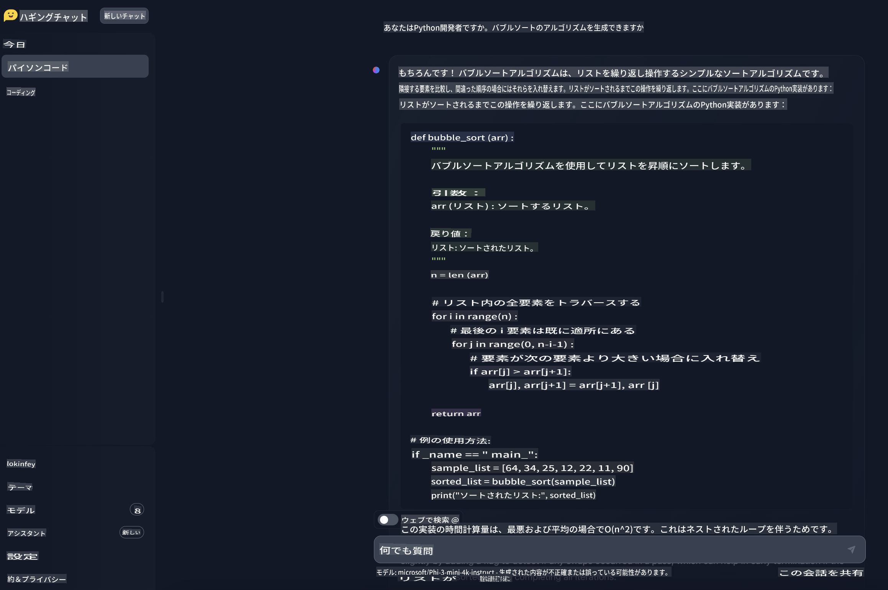

# **Hugging FaceでPhi-3を使う**

[Hugging Face](https://huggingface.co/) は、豊富なデータとオープンソースのモデルリソースを持つ非常に人気のあるAIコミュニティです。Microsoft、Meta、Mistral、Apple、Googleなど、さまざまなメーカーがHugging Faceを通じてオープンソースのLLMやSLMをリリースしています。


Microsoft Phi-3はHugging Faceでリリースされています。開発者はシナリオやビジネスに基づいて対応するPhi-3モデルをダウンロードできます。Hugging FaceでPhi-3のPytorchモデルをデプロイするだけでなく、エンドユーザーに選択肢を提供するためにGGUFやONNX形式の量子化モデルもリリースしました。


## **1. Hugging FaceからPhi-3をダウンロードする**

```bash

git lfs install 

git clone https://huggingface.co/microsoft/Phi-3-mini-4k-instruct

```

## **2. Phi-3のプロンプトテンプレートを学ぶ**

Phi-3をトレーニングする際には特定のデータテンプレートがありますので、Phi-3を使用する際にはテンプレートを通じてプロンプトを設定する必要があります。ファインチューニング中もデータをテンプレートに従って拡張する必要があります。

テンプレートには、システム、ユーザー、アシスタントの3つの役割があります。

```txt

<|system|>
Your Role<|end|>
<|user|>
Your Question?<|end|>
<|assistant|>

```

例えば

```txt

<|system|>
Your are a python developer.<|end|>
<|user|>
Help me generate a bubble algorithm<|end|>
<|assistant|>

```

## **3. Phi-3をPythonで推論する**

Phi-3を使った推論とは、入力データに基づいて予測や出力を生成するプロセスを指します。Phi-3モデルは、Phi-3-Mini、Phi-3-Small、Phi-3-Mediumなど、さまざまな用途向けに設計された小型の言語モデル（SLM）ファミリーです。これらのモデルは高品質なデータでトレーニングされ、チャット機能、整合性、堅牢性、安全性のためにファインチューニングされています。ONNXやTensorFlow Liteを使用してエッジおよびクラウドプラットフォームの両方でデプロイでき、Microsoftの責任あるAI原則に従って開発されています。

例えば、Phi-3-Miniは3.8億パラメータを持つ軽量で最先端のオープンモデルで、チャット形式のプロンプトに適しており、最大128Kトークンのコンテキスト長をサポートします。このクラスのモデルとしては初めて、これほど長いコンテキストをサポートします。

Phi-3モデルは、Azure AI MaaS、HuggingFace、NVIDIA、Ollama、ONNXなどのプラットフォームで利用可能で、リアルタイムの対話、自律システム、低遅延を必要とするアプリケーションなど、さまざまな用途に使用できます。

Phi-3を参照する方法はたくさんあります。異なるプログラミング言語を使用してモデルを参照できます。

以下はPythonの例です。

```python

import torch
from transformers import AutoModelForCausalLM, AutoTokenizer, pipeline

torch.random.manual_seed(0)

model = AutoModelForCausalLM.from_pretrained(
    "microsoft/Phi-3-mini-4k-instruct", 
    device_map="cuda", 
    torch_dtype="auto", 
    trust_remote_code=True, 
)
tokenizer = AutoTokenizer.from_pretrained("microsoft/Phi-3-mini-4k-instruct")

messages = [
    {"role": "system", "content": "Your are a python developer."},
    {"role": "user", "content": "Help me generate a bubble algorithm"},
]

pipe = pipeline(
    "text-generation",
    model=model,
    tokenizer=tokenizer,
)

generation_args = {
    "max_new_tokens": 600,
    "return_full_text": False,
    "temperature": 0.3,
    "do_sample": False,
}

output = pipe(messages, **generation_args)
print(output[0]['generated_text'])


```

> [!NOTE]
> この結果があなたの考える結果と一致しているか確認してください

## **4. Phi-3をC#で推論する**

以下は.NETコンソールアプリケーションの例です。

C#プロジェクトには以下のパッケージを追加する必要があります：

```bash
dotnet add package Microsoft.ML.OnnxRuntime --version 1.18.0
dotnet add package Microsoft.ML.OnnxRuntimeGenAI --version 0.3.0-rc2
dotnet add package Microsoft.ML.OnnxRuntimeGenAI.Cuda --version 0.3.0-rc2
```

以下はC#のコードです。

```csharp
using System;
using Microsoft.ML.OnnxRuntimeGenAI;


// ONNXモデルファイルのフォルダ場所
var modelPath = @"..\models\Phi-3-mini-4k-instruct-onnx";
var model = new Model(modelPath);
var tokenizer = new Tokenizer(model);

var systemPrompt = "You are an AI assistant that helps people find information. Answer questions using a direct style. Do not share more information that the requested by the users.";

// チャット開始
Console.WriteLine(@"質問を入力してください。空の文字列を入力すると終了します。");


// チャットループ
while (true)
{
    // ユーザーの質問を取得
    Console.WriteLine();
    Console.Write(@"Q: ");
    var userQ = Console.ReadLine();    
    if (string.IsNullOrEmpty(userQ))
    {
        break;
    }

    // Phi3の応答を表示
    Console.Write("Phi3: ");
    var fullPrompt = $"<|system|>{systemPrompt}<|end|><|user|>{userQ}<|end|><|assistant|>";
    var tokens = tokenizer.Encode(fullPrompt);

    var generatorParams = new GeneratorParams(model);
    generatorParams.SetSearchOption("max_length", 2048);
    generatorParams.SetSearchOption("past_present_share_buffer", false);
    generatorParams.SetInputSequences(tokens);

    var generator = new Generator(model, generatorParams);
    while (!generator.IsDone())
    {
        generator.ComputeLogits();
        generator.GenerateNextToken();
        var outputTokens = generator.GetSequence(0);
        var newToken = outputTokens.Slice(outputTokens.Length - 1, 1);
        var output = tokenizer.Decode(newToken);
        Console.Write(output);
    }
    Console.WriteLine();
}
```

実行デモは以下のようになります：


***Note:** 最初の質問にタイプミスがありますが、Phi-3は十分に優れた回答を提供します！*

## **5. Hugging Face ChatでPhi-3を使う**

Hugging Faceのチャットで関連する体験が提供されています。ブラウザで[ここからPhi-3チャットを試す](https://huggingface.co/chat/models/microsoft/Phi-3-mini-4k-instruct)ことができます。



免責事項：この翻訳はAIモデルによって原文から翻訳されたものであり、完璧ではない可能性があります。
出力を確認し、必要な修正を行ってください。