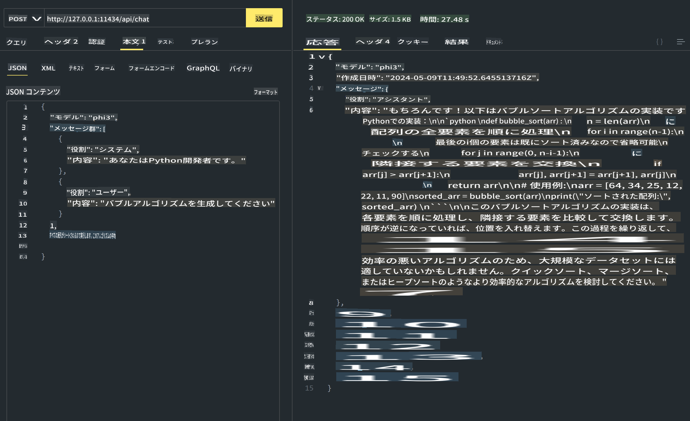

# **OllamaでPhi-3を使う**

[Ollama](https://ollama.com)を使えば、オープンソースのLLMやSLMを簡単なスクリプトで直接デプロイできるだけでなく、ローカルのCopilotアプリケーションシナリオに役立つAPIを構築することもできます。

## **1. インストール**

OllamaはWindows、macOS、Linuxで動作します。このリンクからOllamaをインストールできます（[https://ollama.com/download](https://ollama.com/download)）。インストールが完了したら、ターミナルウィンドウからOllamaスクリプトを使ってPhi-3を呼び出すことができます。すべての[利用可能なライブラリはOllamaのサイト](https://ollama.com/library)で確認できます。このリポジトリをCodespaceで開くと、Ollamaはすでにインストールされています。

```bash

ollama run phi3

```

> [!NOTE]
> 初めて実行するときはモデルが最初にダウンロードされます。もちろん、すでにダウンロード済みのPhi-3モデルを指定することもできます。ここではWSLを例にとってコマンドを実行します。モデルが正常にダウンロードされた後は、ターミナルで直接対話できます。


## **2. Ollamaからphi-3 APIを呼び出す**

Ollamaで生成されたPhi-3 APIを呼び出したい場合は、このコマンドをターミナルで実行してOllamaサーバーを起動します。

```bash

ollama serve

```

> [!NOTE]
> MacOSまたはLinuxを使用している場合、次のエラーに遭遇する可能性があります **"Error: listen tcp 127.0.0.1:11434: bind: address already in use"** このエラーはサーバーがすでに実行中であることを示していることが多いので無視しても構いませんし、Ollamaを停止して再起動することもできます。

**macOS**

```bash

brew services restart ollama

```

**Linux**

```bash

sudo systemctl stop ollama

```

Ollamaは2つのAPIをサポートしています：generateとchat。必要に応じて、ポート11434で動作するローカルサービスにリクエストを送信して、Ollamaが提供するモデルAPIを呼び出すことができます。

**Chat**

```bash

curl http://127.0.0.1:11434/api/chat -d '{
  "model": "phi3",
  "messages": [
    {
      "role": "system",
      "content": "あなたはPython開発者です。"
    },
    {
      "role": "user",
      "content": "バブルソートのアルゴリズムを生成するのを手伝ってください"
    }
  ],
  "stream": false
  
}'


```

これはPostmanでの結果です



```bash

curl http://127.0.0.1:11434/api/generate -d '{
  "model": "phi3",
  "prompt": "<|system|>あなたは私のAIアシスタントです。<|end|><|user|>AIを学ぶ方法を教えてください<|end|><|assistant|>",
  "stream": false
}'


```

これはPostmanでの結果です


## 追加リソース

Ollamaの利用可能なモデルのリストは[ライブラリ](https://ollama.com/library)で確認できます。

このコマンドを使用してOllamaサーバーからモデルを取得します

```bash
ollama pull phi3
```

このコマンドを使用してモデルを実行します

```bash
ollama run phi3
```

***Note:*** 詳しくはこのリンクを参照してください [https://github.com/ollama/ollama/blob/main/docs/api.md](https://github.com/ollama/ollama/blob/main/docs/api.md)

## PythonからOllamaを呼び出す

`requests`や`urllib3`を使って上記のローカルサーバーエンドポイントにリクエストを送ることができます。しかし、PythonでOllamaを使う一般的な方法は、OllamaがOpenAI互換のサーバーエンドポイントを提供しているため、[openai](https://pypi.org/project/openai/) SDKを使用することです。

phi3-miniの例を以下に示します：

```python
import openai

client = openai.OpenAI(
    base_url="http://localhost:11434/v1",
    api_key="nokeyneeded",
)

response = client.chat.completions.create(
    model="phi3",
    temperature=0.7,
    n=1,
    messages=[
        {"role": "system", "content": "あなたは役に立つアシスタントです。"},
        {"role": "user", "content": "空腹な猫についての俳句を書いてください"},
    ],
)

print("Response:")
print(response.choices[0].message.content)
```

## JavaScriptからOllamaを呼び出す 

```javascript
// Phi-3を使ってファイルを要約する例
script({
    model: "ollama:phi3",
    title: "Phi-3で要約",
    system: ["system"],
})

// 要約の例
const file = def("FILE", env.files)
$`Summarize ${file} in a single paragraph.`
```

## C#からOllamaを呼び出す

新しいC#コンソールアプリケーションを作成し、次のNuGetパッケージを追加します：

```bash
dotnet add package Microsoft.SemanticKernel --version 1.13.0
```

次に、`Program.cs`ファイルにこのコードを置き換えます

```csharp
using Microsoft.SemanticKernel;
using Microsoft.SemanticKernel.ChatCompletion;

// ローカルOllamaサーバーエンドポイントを使用してチャット補完サービスを追加
#pragma warning disable SKEXP0001, SKEXP0003, SKEXP0010, SKEXP0011, SKEXP0050, SKEXP0052
builder.AddOpenAIChatCompletion(
    modelId: "phi3.5",
    endpoint: new Uri("http://localhost:11434/"),
    apiKey: "non required");

// チャットサービスにシンプルなプロンプトを送信
string prompt = "子猫についてのジョークを言ってください";
var response = await kernel.InvokePromptAsync(prompt);
Console.WriteLine(response.GetValue<string>());
```

次のコマンドでアプリを実行します：

```bash
dotnet run
```

免責事項: この翻訳はAIモデルによって原文から翻訳されたものであり、完全ではない可能性があります。
出力を確認し、必要に応じて修正を行ってください。