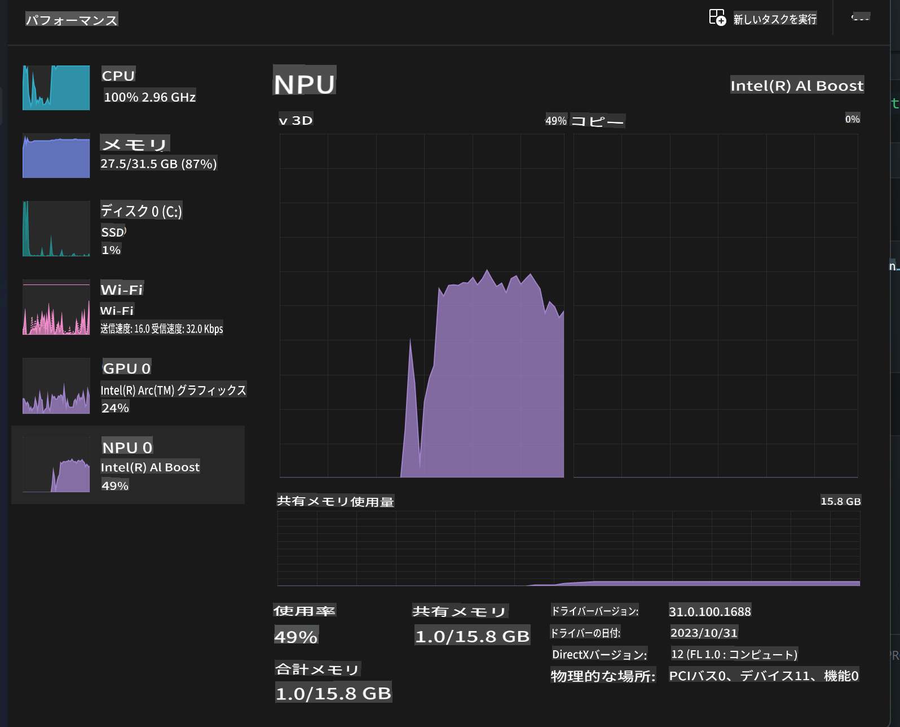
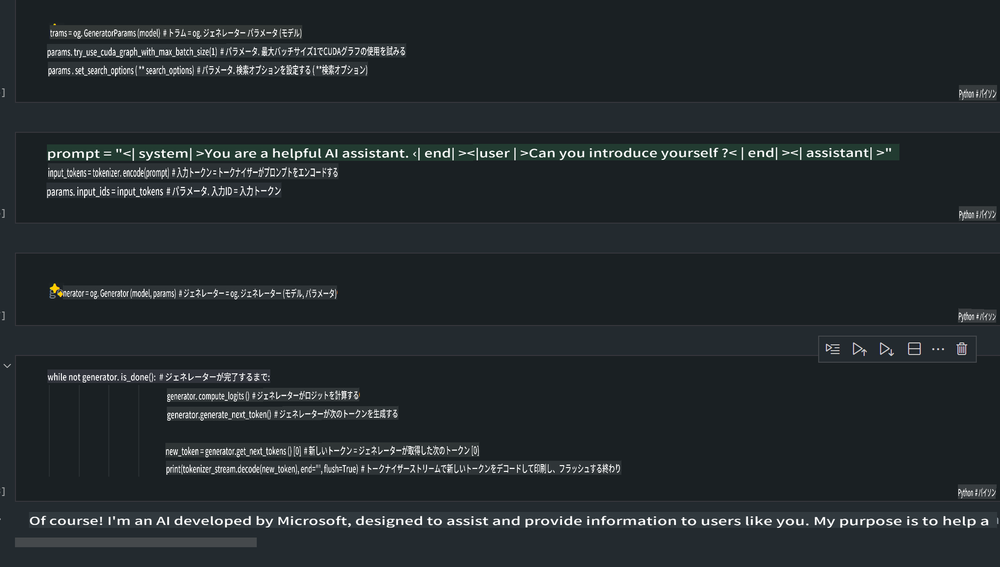
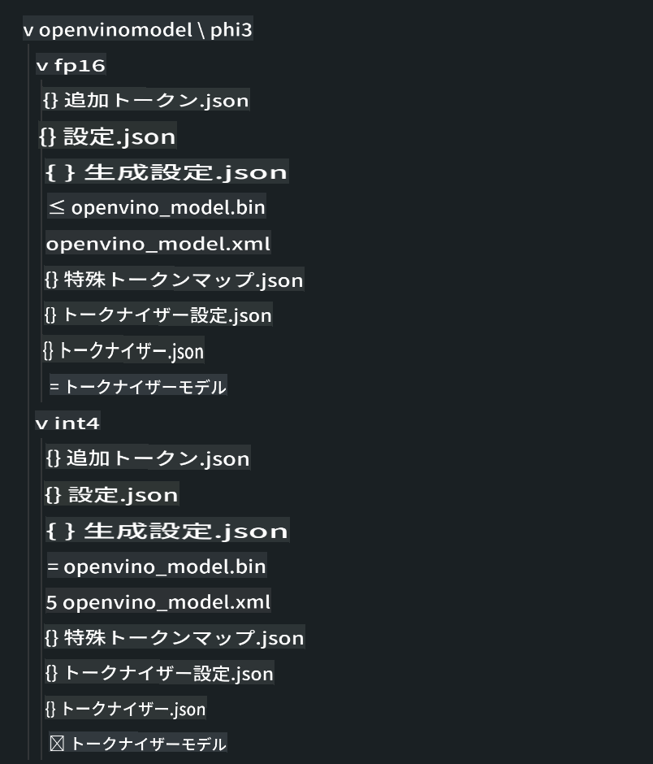

# **AI PCでのPhi-3推論**

生成AIの進化とエッジデバイスのハードウェア能力の向上により、より多くの生成AIモデルがユーザーのBYODデバイスに統合できるようになりました。AI PCもその一つです。2024年から、Intel、AMD、QualcommはPCメーカーと協力して、ハードウェアの改良を通じてローカルの生成AIモデルを展開できるAI PCを導入しています。この議論では、Intel AI PCに焦点を当て、Intel AI PCでPhi-3を展開する方法を探ります。

### NPUとは

NPU（Neural Processing Unit）は、ニューラルネットワークの操作やAIタスクを加速するために設計された専用のプロセッサまたは処理ユニットです。一般的なCPUやGPUとは異なり、NPUsはデータ駆動型の並列コンピューティングに最適化されており、ビデオや画像のような大規模なマルチメディアデータの処理やニューラルネットワークのデータ処理に非常に効率的です。特に、音声認識、ビデオ通話の背景ぼかし、オブジェクト検出などの写真やビデオ編集プロセスなど、AI関連のタスクに適しています。

## NPUとGPUの違い

多くのAIや機械学習のワークロードはGPUで実行されますが、GPUとNPUには重要な違いがあります。
GPUは並列コンピューティング能力で知られていますが、すべてのGPUがグラフィックス処理以外でも同じ効率を持っているわけではありません。一方、NPUはニューラルネットワーク操作に関わる複雑な計算のために特化されており、AIタスクに非常に効果的です。

要するに、NPUはAI計算を加速する数学の達人であり、新しいAI PC時代において重要な役割を果たします！

***この例はIntelの最新Intel Core Ultra Processorに基づいています***

## **1. NPUを使用してPhi-3モデルを実行する**

Intel® NPUデバイスは、Intel® Core™ Ultra世代のCPU（旧称Meteor Lake）からIntelクライアントCPUに統合されたAI推論アクセラレータです。これにより、人工ニューラルネットワークタスクのエネルギー効率の高い実行が可能になります。


**Intel NPU Acceleration Library**

Intel NPU Acceleration Library [https://github.com/intel/intel-npu-acceleration-library](https://github.com/intel/intel-npu-acceleration-library) は、Intel Neural Processing Unit (NPU) の力を活用して、対応するハードウェア上で高速計算を実行することで、アプリケーションの効率を向上させるためのPythonライブラリです。

Intel® Core™ Ultraプロセッサ搭載のAI PCで動作するPhi-3-miniの例。


pipでPythonライブラリをインストール

```bash

   pip install intel-npu-acceleration-library

```

***Note*** プロジェクトはまだ開発中ですが、リファレンスモデルはすでに非常に完成しています。

### **Intel NPU Acceleration Libraryを使用してPhi-3を実行する**

Intel NPUアクセラレーションを使用することで、このライブラリは従来のエンコードプロセスに影響を与えません。このライブラリを使用して、元のPhi-3モデルを量子化するだけで済みます。例えばFP16、INT8、INT4など

```python

from transformers import AutoTokenizer, pipeline,TextStreamer
import intel_npu_acceleration_library as npu_lib
import warnings

model_id = "microsoft/Phi-3-mini-4k-instruct"

model = npu_lib.NPUModelForCausalLM.from_pretrained(
                                    model_id,
                                    torch_dtype="auto",
                                    dtype=npu_lib.int4,
                                    trust_remote_code=True
                                )

tokenizer = AutoTokenizer.from_pretrained(model_id)

text_streamer = TextStreamer(tokenizer, skip_prompt=True)

```
量子化が成功したら、NPUを呼び出してPhi-3モデルを実行します。

```python

generation_args = {
            "max_new_tokens": 1024,
            "return_full_text": False,
            "temperature": 0.3,
            "do_sample": False,
            "streamer": text_streamer,
        }

pipe = pipeline(
            "text-generation",
            model=model,
            tokenizer=tokenizer,
)

query = "<|system|>You are a helpful AI assistant.<|end|><|user|>Can you introduce yourself?<|end|><|assistant|>"

with warnings.catch_warnings():
    warnings.simplefilter("ignore")
    pipe(query, **generation_args)


```

コードを実行するとき、タスクマネージャーを通じてNPUの実行状況を確認できます。



***Samples*** : [AIPC_NPU_DEMO.ipynb](../../../../code/03.Inference/AIPC/AIPC_NPU_DEMO.ipynb)

## **2. DirectML + ONNX Runtimeを使用してPhi-3モデルを実行する**

### **DirectMLとは**

[DirectML](https://github.com/microsoft/DirectML) は、機械学習のための高性能でハードウェアアクセラレートされたDirectX 12ライブラリです。DirectMLは、AMD、Intel、NVIDIA、Qualcommなどのベンダーから提供されるすべてのDirectX 12対応GPUを含む広範なハードウェアとドライバに対して、一般的な機械学習タスクのGPUアクセラレーションを提供します。

スタンドアロンで使用する場合、DirectML APIは低レベルのDirectX 12ライブラリであり、フレームワーク、ゲーム、その他のリアルタイムアプリケーションなどの高性能で低レイテンシのアプリケーションに適しています。DirectMLのDirect3D 12とのシームレスな相互運用性、低オーバーヘッド、およびハードウェア全体での一貫性により、高性能が求められる場合やハードウェア全体での結果の信頼性と予測可能性が重要な場合に、DirectMLは機械学習のアクセラレーションに最適です。

***Note*** : 最新のDirectMLはすでにNPUをサポートしています(https://devblogs.microsoft.com/directx/introducing-neural-processor-unit-npu-support-in-directml-developer-preview/)

### DirectMLとCUDAの能力とパフォーマンスの比較

**DirectML** はMicrosoftが開発した機械学習ライブラリです。Windowsデバイス（デスクトップ、ラップトップ、エッジデバイス）上で機械学習ワークロードを加速するために設計されています。
- DX12ベース: DirectMLはDirectX 12 (DX12) の上に構築されており、NVIDIAとAMDの両方を含むGPU全体に広範なハードウェアサポートを提供します。
- 広範なサポート: DX12を活用しているため、DirectMLはDX12をサポートするすべてのGPU（統合GPUを含む）で動作します。
- 画像処理: DirectMLはニューラルネットワークを使用して画像やその他のデータを処理し、画像認識、オブジェクト検出などのタスクに適しています。
- 設定の簡単さ: DirectMLの設定は簡単で、特定のSDKやライブラリをGPUメーカーから取得する必要はありません。
- パフォーマンス: 一部のケースでは、DirectMLは優れたパフォーマンスを発揮し、特定のワークロードに対してCUDAよりも高速になることがあります。
- 制限: しかし、DirectMLはfloat16の大きなバッチサイズの場合には遅くなることがあります。

**CUDA** はNVIDIAの並列コンピューティングプラットフォームおよびプログラミングモデルです。NVIDIA GPUの力を一般的な計算、機械学習、科学シミュレーションに活用することができます。
- NVIDIA専用: CUDAはNVIDIA GPUと密接に統合されており、それらのために特別に設計されています。
- 高度に最適化: GPUアクセラレートされたタスクに対して優れたパフォーマンスを提供し、特にNVIDIA GPUを使用する場合に最適です。
- 広く使用されている: 多くの機械学習フレームワークやライブラリ（TensorFlowやPyTorchなど）はCUDAをサポートしています。
- カスタマイズ: 開発者は特定のタスクに対してCUDA設定を微調整でき、最適なパフォーマンスを引き出すことができます。
- 制限: しかし、CUDAのNVIDIAハードウェアへの依存は、異なるGPU全体での広範な互換性が必要な場合には制約となることがあります。

### DirectMLとCUDAの選択

DirectMLとCUDAの選択は、特定の使用ケース、ハードウェアの可用性、好みに依存します。
より広範な互換性と設定の簡単さを求める場合、DirectMLが良い選択かもしれません。しかし、NVIDIA GPUを持ち、最適化されたパフォーマンスが必要な場合、CUDAは強力な候補です。要するに、DirectMLとCUDAのどちらにも強みと弱みがあるため、決定する際には要件と利用可能なハードウェアを考慮してください。

### **ONNX Runtimeでの生成AI**

AIの時代において、AIモデルのポータビリティは非常に重要です。ONNX Runtimeは、トレーニング済みのモデルを簡単に異なるデバイスに展開できます。開発者は推論フレームワークに注意を払う必要がなく、統一されたAPIを使用してモデル推論を完了できます。生成AIの時代において、ONNX Runtimeはコード最適化も行っています（https://onnxruntime.ai/docs/genai/）。最適化されたONNX Runtimeを通じて、量子化された生成AIモデルは異なる端末で推論できます。ONNX Runtimeを使用した生成AIでは、Python、C#、C/C++を通じてAIモデルAPIを推論できます。もちろん、iPhoneでのデプロイメントでは、C++のONNX Runtime APIを利用することができます。

[サンプルコード](https://github.com/Azure-Samples/Phi-3MiniSamples/tree/main/onnx)

***ONNX Runtimeライブラリで生成AIをコンパイル***

```bash

winget install --id=Kitware.CMake  -e

git clone https://github.com/microsoft/onnxruntime.git

cd .\onnxruntime\

./build.bat --build_shared_lib --skip_tests --parallel --use_dml --config Release

cd ../

git clone https://github.com/microsoft/onnxruntime-genai.git

cd .\onnxruntime-genai\

mkdir ort

cd ort

mkdir include

mkdir lib

copy ..\onnxruntime\include\onnxruntime\core\providers\dml\dml_provider_factory.h ort\include

copy ..\onnxruntime\include\onnxruntime\core\session\onnxruntime_c_api.h ort\include

copy ..\onnxruntime\build\Windows\Release\Release\*.dll ort\lib

copy ..\onnxruntime\build\Windows\Release\Release\onnxruntime.lib ort\lib

python build.py --use_dml


```

**ライブラリのインストール**

```bash

pip install .\onnxruntime_genai_directml-0.3.0.dev0-cp310-cp310-win_amd64.whl

```

これは実行結果です



***Samples*** : [AIPC_DirectML_DEMO.ipynb](../../../../code/03.Inference/AIPC/AIPC_DirectML_DEMO.ipynb)

## **3. Intel OpenVinoを使用してPhi-3モデルを実行する**

### **OpenVINOとは**

[OpenVINO](https://github.com/openvinotoolkit/openvino) は、ディープラーニングモデルの最適化とデプロイのためのオープンソースツールキットです。TensorFlow、PyTorchなどの人気のあるフレームワークからのビジョン、オーディオ、言語モデルのディープラーニングパフォーマンスを向上させます。OpenVINOは、CPUおよびGPUと組み合わせてPhi-3モデルを実行することもできます。

***Note***: 現在、OpenVINOはNPUをサポートしていません。

### **OpenVINOライブラリのインストール**

```bash

 pip install git+https://github.com/huggingface/optimum-intel.git

 pip install git+https://github.com/openvinotoolkit/nncf.git

 pip install openvino-nightly

```

### **OpenVINOでPhi-3を実行する**

NPUと同様に、OpenVINOは量子化モデルを実行することで生成AIモデルの呼び出しを完了します。まずPhi-3モデルを量子化し、コマンドラインを通じてoptimum-cliでモデルの量子化を完了します。

**INT4**

```bash

optimum-cli export openvino --model "microsoft/Phi-3-mini-4k-instruct" --task text-generation-with-past --weight-format int4 --group-size 128 --ratio 0.6  --sym  --trust-remote-code ./openvinomodel/phi3/int4

```

**FP16**

```bash

optimum-cli export openvino --model "microsoft/Phi-3-mini-4k-instruct" --task text-generation-with-past --weight-format fp16 --trust-remote-code ./openvinomodel/phi3/fp16

```

変換された形式は以下のようになります



OVModelForCausalLMを通じて、モデルパス（model_dir）、関連する設定（ov_config = {"PERFORMANCE_HINT": "LATENCY", "NUM_STREAMS": "1", "CACHE_DIR": ""}）、およびハードウェアアクセラレートされたデバイス（GPU.0）をロードします。

```python

ov_model = OVModelForCausalLM.from_pretrained(
     model_dir,
     device='GPU.0',
     ov_config=ov_config,
     config=AutoConfig.from_pretrained(model_dir, trust_remote_code=True),
     trust_remote_code=True,
)

```

コードを実行するとき、タスクマネージャーを通じてGPUの実行状況を確認できます。


***Samples*** : [AIPC_OpenVino_Demo.ipynb](../../../../code/03.Inference/AIPC/AIPC_OpenVino_Demo.ipynb)

### ***Note*** : 上記の3つの方法にはそれぞれ利点がありますが、AI PC推論にはNPUアクセラレーションの使用を推奨します。

**免責事項**：
この文書は、機械ベースのAI翻訳サービスを使用して翻訳されています。正確性を期すために努めておりますが、自動翻訳には誤りや不正確さが含まれる可能性があります。元の言語での原文が権威ある情報源と見なされるべきです。重要な情報については、専門の人間による翻訳を推奨します。本翻訳の使用に起因する誤解や誤認について、当社は一切の責任を負いません。