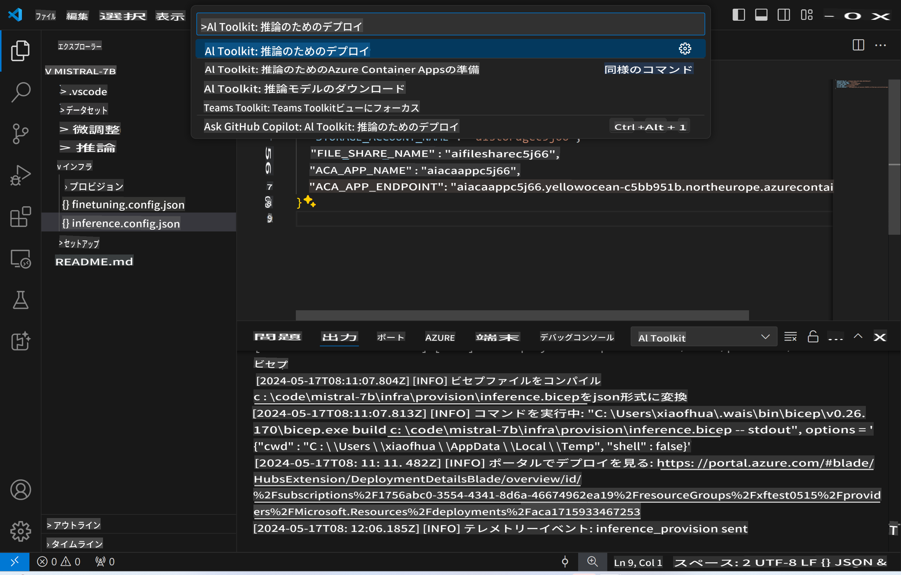

# 微調整されたモデルでのリモート推論

アダプタがリモート環境でトレーニングされた後、シンプルなGradioアプリケーションを使用してモデルと対話します。


### Azureリソースのプロビジョニング
リモート推論のためにAzureリソースを設定するには、コマンドパレットから`AI Toolkit: Provision Azure Container Apps for inference`を実行します。このセットアップ中に、Azureサブスクリプションとリソースグループを選択するように求められます。  

   
デフォルトでは、推論のためのサブスクリプションとリソースグループは微調整に使用されたものと一致する必要があります。推論は同じAzure Container App Environmentを使用し、微調整ステップで生成されたAzure Filesに保存されているモデルとモデルアダプタにアクセスします。

## AIツールキットの使用

### 推論のためのデプロイ
推論コードを修正したり、推論モデルを再ロードしたりする場合は、`AI Toolkit: Deploy for inference`コマンドを実行してください。これにより、最新のコードがACAと同期され、レプリカが再起動されます。  



デプロイが成功すると、このエンドポイントを使用してモデルの評価ができるようになります。

### 推論APIへのアクセス

VSCodeの通知に表示される「*Go to Inference Endpoint*」ボタンをクリックすることで、推論APIにアクセスできます。あるいは、`ACA_APP_ENDPOINT`の`./infra/inference.config.json`と出力パネルにあるWeb APIエンドポイントからアクセスすることもできます。


> **Note:** 推論エンドポイントが完全に動作するまでには数分かかる場合があります。

## テンプレートに含まれる推論コンポーネント

| フォルダ | 内容 |
| ------ |--------- |
| `infra` | リモート操作に必要なすべての設定が含まれています。 |
| `infra/provision/inference.parameters.json` | 推論のためのAzureリソースをプロビジョニングするためのbicepテンプレートのパラメータが含まれています。 |
| `infra/provision/inference.bicep` | 推論のためのAzureリソースをプロビジョニングするためのテンプレートが含まれています。 |
| `infra/inference.config.json` | `AI Toolkit: Provision Azure Container Apps for inference`コマンドによって生成される設定ファイルです。他のリモートコマンドパレットの入力として使用されます。 |

### AIツールキットを使用してAzureリソースのプロビジョニングを設定
[AIツールキット](https://marketplace.visualstudio.com/items?itemName=ms-windows-ai-studio.windows-ai-studio)を設定します

推論のためのAzure Container Appsをプロビジョニングする` command.

You can find configuration parameters in `./infra/provision/inference.parameters.json` file. Here are the details:
| Parameter | Description |
| --------- |------------ |
| `defaultCommands` | This is the commands to initiate a web API. |
| `maximumInstanceCount` | This parameter sets the maximum capacity of GPU instances. |
| `location` | This is the location where Azure resources are provisioned. The default value is the same as the chosen resource group's location. |
| `storageAccountName`, `fileShareName` `acaEnvironmentName`, `acaEnvironmentStorageName`, `acaAppName`,  `acaLogAnalyticsName` | These parameters are used to name the Azure resources for provision. By default, they will be same to the fine-tuning resource name. You can input a new, unused resource name to create your own custom-named resources, or you can input the name of an already existing Azure resource if you'd prefer to use that. For details, refer to the section [Using existing Azure Resources](../../../../md/03.Inference). |

### Using Existing Azure Resources

By default, the inference provision use the same Azure Container App Environment, Storage Account, Azure File Share, and Azure Log Analytics that were used for fine-tuning. A separate Azure Container App is created solely for the inference API. 

If you have customized the Azure resources during the fine-tuning step or want to use your own existing Azure resources for inference, specify their names in the `./infra/inference.parameters.json`ファイル。次に、コマンドパレットから`AI Toolkit: Provision Azure Container Apps for inference`コマンドを実行します。これにより、指定されたリソースが更新され、不足しているリソースが作成されます。

例えば、既存のAzureコンテナ環境がある場合、`./infra/finetuning.parameters.json`は次のようになります:

```json
{
    "$schema": "https://schema.management.azure.com/schemas/2019-04-01/deploymentParameters.json#",
    "contentVersion": "1.0.0.0",
    "parameters": {
      ...
      "acaEnvironmentName": {
        "value": "<your-aca-env-name>"
      },
      "acaEnvironmentStorageName": {
        "value": null
      },
      ...
    }
  }
```

### 手動プロビジョニング
Azureリソースを手動で設定したい場合は、`./infra/provision` folders. If you have already set up and configured all the Azure resources without using the AI Toolkit command palette, you can simply enter the resource names in the `inference.config.json`ファイルにある提供されたbicepファイルを使用できます。

例えば:

```json
{
  "SUBSCRIPTION_ID": "<your-subscription-id>",
  "RESOURCE_GROUP_NAME": "<your-resource-group-name>",
  "STORAGE_ACCOUNT_NAME": "<your-storage-account-name>",
  "FILE_SHARE_NAME": "<your-file-share-name>",
  "ACA_APP_NAME": "<your-aca-name>",
  "ACA_APP_ENDPOINT": "<your-aca-endpoint>"
}
```

**免責事項**：
この文書は機械翻訳AIサービスを使用して翻訳されています。正確さを期していますが、自動翻訳にはエラーや不正確さが含まれる場合がありますのでご注意ください。原文の言語で書かれた元の文書が権威ある情報源とみなされるべきです。重要な情報については、専門の人間による翻訳をお勧めします。この翻訳の使用によって生じた誤解や誤解釈について、当社は一切の責任を負いません。