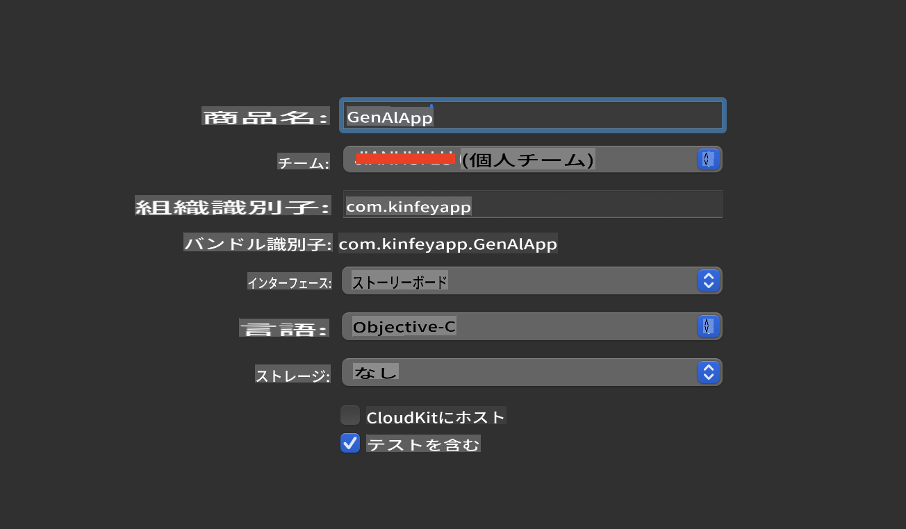
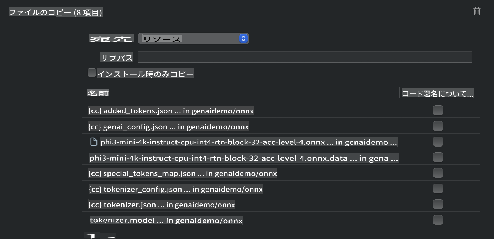

# **iOSでのPhi-3推論**

Phi-3-miniは、Microsoftが提供する新しいモデルシリーズで、エッジデバイスやIoTデバイス上で大規模言語モデル（LLM）を展開することができます。Phi-3-miniはiOS、Android、エッジデバイスでの展開が可能で、BYOD環境で生成AIを展開することができます。以下の例では、iOS上でPhi-3-miniを展開する方法を示します。

## **1. 準備**

- **a.** macOS 14以上
- **b.** Xcode 15以上
- **c.** iOS SDK 17.x（iPhone 14 A16以上）
- **d.** Python 3.10以上をインストール（Condaを推奨）
- **e.** Pythonライブラリをインストール: `python-flatbuffers`
- **f.** CMakeをインストール

### Semantic Kernelと推論

Semantic Kernelは、Azure OpenAI Service、OpenAIモデル、ローカルモデルに対応したアプリケーションを作成できるアプリケーションフレームワークです。Semantic Kernelを通じてローカルサービスにアクセスすることで、セルフホスト型のPhi-3-miniモデルサーバーとの統合が簡単になります。

### OllamaやLlamaEdgeを使った量子化モデルの呼び出し

多くのユーザーは、ローカルでモデルを実行するために量子化モデルを使用することを好みます。[Ollama](https://ollama.com)や[LlamaEdge](https://llamaedge.com)を使用すると、さまざまな量子化モデルを呼び出すことができます。

#### **Ollama**

`ollama run phi3`を直接実行するか、オフラインで設定することができます。`gguf`ファイルへのパスを含むModelfileを作成します。Phi-3-mini量子化モデルを実行するためのサンプルコード：

```gguf
FROM {Add your gguf file path}
TEMPLATE \"\"\"<|user|> .Prompt<|end|> <|assistant|>\"\"\"
PARAMETER stop <|end|>
PARAMETER num_ctx 4096
```

#### **LlamaEdge**

クラウドとエッジデバイスの両方で`gguf`を同時に使用したい場合、LlamaEdgeは優れたオプションです。

## **2. iOS用ONNX Runtimeのコンパイル**

```bash

git clone https://github.com/microsoft/onnxruntime.git

cd onnxruntime

./build.sh --build_shared_lib --ios --skip_tests --parallel --build_dir ./build_ios --ios --apple_sysroot iphoneos --osx_arch arm64 --apple_deploy_target 17.5 --cmake_generator Xcode --config Release

cd ../

```

### **注意**

- **a.** コンパイルする前に、Xcodeが適切に設定されていることを確認し、ターミナルでアクティブな開発者ディレクトリとして設定してください：

    ```bash
    sudo xcode-select -switch /Applications/Xcode.app/Contents/Developer
    ```

- **b.** ONNX Runtimeは異なるプラットフォーム用にコンパイルする必要があります。iOS用には、`arm64` or `x86_64`用にコンパイルできます。

- **c.** 最新のiOS SDKを使用してコンパイルすることを推奨します。ただし、以前のSDKとの互換性が必要な場合は、古いバージョンを使用することもできます。

## **3. iOS用ONNX Runtimeを使用した生成AIのコンパイル**

> **Note:** ONNX Runtimeを使用した生成AIはプレビュー段階にあるため、変更の可能性があることに注意してください。

```bash

git clone https://github.com/microsoft/onnxruntime-genai
 
cd onnxruntime-genai
 
mkdir ort
 
cd ort
 
mkdir include
 
mkdir lib
 
cd ../
 
cp ../onnxruntime/include/onnxruntime/core/session/onnxruntime_c_api.h ort/include
 
cp ../onnxruntime/build_ios/Release/Release-iphoneos/libonnxruntime*.dylib* ort/lib
 
export OPENCV_SKIP_XCODEBUILD_FORCE_TRYCOMPILE_DEBUG=1
 
python3 build.py --parallel --build_dir ./build_ios --ios --ios_sysroot iphoneos --ios_arch arm64 --ios_deployment_target 17.5 --cmake_generator Xcode --cmake_extra_defines CMAKE_XCODE_ATTRIBUTE_CODE_SIGNING_ALLOWED=NO

```

## **4. XcodeでAppアプリケーションを作成**

ONNX Runtime C++ APIを使用して生成AIを利用するために、Objective-CをApp開発の方法として選びました。Objective-Cはより互換性があります。もちろん、Swiftブリッジングを通じて関連する呼び出しを完了することもできます。



## **5. ONNX量子化INT4モデルをAppアプリケーションプロジェクトにコピー**

まず、ONNX形式のINT4量子化モデルをインポートする必要があります。これをダウンロードする必要があります。


ダウンロード後、XcodeのプロジェクトのResourcesディレクトリに追加する必要があります。



## **6. ViewControllersにC++ APIを追加**

> **注意:**

- **a.** 対応するC++ヘッダーファイルをプロジェクトに追加します。

  

- **b.** `onnxruntime-genai` dynamic library in Xcode.

  

- **c.** Use the C Samples code for testing. You can also add additional features like ChatUI for more functionality.

- **d.** Since you need to use C++ in your project, rename `ViewController.m` to `ViewController.mm`を含めてObjective-C++サポートを有効にします。

```objc

    NSString *llmPath = [[NSBundle mainBundle] resourcePath];
    char const *modelPath = llmPath.cString;

    auto model =  OgaModel::Create(modelPath);

    auto tokenizer = OgaTokenizer::Create(*model);

    const char* prompt = "<|system|>You are a helpful AI assistant.<|end|><|user|>Can you introduce yourself?<|end|><|assistant|>";

    auto sequences = OgaSequences::Create();
    tokenizer->Encode(prompt, *sequences);

    auto params = OgaGeneratorParams::Create(*model);
    params->SetSearchOption("max_length", 100);
    params->SetInputSequences(*sequences);

    auto output_sequences = model->Generate(*params);
    const auto output_sequence_length = output_sequences->SequenceCount(0);
    const auto* output_sequence_data = output_sequences->SequenceData(0);
    auto out_string = tokenizer->Decode(output_sequence_data, output_sequence_length);
    
    auto tmp = out_string;

```

## **7. アプリケーションの実行**

セットアップが完了したら、アプリケーションを実行してPhi-3-miniモデル推論の結果を確認できます。


詳細なサンプルコードや手順については、[Phi-3 Mini Samplesリポジトリ](https://github.com/Azure-Samples/Phi-3MiniSamples/tree/main/ios)をご覧ください。

**免責事項**:
この文書は機械ベースのAI翻訳サービスを使用して翻訳されています。正確さを期していますが、自動翻訳には誤りや不正確さが含まれる場合がありますのでご注意ください。元の言語での文書を正式な情報源と見なすべきです。重要な情報については、専門の人間による翻訳を推奨します。この翻訳の使用に起因する誤解や誤解について、当社は一切の責任を負いません。