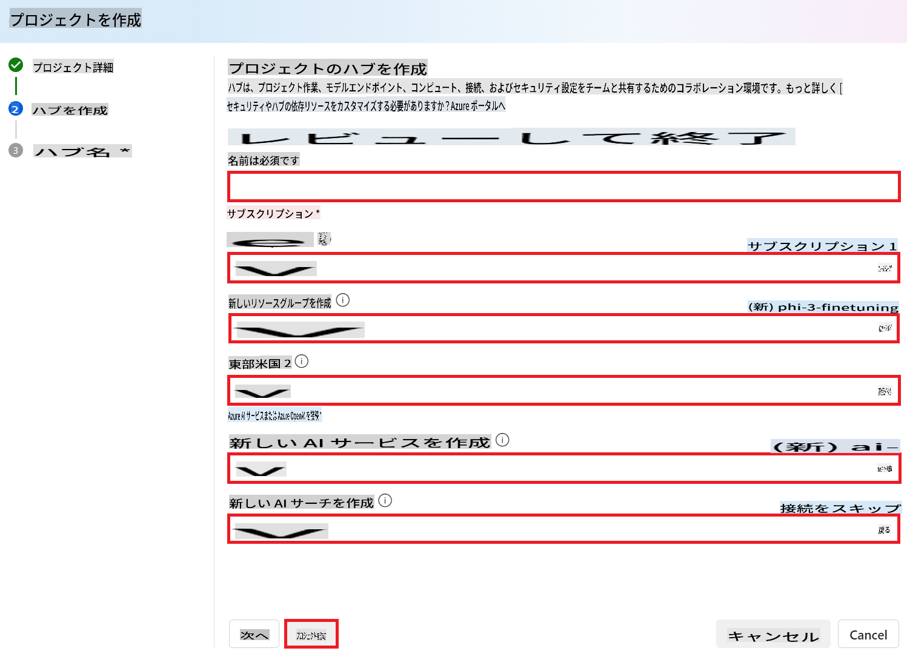

# Azure AI Foundryを使ったPhi-3のファインチューニング

MicrosoftのPhi-3 Mini言語モデルをAzure AI Foundryを使ってどのようにファインチューニングするかを見てみましょう。ファインチューニングにより、Phi-3 Miniを特定のタスクに適応させ、さらに強力でコンテキストに応じたモデルにすることができます。

## 考慮事項

- **機能:** どのモデルがファインチューニング可能か？ベースモデルは何ができるようになるのか？
- **コスト:** ファインチューニングの料金モデルはどうなっているのか？
- **カスタマイズ性:** ベースモデルをどの程度変更できるのか？どのように変更できるのか？
- **利便性:** ファインチューニングは実際にどのように行われるのか？カスタムコードを書く必要があるのか？自分の計算リソースを持ち込む必要があるのか？
- **安全性:** ファインチューニングされたモデルには安全リスクがあることが知られていますが、意図しない危害を防ぐためのガードレールはあるのか？


## ファインチューニングの準備

### 前提条件

> [!NOTE]
> Phi-3ファミリーモデルの場合、従量課金制のファインチューニング提供は**East US 2**リージョンで作成されたハブでのみ利用可能です。

- Azureサブスクリプション。Azureサブスクリプションをお持ちでない場合は、[有料Azureアカウント](https://azure.microsoft.com/pricing/purchase-options/pay-as-you-go)を作成してください。
- [AI Foundryプロジェクト](https://ai.azure.com?WT.mc_id=aiml-138114-kinfeylo)。
- Azureロールベースのアクセス制御 (Azure RBAC) は、Azure AI Foundryでの操作にアクセスを付与するために使用されます。この記事の手順を実行するには、ユーザーアカウントがリソースグループの__Azure AI Developerロール__に割り当てられている必要があります。

### サブスクリプションプロバイダーの登録

サブスクリプションが`Microsoft.Network`リソースプロバイダーに登録されていることを確認します。

1. [Azureポータル](https://portal.azure.com)にサインインします。
1. 左メニューから**サブスクリプション**を選択します。
1. 使用するサブスクリプションを選択します。
1. 左メニューから**AIプロジェクト設定** > **リソースプロバイダー**を選択します。
1. **Microsoft.Network**がリストにあることを確認します。ない場合は追加します。

### データ準備

モデルをファインチューニングするために、トレーニングデータと検証データを準備します。トレーニングデータと検証データセットは、モデルがどのように動作するかの入力と出力の例で構成されます。

すべてのトレーニング例が推論の期待される形式に従っていることを確認してください。効果的にモデルをファインチューニングするために、バランスの取れた多様なデータセットを確保してください。

これは、データバランスの維持、さまざまなシナリオの含有、現実世界の期待に合わせたトレーニングデータの定期的な精緻化を含み、最終的にはより正確でバランスの取れたモデル応答を導きます。

異なるモデルタイプには異なる形式のトレーニングデータが必要です。

### チャットコンプリーション

使用するトレーニングデータと検証データは、JSON Lines (JSONL) ドキュメントとしてフォーマットされている必要があります。`Phi-3-mini-128k-instruct`のファインチューニングデータセットは、Chat completions APIで使用される会話形式でフォーマットされている必要があります。

### ファイル形式の例

```json
    {"messages": [{"role": "system", "content": "You are an Xbox customer support agent whose primary goal is to help users with issues they are experiencing with their Xbox devices. You are friendly and concise. You only provide factual answers to queries, and do not provide answers that are not related to Xbox."}, {"role": "user", "content": "Is Xbox better than PlayStation?"}, {"role": "assistant", "content": "I apologize, but I cannot provide personal opinions. My primary job is to assist you with any issues related to your Xbox device. Do you have any Xbox-related issues that need addressing?"}]}
    {"messages": [{"role": "system", "content": "You are an Xbox customer support agent whose primary goal is to help users with issues they are experiencing with their Xbox devices. You are friendly and concise. You only provide factual answers to queries, and do not provide answers that are not related to Xbox."}, {"role": "user", "content": "Can I play PC games on my Xbox?"}, {"role": "assistant", "content": "While Xbox consoles don't natively support PC games, they can play an array of Xbox games, many of which are also available on PC. Can I assist you with finding games compatible with your Xbox device?"}]}
    {"messages": [{"role": "system", "content": "You are an Xbox customer support agent whose primary goal is to help users with issues they are experiencing with their Xbox devices. You are friendly and concise. You only provide factual answers to queries, and do not provide answers that are not related to Xbox."}, {"role": "user", "content": "I'm having trouble connecting my Xbox to the Wi-Fi."}, {"role": "assistant", "content": "No worries, let's go through the network settings on your Xbox. Can you please tell me what happens when you try to connect it to the Wi-Fi?"}]}
```

サポートされているファイルタイプはJSON Linesです。ファイルはデフォルトのデータストアにアップロードされ、プロジェクト内で利用可能になります。

## Azure AI Foundryを使ったPhi-3のファインチューニング

Azure AI Foundryを使用すると、ファインチューニングと呼ばれるプロセスを使用して、大規模な言語モデルを個人のデータセットに合わせて調整できます。ファインチューニングは、特定のタスクやアプリケーションに対するカスタマイズと最適化を可能にし、性能向上、コスト効率、遅延の削減、カスタマイズされた出力をもたらします。


### 新しいプロジェクトの作成

1. [Azure AI Foundry](https://ai.azure.com)にサインインします。

1. **+新しいプロジェクト**を選択して、Azure AI Foundryで新しいプロジェクトを作成します。

    

1. 次のタスクを実行します：

    - プロジェクトの**ハブ名**。一意の値である必要があります。
    - 使用する**ハブ**を選択します（必要に応じて新しいものを作成します）。

    

1. 新しいハブを作成するために次のタスクを実行します：

    - **ハブ名**を入力します。一意の値である必要があります。
    - Azureの**サブスクリプション**を選択します。
    - 使用する**リソースグループ**を選択します（必要に応じて新しいものを作成します）。
    - 使用したい**場所**を選択します。
    - 使用する**Azure AIサービスの接続**を選択します（必要に応じて新しいものを作成します）。
    - **Azure AI検索の接続**を**接続をスキップ**に選択します。

    

1. **次へ**を選択します。
1. **プロジェクトを作成**を選択します。

### データ準備

ファインチューニングの前に、チャット指示、質問と回答のペア、その他の関連するテキストデータなど、タスクに関連するデータセットを収集または作成します。このデータをノイズの除去、欠損値の処理、テキストのトークン化などでクリーンアップおよび前処理します。

### Azure AI FoundryでのPhi-3モデルのファインチューニング

> [!NOTE]
> Phi-3モデルのファインチューニングは現在、East US 2にあるプロジェクトでサポートされています。

1. 左側のタブから**モデルカタログ**を選択します。

1. **検索バー**に*phi-3*と入力し、使用したいphi-3モデルを選択します。

    

1. **ファインチューニング**を選択します。

    

1. **ファインチューニングされたモデル名**を入力します。

    

1. **次へ**を選択します。

1. 次のタスクを実行します：

    - **タスクタイプ**を**チャットコンプリーション**に選択します。
    - 使用したい**トレーニングデータ**を選択します。Azure AI Foundryのデータからアップロードするか、ローカル環境からアップロードできます。

    

1. **次へ**を選択します。

1. 使用したい**検証データ**をアップロードします。または、**トレーニングデータの自動分割**を選択できます。

    

1. **次へ**を選択します。

1. 次のタスクを実行します：

    - 使用したい**バッチサイズの乗数**を選択します。
    - 使用したい**学習率**を選択します。
    - 使用したい**エポック数**を選択します。

    

1. ファインチューニングプロセスを開始するために**送信**を選択します。

    

1. モデルがファインチューニングされると、ステータスが**完了**として表示されます。これで、モデルをデプロイして、自分のアプリケーション、プレイグラウンド、またはプロンプトフローで使用できます。詳細については、[Azure AI FoundryでのPhi-3ファミリーの小型言語モデルのデプロイ方法](https://learn.microsoft.com/azure/ai-studio/how-to/deploy-models-phi-3?tabs=phi-3-5&pivots=programming-language-python)を参照してください。

    

> [!NOTE]
> Phi-3のファインチューニングに関する詳細情報については、[Azure AI FoundryでのPhi-3モデルのファインチューニング](https://learn.microsoft.com/azure/ai-studio/how-to/fine-tune-phi-3?tabs=phi-3-mini)をご覧ください。

## ファインチューニングされたモデルのクリーンアップ

ファインチューニングされたモデルを[Azure AI Foundry](https://ai.azure.com)のファインチューニングモデルリストから、またはモデル詳細ページから削除できます。ファインチューニングページから削除するモデルを選択し、削除ボタンを選択してファインチューニングされたモデルを削除します。

> [!NOTE]
> 既存のデプロイメントがあるカスタムモデルは削除できません。カスタムモデルを削除する前に、モデルのデプロイメントを削除する必要があります。

## コストとクォータ

### サービスとしてファインチューニングされたPhi-3モデルのコストとクォータの考慮事項

サービスとしてファインチューニングされたPhiモデルは、Microsoftによって提供され、Azure AI Foundryと統合されて使用されます。価格は、[デプロイ](https://learn.microsoft.com/azure/ai-studio/how-to/deploy-models-phi-3?tabs=phi-3-5&pivots=programming-language-python)またはファインチューニング時に、デプロイメントウィザードの価格と条件タブで確認できます。

## コンテンツフィルタリング

従量課金制でサービスとしてデプロイされたモデルは、Azure AI Content Safetyによって保護されています。リアルタイムエンドポイントにデプロイされるときに、この機能をオプトアウトすることができます。Azure AIコンテンツセーフティが有効になっている場合、プロンプトとコンプリーションの両方が有害なコンテンツの出力を検出および防止することを目的とした分類モデルのアンサンブルを通過します。コンテンツフィルタリングシステムは、入力プロンプトと出力コンプリーションの両方において、潜在的に有害なコンテンツの特定のカテゴリを検出し、アクションを実行します。詳細は[Azure AI Content Safety](https://learn.microsoft.com/azure/ai-studio/concepts/content-filtering)をご覧ください。

**ファインチューニングの設定**

ハイパーパラメータ: 学習率、バッチサイズ、トレーニングエポック数などのハイパーパラメータを定義します。

**損失関数**

タスクに適した損失関数を選択します（例：クロスエントロピー）。

**オプティマイザー**

トレーニング中の勾配更新のためにオプティマイザーを選択します（例：Adam）。

**ファインチューニングプロセス**

- 事前トレーニング済みモデルの読み込み: Phi-3 Miniのチェックポイントを読み込みます。
- カスタムレイヤーの追加: タスク固有のレイヤーを追加します（例：チャット指示用の分類ヘッド）。

**モデルのトレーニング**
準備したデータセットを使用してモデルをファインチューニングします。トレーニングの進行状況を監視し、必要に応じてハイパーパラメータを調整します。

**評価と検証**

検証セット: データをトレーニングセットと検証セットに分割します。

**性能の評価**

精度、F1スコア、パープレキシティなどのメトリクスを使用してモデルの性能を評価します。

## ファインチューニングされたモデルの保存

**チェックポイント**
将来の使用のためにファインチューニングされたモデルのチェックポイントを保存します。

## デプロイ

- Webサービスとしてデプロイ: ファインチューニングされたモデルをAzure AI FoundryでWebサービスとしてデプロイします。
- エンドポイントのテスト: デプロイされたエンドポイントにテストクエリを送信して、その機能を確認します。

## 繰り返しと改善

繰り返し: パフォーマンスが満足できない場合、ハイパーパラメータの調整、データの追加、追加のエポックでのファインチューニングを行うことで繰り返します。

## 監視と改良

モデルの動作を継続的に監視し、必要に応じて改良します。

## カスタマイズと拡張

カスタムタスク: Phi-3 Miniはチャット指示以外のさまざまなタスクにもファインチューニング可能です。その他のユースケースを探求しましょう！
実験: パフォーマンスを向上させるために、さまざまなアーキテクチャ、レイヤーの組み合わせ、技術を試してみましょう。

> [!NOTE]
> ファインチューニングは反復的なプロセスです。実験し、学び、モデルを適応させて、特定のタスクに対して最良の結果を達成しましょう！

**免責事項**：
この文書は、機械翻訳サービスを使用して翻訳されています。正確さを期しておりますが、自動翻訳には誤りや不正確さが含まれる可能性があることをご承知おきください。元の言語の文書が信頼できる情報源とみなされるべきです。重要な情報については、専門の人間による翻訳を推奨します。この翻訳の使用に起因する誤解や誤訳について、当社は一切の責任を負いかねます。