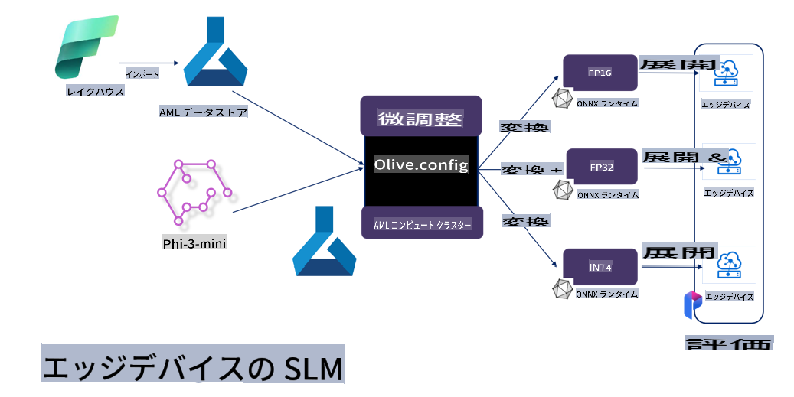

# **Microsoft Olive を使った Phi-3 のファインチューニング**

[Olive](https://github.com/microsoft/OLive?WT.mc_id=aiml-138114-kinfeylo) は、モデル圧縮、最適化、コンパイルの技術を一つにまとめた、ハードウェアに最適化されたモデル最適化ツールです。

このツールは、特定のハードウェアアーキテクチャを最大限に活用できるように、機械学習モデルの最適化プロセスを簡略化することを目的としています。

クラウドベースのアプリケーションでもエッジデバイスでも、Olive を使えばモデルを簡単かつ効果的に最適化できます。

## 主な特徴:
- Olive は、目的のハードウェアターゲットに対する最適化技術を集約し、自動化します。
- すべてのシナリオに適した単一の最適化技術は存在しないため、Olive は業界の専門家が最適化技術をプラグインできるように拡張性を持たせています。

## エンジニアリングの労力を軽減:
- 開発者は通常、トレーニングされたモデルをデプロイするために、複数のハードウェアベンダー固有のツールチェーンを学び、利用する必要があります。
- Olive は、目的のハードウェアに対する最適化技術を自動化することで、この体験を簡素化します。

## すぐに使えるエンドツーエンドの最適化ソリューション:

統合された技術を組み合わせて調整することで、Olive はエンドツーエンドの最適化に対する統一されたソリューションを提供します。
最適化する際には、精度や遅延といった制約も考慮します。


## Microsoft Olive を使ったファインチューニング

Microsoft Olive は非常に使いやすいオープンソースのモデル最適化ツールで、生成型人工知能の分野におけるファインチューニングや参照に対応できます。簡単な設定と、オープンソースの小型言語モデルや関連するランタイム環境（AzureML / ローカル GPU、CPU、DirectML）を組み合わせるだけで、自動最適化を通じてモデルのファインチューニングや参照を完了し、クラウドやエッジデバイスにデプロイする最適なモデルを見つけることができます。企業はオンプレミスやクラウド上で自社の業界特化型モデルを構築できます。


## Microsoft Olive を使った Phi-3 のファインチューニング



## Phi-3 Olive サンプルコードと例
この例では、Olive を使って以下を行います:

- LoRA アダプターをファインチューニングしてフレーズを Sad, Joy, Fear, Surprise に分類します。
- アダプターの重みをベースモデルにマージします。
- モデルを最適化し、int4 に量子化します。

[サンプルコード](../../code/04.Finetuning/olive-ort-example/README.md)


### Microsoft Olive のセットアップ

Microsoft Olive のインストールは非常に簡単で、CPU、GPU、DirectML、Azure ML 用にインストールすることもできます。

```bash
pip install olive-ai
```

CPU で ONNX モデルを実行したい場合は

```bash
pip install olive-ai[cpu]
```

GPU で ONNX モデルを実行したい場合は

```python
pip install olive-ai[gpu]
```

Azure ML を使用したい場合は

```python
pip install git+https://github.com/microsoft/Olive#egg=olive-ai[azureml]
```

**注意**
OS 要件: Ubuntu 20.04 / 22.04 


### **Microsoft Olive の Config.json**

インストール後、Config ファイルを通じてデータ、計算、トレーニング、デプロイメント、モデル生成などのモデル固有の設定を構成できます。

**1. データ**

Microsoft Olive では、ローカルデータとクラウドデータでのトレーニングをサポートしており、設定で構成できます。

*ローカルデータ設定*

ファインチューニングに必要なデータセットを簡単に設定でき、通常は json 形式で、データテンプレートに適合させます。これはモデルの要件に基づいて調整する必要があります（例: Microsoft Phi-3-mini に必要な形式に適合させる。他のモデルがある場合は、他のモデルに必要なファインチューニング形式を参照して処理してください）。

```json

    "data_configs": [
        {
            "name": "dataset_default_train",
            "type": "HuggingfaceContainer",
            "load_dataset_config": {
                "params": {
                    "data_name": "json", 
                    "data_files":"dataset/dataset-classification.json",
                    "split": "train"
                }
            },
            "pre_process_data_config": {
                "params": {
                    "dataset_type": "corpus",
                    "text_cols": [
                            "phrase",
                            "tone"
                    ],
                    "text_template": "### Text: {phrase}\n### The tone is:\n{tone}",
                    "corpus_strategy": "join",
                    "source_max_len": 2048,
                    "pad_to_max_len": false,
                    "use_attention_mask": false
                }
            }
        }
    ],
```

**クラウドデータソース設定**

Azure AI Studio / Azure Machine Learning Service のデータストアをリンクしてクラウドのデータをリンクし、Microsoft Fabric と Azure Data を通じて異なるデータソースを Azure AI Studio / Azure Machine Learning Service に導入し、ファインチューニングのデータをサポートできます。

```json

    "data_configs": [
        {
            "name": "dataset_default_train",
            "type": "HuggingfaceContainer",
            "load_dataset_config": {
                "params": {
                    "data_name": "json", 
                    "data_files": {
                        "type": "azureml_datastore",
                        "config": {
                            "azureml_client": {
                                "subscription_id": "Your Azure Subscrition ID",
                                "resource_group": "Your Azure Resource Group",
                                "workspace_name": "Your Azure ML Workspaces name"
                            },
                            "datastore_name": "workspaceblobstore",
                            "relative_path": "Your train_data.json Azure ML Location"
                        }
                    },
                    "split": "train"
                }
            },
            "pre_process_data_config": {
                "params": {
                    "dataset_type": "corpus",
                    "text_cols": [
                            "Question",
                            "Best Answer"
                    ],
                    "text_template": "<|user|>\n{Question}<|end|>\n<|assistant|>\n{Best Answer}\n<|end|>",
                    "corpus_strategy": "join",
                    "source_max_len": 2048,
                    "pad_to_max_len": false,
                    "use_attention_mask": false
                }
            }
        }
    ],
    
```


**2. 計算設定**

ローカルで実行する場合は、ローカルデータリソースを直接使用できます。Azure AI Studio / Azure Machine Learning Service のリソースを使用する場合は、関連する Azure パラメータや計算力名などを設定する必要があります。

```json

    "systems": {
        "aml": {
            "type": "AzureML",
            "config": {
                "accelerators": ["gpu"],
                "hf_token": true,
                "aml_compute": "Your Azure AI Studio / Azure Machine Learning Service Compute Name",
                "aml_docker_config": {
                    "base_image": "Your Azure AI Studio / Azure Machine Learning Service docker",
                    "conda_file_path": "conda.yaml"
                }
            }
        },
        "azure_arc": {
            "type": "AzureML",
            "config": {
                "accelerators": ["gpu"],
                "aml_compute": "Your Azure AI Studio / Azure Machine Learning Service Compute Name",
                "aml_docker_config": {
                    "base_image": "Your Azure AI Studio / Azure Machine Learning Service docker",
                    "conda_file_path": "conda.yaml"
                }
            }
        }
    },
```

***注意***

Azure AI Studio / Azure Machine Learning Service 上でコンテナを通じて実行されるため、必要な環境を設定する必要があります。これは conda.yaml 環境で設定されています。

```yaml

name: project_environment
channels:
  - defaults
dependencies:
  - python=3.8.13
  - pip=22.3.1
  - pip:
      - einops
      - accelerate
      - azure-keyvault-secrets
      - azure-identity
      - bitsandbytes
      - datasets
      - huggingface_hub
      - peft
      - scipy
      - sentencepiece
      - torch>=2.2.0
      - transformers
      - git+https://github.com/microsoft/Olive@jiapli/mlflow_loading_fix#egg=olive-ai[gpu]
      - --extra-index-url https://aiinfra.pkgs.visualstudio.com/PublicPackages/_packaging/ORT-Nightly/pypi/simple/ 
      - ort-nightly-gpu==1.18.0.dev20240307004
      - --extra-index-url https://aiinfra.pkgs.visualstudio.com/PublicPackages/_packaging/onnxruntime-genai/pypi/simple/
      - onnxruntime-genai-cuda

    

```


**3. SLM の選択**

Hugging Face から直接モデルを使用することも、Azure AI Studio / Azure Machine Learning のモデルカタログと組み合わせて使用することもできます。以下のコード例では、Microsoft Phi-3-mini を例として使用します。

ローカルにモデルがある場合は、この方法を使用します。

```json

    "input_model":{
        "type": "PyTorchModel",
        "config": {
            "hf_config": {
                "model_name": "model-cache/microsoft/phi-3-mini",
                "task": "text-generation",
                "model_loading_args": {
                    "trust_remote_code": true
                }
            }
        }
    },
```

Azure AI Studio / Azure Machine Learning Service からモデルを使用したい場合は、この方法を使用します。

```json

    "input_model":{
        "type": "PyTorchModel",
        "config": {
            "model_path": {
                "type": "azureml_registry_model",
                "config": {
                    "name": "microsoft/Phi-3-mini-4k-instruct",
                    "registry_name": "azureml-msr",
                    "version": "11"
                }
            },
             "model_file_format": "PyTorch.MLflow",
             "hf_config": {
                "model_name": "microsoft/Phi-3-mini-4k-instruct",
                "task": "text-generation",
                "from_pretrained_args": {
                    "trust_remote_code": true
                }
            }
        }
    },
```

**注意:**
Azure AI Studio / Azure Machine Learning Service と統合する必要があるため、モデルを設定する際にはバージョン番号や関連する名前付けを参照してください。

Azure 上のすべてのモデルは PyTorch.MLflow に設定する必要があります。

Hugging Face アカウントを持ち、Azure AI Studio / Azure Machine Learning のキーにキーをバインドする必要があります。

**4. アルゴリズム**

Microsoft Olive は Lora と QLora のファインチューニングアルゴリズムを非常にうまくカプセル化しています。関連するパラメータをいくつか設定するだけで済みます。ここでは QLora を例にとります。

```json
        "lora": {
            "type": "LoRA",
            "config": {
                "target_modules": [
                    "o_proj",
                    "qkv_proj"
                ],
                "double_quant": true,
                "lora_r": 64,
                "lora_alpha": 64,
                "lora_dropout": 0.1,
                "train_data_config": "dataset_default_train",
                "eval_dataset_size": 0.3,
                "training_args": {
                    "seed": 0,
                    "data_seed": 42,
                    "per_device_train_batch_size": 1,
                    "per_device_eval_batch_size": 1,
                    "gradient_accumulation_steps": 4,
                    "gradient_checkpointing": false,
                    "learning_rate": 0.0001,
                    "num_train_epochs": 3,
                    "max_steps": 10,
                    "logging_steps": 10,
                    "evaluation_strategy": "steps",
                    "eval_steps": 187,
                    "group_by_length": true,
                    "adam_beta2": 0.999,
                    "max_grad_norm": 0.3
                }
            }
        },
```

量子化変換を行いたい場合、Microsoft Olive のメインブランチはすでに onnxruntime-genai メソッドをサポートしています。必要に応じて設定できます：

1. アダプターの重みをベースモデルにマージ
2. ModelBuilder によって必要な精度の onnx モデルに変換

例えば、量子化された INT4 に変換する場合

```json

        "merge_adapter_weights": {
            "type": "MergeAdapterWeights"
        },
        "builder": {
            "type": "ModelBuilder",
            "config": {
                "precision": "int4"
            }
        }
```

**注意** 
- QLoRA を使用する場合、ONNXRuntime-genai の量子化変換は現在サポートされていません。

- 上記のステップは自分のニーズに応じて設定できます。必ずしも上記のステップを完全に構成する必要はなく、ニーズに応じてアルゴリズムのステップを直接使用することもできます。最終的に関連するエンジンを設定する必要があります。

```json

    "engine": {
        "log_severity_level": 0,
        "host": "aml",
        "target": "aml",
        "search_strategy": false,
        "execution_providers": ["CUDAExecutionProvider"],
        "cache_dir": "../model-cache/models/phi3-finetuned/cache",
        "output_dir" : "../model-cache/models/phi3-finetuned"
    }
```

**5. ファインチューニング完了**

コマンドラインで、olive-config.json のディレクトリで実行します。

```bash
olive run --config olive-config.json  
```

免責事項：この翻訳はAIモデルによって原文から翻訳されたものであり、完璧ではない可能性があります。
出力を確認し、必要な修正を行ってください。