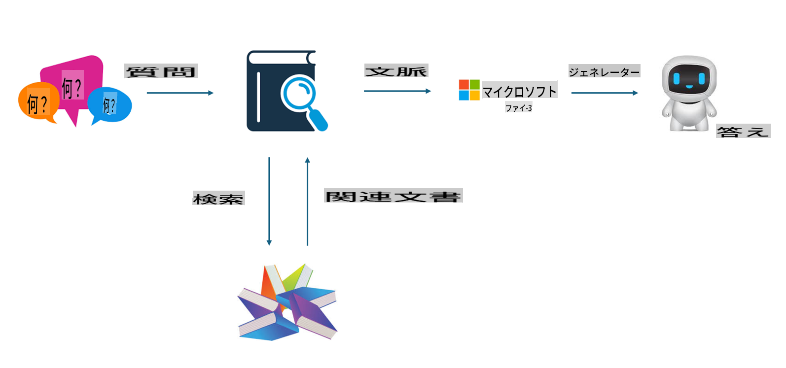

## ファインチューニング vs RAG

## 検索強化生成 (Retrieval Augmented Generation)

RAGはデータ検索 + テキスト生成です。企業の構造化データと非構造化データがベクトルデータベースに保存されます。関連するコンテンツを検索する際に、関連する要約や内容が見つかり、コンテキストが形成され、LLM/SLMのテキスト補完機能と組み合わせてコンテンツが生成されます。

## RAG プロセス

## ファインチューニング
ファインチューニングは特定のモデルの改良に基づいています。モデルアルゴリズムから始める必要はなく、データを継続的に蓄積する必要があります。業界アプリケーションでより正確な用語や言語表現が必要な場合、ファインチューニングがより良い選択です。しかし、データが頻繁に変わる場合、ファインチューニングは複雑になる可能性があります。

## 選び方
外部データの導入が必要な場合、RAGが最適な選択です。

安定して正確な業界知識を出力する必要がある場合、ファインチューニングが良い選択です。RAGは関連するコンテンツを優先して引っ張りますが、専門的なニュアンスを完全に捉えることは難しいかもしれません。

ファインチューニングには高品質なデータセットが必要で、データが少量の場合、大きな違いは生じません。RAGはより柔軟です。
ファインチューニングはブラックボックスで、その内部メカニズムを理解するのは難しいです。しかし、RAGはデータの出所を見つけやすくすることで、幻覚や内容の誤りを効果的に調整し、より良い透明性を提供します。

免責事項: この翻訳はAIモデルによって元の文章から翻訳されたものであり、完全ではない可能性があります。
出力内容を確認し、必要に応じて修正を行ってください。