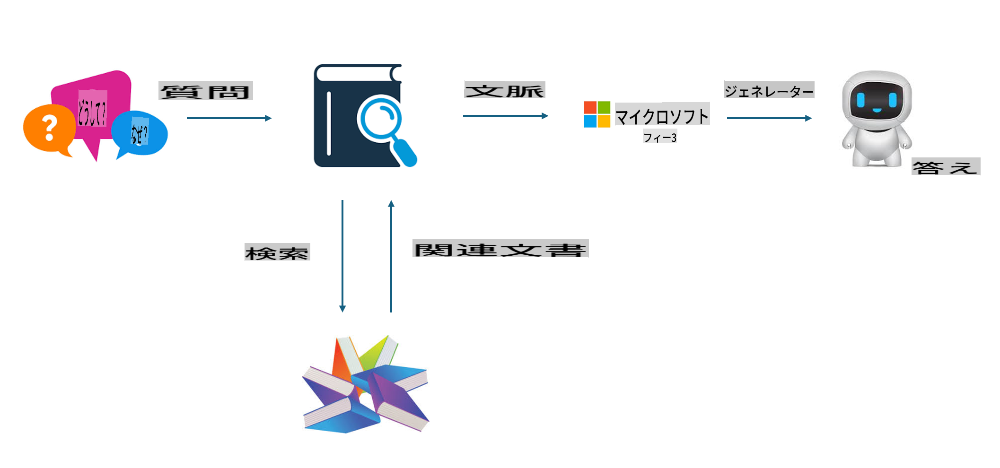
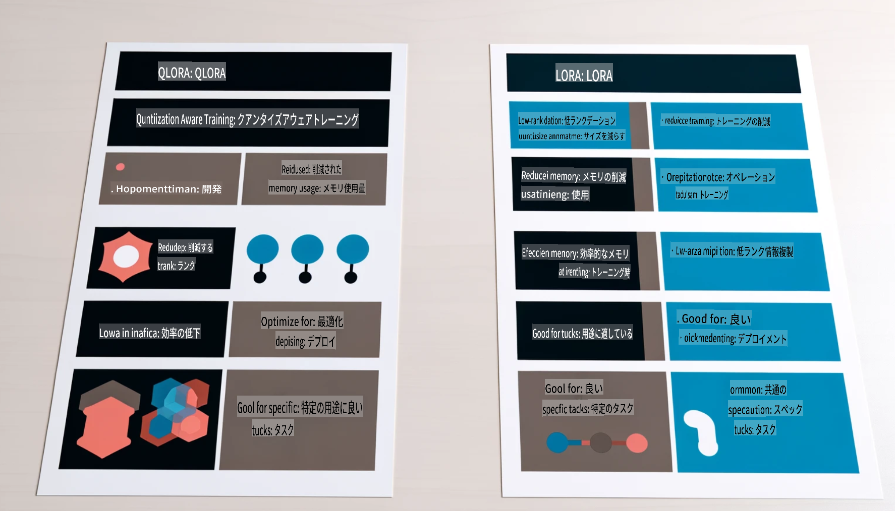

# **Phi-3を業界のエキスパートにする**

Phi-3モデルを業界に導入するには、業界のビジネスデータをPhi-3モデルに追加する必要があります。選択肢は2つあり、1つ目はRAG（Retrieval Augmented Generation）、2つ目はFine Tuningです。

## **RAG vs Fine-Tuning**

### **Retrieval Augmented Generation**

RAGはデータの検索とテキスト生成を組み合わせたものです。企業の構造化データと非構造化データはベクトルデータベースに保存されます。関連する内容を検索すると、関連する要約や内容が見つかり、それをコンテキストとして利用し、LLM/SLMのテキスト補完機能と組み合わせてコンテンツを生成します。

### **Fine-tuning**

Fine-tuningは特定のモデルを改良する方法です。モデルのアルゴリズムから始める必要はありませんが、データを継続的に蓄積する必要があります。業界アプリケーションでより正確な専門用語や言語表現が必要な場合、Fine-tuningが最適です。しかし、データが頻繁に変わる場合、Fine-tuningは複雑になる可能性があります。

### **選び方**

1. 答えに外部データの導入が必要な場合、RAGが最適です。

2. 安定して正確な業界知識を出力する必要がある場合、Fine-tuningが良い選択です。RAGは関連するコンテンツを優先的に引っ張ってきますが、専門的なニュアンスを完全に捉えることは難しいかもしれません。

3. Fine-tuningには高品質なデータセットが必要で、データが少量の場合、あまり効果がありません。RAGはより柔軟です。

4. Fine-tuningはブラックボックスであり、内部メカニズムを理解するのは難しいです。しかし、RAGはデータの出所を容易に見つけることができ、幻覚やコンテンツエラーを効果的に調整し、透明性を提供します。

### **シナリオ**

1. 垂直産業で特定の専門用語や表現が必要な場合、***Fine-tuning***が最適です。

2. 異なる知識ポイントの統合が必要なQAシステムの場合、***RAG***が最適です。

3. 自動化されたビジネスフローの組み合わせには、***RAG + Fine-tuning***が最適です。

## **RAGの使い方**

ベクトルデータベースは、数学的な形で保存されたデータのコレクションです。ベクトルデータベースは、機械学習モデルが以前の入力を記憶しやすくし、検索、推薦、テキスト生成などのユースケースをサポートするために機械学習を利用できるようにします。データは正確な一致ではなく、類似性メトリクスに基づいて識別されるため、コンピュータモデルがデータのコンテキストを理解できるようになります。

ベクトルデータベースはRAGを実現するための鍵です。text-embedding-3、jina-ai-embeddingなどのベクトルモデルを使用してデータをベクトルストレージに変換できます。

RAGアプリケーションの作成について詳しくは [https://github.com/microsoft/Phi-3CookBook](https://github.com/microsoft/Phi-3CookBook?WT.mc_id=aiml-138114-kinfeylo) をご覧ください。

## **Fine-tuningの使い方**

Fine-tuningでよく使われるアルゴリズムはLoraとQLoraです。どちらを選ぶべきでしょうか？
- [このサンプルノートブックでさらに学ぶ](../../../../code/04.Finetuning/Phi_3_Inference_Finetuning.ipynb)
- [Python FineTuningのサンプル例](../../../../code/04.Finetuning/FineTrainingScript.py)

### **LoraとQLora**

LoRA（Low-Rank Adaptation）とQLoRA（Quantized Low-Rank Adaptation）は、どちらもパラメータ効率の良いファインチューニング（PEFT）を使用して大規模言語モデル（LLM）を微調整する技術です。PEFT技術は、従来の方法よりも効率的にモデルを訓練するように設計されています。
LoRAは、重み更新行列に低ランク近似を適用することでメモリフットプリントを削減する単独のファインチューニング技術です。高速な訓練時間を提供し、従来のファインチューニング方法に近いパフォーマンスを維持します。

QLoRAは、さらにメモリ使用量を削減するために量子化技術を組み込んだLoRAの拡張版です。QLoRAは、事前訓練されたLLMの重みパラメータの精度を4ビットに量子化し、LoRAよりもメモリ効率が良いです。しかし、QLoRAの訓練は、追加の量子化および逆量子化ステップのために、LoRAの訓練より約30％遅くなります。

QLoRAは、量子化エラーを修正するための付属品としてLoRAを使用します。QLoRAは、比較的小型で高可用性のGPU上で数十億のパラメータを持つ大規模モデルのファインチューニングを可能にします。例えば、QLoRAは36個のGPUを必要とする70Bパラメータモデルを、わずか2つのGPUでファインチューニングできます。

免責事項: 翻訳はAIモデルによって原文から翻訳されたものであり、完璧ではない可能性があります。
出力を確認し、必要に応じて修正を行ってください。