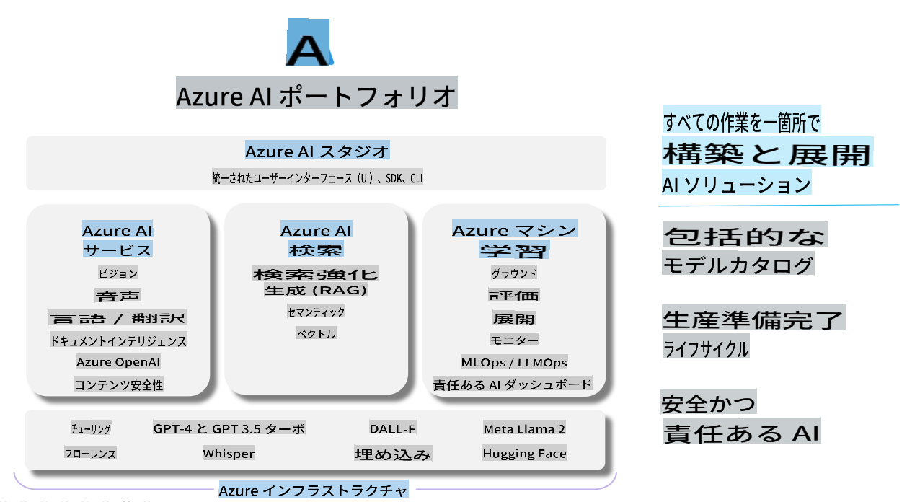

# **Azure AI Foundry を使用した評価**

[Azure AI Foundry](https://ai.azure.com?WT.mc_id=aiml-138114-kinfeylo) を使用して生成AIアプリケーションを評価する方法です。単一ターンまたは複数ターンの会話を評価する場合でも、Azure AI Foundry はモデルのパフォーマンスと安全性を評価するためのツールを提供します。

## Azure AI Foundry で生成AIアプリを評価する方法
詳細な手順については、[Azure AI Foundry ドキュメント](https://learn.microsoft.com/azure/ai-studio/how-to/evaluate-generative-ai-app?WT.mc_id=aiml-138114-kinfeylo) を参照してください。

以下は開始するためのステップです：

## Azure AI Foundry で生成AIモデルを評価する

**前提条件**

- CSV または JSON 形式のテストデータセット。
- 配備済みの生成AIモデル（例：Phi-3、GPT 3.5、GPT 4、または Davinci モデル）。
- 評価を実行するためのコンピュートインスタンスを備えたランタイム。

## 組み込み評価指標

Azure AI Foundry は、単一ターンおよび複雑な複数ターンの会話の両方を評価できます。
モデルが特定のデータに基づいている Retrieval Augmented Generation (RAG) シナリオでは、組み込みの評価指標を使用してパフォーマンスを評価できます。
さらに、一般的な単一ターンの質問応答シナリオ（非RAG）も評価できます。

## 評価実行の作成

Azure AI Foundry のUIから、Evaluate ページまたは Prompt Flow ページに移動します。
評価作成ウィザードに従って評価実行を設定します。評価にオプションの名前を付けることができます。
アプリケーションの目的に一致するシナリオを選択します。
モデルの出力を評価するための1つ以上の評価指標を選択します。

## カスタム評価フロー（オプション）

より柔軟に対応するために、カスタム評価フローを確立することもできます。特定の要件に基づいて評価プロセスをカスタマイズします。

## 結果の表示

評価を実行した後、Azure AI Foundry で詳細な評価指標をログに記録し、表示し、分析します。アプリケーションの能力と限界についての洞察を得ることができます。

**Note** Azure AI Foundry は現在パブリックプレビュー中のため、実験および開発目的で使用してください。運用ワークロードには他のオプションを検討してください。詳細およびステップバイステップの手順については、公式の [AI Foundry ドキュメント](https://learn.microsoft.com/azure/ai-studio/?WT.mc_id=aiml-138114-kinfeylo) を参照してください。

**免責事項**:
この文書は機械ベースのAI翻訳サービスを使用して翻訳されています。正確性を期していますが、自動翻訳には誤りや不正確さが含まれる場合があります。元の言語で書かれた原文が信頼できる情報源とみなされるべきです。重要な情報については、専門の人間による翻訳をお勧めします。この翻訳の使用に起因する誤解や誤解については責任を負いません。