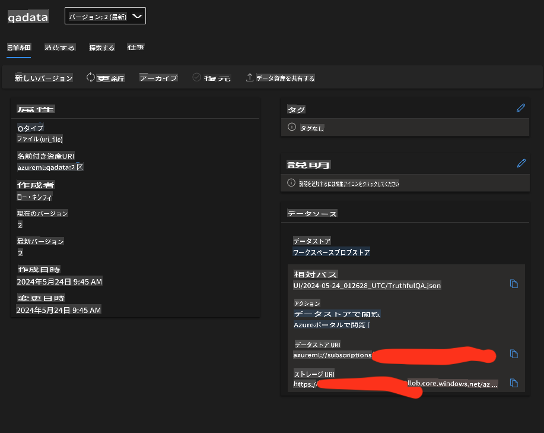

# **業界データの準備**

Phi-3-miniを[TruthfulQAのデータ](https://github.com/sylinrl/TruthfulQA/blob/main/TruthfulQA.csv)に注入する予定です。最初のステップは、TruthfulQAのデータをインポートすることです。

### **1. データをcsvにロードし、jsonに保存する**

```python

import csv
import json

csvfile = open('./datasets/TruthfulQA.csv', 'r')
jsonfile = open('./output/TruthfulQA.json', 'w')

fieldnames = ("Type","Category","Question","Best Answer","Correct Answers","Incorrect Answers","Source")

reader = csv.DictReader(csvfile, fieldnames)

for row in reader:
    json.dump(row, jsonfile)
    jsonfile.write('\n')

i = 1
data = []
with open('./output/TruthfulQA.json', 'r') as file:
    for line in file:
        print(line)
        data.append(json.loads(line))
        print(str(i))
        i+=1
```

### **2. データをAzure MLデータストアにアップロードする**



### **おめでとうございます！**

データのロードが成功しました。次に、データと関連するアルゴリズムをMicrosoft Oliveを使って設定してください。[E2E_LoRA&QLoRA_Config_With_Olive.md](./E2E_LoRA&QLoRA_Config_With_Olive.md)

