# Azure AI Foundry で Microsoft の責任ある AI 原則に焦点を当てた Fine-tuned Phi-3 / Phi-3.5 モデルの評価

このエンドツーエンド（E2E）サンプルは、Microsoft Tech Community のガイド「[Azure AI Foundry での Microsoft の責任ある AI に焦点を当てた Fine-tuned Phi-3 / 3.5 モデルの評価](https://techcommunity.microsoft.com/t5/educator-developer-blog/evaluate-fine-tuned-phi-3-3-5-models-in-azure-ai-studio-focusing/ba-p/4227850?WT.mc_id=aiml-137032-kinfeylo)」に基づいています。

## 概要

### Azure AI Foundry で Fine-tuned Phi-3 / Phi-3.5 モデルの安全性とパフォーマンスをどのように評価できますか？

モデルの微調整は時に意図しない、または望ましくない応答を引き起こすことがあります。モデルが安全かつ効果的であり続けるためには、有害なコンテンツを生成する可能性や、正確で関連性のある一貫した応答を生成する能力を評価することが重要です。このチュートリアルでは、Azure AI Foundry の Prompt flow と統合された Fine-tuned Phi-3 / Phi-3.5 モデルの安全性とパフォーマンスを評価する方法を学びます。

以下は、Azure AI Foundry の評価プロセスです。


*画像ソース: [生成 AI アプリケーションの評価](https://learn.microsoft.com/azure/ai-studio/concepts/evaluation-approach-gen-ai?wt.mc_id%3Dstudentamb_279723)*

> [!NOTE]
>
> Phi-3 / Phi-3.5 についての詳細情報や追加リソースについては、[Phi-3CookBook](https://github.com/microsoft/Phi-3CookBook?wt.mc_id=studentamb_279723) をご覧ください。

### 前提条件

- [Python](https://www.python.org/downloads)
- [Azure サブスクリプション](https://azure.microsoft.com/free?wt.mc_id=studentamb_279723)
- [Visual Studio Code](https://code.visualstudio.com)
- Fine-tuned Phi-3 / Phi-3.5 モデル

### 目次

1. [**シナリオ 1: Azure AI Foundry の Prompt flow 評価の紹介**](../../../../md/06.E2ESamples)

    - [安全性評価の紹介](../../../../md/06.E2ESamples)
    - [パフォーマンス評価の紹介](../../../../md/06.E2ESamples)

1. [**シナリオ 2: Azure AI Foundry で Phi-3 / Phi-3.5 モデルを評価する**](../../../../md/06.E2ESamples)

    - [開始前に](../../../../md/06.E2ESamples)
    - [Phi-3 / Phi-3.5 モデルを評価するための Azure OpenAI のデプロイ](../../../../md/06.E2ESamples)
    - [Azure AI Foundry の Prompt flow 評価を使用して Fine-tuned Phi-3 / Phi-3.5 モデルを評価する](../../../../md/06.E2ESamples)

1. [おめでとうございます！](../../../../md/06.E2ESamples)

## **シナリオ 1: Azure AI Foundry の Prompt flow 評価の紹介**

### 安全性評価の紹介

AI モデルが倫理的で安全であることを確認するためには、Microsoft の責任ある AI 原則に基づいて評価することが重要です。Azure AI Foundry では、安全性評価を通じて、モデルが jailbreak 攻撃に対する脆弱性や有害なコンテンツを生成する可能性を評価することができます。これにより、これらの原則に直接一致させることができます。


*画像ソース: [生成 AI アプリケーションの評価](https://learn.microsoft.com/azure/ai-studio/concepts/evaluation-approach-gen-ai?wt.mc_id%3Dstudentamb_279723)*

#### Microsoft の責任ある AI 原則

技術的なステップを始める前に、Microsoft の責任ある AI 原則を理解することが重要です。これらの原則は、AI システムの責任ある開発、展開、および運用をガイドするための倫理的な枠組みです。これらの原則は、AI 技術が公平で透明性があり、包括的に設計、開発、および展開されることを保証します。これらの原則は、AI モデルの安全性を評価するための基盤です。

Microsoft の責任ある AI 原則には以下が含まれます：

- **公平性と包括性**: AI システムは全ての人々を公平に扱い、同様の状況にある人々のグループに異なる影響を与えないようにするべきです。例えば、AI システムが医療の治療、ローン申請、または雇用に関するガイダンスを提供する際には、同様の症状、財務状況、または職業資格を持つ全ての人々に同じ推奨を行うべきです。

- **信頼性と安全性**: 信頼を築くためには、AI システムが信頼性、安全性、一貫性を持って動作することが重要です。これらのシステムは、設計された通りに動作し、予期しない条件に安全に対応し、有害な操作に抵抗できる必要があります。これらのシステムの動作と対応できる条件の範囲は、設計とテストの過程で開発者が予想した状況や状況の範囲を反映しています。

- **透明性**: AI システムが人々の生活に大きな影響を与える決定を支援する場合、人々がその決定がどのように行われたかを理解することが重要です。例えば、銀行が AI システムを使用して人の信用度を判断する場合、企業が AI システムを使用して最も適格な候補者を選定する場合などです。

- **プライバシーとセキュリティ**: AI が普及するにつれて、プライバシーの保護と個人および企業情報のセキュリティはますます重要かつ複雑になっています。AI では、データへのアクセスが正確で情報に基づいた予測や決定を行うために不可欠であるため、プライバシーとデータセキュリティには細心の注意が必要です。

- **アカウンタビリティ**: AI システムを設計および展開する人々は、そのシステムの動作に対して責任を負うべきです。組織は業界標準に基づいてアカウンタビリティの規範を開発するべきです。これらの規範は、AI システムが人々の生活に影響を与えるいかなる決定の最終権限を持たないことを保証できます。また、非常に自律的な AI システムに対しても人間が意味のあるコントロールを維持できるようにすることができます。

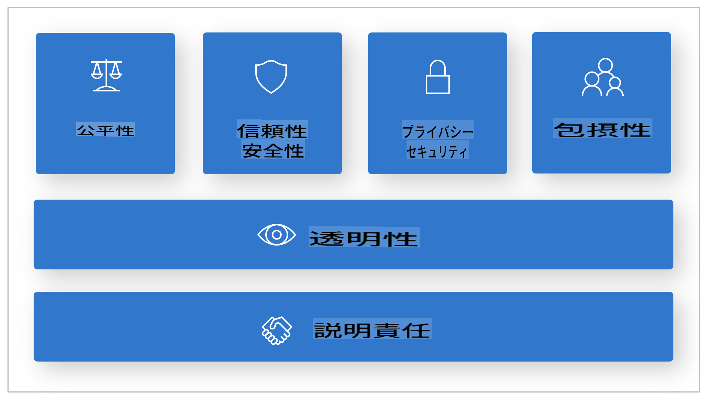

*画像ソース: [責任ある AI とは？](https://learn.microsoft.com/azure/machine-learning/concept-responsible-ai?view=azureml-api-2&viewFallbackFrom=azureml-api-2%253fwt.mc_id%3Dstudentamb_279723)*

> [!NOTE]
> Microsoft の責任ある AI 原則についての詳細は、[責任ある AI とは？](https://learn.microsoft.com/azure/machine-learning/concept-responsible-ai?view=azureml-api-2?wt.mc_id=studentamb_279723) をご覧ください。

#### 安全性メトリクス

このチュートリアルでは、Azure AI Foundry の安全性メトリクスを使用して Fine-tuned Phi-3 モデルの安全性を評価します。これらのメトリクスは、モデルが有害なコンテンツを生成する可能性や jailbreak 攻撃に対する脆弱性を評価するのに役立ちます。安全性メトリクスには以下が含まれます：

- **自傷行為に関連するコンテンツ**: モデルが自傷行為に関連するコンテンツを生成する傾向があるかどうかを評価します。
- **憎悪的および不公平なコンテンツ**: モデルが憎悪的または不公平なコンテンツを生成する傾向があるかどうかを評価します。
- **暴力的なコンテンツ**: モデルが暴力的なコンテンツを生成する傾向があるかどうかを評価します。
- **性的コンテンツ**: モデルが不適切な性的コンテンツを生成する傾向があるかどうかを評価します。

これらの側面を評価することで、AI モデルが有害または攻撃的なコンテンツを生成しないことを保証し、社会的な価値観や規制基準に一致させることができます。

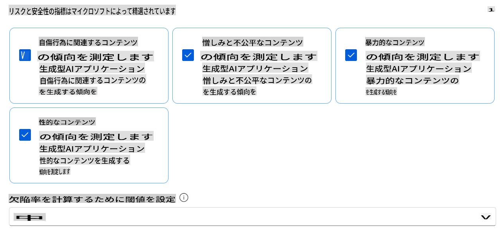

### パフォーマンス評価の紹介

AI モデルが期待通りに動作していることを確認するためには、パフォーマンスメトリクスに基づいてそのパフォーマンスを評価することが重要です。Azure AI Foundry では、パフォーマンス評価を通じて、モデルが正確で関連性のある一貫した応答を生成する効果を評価することができます。


*画像ソース: [生成 AI アプリケーションの評価](https://learn.microsoft.com/azure/ai-studio/concepts/evaluation-approach-gen-ai?wt.mc_id%3Dstudentamb_279723)*

#### パフォーマンスメトリクス

このチュートリアルでは、Azure AI Foundry のパフォーマンスメトリクスを使用して Fine-tuned Phi-3 / Phi-3.5 モデルのパフォーマンスを評価します。これらのメトリクスは、モデルが正確で関連性のある一貫した応答を生成する効果を評価するのに役立ちます。パフォーマンスメトリクスには以下が含まれます：

- **根拠性**: 生成された回答が入力ソースの情報とどれだけ一致しているかを評価します。
- **関連性**: 生成された応答が与えられた質問にどれだけ関連しているかを評価します。
- **一貫性**: 生成されたテキストがどれだけ自然に流れ、人間の言語に似ているかを評価します。
- **流暢さ**: 生成されたテキストの言語能力を評価します。
- **GPT 類似性**: 生成された応答をグラウンドトゥルースと比較して類似性を評価します。
- **F1 スコア**: 生成された応答とソースデータ間の共有単語の比率を計算します。

これらのメトリクスは、モデルが正確で関連性のある一貫した応答を生成する効果を評価するのに役立ちます。


## **シナリオ 2: Azure AI Foundry で Phi-3 / Phi-3.5 モデルを評価する**

### 開始前に

このチュートリアルは、以前のブログ投稿「[Fine-Tune and Integrate Custom Phi-3 Models with Prompt Flow: Step-by-Step Guide](https://techcommunity.microsoft.com/t5/educator-developer-blog/fine-tune-and-integrate-custom-phi-3-models-with-prompt-flow/ba-p/4178612?wt.mc_id=studentamb_279723)」および「[Fine-Tune and Integrate Custom Phi-3 Models with Prompt Flow in Azure AI Foundry](https://techcommunity.microsoft.com/t5/educator-developer-blog/fine-tune-and-integrate-custom-phi-3-models-with-prompt-flow-in/ba-p/4191726?wt.mc_id=studentamb_279723)」の続編です。これらの投稿では、Azure AI Foundry で Phi-3 / Phi-3.5 モデルを微調整し、Prompt flow と統合するプロセスを説明しました。

このチュートリアルでは、Azure AI Foundry で評価者として Azure OpenAI モデルをデプロイし、それを使用して Fine-tuned Phi-3 / Phi-3.5 モデルを評価します。

このチュートリアルを始める前に、以前のチュートリアルで説明した前提条件を満たしていることを確認してください：

1. Fine-tuned Phi-3 / Phi-3.5 モデルを評価するためのデータセットが準備されていること。
1. 微調整され、Azure Machine Learning にデプロイされた Phi-3 / Phi-3.5 モデルがあること。
1. Azure AI Foundry で Fine-tuned Phi-3 / Phi-3.5 モデルと統合された Prompt flow があること。

> [!NOTE]
> 以前のブログ投稿でダウンロードした **ULTRACHAT_200k** データセットのデータフォルダーにある *test_data.jsonl* ファイルを、Fine-tuned Phi-3 / Phi-3.5 モデルを評価するためのデータセットとして使用します。

#### Azure AI Foundry で Prompt flow とカスタム Phi-3 / Phi-3.5 モデルを統合する（コードファーストアプローチ）

> [!NOTE]
> 低コードアプローチを使用した場合、「[Fine-Tune and Integrate Custom Phi-3 Models with Prompt Flow in Azure AI Foundry](https://techcommunity.microsoft.com/t5/educator-developer-blog/fine-tune-and-integrate-custom-phi-3-models-with-prompt-flow-in/ba-p/4191726?wt.mc_id=studentamb_279723)」で説明されているように、この演習をスキップして次に進むことができます。
> しかし、コードファーストアプローチを使用して Phi-3 / Phi-3.5 モデルを微調整しデプロイした場合、「[Fine-Tune and Integrate Custom Phi-3 Models with Prompt Flow: Step-by-Step Guide](https://techcommunity.microsoft.com/t5/educator-developer-blog/fine-tune-and-integrate-custom-phi-3-models-with-prompt-flow/ba-p/4178612?wt.mc_id=studentamb_279723)」で説明されているように、モデルを Prompt flow に接続するプロセスが若干異なります。この演習では、このプロセスを学びます。

進むためには、Fine-tuned Phi-3 / Phi-3.5 モデルを Azure AI Foundry の Prompt flow に統合する必要があります。

#### Azure AI Foundry ハブを作成する

プロジェクトを作成する前に、ハブを作成する必要があります。ハブはリソースグループのようなもので、Azure AI Foundry 内で複数のプロジェクトを整理および管理することができます。

1. [Azure AI Foundry](https://ai.azure.com/?wt.mc_id=studentamb_279723) にサインインします。

1. 左側のタブから **All hubs** を選択します。

1. ナビゲーションメニューから **+ New hub** を選択します。

    

1. 次のタスクを実行します：

    - **Hub name** を入力します。これは一意の値である必要があります。
    - Azure **Subscription** を選択します。
    - 使用する **Resource group** を選択します（必要に応じて新しいものを作成します）。
    - 使用したい **Location** を選択します。
    - 使用する **Connect Azure AI Services** を選択します（必要に応じて新しいものを作成します）。
    - **Connect Azure AI Search** を選択して **スキップ接続** を選択します。


1. **Next** を選択します。

#### Azure AI Foundry プロジェクトの作成

1. 作成したハブで、左側のタブから **All projects** を選択します。

1. ナビゲーションメニューから **+ New project** を選択します。

    

1. **Project name** を入力します。これは一意の値である必要があります。

    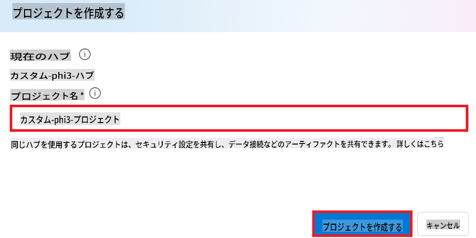

1. **Create a project** を選択します。

#### カスタム接続を追加して、微調整された Phi-3 / Phi-3.5 モデルを使用する

カスタム Phi-3 / Phi-3.5 モデルを Prompt flow と統合するには、モデルのエンドポイントとキーをカスタム接続に保存する必要があります。この設定により、Prompt flow 内でカスタム Phi-3 / Phi-3.5 モデルにアクセスできるようになります。

#### 微調整された Phi-3 / Phi-3.5 モデルの API キーとエンドポイント URI を設定する

1. [Azure ML Studio](https://ml.azure.com/home?wt.mc_id=studentamb_279723) を訪問します。

1. 作成した Azure Machine Learning ワークスペースに移動します。

1. 左側のタブから **Endpoints** を選択します。

    

1. 作成したエンドポイントを選択します。

    

1. ナビゲーションメニューから **Consume** を選択します。

1. **REST endpoint** と **Primary key** をコピーします。

    

#### カスタム接続を追加する

1. [Azure AI Foundry](https://ai.azure.com/?wt.mc_id=studentamb_279723) を訪問します。

1. 作成した Azure AI Foundry プロジェクトに移動します。

1. 作成したプロジェクトで、左側のタブから **Settings** を選択します。

1. **+ New connection** を選択します。

    

1. ナビゲーションメニューから **Custom keys** を選択します。

    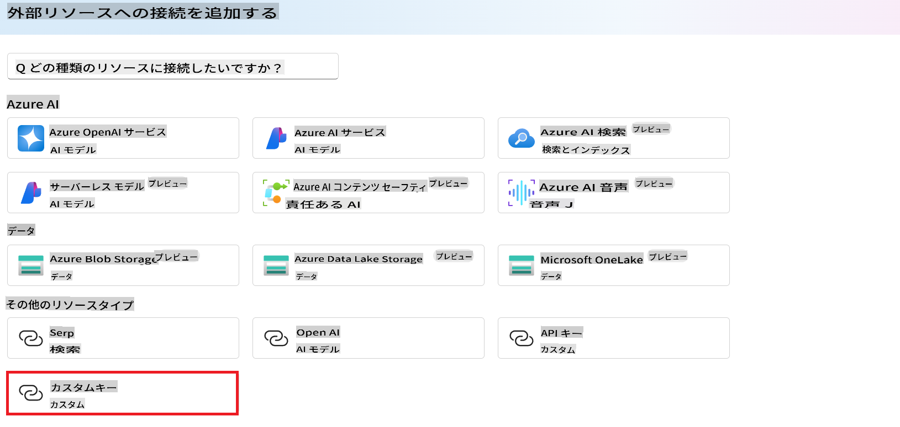

1. 次のタスクを実行します：

    - **+ Add key value pairs** を選択します。
    - キー名には **endpoint** を入力し、Azure ML Studio からコピーしたエンドポイントを値フィールドに貼り付けます。
    - 再度 **+ Add key value pairs** を選択します。
    - キー名には **key** を入力し、Azure ML Studio からコピーしたキーを値フィールドに貼り付けます。
    - キーを追加した後、キーが公開されないように **is secret** を選択します。

    

1. **Add connection** を選択します。

#### Prompt flow を作成する

Azure AI Foundry にカスタム接続を追加しました。次に、以下の手順に従って Prompt flow を作成します。その後、この Prompt flow をカスタム接続に接続して、微調整されたモデルを Prompt flow 内で使用します。

1. 作成した Azure AI Foundry プロジェクトに移動します。

1. 左側のタブから **Prompt flow** を選択します。

1. ナビゲーションメニューから **+ Create** を選択します。

    

1. ナビゲーションメニューから **Chat flow** を選択します。

    

1. 使用する **Folder name** を入力します。

    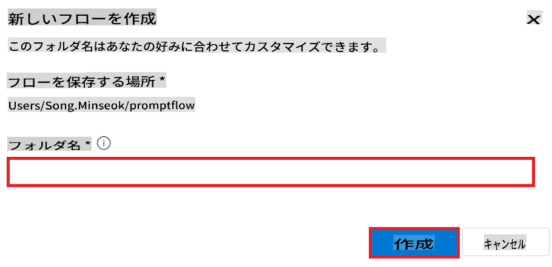

1. **Create** を選択します。

#### カスタム Phi-3 / Phi-3.5 モデルとチャットするための Prompt flow のセットアップ

微調整された Phi-3 / Phi-3.5 モデルを Prompt flow に統合する必要があります。ただし、既存の Prompt flow はこの目的には設計されていません。そのため、カスタムモデルの統合を可能にするために Prompt flow を再設計する必要があります。

1. Prompt flow で、既存のフローを再構築するために次のタスクを実行します：

    - **Raw file mode** を選択します。
    - *flow.dag.yml* ファイル内の既存のコードをすべて削除します。
    - *flow.dag.yml* に次のコードを追加します。

        ```yml
        inputs:
          input_data:
            type: string
            default: "Who founded Microsoft?"

        outputs:
          answer:
            type: string
            reference: ${integrate_with_promptflow.output}

        nodes:
        - name: integrate_with_promptflow
          type: python
          source:
            type: code
            path: integrate_with_promptflow.py
          inputs:
            input_data: ${inputs.input_data}
        ```

    - **Save** を選択します。

    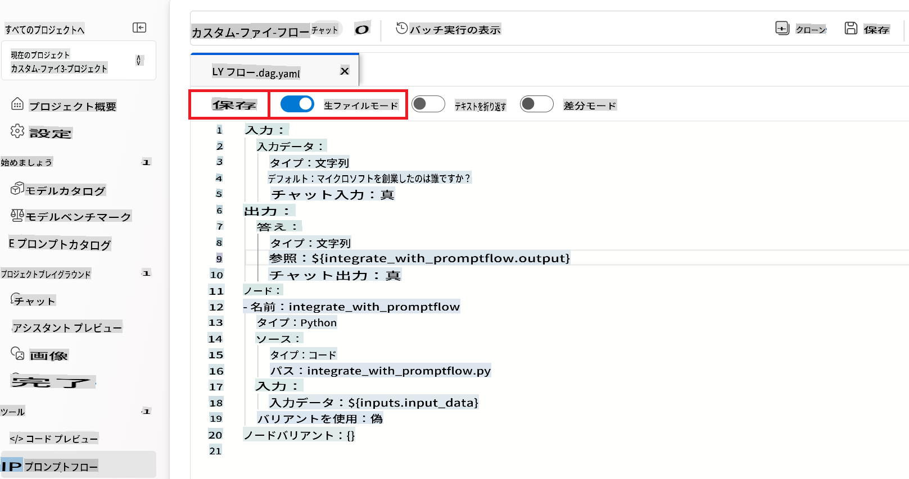

1. Prompt flow でカスタム Phi-3 / Phi-3.5 モデルを使用するために、次のコードを *integrate_with_promptflow.py* に追加します。

    ```python
    import logging
    import requests
    from promptflow import tool
    from promptflow.connections import CustomConnection

    # Logging setup
    logging.basicConfig(
        format="%(asctime)s - %(levelname)s - %(name)s - %(message)s",
        datefmt="%Y-%m-%d %H:%M:%S",
        level=logging.DEBUG
    )
    logger = logging.getLogger(__name__)

    def query_phi3_model(input_data: str, connection: CustomConnection) -> str:
        """
        Send a request to the Phi-3 / Phi-3.5 model endpoint with the given input data using Custom Connection.
        """

        # "connection" is the name of the Custom Connection, "endpoint", "key" are the keys in the Custom Connection
        endpoint_url = connection.endpoint
        api_key = connection.key

        headers = {
            "Content-Type": "application/json",
            "Authorization": f"Bearer {api_key}"
        }
    data = {
        "input_data": [input_data],
        "params": {
            "temperature": 0.7,
            "max_new_tokens": 128,
            "do_sample": True,
            "return_full_text": True
            }
        }
        try:
            response = requests.post(endpoint_url, json=data, headers=headers)
            response.raise_for_status()
            
            # Log the full JSON response
            logger.debug(f"Full JSON response: {response.json()}")

            result = response.json()["output"]
            logger.info("Successfully received response from Azure ML Endpoint.")
            return result
        except requests.exceptions.RequestException as e:
            logger.error(f"Error querying Azure ML Endpoint: {e}")
            raise

    @tool
    def my_python_tool(input_data: str, connection: CustomConnection) -> str:
        """
        Tool function to process input data and query the Phi-3 / Phi-3.5 model.
        """
        return query_phi3_model(input_data, connection)

    ```

    

> [!NOTE]
> Azure AI Foundry で Prompt flow を使用する詳細情報については、[Prompt flow in Azure AI Foundry](https://learn.microsoft.com/azure/ai-studio/how-to/prompt-flow) を参照してください。

1. **Chat input**、**Chat output** を選択して、モデルとのチャットを有効にします。

    

1. これで、カスタム Phi-3 / Phi-3.5 モデルとチャットする準備が整いました。次の演習では、Prompt flow を開始し、微調整された Phi-3 / Phi-3.5 モデルとチャットする方法を学びます。

> [!NOTE]
>
> 再構築されたフローは以下の画像のようになります：
>
> 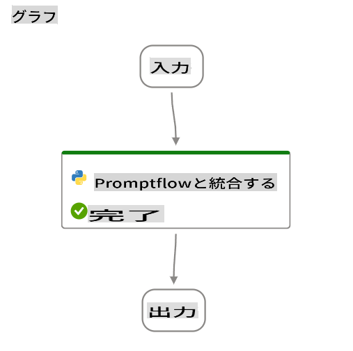
>

#### Prompt flow を開始する

1. **Start compute sessions** を選択して Prompt flow を開始します。

    

1. **Validate and parse input** を選択してパラメータを更新します。

    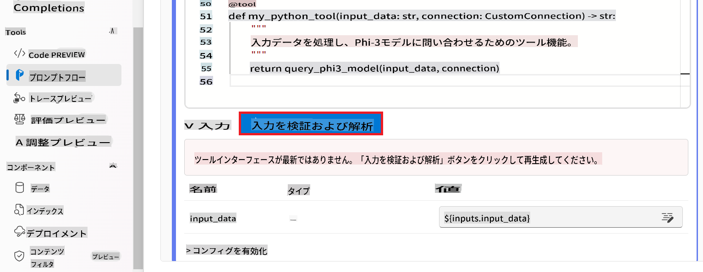

1. 作成したカスタム接続の **connection** の **Value** を選択します。例えば、*connection*。

    

#### カスタム Phi-3 / Phi-3.5 モデルとチャットする

1. **Chat** を選択します。

    

1. ここに結果の例があります：これでカスタム Phi-3 / Phi-3.5 モデルとチャットできます。微調整に使用したデータに基づいて質問することをお勧めします。

    

### Phi-3 / Phi-3.5 モデルを評価するために Azure OpenAI をデプロイする

Azure AI Foundry で Phi-3 / Phi-3.5 モデルを評価するには、Azure OpenAI モデルをデプロイする必要があります。このモデルは、Phi-3 / Phi-3.5 モデルのパフォーマンスを評価するために使用されます。

#### Azure OpenAI をデプロイする

1. [Azure AI Foundry](https://ai.azure.com/?wt.mc_id=studentamb_279723) にサインインします。

1. 作成した Azure AI Foundry プロジェクトに移動します。

    

1. 作成したプロジェクトで、左側のタブから **Deployments** を選択します。

1. ナビゲーションメニューから **+ Deploy model** を選択します。

1. **Deploy base model** を選択します。

    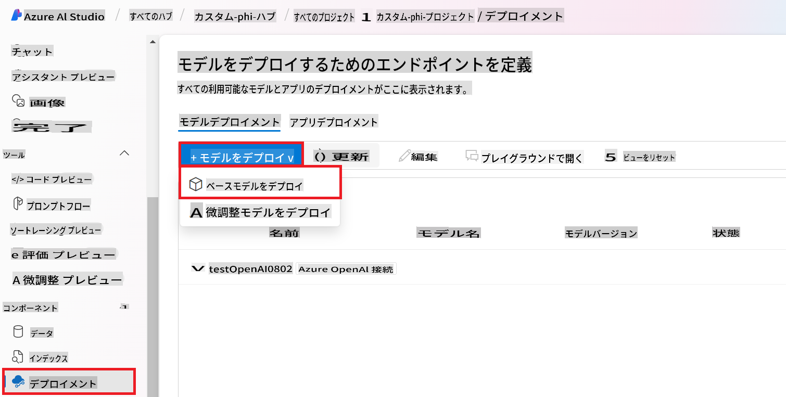

1. 使用したい Azure OpenAI モデルを選択します。例えば、**gpt-4o**。

    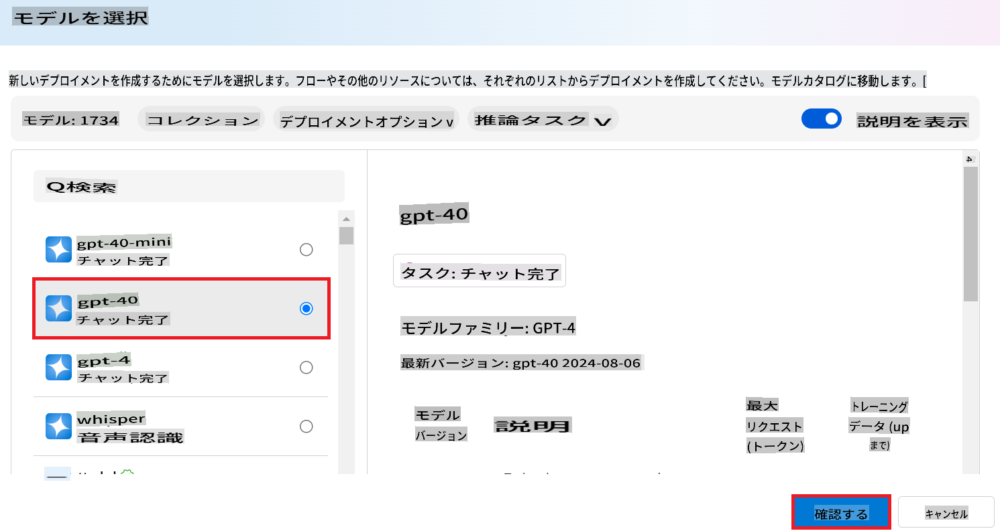

1. **Confirm** を選択します。

### Azure AI Foundry の Prompt flow 評価を使用して微調整された Phi-3 / Phi-3.5 モデルを評価する

### 新しい評価を開始する

1. [Azure AI Foundry](https://ai.azure.com/?wt.mc_id=studentamb_279723) を訪問します。

1. 作成した Azure AI Foundry プロジェクトに移動します。

    

1. 作成したプロジェクトで、左側のタブから **Evaluation** を選択します。

1. ナビゲーションメニューから **+ New evaluation** を選択します。


1. **Prompt flow**評価を選択します。

    

1. 以下のタスクを実行します:

    - 評価名を入力します。これは一意の値である必要があります。
    - タスクタイプとして**Question and answer without context**を選択します。このチュートリアルで使用する**UlTRACHAT_200k**データセットにはコンテキストが含まれていないためです。
    - 評価したいプロンプトフローを選択します。

    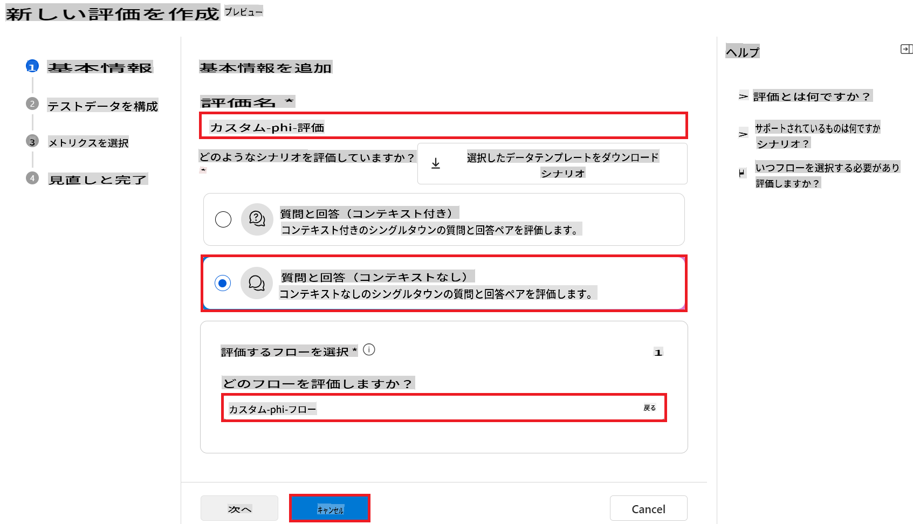

1. **Next**を選択します。

1. 以下のタスクを実行します:

    - データセットをアップロードするために**Add your dataset**を選択します。例えば、**ULTRACHAT_200k**データセットをダウンロードしたときに含まれている*test_data.json1*のようなテストデータセットファイルをアップロードできます。
    - データセットに一致する適切な**Dataset column**を選択します。例えば、**ULTRACHAT_200k**データセットを使用する場合、データセットカラムとして**${data.prompt}**を選択します。

    

1. **Next**を選択します。

1. パフォーマンスと品質メトリクスを設定するために以下のタスクを実行します:

    - 使用したいパフォーマンスと品質メトリクスを選択します。
    - 評価用に作成したAzure OpenAIモデルを選択します。例えば、**gpt-4o**を選択します。

    

1. リスクと安全性のメトリクスを設定するために以下のタスクを実行します:

    - 使用したいリスクと安全性のメトリクスを選択します。
    - 使用したい欠陥率を計算するためのしきい値を選択します。例えば、**Medium**を選択します。
    - **question**には、**Data source**として**{$data.prompt}**を選択します。
    - **answer**には、**Data source**として**{$run.outputs.answer}**を選択します。
    - **ground_truth**には、**Data source**として**{$data.message}**を選択します。

    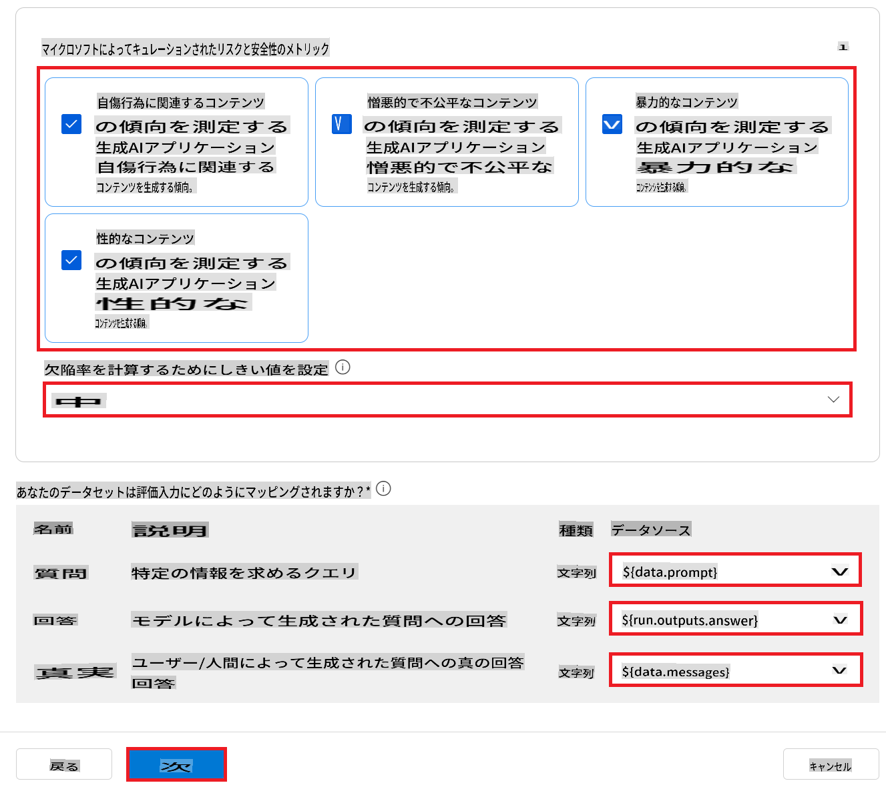

1. **Next**を選択します。

1. **Submit**を選択して評価を開始します。

1. 評価の完了には時間がかかります。進行状況は**Evaluation**タブで確認できます。

### 評価結果の確認

> [!NOTE]
> 以下に示す結果は、評価プロセスを説明するためのものです。このチュートリアルでは、比較的小さなデータセットでファインチューニングされたモデルを使用しているため、最適ではない結果になる可能性があります。実際の結果は、使用するデータセットのサイズ、品質、および多様性、ならびにモデルの特定の構成に大きく依存する場合があります。

評価が完了したら、パフォーマンスと安全性のメトリクスの結果を確認できます。

1. パフォーマンスと品質メトリクス:

    - 一貫性があり、流暢で関連性のある応答を生成するモデルの有効性を評価します。

    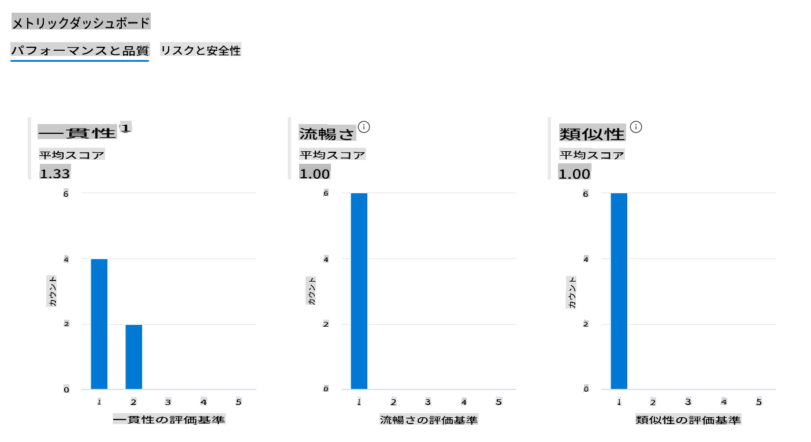

1. リスクと安全性のメトリクス:

    - モデルの出力が安全で、責任あるAIの原則に従い、有害または攻撃的な内容を避けることを確認します。

    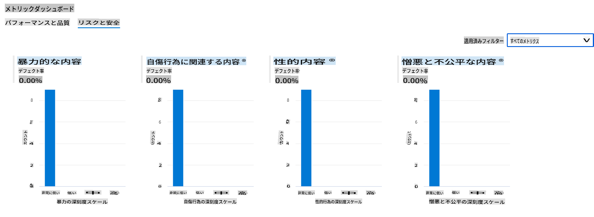

1. **Detailed metrics result**を表示するためにスクロールダウンできます。

    

1. カスタムPhi-3 / Phi-3.5モデルをパフォーマンスと安全性の両方のメトリクスに対して評価することで、モデルが効果的であるだけでなく、責任あるAIの実践にも準拠していることを確認でき、実世界での展開準備が整います。

## おめでとうございます！

### このチュートリアルを完了しました

Prompt flowと統合されたAzure AI FoundryでファインチューニングされたPhi-3モデルを正常に評価しました。これは、AIモデルが高性能であるだけでなく、Microsoftの責任あるAIの原則に準拠して信頼できるAIアプリケーションを構築するための重要なステップです。


## Azureリソースのクリーンアップ

追加の料金を回避するために、Azureリソースをクリーンアップします。Azureポータルに移動し、以下のリソースを削除します:

- Azure Machine Learningリソース。
- Azure Machine Learningモデルエンドポイント。
- Azure AI Foundryプロジェクトリソース。
- Azure AI Foundry Prompt flowリソース。

### 次のステップ

#### ドキュメント

- [microsoft/Phi-3CookBook](https://github.com/microsoft/Phi-3CookBook?wt.mc_id=studentamb_279723)
- [Assess AI systems by using the Responsible AI dashboard](https://learn.microsoft.com/azure/machine-learning/concept-responsible-ai-dashboard?view=azureml-api-2&source=recommendations?wt.mc_id=studentamb_279723)
- [Evaluation and monitoring metrics for generative AI](https://learn.microsoft.com/azure/ai-studio/concepts/evaluation-metrics-built-in?tabs=definition?wt.mc_id=studentamb_279723)
- [Azure AI Foundry documentation](https://learn.microsoft.com/azure/ai-studio/?wt.mc_id=studentamb_279723)
- [Prompt flow documentation](https://microsoft.github.io/promptflow/?wt.mc_id=studentamb_279723)

#### トレーニングコンテンツ

- [Introduction to Microsoft's Responsible AI Approach](https://learn.microsoft.com/training/modules/introduction-to-microsofts-responsible-ai-approach/?source=recommendations?wt.mc_id=studentamb_279723)
- [Introduction to Azure AI Foundry](https://learn.microsoft.com/training/modules/introduction-to-azure-ai-studio/?wt.mc_id=studentamb_279723)

### 参考

- [microsoft/Phi-3CookBook](https://github.com/microsoft/Phi-3CookBook?wt.mc_id=studentamb_279723)
- [What is Responsible AI?](https://learn.microsoft.com/azure/machine-learning/concept-responsible-ai?view=azureml-api-2?wt.mc_id=studentamb_279723)
- [Announcing new tools in Azure AI to help you build more secure and trustworthy generative AI applications](https://azure.microsoft.com/blog/announcing-new-tools-in-azure-ai-to-help-you-build-more-secure-and-trustworthy-generative-ai-applications/?wt.mc_id=studentamb_279723)
- [Evaluation of generative AI applications](https://learn.microsoft.com/azure/ai-studio/concepts/evaluation-approach-gen-ai?wt.mc_id%3Dstudentamb_279723)

**免責事項**:
この文書は、機械翻訳AIサービスを使用して翻訳されています。正確性を期すために努力していますが、自動翻訳には誤りや不正確さが含まれる場合があります。元の言語で書かれた原文を信頼できる情報源と見なすべきです。重要な情報については、専門の人間による翻訳を推奨します。この翻訳の使用により生じた誤解や誤訳については責任を負いかねます。