# Azure AI StudioでMicrosoftの責任あるAI原則に焦点を当てたFine-tuned Phi-3 / Phi-3.5モデルの評価

このエンドツーエンド（E2E）サンプルは、Microsoft Tech Communityのガイド「[Evaluate Fine-tuned Phi-3 / 3.5 Models in Azure AI Studio Focusing on Microsoft's Responsible AI](https://techcommunity.microsoft.com/t5/educator-developer-blog/evaluate-fine-tuned-phi-3-3-5-models-in-azure-ai-studio-focusing/ba-p/4227850?WT.mc_id=aiml-137032-kinfeylo)」に基づいています。

## 概要

### Azure AI StudioでFine-tuned Phi-3 / Phi-3.5モデルの安全性とパフォーマンスをどのように評価できますか？

モデルを微調整すると、意図しない反応や望ましくない反応が発生することがあります。モデルが安全かつ効果的であることを確認するためには、モデルが有害なコンテンツを生成する可能性や、正確で関連性のある一貫した応答を生成する能力を評価することが重要です。このチュートリアルでは、Azure AI StudioのPrompt flowと統合されたFine-tuned Phi-3 / Phi-3.5モデルの安全性とパフォーマンスを評価する方法を学びます。

以下はAzure AI Studioの評価プロセスです。


*画像ソース: [生成AIアプリケーションの評価](https://learn.microsoft.com/azure/ai-studio/concepts/evaluation-approach-gen-ai?wt.mc_id%3Dstudentamb_279723)*

> [!NOTE]
>
> Phi-3 / Phi-3.5に関する詳細情報や追加リソースについては、[Phi-3CookBook](https://github.com/microsoft/Phi-3CookBook?wt.mc_id=studentamb_279723)をご覧ください。

### 前提条件

- [Python](https://www.python.org/downloads)
- [Azureサブスクリプション](https://azure.microsoft.com/free?wt.mc_id=studentamb_279723)
- [Visual Studio Code](https://code.visualstudio.com)
- Fine-tuned Phi-3 / Phi-3.5モデル

### 目次

1. [**シナリオ1: Azure AI StudioのPrompt flow評価の紹介**](../../../../md/06.E2ESamples)

    - [安全性評価の紹介](../../../../md/06.E2ESamples)
    - [パフォーマンス評価の紹介](../../../../md/06.E2ESamples)

1. [**シナリオ2: Azure AI StudioでのPhi-3 / Phi-3.5モデルの評価**](../../../../md/06.E2ESamples)

    - [始める前に](../../../../md/06.E2ESamples)
    - [Azure OpenAIをデプロイしてPhi-3 / Phi-3.5モデルを評価](../../../../md/06.E2ESamples)
    - [Azure AI StudioのPrompt flow評価を使用してFine-tuned Phi-3 / Phi-3.5モデルを評価](../../../../md/06.E2ESamples)

1. [おめでとうございます！](../../../../md/06.E2ESamples)

## **シナリオ1: Azure AI StudioのPrompt flow評価の紹介**

### 安全性評価の紹介

AIモデルが倫理的で安全であることを確認するためには、Microsoftの責任あるAI原則に照らして評価することが重要です。Azure AI Studioでは、安全性評価によりモデルの脆弱性や有害なコンテンツを生成する可能性を評価できます。これはこれらの原則に直接関連しています。

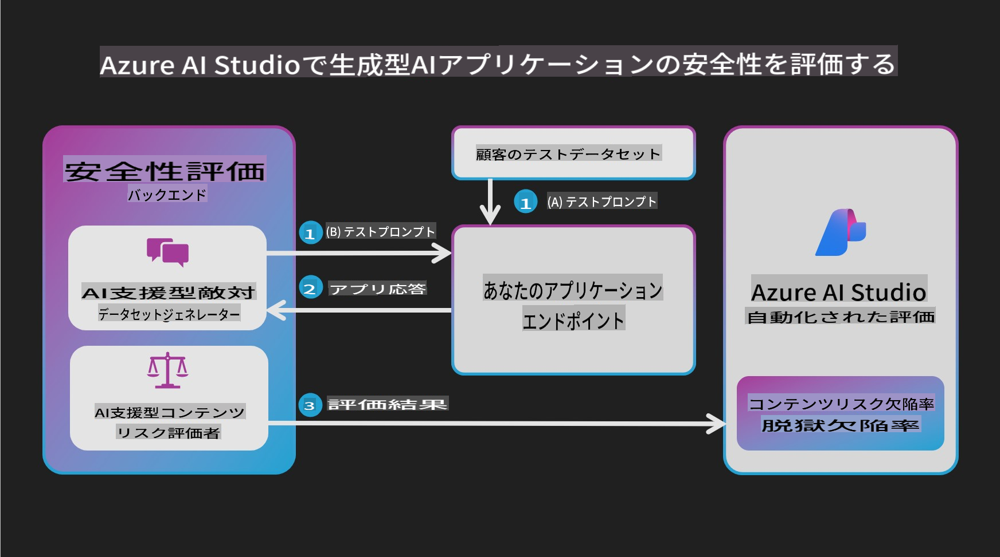

*画像ソース: [生成AIアプリケーションの評価](https://learn.microsoft.com/azure/ai-studio/concepts/evaluation-approach-gen-ai?wt.mc_id%3Dstudentamb_279723)*

#### Microsoftの責任あるAI原則

技術的なステップを始める前に、Microsoftの責任あるAI原則を理解することが重要です。これは、AIシステムの責任ある開発、展開、および運用をガイドするための倫理的な枠組みです。これらの原則は、AIシステムが公平で透明性があり、包括的に設計されることを確保します。これらの原則は、AIモデルの安全性を評価するための基盤となります。

Microsoftの責任あるAI原則には以下が含まれます：

- **公平性と包括性**: AIシステムはすべての人を公平に扱い、同様の状況にある人々を異なる方法で扱わないようにするべきです。例えば、AIシステムが医療治療、ローン申請、雇用に関するガイダンスを提供する場合、同様の症状、経済状況、または専門資格を持つすべての人に同じ推奨をするべきです。

- **信頼性と安全性**: 信頼を築くためには、AIシステムが信頼性、安全性、一貫性を持って動作することが重要です。これらのシステムは、元々設計された通りに動作し、予期しない状況に安全に対応し、有害な操作に耐えることができるべきです。その動作や対応できる状況の範囲は、設計およびテストの際に開発者が想定した範囲を反映しています。

- **透明性**: AIシステムが人々の生活に大きな影響を与える決定を支援する場合、その決定がどのように行われたかを人々が理解することが重要です。例えば、銀行がAIシステムを使用して人の信用度を判断する場合や、企業がAIシステムを使用して最も適格な候補者を選ぶ場合です。

- **プライバシーとセキュリティ**: AIが普及するにつれて、プライバシーを保護し、個人およびビジネス情報を安全に保つことがますます重要かつ複雑になっています。AIでは、正確で情報に基づいた予測や決定を行うためにデータへのアクセスが必要であるため、プライバシーとデータセキュリティには細心の注意が必要です。

- **責任**: AIシステムを設計・展開する人々は、そのシステムの動作に対して責任を負わなければなりません。組織は業界標準を活用して責任の規範を策定するべきです。これらの規範は、AIシステムが人々の生活に影響を与える決定の最終権限を持たないことを保証し、また、人々が高度に自律的なAIシステムに対して意味のあるコントロールを維持できるようにします。


*画像ソース: [責任あるAIとは？](https://learn.microsoft.com/azure/machine-learning/concept-responsible-ai?view=azureml-api-2&viewFallbackFrom=azureml-api-2%253fwt.mc_id%3Dstudentamb_279723)*

> [!NOTE]
> Microsoftの責任あるAI原則について詳しくは、[責任あるAIとは？](https://learn.microsoft.com/azure/machine-learning/concept-responsible-ai?view=azureml-api-2?wt.mc_id=studentamb_279723)をご覧ください。

#### 安全性指標

このチュートリアルでは、Azure AI Studioの安全性指標を使用して、Fine-tuned Phi-3モデルの安全性を評価します。これらの指標は、モデルが有害なコンテンツを生成する可能性や、脆弱性を評価するのに役立ちます。安全性指標には以下が含まれます：

- **自傷行為に関連するコンテンツ**: モデルが自傷行為に関連するコンテンツを生成する傾向があるかどうかを評価します。
- **憎悪的および不公平なコンテンツ**: モデルが憎悪的または不公平なコンテンツを生成する傾向があるかどうかを評価します。
- **暴力的なコンテンツ**: モデルが暴力的なコンテンツを生成する傾向があるかどうかを評価します。
- **性的なコンテンツ**: モデルが不適切な性的コンテンツを生成する傾向があるかどうかを評価します。

これらの側面を評価することで、AIモデルが有害または不快なコンテンツを生成しないことを確認し、社会的価値観や規制基準に適合させることができます。


### パフォーマンス評価の紹介

AIモデルが期待通りに機能していることを確認するためには、パフォーマンス指標に対してその性能を評価することが重要です。Azure AI Studioでは、パフォーマンス評価によりモデルが正確で関連性のある一貫した応答を生成する効果を評価できます。

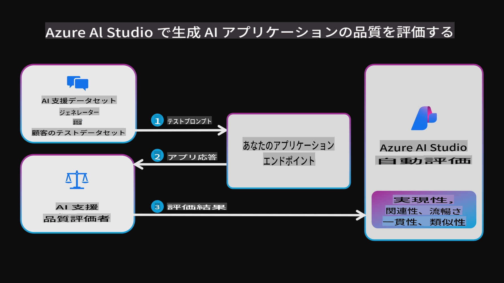

*画像ソース: [生成AIアプリケーションの評価](https://learn.microsoft.com/azure/ai-studio/concepts/evaluation-approach-gen-ai?wt.mc_id%3Dstudentamb_279723)*

#### パフォーマンス指標

このチュートリアルでは、Azure AI Studioのパフォーマンス指標を使用して、Fine-tuned Phi-3 / Phi-3.5モデルのパフォーマンスを評価します。これらの指標は、モデルが正確で関連性のある一貫した応答を生成する効果を評価するのに役立ちます。パフォーマンス指標には以下が含まれます：

- **根拠性**: 生成された回答が入力元の情報とどれだけ一致しているかを評価します。
- **関連性**: 生成された応答が与えられた質問にどれだけ関連しているかを評価します。
- **一貫性**: 生成されたテキストがどれだけスムーズに流れ、自然に読め、人間の言語に似ているかを評価します。
- **流暢さ**: 生成されたテキストの言語能力を評価します。
- **GPT類似性**: 生成された応答を真実のデータと比較して類似性を評価します。
- **F1スコア**: 生成された応答とソースデータ間の共有単語の比率を計算します。

これらの指標は、モデルが正確で関連性のある一貫した応答を生成する効果を評価するのに役立ちます。


## **シナリオ2: Azure AI StudioでのPhi-3 / Phi-3.5モデルの評価**

### 始める前に

このチュートリアルは、以前のブログ投稿「[Fine-Tune and Integrate Custom Phi-3 Models with Prompt Flow: Step-by-Step Guide](https://techcommunity.microsoft.com/t5/educator-developer-blog/fine-tune-and-integrate-custom-phi-3-models-with-prompt-flow/ba-p/4178612?wt.mc_id=studentamb_279723)」および「[Fine-Tune and Integrate Custom Phi-3 Models with Prompt Flow in Azure AI Studio](https://techcommunity.microsoft.com/t5/educator-developer-blog/fine-tune-and-integrate-custom-phi-3-models-with-prompt-flow-in/ba-p/4191726?wt.mc_id=studentamb_279723)」の続きです。これらの投稿では、Azure AI StudioでPhi-3 / Phi-3.5モデルを微調整し、Prompt flowと統合するプロセスを紹介しました。

このチュートリアルでは、Azure AI Studioで評価者としてAzure OpenAIモデルをデプロイし、微調整されたPhi-3 / Phi-3.5モデルを評価します。

このチュートリアルを始める前に、以下の前提条件を確認してください。これは前のチュートリアルで説明されています：

1. 微調整されたPhi-3 / Phi-3.5モデルを評価するための準備されたデータセット。
1. 微調整され、Azure Machine LearningにデプロイされたPhi-3 / Phi-3.5モデル。
1. Azure AI Studioで微調整されたPhi-3 / Phi-3.5モデルと統合されたPrompt flow。

> [!NOTE]
> 前のブログ投稿でダウンロードした**ULTRACHAT_200k**データセットのデータフォルダにある*test_data.jsonl*ファイルを、微調整されたPhi-3 / Phi-3.5モデルを評価するためのデータセットとして使用します。

#### Azure AI StudioでPrompt flowとカスタムPhi-3 / Phi-3.5モデルを統合する（コードファーストアプローチ）

> [!NOTE]
> 低コードアプローチに従った場合、「[Fine-Tune and Integrate Custom Phi-3 Models with Prompt Flow in Azure AI Studio](https://techcommunity.microsoft.com/t5/educator-developer-blog/fine-tune-and-integrate-custom-phi-3-models-with-prompt-flow-in/ba-p/4191726?wt.mc_id=studentamb_279723)」に記載されているように、この演習をスキップして次の演習に進むことができます。
> ただし、「[Fine-Tune and Integrate Custom Phi-3 Models with Prompt Flow: Step-by-Step Guide](https://techcommunity.microsoft.com/t5/educator-developer-blog/fine-tune-and-integrate-custom-phi-3-models-with-prompt-flow/ba-p/4178612?wt.mc_id=studentamb_279723)」に記載されているコードファーストアプローチに従ってPhi-3 / Phi-3.5モデルを微調整およびデプロイした場合、モデルをPrompt flowに接続するプロセスが少し異なります。この演習では、このプロセスを学びます。

続行するには、微調整されたPhi-3 / Phi-3.5モデルをAzure AI StudioのPrompt flowに統合する必要があります。

#### Azure AI Studio Hubの作成

プロジェクトを作成する前に、Hubを作成する必要があります。Hubはリソースグループのようなもので、Azure AI Studio内で複数のプロジェクトを整理および管理するのに役立ちます。

1. [Azure AI Studio](https://ai.azure.com/?wt.mc_id=studentamb_279723)にサインインします。

1. 左側のタブから**All hubs**を選択します。

1. ナビゲーションメニューから**+ New hub**を選択します。

    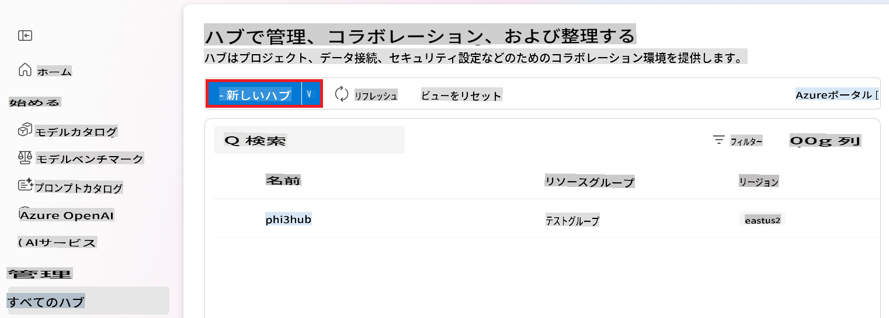

1. 次のタスクを実行します：

    - **Hub name**を入力します。これは一意の値である必要があります。
    - Azureの**Subscription**を選択します。
    - 使用する**Resource group**を選択します（必要に応じて新しいものを作成します）。
    - 使用したい**Location**を選択します。
    - 使用する**Connect Azure AI Services**を選択します（必要に応じて新しいものを作成します）。
    - **Connect Azure AI Search**を選択して**Skip connecting**を選択します。
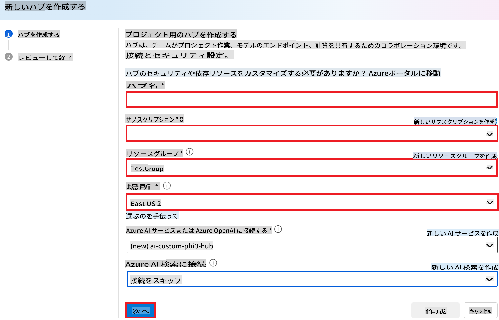

1. **Next** を選択します。

#### Azure AI Studio プロジェクトを作成する

1. 作成したハブで、左側のタブから **All projects** を選択します。

1. ナビゲーションメニューから **+ New project** を選択します。

    

1. **Project name** を入力します。ユニークな値である必要があります。

    

1. **Create a project** を選択します。

#### カスタム接続を追加してファインチューニングされた Phi-3 / Phi-3.5 モデルを統合する

カスタム Phi-3 / Phi-3.5 モデルを Prompt flow と統合するには、モデルのエンドポイントとキーをカスタム接続に保存する必要があります。このセットアップにより、Prompt flow でカスタム Phi-3 / Phi-3.5 モデルにアクセスできるようになります。

#### ファインチューニングされた Phi-3 / Phi-3.5 モデルの API キーとエンドポイント URI を設定する

1. [Azure ML Studio](https://ml.azure.com/home?wt.mc_id=studentamb_279723) にアクセスします。

1. 作成した Azure Machine Learning ワークスペースに移動します。

1. 左側のタブから **Endpoints** を選択します。

    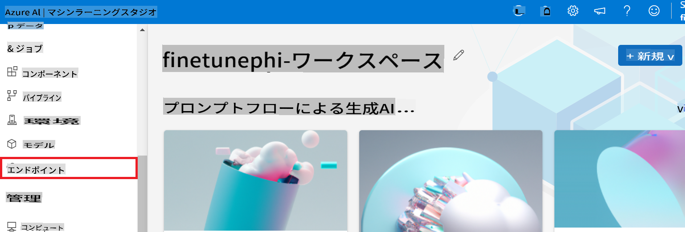

1. 作成したエンドポイントを選択します。

    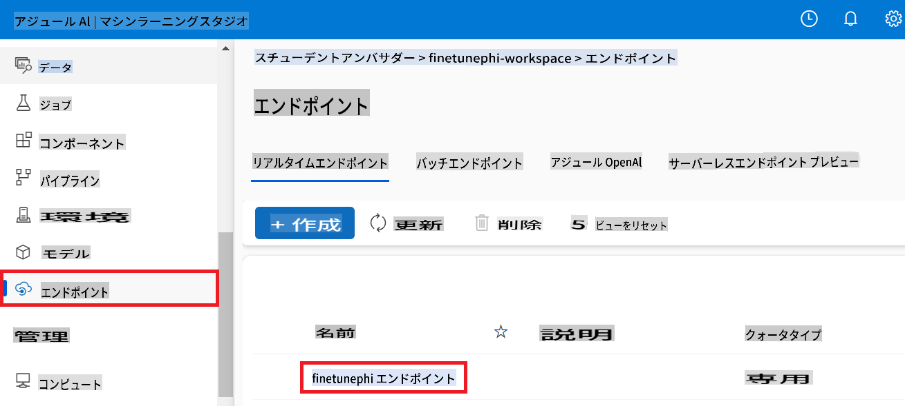

1. ナビゲーションメニューから **Consume** を選択します。

1. **REST endpoint** と **Primary key** をコピーします。

    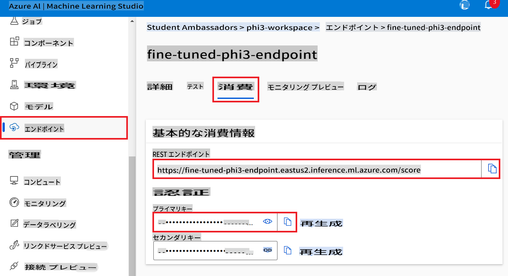

#### カスタム接続を追加する

1. [Azure AI Studio](https://ai.azure.com/?wt.mc_id=studentamb_279723) にアクセスします。

1. 作成した Azure AI Studio プロジェクトに移動します。

1. 作成したプロジェクトで、左側のタブから **Settings** を選択します。

1. **+ New connection** を選択します。

    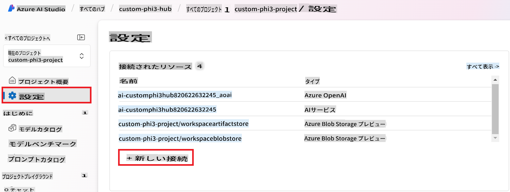

1. ナビゲーションメニューから **Custom keys** を選択します。

    

1. 以下のタスクを実行します：

    - **+ Add key value pairs** を選択します。
    - キー名には **endpoint** を入力し、Azure ML Studio からコピーしたエンドポイントを値フィールドに貼り付けます。
    - 再度 **+ Add key value pairs** を選択します。
    - キー名には **key** を入力し、Azure ML Studio からコピーしたキーを値フィールドに貼り付けます。
    - キーを追加した後、**is secret** を選択してキーが公開されないようにします。

    

1. **Add connection** を選択します。

#### Prompt flow を作成する

Azure AI Studio にカスタム接続を追加しました。次に、以下の手順を使用して Prompt flow を作成します。その後、この Prompt flow をカスタム接続に接続して、ファインチューニングされたモデルを Prompt flow 内で使用します。

1. 作成した Azure AI Studio プロジェクトに移動します。

1. 左側のタブから **Prompt flow** を選択します。

1. ナビゲーションメニューから **+ Create** を選択します。

    

1. ナビゲーションメニューから **Chat flow** を選択します。

    

1. 使用する **Folder name** を入力します。

    

1. **Create** を選択します。

#### カスタム Phi-3 / Phi-3.5 モデルとチャットするための Prompt flow をセットアップする

ファインチューニングされた Phi-3 / Phi-3.5 モデルを Prompt flow に統合する必要があります。しかし、提供されている既存の Prompt flow はこの目的には設計されていません。そのため、カスタムモデルを統合できるように Prompt flow を再設計する必要があります。

1. Prompt flow 内で、以下のタスクを実行して既存のフローを再構築します：

    - **Raw file mode** を選択します。
    - *flow.dag.yml* ファイル内の既存のコードをすべて削除します。
    - 次のコードを *flow.dag.yml* に追加します。

        ```yml
        inputs:
          input_data:
            type: string
            default: "Who founded Microsoft?"

        outputs:
          answer:
            type: string
            reference: ${integrate_with_promptflow.output}

        nodes:
        - name: integrate_with_promptflow
          type: python
          source:
            type: code
            path: integrate_with_promptflow.py
          inputs:
            input_data: ${inputs.input_data}
        ```

    - **Save** を選択します。

    

1. カスタム Phi-3 / Phi-3.5 モデルを Prompt flow で使用するために、次のコードを *integrate_with_promptflow.py* に追加します。

    ```python
    import logging
    import requests
    from promptflow import tool
    from promptflow.connections import CustomConnection

    # Logging setup
    logging.basicConfig(
        format="%(asctime)s - %(levelname)s - %(name)s - %(message)s",
        datefmt="%Y-%m-%d %H:%M:%S",
        level=logging.DEBUG
    )
    logger = logging.getLogger(__name__)

    def query_phi3_model(input_data: str, connection: CustomConnection) -> str:
        """
        Send a request to the Phi-3 / Phi-3.5 model endpoint with the given input data using Custom Connection.
        """

        # "connection" is the name of the Custom Connection, "endpoint", "key" are the keys in the Custom Connection
        endpoint_url = connection.endpoint
        api_key = connection.key

        headers = {
            "Content-Type": "application/json",
            "Authorization": f"Bearer {api_key}"
        }
    data = {
        "input_data": [input_data],
        "params": {
            "temperature": 0.7,
            "max_new_tokens": 128,
            "do_sample": True,
            "return_full_text": True
            }
        }
        try:
            response = requests.post(endpoint_url, json=data, headers=headers)
            response.raise_for_status()
            
            # Log the full JSON response
            logger.debug(f"Full JSON response: {response.json()}")

            result = response.json()["output"]
            logger.info("Successfully received response from Azure ML Endpoint.")
            return result
        except requests.exceptions.RequestException as e:
            logger.error(f"Error querying Azure ML Endpoint: {e}")
            raise

    @tool
    def my_python_tool(input_data: str, connection: CustomConnection) -> str:
        """
        Tool function to process input data and query the Phi-3 / Phi-3.5 model.
        """
        return query_phi3_model(input_data, connection)

    ```

    

> [!NOTE]
> Azure AI Studio で Prompt flow を使用する詳細情報については、[Prompt flow in Azure AI Studio](https://learn.microsoft.com/azure/ai-studio/how-to/prompt-flow) を参照してください。

1. **Chat input** と **Chat output** を選択して、モデルとのチャットを有効にします。

    

1. これでカスタム Phi-3 / Phi-3.5 モデルとのチャットの準備が整いました。次の演習では、Prompt flow を開始し、ファインチューニングされた Phi-3 / Phi-3.5 モデルとチャットする方法を学びます。

> [!NOTE]
>
> 再構築されたフローは次の画像のようになります：
>
> 
>

#### Prompt flow を開始する

1. **Start compute sessions** を選択して Prompt flow を開始します。

    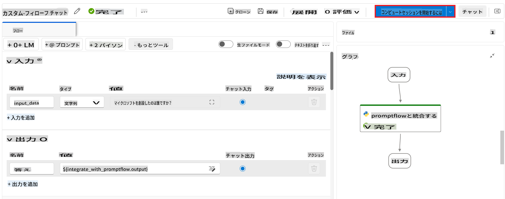

1. **Validate and parse input** を選択してパラメータを更新します。

    

1. 作成したカスタム接続の **connection** の **Value** を選択します。例えば、*connection*。

    

#### カスタム Phi-3 / Phi-3.5 モデルとチャットする

1. **Chat** を選択します。

    

1. ここに結果の例があります：これでカスタム Phi-3 / Phi-3.5 モデルとチャットできます。ファインチューニングに使用したデータに基づいて質問することをお勧めします。

    

### Phi-3 / Phi-3.5 モデルを評価するために Azure OpenAI をデプロイする

Azure AI Studio で Phi-3 / Phi-3.5 モデルを評価するには、Azure OpenAI モデルをデプロイする必要があります。このモデルは Phi-3 / Phi-3.5 モデルのパフォーマンスを評価するために使用されます。

#### Azure OpenAI をデプロイする

1. [Azure AI Studio](https://ai.azure.com/?wt.mc_id=studentamb_279723) にサインインします。

1. 作成した Azure AI Studio プロジェクトに移動します。

    

1. 作成したプロジェクトで、左側のタブから **Deployments** を選択します。

1. ナビゲーションメニューから **+ Deploy model** を選択します。

1. **Deploy base model** を選択します。

    

1. 使用したい Azure OpenAI モデルを選択します。例えば、**gpt-4o**。

    

1. **Confirm** を選択します。

### Azure AI Studio の Prompt flow 評価を使用してファインチューニングされた Phi-3 / Phi-3.5 モデルを評価する

### 新しい評価を開始する

1. [Azure AI Studio](https://ai.azure.com/?wt.mc_id=studentamb_279723) にアクセスします。

1. 作成した Azure AI Studio プロジェクトに移動します。

    

1. 作成したプロジェクトで、左側のタブから **Evaluation** を選択します。

1. ナビゲーションメニューから **+ New evaluation** を選択します。
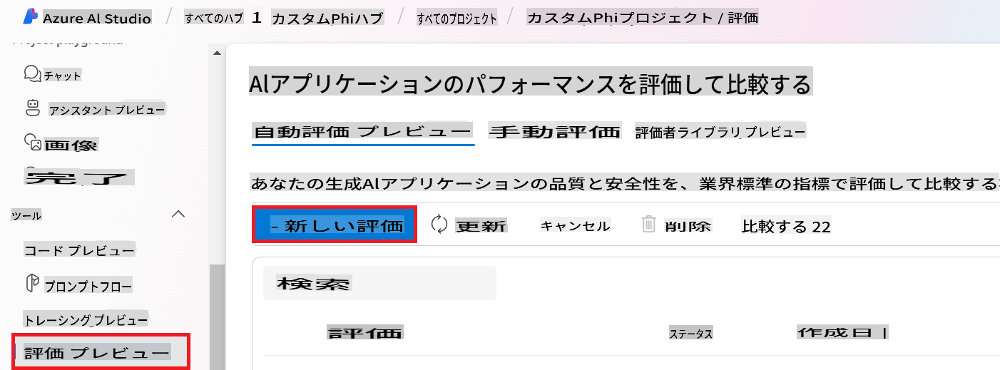

1. **Prompt flow** の評価を選択します。

    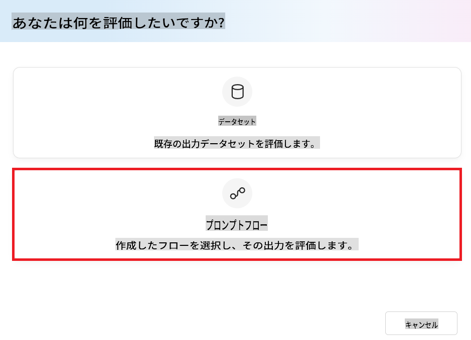

1. 次のタスクを実行します:

    - 評価名を入力します。これは一意の値である必要があります。
    - タスクタイプとして **Question and answer without context** を選択します。このチュートリアルで使用する **UlTRACHAT_200k** データセットにはコンテキストが含まれていないためです。
    - 評価したいプロンプトフローを選択します。

    

1. **Next** を選択します。

1. 次のタスクを実行します:

    - **Add your dataset** を選択してデータセットをアップロードします。たとえば、**ULTRACHAT_200k** データセットをダウンロードした際に含まれている *test_data.json1* などのテストデータセットファイルをアップロードできます。
    - データセットに一致する適切な **Dataset column** を選択します。たとえば、**ULTRACHAT_200k** データセットを使用している場合、データセット列として **${data.prompt}** を選択します。

    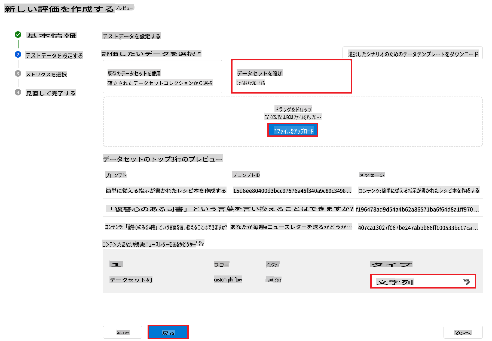

1. **Next** を選択します。

1. パフォーマンスと品質のメトリクスを設定するために次のタスクを実行します:

    - 使用したいパフォーマンスと品質のメトリクスを選択します。
    - 評価用に作成した Azure OpenAI モデルを選択します。たとえば、**gpt-4o** を選択します。

    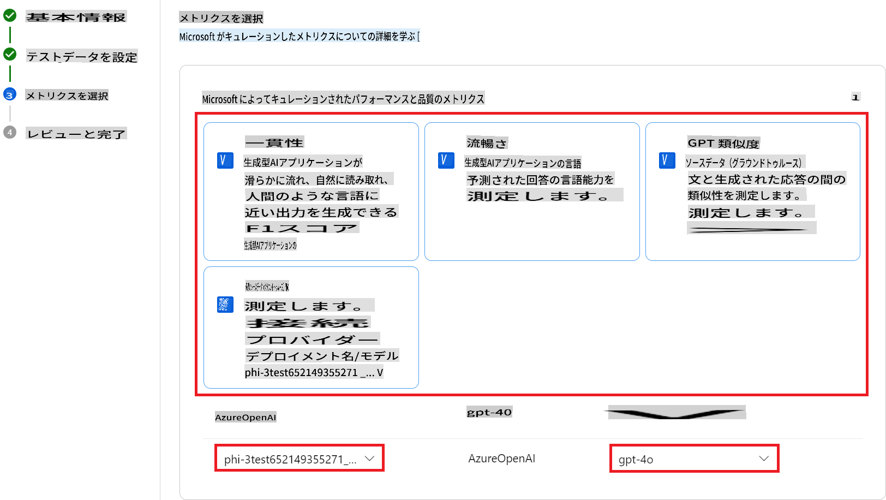

1. リスクと安全性のメトリクスを設定するために次のタスクを実行します:

    - 使用したいリスクと安全性のメトリクスを選択します。
    - 使用したい欠陥率を計算するためのしきい値を選択します。たとえば、**Medium** を選択します。
    - **question** には **Data source** を **{$data.prompt}** に設定します。
    - **answer** には **Data source** を **{$run.outputs.answer}** に設定します。
    - **ground_truth** には **Data source** を **{$data.message}** に設定します。

    

1. **Next** を選択します。

1. **Submit** を選択して評価を開始します。

1. 評価の完了には時間がかかります。進行状況は **Evaluation** タブで確認できます。

### 評価結果の確認

> [!NOTE]
> 以下に示す結果は評価プロセスを説明するためのものであり、このチュートリアルでは比較的小さなデータセットで微調整されたモデルを使用しているため、最適ではない結果が出る場合があります。実際の結果は、使用するデータセットのサイズ、品質、および多様性、ならびにモデルの具体的な設定によって大きく異なる場合があります。

評価が完了すると、パフォーマンスと安全性のメトリクスの結果を確認できます。

1. パフォーマンスと品質のメトリクス:

    - モデルの一貫性、流暢さ、関連性のある応答を生成する効果を評価します。

    

1. リスクと安全性のメトリクス:

    - モデルの出力が安全であり、責任あるAIの原則に沿っていることを確認し、有害または攻撃的なコンテンツを避けます。

    

1. **Detailed metrics result** を表示するためにスクロールできます。

    

1. カスタム Phi-3 / Phi-3.5 モデルをパフォーマンスと安全性のメトリクスに対して評価することで、モデルが効果的であるだけでなく、責任あるAIの実践に従っていることを確認でき、実際の運用に備えることができます。

## おめでとうございます！

### このチュートリアルを完了しました

Azure AI Studio で Prompt flow と統合された微調整 Phi-3 モデルの評価に成功しました。これは、AIモデルが高性能であるだけでなく、信頼できるAIアプリケーションを構築するために Microsoft の責任あるAIの原則に従うことを保証するための重要なステップです。


## Azure リソースのクリーンアップ

追加の料金を避けるために、Azure リソースをクリーンアップします。Azure ポータルに移動し、以下のリソースを削除します:

- Azure Machine learning リソース
- Azure Machine learning モデルエンドポイント
- Azure AI Studio プロジェクトリソース
- Azure AI Studio Prompt flow リソース

### 次のステップ

#### ドキュメント

- [microsoft/Phi-3CookBook](https://github.com/microsoft/Phi-3CookBook?wt.mc_id=studentamb_279723)
- [Responsible AI ダッシュボードを使用してAIシステムを評価する](https://learn.microsoft.com/azure/machine-learning/concept-responsible-ai-dashboard?view=azureml-api-2&source=recommendations?wt.mc_id=studentamb_279723)
- [生成AIの評価とモニタリングメトリクス](https://learn.microsoft.com/azure/ai-studio/concepts/evaluation-metrics-built-in?tabs=definition?wt.mc_id=studentamb_279723)
- [Azure AI Studio ドキュメント](https://learn.microsoft.com/azure/ai-studio/?wt.mc_id=studentamb_279723)
- [Prompt flow ドキュメント](https://microsoft.github.io/promptflow/?wt.mc_id=studentamb_279723)

#### トレーニングコンテンツ

- [Microsoftの責任あるAIアプローチの紹介](https://learn.microsoft.com/training/modules/introduction-to-microsofts-responsible-ai-approach/?source=recommendations?wt.mc_id=studentamb_279723)
- [Azure AI Studioの紹介](https://learn.microsoft.com/training/modules/introduction-to-azure-ai-studio/?wt.mc_id=studentamb_279723)

### 参考資料

- [microsoft/Phi-3CookBook](https://github.com/microsoft/Phi-3CookBook?wt.mc_id=studentamb_279723)
- [責任あるAIとは？](https://learn.microsoft.com/azure/machine-learning/concept-responsible-ai?view=azureml-api-2?wt.mc_id=studentamb_279723)
- [より安全で信頼性の高い生成AIアプリケーションを構築するための新しいツールの発表](https://azure.microsoft.com/blog/announcing-new-tools-in-azure-ai-to-help-you-build-more-secure-and-trustworthy-generative-ai-applications/?wt.mc_id=studentamb_279723)
- [生成AIアプリケーションの評価](https://learn.microsoft.com/azure/ai-studio/concepts/evaluation-approach-gen-ai?wt.mc_id%3Dstudentamb_279723)

**免責事項**:
この文書は、機械ベースのAI翻訳サービスを使用して翻訳されています。正確さを期していますが、自動翻訳には誤りや不正確さが含まれる可能性があることをご理解ください。元の言語での原文が権威ある情報源と見なされるべきです。重要な情報については、専門の人間による翻訳をお勧めします。この翻訳の使用に起因する誤解や誤認について、当社は責任を負いません。