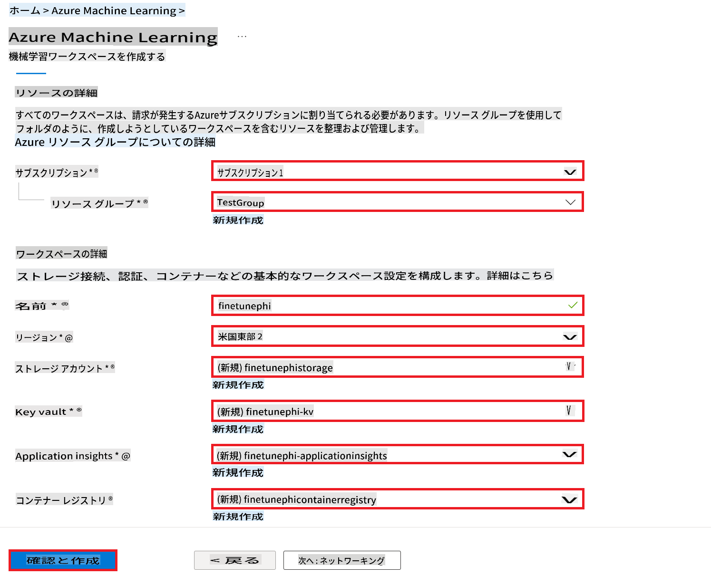
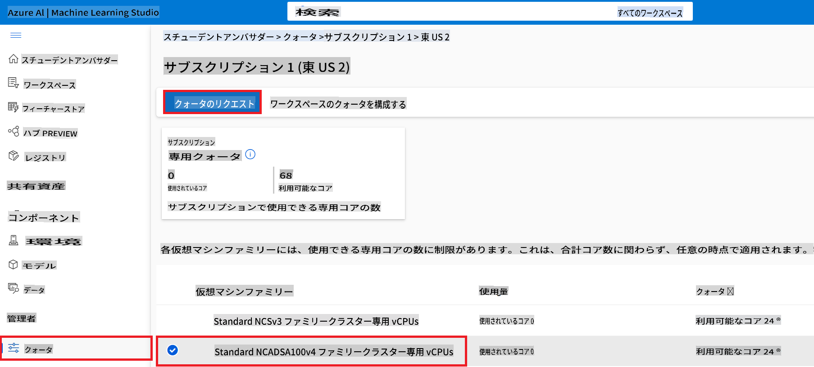
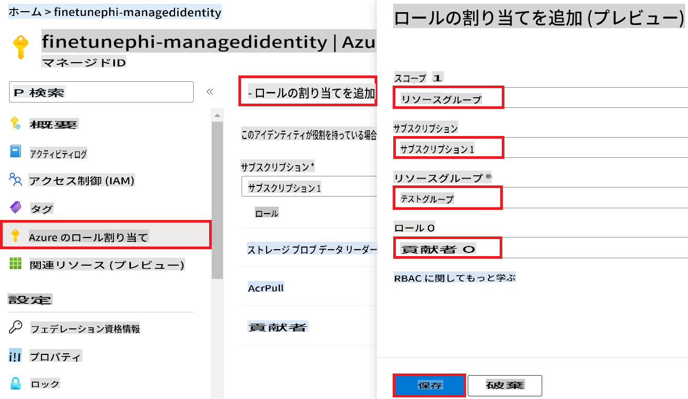
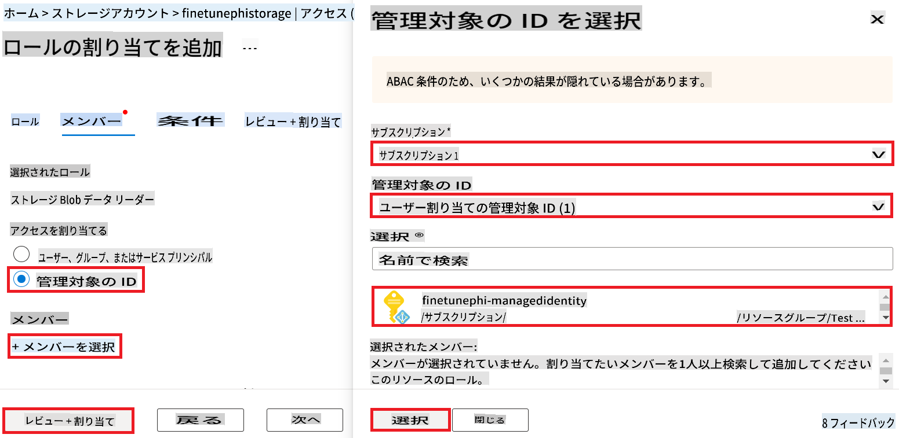

# カスタムPhi-3モデルをPrompt flowで微調整して統合する

このエンドツーエンド（E2E）サンプルは、Microsoft Tech Communityのガイド「[Fine-Tune and Integrate Custom Phi-3 Models with Prompt Flow: Step-by-Step Guide](https://techcommunity.microsoft.com/t5/educator-developer-blog/fine-tune-and-integrate-custom-phi-3-models-with-prompt-flow/ba-p/4178612?WT.mc_id=aiml-137032-kinfeylo)」に基づいています。カスタムPhi-3モデルをPrompt flowで微調整、デプロイ、および統合するプロセスを紹介します。

## 概要

このE2Eサンプルでは、Phi-3モデルを微調整し、Prompt flowと統合する方法を学びます。Azure Machine LearningとPrompt flowを活用して、カスタムAIモデルをデプロイし、利用するためのワークフローを確立します。このE2Eサンプルは、以下の3つのシナリオに分かれています：

**シナリオ1: Azureリソースのセットアップと微調整の準備**

**シナリオ2: Phi-3モデルの微調整とAzure Machine Learning Studioでのデプロイ**

**シナリオ3: Prompt flowとの統合とカスタムモデルとのチャット**

以下は、このE2Eサンプルの概要です。


### 目次

1. **[シナリオ1: Azureリソースのセットアップと微調整の準備](../../../../md/06.E2ESamples)**
    - [Azure Machine Learning Workspaceの作成](../../../../md/06.E2ESamples)
    - [AzureサブスクリプションでのGPUクォータのリクエスト](../../../../md/06.E2ESamples)
    - [ロールの割り当て](../../../../md/06.E2ESamples)
    - [プロジェクトのセットアップ](../../../../md/06.E2ESamples)
    - [微調整用データセットの準備](../../../../md/06.E2ESamples)

1. **[シナリオ2: Phi-3モデルの微調整とAzure Machine Learning Studioでのデプロイ](../../../../md/06.E2ESamples)**
    - [Azure CLIのセットアップ](../../../../md/06.E2ESamples)
    - [Phi-3モデルの微調整](../../../../md/06.E2ESamples)
    - [微調整されたモデルのデプロイ](../../../../md/06.E2ESamples)

1. **[シナリオ3: Prompt flowとの統合とカスタムモデルとのチャット](../../../../md/06.E2ESamples)**
    - [カスタムPhi-3モデルとPrompt flowの統合](../../../../md/06.E2ESamples)
    - [カスタムモデルとのチャット](../../../../md/06.E2ESamples)

## シナリオ1: Azureリソースのセットアップと微調整の準備

### Azure Machine Learning Workspaceの作成

1. ポータルページの**検索バー**に「*azure machine learning*」と入力し、表示されたオプションから**Azure Machine Learning**を選択します。

    

1. ナビゲーションメニューから**+ 作成**を選択します。

1. ナビゲーションメニューから**新しいワークスペース**を選択します。

    

1. 以下のタスクを実行します：

    - Azureの**サブスクリプション**を選択します。
    - 使用する**リソースグループ**を選択します（必要に応じて新しいものを作成します）。
    - **ワークスペース名**を入力します。これは一意の値である必要があります。
    - 使用したい**リージョン**を選択します。
    - 使用する**ストレージアカウント**を選択します（必要に応じて新しいものを作成します）。
    - 使用する**キー・ボールト**を選択します（必要に応じて新しいものを作成します）。
    - 使用する**アプリケーションインサイト**を選択します（必要に応じて新しいものを作成します）。
    - 使用する**コンテナレジストリ**を選択します（必要に応じて新しいものを作成します）。

    

1. **確認 + 作成**を選択します。

1. **作成**を選択します。

### AzureサブスクリプションでのGPUクォータのリクエスト

このE2Eサンプルでは、微調整には*Standard_NC24ads_A100_v4 GPU*を使用し、デプロイには*Standard_E4s_v3* CPUを使用します。GPUにはクォータリクエストが必要ですが、CPUには必要ありません。

> [!NOTE]
>
> GPU割り当ての対象はPay-As-You-Goサブスクリプション（標準サブスクリプションタイプ）のみです。特典サブスクリプションは現在サポートされていません。
>
> 特典サブスクリプション（Visual Studio Enterprise Subscriptionなど）を使用している場合や、微調整とデプロイのプロセスを迅速にテストしたい場合、このチュートリアルではCPUを使用した最小限のデータセットでの微調整のガイドも提供しています。ただし、GPUを使用した方が大規模なデータセットでの微調整結果は大幅に向上します。

1. [Azure ML Studio](https://ml.azure.com/home?wt.mc_id=studentamb_279723)にアクセスします。

1. 以下のタスクを実行して*Standard NCADSA100v4 Family*クォータをリクエストします：

    - 左側のタブから**クォータ**を選択します。
    - 使用する**仮想マシンファミリ**を選択します。例えば、*Standard NCADSA100v4 Family Cluster Dedicated vCPUs*を選択します。このファミリには*Standard_NC24ads_A100_v4* GPUが含まれます。
    - ナビゲーションメニューから**クォータのリクエスト**を選択します。

        

    - クォータリクエストページで、使用したい**新しいコアの制限**を入力します。例えば、24。
    - クォータリクエストページで、**送信**を選択してGPUクォータをリクエストします。

> [!NOTE]
> 必要に応じて適切なGPUまたはCPUを選択するために、[Azureの仮想マシンのサイズ](https://learn.microsoft.com/azure/virtual-machines/sizes/overview?tabs=breakdownseries%2Cgeneralsizelist%2Ccomputesizelist%2Cmemorysizelist%2Cstoragesizelist%2Cgpusizelist%2Cfpgasizelist%2Chpcsizelist)ドキュメントを参照してください。

### ロールの割り当て

モデルの微調整とデプロイを行うには、まずユーザー割り当てマネージドID（UAI）を作成し、適切な権限を割り当てる必要があります。このUAIはデプロイ時の認証に使用されます。

#### ユーザー割り当てマネージドID（UAI）の作成

1. ポータルページの**検索バー**に「*managed identities*」と入力し、表示されたオプションから**Managed Identities**を選択します。

    

1. **+ 作成**を選択します。

    

1. 以下のタスクを実行します：

    - Azureの**サブスクリプション**を選択します。
    - 使用する**リソースグループ**を選択します（必要に応じて新しいものを作成します）。
    - 使用したい**リージョン**を選択します。
    - **名前**を入力します。これは一意の値である必要があります。

1. **確認 + 作成**を選択します。

1. **作成**を選択します。

#### マネージドIDにContributorロールを割り当てる

1. 作成したマネージドIDリソースに移動します。

1. 左側のタブから**Azureロールの割り当て**を選択します。

1. ナビゲーションメニューから**+ ロールの割り当てを追加**を選択します。

1. ロールの割り当てページで以下のタスクを実行します：
    - **スコープ**を**リソースグループ**に選択します。
    - Azureの**サブスクリプション**を選択します。
    - 使用する**リソースグループ**を選択します。
    - **ロール**を**Contributor**に選択します。

    

1. **保存**を選択します。

#### マネージドIDにStorage Blob Data Readerロールを割り当てる

1. ポータルページの**検索バー**に「*storage accounts*」と入力し、表示されたオプションから**Storage accounts**を選択します。

    

1. 作成したAzure Machine Learningワークスペースに関連付けられたストレージアカウントを選択します。例えば、*finetunephistorage*。

1. 以下のタスクを実行してロールの割り当てページに移動します：

    - 作成したAzureストレージアカウントに移動します。
    - 左側のタブから**アクセス制御（IAM）**を選択します。
    - ナビゲーションメニューから**+ 追加**を選択します。
    - ナビゲーションメニューから**ロールの割り当てを追加**を選択します。

    

1. ロールの割り当てページで以下のタスクを実行します：

    - ロールページで**Storage Blob Data Reader**と入力し、表示されたオプションから**Storage Blob Data Reader**を選択します。
    - ロールページで**次へ**を選択します。
    - メンバーページで**アクセスの割り当て**を**Managed identity**に選択します。
    - メンバーページで**+ メンバーを選択**を選択します。
    - マネージドIDページでAzureの**サブスクリプション**を選択します。
    - マネージドIDページで**マネージドID**を**Manage Identity**に選択します。
    - マネージドIDページで作成したマネージドIDを選択します。例えば、*finetunephi-managedidentity*。
    - マネージドIDページで**選択**を選択します。

    

1. **確認 + 割り当て**を選択します。

#### マネージドIDにAcrPullロールを割り当てる

1. ポータルページの**検索バー**に「*container registries*」と入力し、表示されたオプションから**Container registries**を選択します。

    

1. 作成したAzure Machine Learningワークスペースに関連付けられたコンテナレジストリを選択します。例えば、*finetunephicontainerregistries*。

1. 以下のタスクを実行してロールの割り当てページに移動します：

    - 左側のタブから**アクセス制御（IAM）**を選択します。
    - ナビゲーションメニューから**+ 追加**を選択します。
    - ナビゲーションメニューから**ロールの割り当てを追加**を選択します。

1. ロールの割り当てページで以下のタスクを実行します：

    - ロールページで**AcrPull**と入力し、表示されたオプションから**AcrPull**を選択します。
    - ロールページで**次へ**を選択します。
    - メンバーページで**アクセスの割り当て**を**Managed identity**に選択します。
    - メンバーページで**+ メンバーを選択**を選択します。
    - マネージドIDページでAzureの**サブスクリプション**を選択します。
    - マネージドIDページで**マネージドID**を**Manage Identity**に選択します。
    - マネージドIDページで作成したマネージドIDを選択します。例えば、*finetunephi-managedidentity*。
    - マネージドIDページで**選択**を選択します。
    - **確認 + 割り当て**を選択します。

### プロジェクトのセットアップ

次に、作業するフォルダーを作成し、ユーザーと対話し、Azure Cosmos DBに保存されたチャット履歴を使用して応答を生成するプログラムを開発するための仮想環境をセットアップします。

#### 作業フォルダーの作成

1. ターミナルウィンドウを開き、以下のコマンドを入力してデフォルトのパスに*finetune-phi*というフォルダーを作成します。

    ```console
    mkdir finetune-phi
    ```

1. ターミナル内で以下のコマンドを入力して作成した*finetune-phi*フォルダーに移動します。

    ```console
    cd finetune-phi
    ```

#### 仮想環境の作成

1. ターミナル内で以下のコマンドを入力して*.venv*という名前の仮想環境を作成します。

    ```console
    python -m venv .venv
    ```

1. ターミナル内で以下のコマンドを入力して仮想環境をアクティブにします。

    ```console
    .venv\Scripts\activate.bat
    ```

> [!NOTE]
>
> 成功した場合、コマンドプロンプトの前に*（.venv）*が表示されるはずです。

#### 必要なパッケージのインストール

1. ターミナル内で以下のコマンドを入力して必要なパッケージをインストールします。

    ```console
    pip install datasets==2.19.1
    pip install transformers==4.41.1
    pip install azure-ai-ml==1.16.0
    pip install torch==2.3.1
    pip install trl==0.9.4
    pip install promptflow==1.12.0
    ```

#### プロジェクトファイルの作成

この演習では、プロジェクトのための基本的なファイルを作成します。これらのファイルには、データセットのダウンロード、Azure Machine Learning環境のセットアップ、Phi-3モデルの微調整、微調整されたモデルのデプロイのためのスクリプトが含まれます。また、微調整環境を設定するための*conda.yml*ファイルも作成します。

この演習では以下を行います：

- データセットをダウンロードするための*download_dataset.py*ファイルを作成します。
- Azure Machine Learning環境をセットアップするための*setup_ml.py*ファイルを作成します。
- データセットを使用してPhi-3モデルを微調整するための*finetuning_dir*フォルダー内に*fine_tune.py*ファイルを作成します。
- 微調整環境を設定するための*conda.yml*ファイルを作成します。
- 微調整されたモデルをデプロイするための*deploy_model.py*ファイルを作成します。
- 微調整されたモデルとPrompt flowを統合し、モデルを実行するための*integrate_with_promptflow.py*ファイルを作成します。
- Prompt flowのワークフローストラクチャを設定するための*flow.dag.yml*ファイルを作成します。
- Azure情報を入力するための*config.py*ファイルを作成します。

> [!NOTE]
>
> 完全なフォ


免責事項: この翻訳はAIモデルによって原文から翻訳されたものであり、完全ではない可能性があります。
出力を確認し、必要な修正を行ってください。