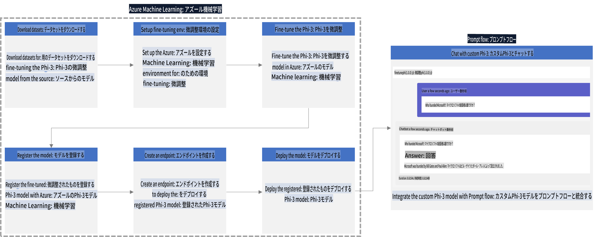
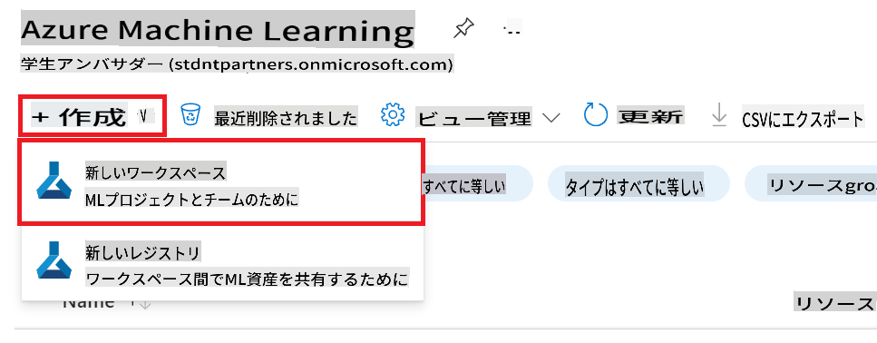
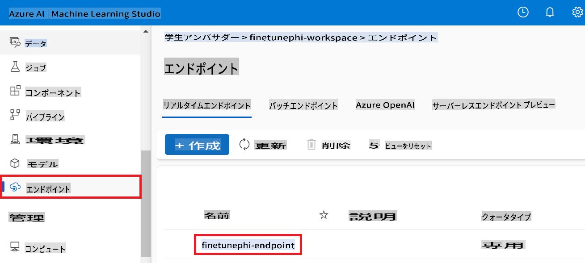
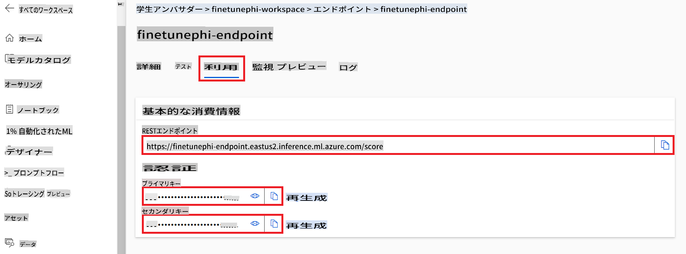
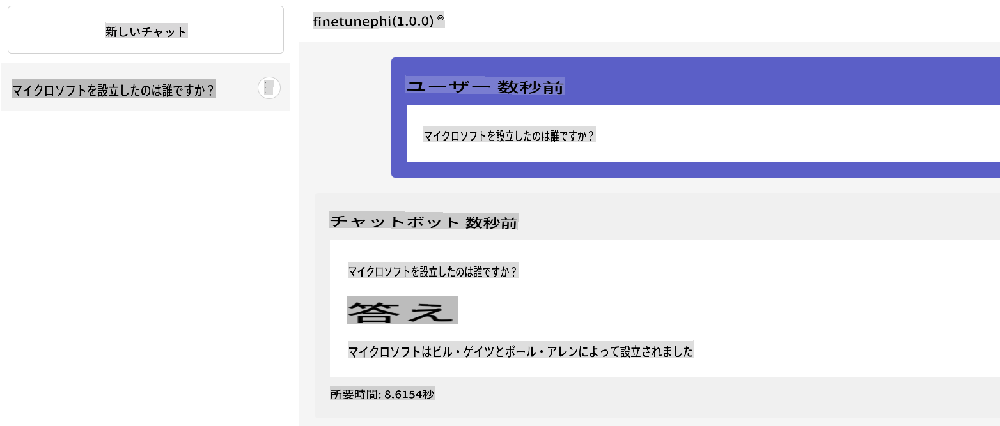

# Fine-tune and Integrate custom Phi-3 models with Prompt flow

このエンドツーエンド（E2E）サンプルは、Microsoft Tech Communityのガイド「[Fine-Tune and Integrate Custom Phi-3 Models with Prompt Flow: Step-by-Step Guide](https://techcommunity.microsoft.com/t5/educator-developer-blog/fine-tune-and-integrate-custom-phi-3-models-with-prompt-flow/ba-p/4178612?WT.mc_id=aiml-137032-kinfeylo)」に基づいています。ここでは、カスタムPhi-3モデルの微調整、デプロイ、およびPrompt flowとの統合プロセスを紹介します。

## 概要

このE2Eサンプルでは、Phi-3モデルの微調整とPrompt flowとの統合方法を学びます。Azure Machine LearningとPrompt flowを活用して、カスタムAIモデルのデプロイと利用のためのワークフローを確立します。このE2Eサンプルは3つのシナリオに分かれています：

**シナリオ1: Azureリソースのセットアップと微調整の準備**

**シナリオ2: Phi-3モデルの微調整とAzure Machine Learning Studioでのデプロイ**

**シナリオ3: Prompt flowとの統合とカスタムモデルとのチャット**

以下は、このE2Eサンプルの概要です。



### 目次

1. **[シナリオ1: Azureリソースのセットアップと微調整の準備](../../../../md/06.E2ESamples)**
    - [Azure Machine Learning Workspaceの作成](../../../../md/06.E2ESamples)
    - [Azure SubscriptionでのGPUクォータのリクエスト](../../../../md/06.E2ESamples)
    - [ロールの割り当て](../../../../md/06.E2ESamples)
    - [プロジェクトのセットアップ](../../../../md/06.E2ESamples)
    - [微調整用データセットの準備](../../../../md/06.E2ESamples)

1. **[シナリオ2: Phi-3モデルの微調整とAzure Machine Learning Studioでのデプロイ](../../../../md/06.E2ESamples)**
    - [Azure CLIのセットアップ](../../../../md/06.E2ESamples)
    - [Phi-3モデルの微調整](../../../../md/06.E2ESamples)
    - [微調整済みモデルのデプロイ](../../../../md/06.E2ESamples)

1. **[シナリオ3: Prompt flowとの統合とカスタムモデルとのチャット](../../../../md/06.E2ESamples)**
    - [カスタムPhi-3モデルのPrompt flowとの統合](../../../../md/06.E2ESamples)
    - [カスタムモデルとのチャット](../../../../md/06.E2ESamples)

## シナリオ1: Azureリソースのセットアップと微調整の準備

### Azure Machine Learning Workspaceの作成

1. ポータルページの**検索バー**に「*azure machine learning*」と入力し、表示されるオプションから**Azure Machine Learning**を選択します。

    

1. ナビゲーションメニューから**+ Create**を選択します。

1. ナビゲーションメニューから**New workspace**を選択します。

    

1. 次のタスクを実行します：

    - Azureの**Subscription**を選択します。
    - 使用する**Resource group**を選択します（必要に応じて新しいものを作成）。
    - **Workspace Name**を入力します。一意の値である必要があります。
    - 使用したい**Region**を選択します。
    - 使用する**Storage account**を選択します（必要に応じて新しいものを作成）。
    - 使用する**Key vault**を選択します（必要に応じて新しいものを作成）。
    - 使用する**Application insights**を選択します（必要に応じて新しいものを作成）。
    - 使用する**Container registry**を選択します（必要に応じて新しいものを作成）。

    

1. **Review + Create**を選択します。

1. **Create**を選択します。

### Azure SubscriptionでのGPUクォータのリクエスト

このE2Eサンプルでは、微調整には*Standard_NC24ads_A100_v4 GPU*を使用し、デプロイには*Standard_E4s_v3* CPUを使用します。GPUにはクォータリクエストが必要ですが、CPUには必要ありません。

> [!NOTE]
>
> GPU割り当てが可能なのはPay-As-You-Goサブスクリプション（標準サブスクリプションタイプ）のみであり、ベネフィットサブスクリプションは現在サポートされていません。
>
> ベネフィットサブスクリプション（例: Visual Studio Enterprise Subscription）を使用している場合や、微調整とデプロイプロセスを迅速にテストしたい場合、このチュートリアルではCPUを使用した最小データセットでの微調整のガイドも提供しています。ただし、GPUを使用した方が大規模データセットでの微調整結果は大幅に良くなります。

1. [Azure ML Studio](https://ml.azure.com/home?wt.mc_id=studentamb_279723)にアクセスします。

1. 次のタスクを実行して*Standard NCADSA100v4 Family*のクォータをリクエストします：

    - 左側のタブから**Quota**を選択します。
    - 使用する**Virtual machine family**を選択します。例として、*Standard_NC24ads_A100_v4* GPUを含む**Standard NCADSA100v4 Family Cluster Dedicated vCPUs**を選択します。
    - ナビゲーションメニューから**Request quota**を選択します。

        

    - Request quotaページで、使用したい**New cores limit**を入力します。例として、24。
    - Request quotaページで、**Submit**を選択してGPUクォータをリクエストします。

> [!NOTE]
> 必要に応じて、[Sizes for Virtual Machines in Azure](https://learn.microsoft.com/azure/virtual-machines/sizes/overview?tabs=breakdownseries%2Cgeneralsizelist%2Ccomputesizelist%2Cmemorysizelist%2Cstoragesizelist%2Cgpusizelist%2Cfpgasizelist%2Chpcsizelist)ドキュメントを参照して、適切なGPUまたはCPUを選択できます。

### ロールの割り当て

モデルの微調整とデプロイを行うには、最初にユーザー割り当てマネージドID（UAI）を作成し、適切な権限を割り当てる必要があります。このUAIはデプロイ中の認証に使用されます。

#### ユーザー割り当てマネージドID(UAI)の作成

1. ポータルページの**検索バー**に「*managed identities*」と入力し、表示されるオプションから**Managed Identities**を選択します。

    

1. **+ Create**を選択します。

    

1. 次のタスクを実行します：

    - Azureの**Subscription**を選択します。
    - 使用する**Resource group**を選択します（必要に応じて新しいものを作成）。
    - 使用したい**Region**を選択します。
    - **Name**を入力します。一意の値である必要があります。

1. **Review + create**を選択します。

1. **+ Create**を選択します。

#### Managed IdentityにContributorロールを割り当てる

1. 作成したManaged Identityリソースに移動します。

1. 左側のタブから**Azure role assignments**を選択します。

1. ナビゲーションメニューから**+Add role assignment**を選択します。

1. Add role assignmentページで、次のタスクを実行します：
    - **Scope**を**Resource group**に設定します。
    - Azureの**Subscription**を選択します。
    - 使用する**Resource group**を選択します。
    - **Role**を**Contributor**に設定します。

    

1. **Save**を選択します。

#### Managed IdentityにStorage Blob Data Readerロールを割り当てる

1. ポータルページの**検索バー**に「*storage accounts*」と入力し、表示されるオプションから**Storage accounts**を選択します。

    

1. 作成したAzure Machine Learning workspaceに関連付けられているストレージアカウントを選択します。例として、*finetunephistorage*。

1. Add role assignmentページに移動するために次のタスクを実行します：

    - 作成したAzure Storageアカウントに移動します。
    - 左側のタブから**Access Control (IAM)**を選択します。
    - ナビゲーションメニューから**+ Add**を選択します。
    - ナビゲーションメニューから**Add role assignment**を選択します。

    

1. Add role assignmentページで、次のタスクを実行します：

    - Roleページで、**search bar**に*Storage Blob Data Reader*と入力し、表示されるオプションから**Storage Blob Data Reader**を選択します。
    - Roleページで、**Next**を選択します。
    - Membersページで、**Assign access to**を**Managed identity**に設定します。
    - Membersページで、**+ Select members**を選択します。
    - Select managed identitiesページで、Azureの**Subscription**を選択します。
    - Select managed identitiesページで、**Managed identity**を**Manage Identity**に設定します。
    - Select managed identitiesページで、作成したManage Identityを選択します。例として、*finetunephi-managedidentity*。
    - Select managed identitiesページで、**Select**を選択します。

    

1. **Review + assign**を選択します。

#### Managed IdentityにAcrPullロールを割り当てる

1. ポータルページの**検索バー**に「*container registries*」と入力し、表示されるオプションから**Container registries**を選択します。

    

1. 作成したAzure Machine Learning workspaceに関連付けられているコンテナレジストリを選択します。例として、*finetunephicontainerregistries*

1. Add role assignmentページに移動するために次のタスクを実行します：

    - 左側のタブから**Access Control (IAM)**を選択します。
    - ナビゲーションメニューから**+ Add**を選択します。
    - ナビゲーションメニューから**Add role assignment**を選択します。

1. Add role assignmentページで、次のタスクを実行します：

    - Roleページで、**search bar**に*AcrPull*と入力し、表示されるオプションから**AcrPull**を選択します。
    - Roleページで、**Next**を選択します。
    - Membersページで、**Assign access to**を**Managed identity**に設定します。
    - Membersページで、**+ Select members**を選択します。
    - Select managed identitiesページで、Azureの**Subscription**を選択します。
    - Select managed identitiesページで、**Managed identity**を**Manage Identity**に設定します。
    - Select managed identitiesページで、作成したManage Identityを選択します。例として、*finetunephi-managedidentity*。
    - Select managed identitiesページで、**Select**を選択します。
    - **Review + assign**を選択します。

### プロジェクトのセットアップ

次に、作業用フォルダを作成し、ユーザーと対話し、Azure Cosmos DBから保存されたチャット履歴を使用するプログラムを開発するための仮想環境を設定します。

#### 作業用フォルダの作成

1. ターミナルウィンドウを開き、次のコマンドを入力してデフォルトのパスに*finetune-phi*という名前のフォルダを作成します。

    ```console
    mkdir finetune-phi
    ```

1. ターミナル内で次のコマンドを入力して、作成した*finetune-phi*フォルダに移動します。

    ```console
    cd finetune-phi
    ```

#### 仮想環境の作成

1. ターミナル内で次のコマンドを入力して、*.venv*という名前の仮想環境を作成します。

    ```console
    python -m venv .venv
    ```

1. ターミナル内で次のコマンドを入力して、仮想環境をアクティブ化します。

    ```console
    .venv\Scripts\activate.bat
    ```

> [!NOTE]
>
> 正常に動作すると、コマンドプロンプトの前に*(.venv)*が表示されます。

#### 必要なパッケージのインストール

1. ターミナル内で次のコマンドを入力して、必要なパッケージをインストールします。

    ```console
    pip install datasets==2.19.1
    pip install transformers==4.41.1
    pip install azure-ai-ml==1.16.0
    pip install torch==2.3.1
    pip install trl==0.9.4
    pip install promptflow==1.12.0
    ```

#### プロジェクトファイルの作成

この演習では、プロジェクトの基本ファイルを作成します。これらのファイルには、データセットのダウンロード、Azure Machine Learning環境のセットアップ、Phi-3モデルの微調整、および微調整済みモデルのデプロイ用のスクリプトが含まれます。また、微調整環境をセットアップするための*conda.yml*ファイルも作成します。

この演習では、以下を行います：

- データセットをダウンロードするための*download_dataset.py*ファイルを作成します。
- Azure Machine Learning環境をセットアップするための*setup_ml.py*ファイルを作成します。
- データセットを使用してPhi-3モデルを微調整するための*fine_tune.py*ファイルを*finetuning_dir*フォルダに作成します。
- 微調整環境をセットアップするための*conda.yml*ファイルを作成します。
- 微調整済みモデルをデプロイするための*deploy_model.py*ファイルを作成します。
- 微調整済みモデルを統合し、Prompt flowを使用してモデルを実行するための*integrate_with_promptflow.py*ファイルを作成します。
- Prompt flowのワークフロー構造を設定するためのflow.dag.ymlファイルを作成します。
- Azure情報を入力するための*config.py*ファイルを作成します。

> [!NOTE]
>
> 完全なフォルダ構成：
>
> ```text
> └── YourUserName
> .    └── finetune-phi
> .        ├── finetuning_dir
> .        │      └── fine_tune.py
> .        ├── conda.yml
> .        ├── config.py
> .        ├── deploy_model.py
> .        ├── download_dataset.py
> .        ├── flow.dag.yml
> .        ├── integrate_with_promptflow.py
> .        └── setup_ml.py
> ```

1. **Visual Studio Code**を開きます。

1. メニューバーから**File**を選択します。

1. **Open Folder**を選択します。

1. 作成した*finetune-phi*フォルダを選択します。場所は*C:\Users\yourUserName\finetune-phi*です。

    

1. Visual Studio Codeの左ペインで右クリックして**New File**を選択し、*download_dataset.py*という名前の新しいファイルを作成します。

1. Visual Studio Codeの左ペインで右クリックして**New File**を選択し、*setup_ml.py*という名前の新しいファイルを作成します。

1. Visual Studio Codeの左ペインで右クリックして**New File**を選択し、*deploy_model.py*という名前の新しいファイルを作成します。

    

1. Visual Studio Codeの左ペインで右クリックして**New Folder**を選択し、*finetuning_dir*という名前の新しいフォルダを作成します。

1. *finetuning_dir*フォルダ内に、*fine_tune.py*という名前の新しいファイルを作成します。

#### *conda.yml*ファイルの作成と設定


1. Azure Workspace Name を追加するために以下のタスクを実行します:

    - 作成した Azure Machine Learning リソースに移動します。
    - アカウント名をコピーして *config.py* ファイルに貼り付けます。

    

1. Azure Resource Group Name を追加するために以下のタスクを実行します:

    - 作成した Azure Machine Learning リソースに移動します。
    - Azure Resource Group Name をコピーして *config.py* ファイルに貼り付けます。

    

1. Azure Managed Identity name を追加するために以下のタスクを実行します:

    - 作成した Managed Identities リソースに移動します。
    - Azure Managed Identity name をコピーして *config.py* ファイルに貼り付けます。

    

### Fine-tuning 用のデータセットを準備する

この演習では、*download_dataset.py* ファイルを実行して *ULTRACHAT_200k* データセットをローカル環境にダウンロードします。次に、このデータセットを使用して Azure Machine Learning で Phi-3 モデルをファインチューニングします。

#### *download_dataset.py* を使用してデータセットをダウンロードする

1. Visual Studio Code で *download_dataset.py* ファイルを開きます。

1. 以下のコードを *download_dataset.py* に追加します。

    ```python
    import json
    import os
    from datasets import load_dataset
    from config import (
        TRAIN_DATA_PATH,
        TEST_DATA_PATH)

    def load_and_split_dataset(dataset_name, config_name, split_ratio):
        """
        Load and split a dataset.
        """
        # Load the dataset with the specified name, configuration, and split ratio
        dataset = load_dataset(dataset_name, config_name, split=split_ratio)
        print(f"Original dataset size: {len(dataset)}")
        
        # Split the dataset into train and test sets (80% train, 20% test)
        split_dataset = dataset.train_test_split(test_size=0.2)
        print(f"Train dataset size: {len(split_dataset['train'])}")
        print(f"Test dataset size: {len(split_dataset['test'])}")
        
        return split_dataset

    def save_dataset_to_jsonl(dataset, filepath):
        """
        Save a dataset to a JSONL file.
        """
        # Create the directory if it does not exist
        os.makedirs(os.path.dirname(filepath), exist_ok=True)
        
        # Open the file in write mode
        with open(filepath, 'w', encoding='utf-8') as f:
            # Iterate over each record in the dataset
            for record in dataset:
                # Dump the record as a JSON object and write it to the file
                json.dump(record, f)
                # Write a newline character to separate records
                f.write('\n')
        
        print(f"Dataset saved to {filepath}")

    def main():
        """
        Main function to load, split, and save the dataset.
        """
        # Load and split the ULTRACHAT_200k dataset with a specific configuration and split ratio
        dataset = load_and_split_dataset("HuggingFaceH4/ultrachat_200k", 'default', 'train_sft[:1%]')
        
        # Extract the train and test datasets from the split
        train_dataset = dataset['train']
        test_dataset = dataset['test']

        # Save the train dataset to a JSONL file
        save_dataset_to_jsonl(train_dataset, TRAIN_DATA_PATH)
        
        # Save the test dataset to a separate JSONL file
        save_dataset_to_jsonl(test_dataset, TEST_DATA_PATH)

    if __name__ == "__main__":
        main()

    ```

> [!TIP]
>
> **CPU を使用した最小限のデータセットでのファインチューニングのガイダンス**
>
> CPU を使用してファインチューニングを行いたい場合、このアプローチは Visual Studio Enterprise Subscription などの特典サブスクリプションを持つ人や、ファインチューニングおよびデプロイメントプロセスを迅速にテストするために理想的です。
>
> `dataset = load_and_split_dataset("HuggingFaceH4/ultrachat_200k", 'default', 'train_sft[:1%]')` with `dataset = load_and_split_dataset("HuggingFaceH4/ultrachat_200k", 'default', 'train_sft[:10]')` を置き換えます。
>

1. ターミナル内で以下のコマンドを入力し、スクリプトを実行してデータセットをローカル環境にダウンロードします。

    ```console
    python download_data.py
    ```

1. データセットがローカルの *finetune-phi/data* ディレクトリに正常に保存されたことを確認します。

> [!NOTE]
>
> **データセットのサイズとファインチューニング時間**
>
> このエンドツーエンド (E2E) サンプルでは、データセットの 1% (`train_sft[:1%]`) のみを使用します。これにより、データ量が大幅に削減され、アップロードおよびファインチューニングプロセスの速度が向上します。トレーニング時間とモデル性能のバランスを見つけるためにパーセンテージを調整できます。データセットの小さい部分を使用することで、ファインチューニングに必要な時間が短縮され、E2E サンプルのプロセスが管理しやすくなります。

## シナリオ 2: Phi-3 モデルをファインチューニングし、Azure Machine Learning Studio にデプロイする

### Azure CLI を設定する

環境を認証するために Azure CLI を設定する必要があります。Azure CLI を使用すると、コマンドラインから直接 Azure リソースを管理でき、Azure Machine Learning がこれらのリソースにアクセスするために必要な資格情報を提供します。開始するには [Azure CLI](https://learn.microsoft.com/cli/azure/install-azure-cli) をインストールします。

1. ターミナルウィンドウを開き、以下のコマンドを入力して Azure アカウントにログインします。

    ```console
    az login
    ```

1. 使用する Azure アカウントを選択します。

1. 使用する Azure サブスクリプションを選択します。

    

> [!TIP]
>
> Azure にサインインする際に問題が発生した場合、デバイスコードを使用してみてください。ターミナルウィンドウを開き、以下のコマンドを入力して Azure アカウントにサインインします:
>
> ```console
> az login --use-device-code
> ```
>

### Phi-3 モデルをファインチューニングする

この演習では、提供されたデータセットを使用して Phi-3 モデルをファインチューニングします。まず、*fine_tune.py* ファイルでファインチューニングプロセスを定義します。次に、Azure Machine Learning 環境を設定し、*setup_ml.py* ファイルを実行してファインチューニングプロセスを開始します。このスクリプトは、Azure Machine Learning 環境内でファインチューニングが行われることを保証します。

*setup_ml.py* を実行することで、Azure Machine Learning 環境でファインチューニングプロセスを実行します。

#### *fine_tune.py* ファイルにコードを追加する

1. *finetuning_dir* フォルダに移動し、Visual Studio Code で *fine_tune.py* ファイルを開きます。

1. 以下のコードを *fine_tune.py* に追加します。

    ```python
    import argparse
    import sys
    import logging
    import os
    from datasets import load_dataset
    import torch
    import mlflow
    from transformers import AutoModelForCausalLM, AutoTokenizer, TrainingArguments
    from trl import SFTTrainer

    # To avoid the INVALID_PARAMETER_VALUE error in MLflow, disable MLflow integration
    os.environ["DISABLE_MLFLOW_INTEGRATION"] = "True"

    # Logging setup
    logging.basicConfig(
        format="%(asctime)s - %(levelname)s - %(name)s - %(message)s",
        datefmt="%Y-%m-%d %H:%M:%S",
        handlers=[logging.StreamHandler(sys.stdout)],
        level=logging.WARNING
    )
    logger = logging.getLogger(__name__)

    def initialize_model_and_tokenizer(model_name, model_kwargs):
        """
        Initialize the model and tokenizer with the given pretrained model name and arguments.
        """
        model = AutoModelForCausalLM.from_pretrained(model_name, **model_kwargs)
        tokenizer = AutoTokenizer.from_pretrained(model_name)
        tokenizer.model_max_length = 2048
        tokenizer.pad_token = tokenizer.unk_token
        tokenizer.pad_token_id = tokenizer.convert_tokens_to_ids(tokenizer.pad_token)
        tokenizer.padding_side = 'right'
        return model, tokenizer

    def apply_chat_template(example, tokenizer):
        """
        Apply a chat template to tokenize messages in the example.
        """
        messages = example["messages"]
        if messages[0]["role"] != "system":
            messages.insert(0, {"role": "system", "content": ""})
        example["text"] = tokenizer.apply_chat_template(
            messages, tokenize=False, add_generation_prompt=False
        )
        return example

    def load_and_preprocess_data(train_filepath, test_filepath, tokenizer):
        """
        Load and preprocess the dataset.
        """
        train_dataset = load_dataset('json', data_files=train_filepath, split='train')
        test_dataset = load_dataset('json', data_files=test_filepath, split='train')
        column_names = list(train_dataset.features)

        train_dataset = train_dataset.map(
            apply_chat_template,
            fn_kwargs={"tokenizer": tokenizer},
            num_proc=10,
            remove_columns=column_names,
            desc="Applying chat template to train dataset",
        )

        test_dataset = test_dataset.map(
            apply_chat_template,
            fn_kwargs={"tokenizer": tokenizer},
            num_proc=10,
            remove_columns=column_names,
            desc="Applying chat template to test dataset",
        )

        return train_dataset, test_dataset

    def train_and_evaluate_model(train_dataset, test_dataset, model, tokenizer, output_dir):
        """
        Train and evaluate the model.
        """
        training_args = TrainingArguments(
            bf16=True,
            do_eval=True,
            output_dir=output_dir,
            eval_strategy="epoch",
            learning_rate=5.0e-06,
            logging_steps=20,
            lr_scheduler_type="cosine",
            num_train_epochs=3,
            overwrite_output_dir=True,
            per_device_eval_batch_size=4,
            per_device_train_batch_size=4,
            remove_unused_columns=True,
            save_steps=500,
            seed=0,
            gradient_checkpointing=True,
            gradient_accumulation_steps=1,
            warmup_ratio=0.2,
        )

        trainer = SFTTrainer(
            model=model,
            args=training_args,
            train_dataset=train_dataset,
            eval_dataset=test_dataset,
            max_seq_length=2048,
            dataset_text_field="text",
            tokenizer=tokenizer,
            packing=True
        )

        train_result = trainer.train()
        trainer.log_metrics("train", train_result.metrics)

        mlflow.transformers.log_model(
            transformers_model={"model": trainer.model, "tokenizer": tokenizer},
            artifact_path=output_dir,
        )

        tokenizer.padding_side = 'left'
        eval_metrics = trainer.evaluate()
        eval_metrics["eval_samples"] = len(test_dataset)
        trainer.log_metrics("eval", eval_metrics)

    def main(train_file, eval_file, model_output_dir):
        """
        Main function to fine-tune the model.
        """
        model_kwargs = {
            "use_cache": False,
            "trust_remote_code": True,
            "torch_dtype": torch.bfloat16,
            "device_map": None,
            "attn_implementation": "eager"
        }

        # pretrained_model_name = "microsoft/Phi-3-mini-4k-instruct"
        pretrained_model_name = "microsoft/Phi-3.5-mini-instruct"

        with mlflow.start_run():
            model, tokenizer = initialize_model_and_tokenizer(pretrained_model_name, model_kwargs)
            train_dataset, test_dataset = load_and_preprocess_data(train_file, eval_file, tokenizer)
            train_and_evaluate_model(train_dataset, test_dataset, model, tokenizer, model_output_dir)

    if __name__ == "__main__":
        parser = argparse.ArgumentParser()
        parser.add_argument("--train-file", type=str, required=True, help="Path to the training data")
        parser.add_argument("--eval-file", type=str, required=True, help="Path to the evaluation data")
        parser.add_argument("--model_output_dir", type=str, required=True, help="Directory to save the fine-tuned model")
        args = parser.parse_args()
        main(args.train_file, args.eval_file, args.model_output_dir)

    ```

1. *fine_tune.py* ファイルを保存して閉じます。

> [!TIP]
> **Phi-3.5 モデルをファインチューニングすることができます**
>
> *fine_tune.py* ファイルで、`pretrained_model_name` from `"microsoft/Phi-3-mini-4k-instruct"` to any model you want to fine-tune. For example, if you change it to `"microsoft/Phi-3.5-mini-instruct"`, you'll be using the Phi-3.5-mini-instruct model for fine-tuning. To find and use the model name you prefer, visit [Hugging Face](https://huggingface.co/), search for the model you're interested in, and then copy and paste its name into the `pretrained_model_name` フィールドを変更できます。
>
> :::image type="content" source="../../imgs/03/FineTuning-PromptFlow/finetunephi3.5.png" alt-text="Fine tune Phi-3.5.":::
>

#### *setup_ml.py* ファイルにコードを追加する

1. Visual Studio Code で *setup_ml.py* ファイルを開きます。

1. 以下のコードを *setup_ml.py* に追加します。

    ```python
    import logging
    from azure.ai.ml import MLClient, command, Input
    from azure.ai.ml.entities import Environment, AmlCompute
    from azure.identity import AzureCliCredential
    from config import (
        AZURE_SUBSCRIPTION_ID,
        AZURE_RESOURCE_GROUP_NAME,
        AZURE_ML_WORKSPACE_NAME,
        TRAIN_DATA_PATH,
        TEST_DATA_PATH
    )

    # Constants

    # Uncomment the following lines to use a CPU instance for training
    # COMPUTE_INSTANCE_TYPE = "Standard_E16s_v3" # cpu
    # COMPUTE_NAME = "cpu-e16s-v3"
    # DOCKER_IMAGE_NAME = "mcr.microsoft.com/azureml/openmpi4.1.0-ubuntu20.04:latest"

    # Uncomment the following lines to use a GPU instance for training
    COMPUTE_INSTANCE_TYPE = "Standard_NC24ads_A100_v4"
    COMPUTE_NAME = "gpu-nc24s-a100-v4"
    DOCKER_IMAGE_NAME = "mcr.microsoft.com/azureml/curated/acft-hf-nlp-gpu:59"

    CONDA_FILE = "conda.yml"
    LOCATION = "eastus2" # Replace with the location of your compute cluster
    FINETUNING_DIR = "./finetuning_dir" # Path to the fine-tuning script
    TRAINING_ENV_NAME = "phi-3-training-environment" # Name of the training environment
    MODEL_OUTPUT_DIR = "./model_output" # Path to the model output directory in azure ml

    # Logging setup to track the process
    logger = logging.getLogger(__name__)
    logging.basicConfig(
        format="%(asctime)s - %(levelname)s - %(name)s - %(message)s",
        datefmt="%Y-%m-%d %H:%M:%S",
        level=logging.WARNING
    )

    def get_ml_client():
        """
        Initialize the ML Client using Azure CLI credentials.
        """
        credential = AzureCliCredential()
        return MLClient(credential, AZURE_SUBSCRIPTION_ID, AZURE_RESOURCE_GROUP_NAME, AZURE_ML_WORKSPACE_NAME)

    def create_or_get_environment(ml_client):
        """
        Create or update the training environment in Azure ML.
        """
        env = Environment(
            image=DOCKER_IMAGE_NAME,  # Docker image for the environment
            conda_file=CONDA_FILE,  # Conda environment file
            name=TRAINING_ENV_NAME,  # Name of the environment
        )
        return ml_client.environments.create_or_update(env)

    def create_or_get_compute_cluster(ml_client, compute_name, COMPUTE_INSTANCE_TYPE, location):
        """
        Create or update the compute cluster in Azure ML.
        """
        try:
            compute_cluster = ml_client.compute.get(compute_name)
            logger.info(f"Compute cluster '{compute_name}' already exists. Reusing it for the current run.")
        except Exception:
            logger.info(f"Compute cluster '{compute_name}' does not exist. Creating a new one with size {COMPUTE_INSTANCE_TYPE}.")
            compute_cluster = AmlCompute(
                name=compute_name,
                size=COMPUTE_INSTANCE_TYPE,
                location=location,
                tier="Dedicated",  # Tier of the compute cluster
                min_instances=0,  # Minimum number of instances
                max_instances=1  # Maximum number of instances
            )
            ml_client.compute.begin_create_or_update(compute_cluster).wait()  # Wait for the cluster to be created
        return compute_cluster

    def create_fine_tuning_job(env, compute_name):
        """
        Set up the fine-tuning job in Azure ML.
        """
        return command(
            code=FINETUNING_DIR,  # Path to fine_tune.py
            command=(
                "python fine_tune.py "
                "--train-file ${{inputs.train_file}} "
                "--eval-file ${{inputs.eval_file}} "
                "--model_output_dir ${{inputs.model_output}}"
            ),
            environment=env,  # Training environment
            compute=compute_name,  # Compute cluster to use
            inputs={
                "train_file": Input(type="uri_file", path=TRAIN_DATA_PATH),  # Path to the training data file
                "eval_file": Input(type="uri_file", path=TEST_DATA_PATH),  # Path to the evaluation data file
                "model_output": MODEL_OUTPUT_DIR
            }
        )

    def main():
        """
        Main function to set up and run the fine-tuning job in Azure ML.
        """
        # Initialize ML Client
        ml_client = get_ml_client()

        # Create Environment
        env = create_or_get_environment(ml_client)
        
        # Create or get existing compute cluster
        create_or_get_compute_cluster(ml_client, COMPUTE_NAME, COMPUTE_INSTANCE_TYPE, LOCATION)

        # Create and Submit Fine-Tuning Job
        job = create_fine_tuning_job(env, COMPUTE_NAME)
        returned_job = ml_client.jobs.create_or_update(job)  # Submit the job
        ml_client.jobs.stream(returned_job.name)  # Stream the job logs
        
        # Capture the job name
        job_name = returned_job.name
        print(f"Job name: {job_name}")

    if __name__ == "__main__":
        main()

    ```

1. `COMPUTE_INSTANCE_TYPE`, `COMPUTE_NAME`, and `LOCATION` を特定の詳細に置き換えます。

    ```python
   # Uncomment the following lines to use a GPU instance for training
    COMPUTE_INSTANCE_TYPE = "Standard_NC24ads_A100_v4"
    COMPUTE_NAME = "gpu-nc24s-a100-v4"
    ...
    LOCATION = "eastus2" # Replace with the location of your compute cluster
    ```

> [!TIP]
>
> **CPU を使用した最小限のデータセットでのファインチューニングのガイダンス**
>
> CPU を使用してファインチューニングを行いたい場合、このアプローチは Visual Studio Enterprise Subscription などの特典サブスクリプションを持つ人や、ファインチューニングおよびデプロイメントプロセスを迅速にテストするために理想的です。
>
> 1. *setup_ml* ファイルを開きます。
> 1. `COMPUTE_INSTANCE_TYPE`, `COMPUTE_NAME`, and `DOCKER_IMAGE_NAME` with the following. If you do not have access to *Standard_E16s_v3*, you can use an equivalent CPU instance or request a new quota.
> 1. Replace `LOCATION` を特定の詳細に置き換えます。
>
>    ```python
>    # Uncomment the following lines to use a CPU instance for training
>    COMPUTE_INSTANCE_TYPE = "Standard_E16s_v3" # cpu
>    COMPUTE_NAME = "cpu-e16s-v3"
>    DOCKER_IMAGE_NAME = "mcr.microsoft.com/azureml/openmpi4.1.0-ubuntu20.04:latest"
>    LOCATION = "eastus2" # Replace with the location of your compute cluster
>    ```
>

1. 以下のコマンドを入力して *setup_ml.py* スクリプトを実行し、Azure Machine Learning でファインチューニングプロセスを開始します。

    ```python
    python setup_ml.py
    ```

1. この演習では、Azure Machine Learning を使用して Phi-3 モデルを正常にファインチューニングしました。*setup_ml.py* スクリプトを実行することで、Azure Machine Learning 環境がセットアップされ、*fine_tune.py* ファイルで定義されたファインチューニングプロセスが開始されました。ファインチューニングプロセスにはかなりの時間がかかることに注意してください。`python setup_ml.py` command, you need to wait for the process to complete. You can monitor the status of the fine-tuning job by following the link provided in the terminal to the Azure Machine Learning portal.

    

### Deploy the fine-tuned model

To integrate the fine-tuned Phi-3 model with Prompt Flow, you need to deploy the model to make it accessible for real-time inference. This process involves registering the model, creating an online endpoint, and deploying the model.

#### Set the model name, endpoint name, and deployment name for deployment

1. Open *config.py* file.

1. Replace `AZURE_MODEL_NAME = "your_fine_tuned_model_name"` with the desired name for your model.

1. Replace `AZURE_ENDPOINT_NAME = "your_fine_tuned_model_endpoint_name"` with the desired name for your endpoint.

1. Replace `AZURE_DEPLOYMENT_NAME = "your_fine_tuned_model_deployment_name"` を実行し、デプロイメントの希望する名前を指定します。

#### *deploy_model.py* ファイルにコードを追加する

*deploy_model.py* ファイルを実行することで、デプロイメントプロセス全体が自動化されます。モデルを登録し、エンドポイントを作成し、config.py ファイルに指定された設定（モデル名、エンドポイント名、デプロイメント名）に基づいてデプロイメントを実行します。

1. Visual Studio Code で *deploy_model.py* ファイルを開きます。

1. 以下のコードを *deploy_model.py* に追加します。

    ```python
    import logging
    from azure.identity import AzureCliCredential
    from azure.ai.ml import MLClient
    from azure.ai.ml.entities import Model, ProbeSettings, ManagedOnlineEndpoint, ManagedOnlineDeployment, IdentityConfiguration, ManagedIdentityConfiguration, OnlineRequestSettings
    from azure.ai.ml.constants import AssetTypes

    # Configuration imports
    from config import (
        AZURE_SUBSCRIPTION_ID,
        AZURE_RESOURCE_GROUP_NAME,
        AZURE_ML_WORKSPACE_NAME,
        AZURE_MANAGED_IDENTITY_RESOURCE_ID,
        AZURE_MANAGED_IDENTITY_CLIENT_ID,
        AZURE_MODEL_NAME,
        AZURE_ENDPOINT_NAME,
        AZURE_DEPLOYMENT_NAME
    )

    # Constants
    JOB_NAME = "your-job-name"
    COMPUTE_INSTANCE_TYPE = "Standard_E4s_v3"

    deployment_env_vars = {
        "SUBSCRIPTION_ID": AZURE_SUBSCRIPTION_ID,
        "RESOURCE_GROUP_NAME": AZURE_RESOURCE_GROUP_NAME,
        "UAI_CLIENT_ID": AZURE_MANAGED_IDENTITY_CLIENT_ID,
    }

    # Logging setup
    logging.basicConfig(
        format="%(asctime)s - %(levelname)s - %(name)s - %(message)s",
        datefmt="%Y-%m-%d %H:%M:%S",
        level=logging.DEBUG
    )
    logger = logging.getLogger(__name__)

    def get_ml_client():
        """Initialize and return the ML Client."""
        credential = AzureCliCredential()
        return MLClient(credential, AZURE_SUBSCRIPTION_ID, AZURE_RESOURCE_GROUP_NAME, AZURE_ML_WORKSPACE_NAME)

    def register_model(ml_client, model_name, job_name):
        """Register a new model."""
        model_path = f"azureml://jobs/{job_name}/outputs/artifacts/paths/model_output"
        logger.info(f"Registering model {model_name} from job {job_name} at path {model_path}.")
        run_model = Model(
            path=model_path,
            name=model_name,
            description="Model created from run.",
            type=AssetTypes.MLFLOW_MODEL,
        )
        model = ml_client.models.create_or_update(run_model)
        logger.info(f"Registered model ID: {model.id}")
        return model

    def delete_existing_endpoint(ml_client, endpoint_name):
        """Delete existing endpoint if it exists."""
        try:
            endpoint_result = ml_client.online_endpoints.get(name=endpoint_name)
            logger.info(f"Deleting existing endpoint {endpoint_name}.")
            ml_client.online_endpoints.begin_delete(name=endpoint_name).result()
            logger.info(f"Deleted existing endpoint {endpoint_name}.")
        except Exception as e:
            logger.info(f"No existing endpoint {endpoint_name} found to delete: {e}")

    def create_or_update_endpoint(ml_client, endpoint_name, description=""):
        """Create or update an endpoint."""
        delete_existing_endpoint(ml_client, endpoint_name)
        logger.info(f"Creating new endpoint {endpoint_name}.")
        endpoint = ManagedOnlineEndpoint(
            name=endpoint_name,
            description=description,
            identity=IdentityConfiguration(
                type="user_assigned",
                user_assigned_identities=[ManagedIdentityConfiguration(resource_id=AZURE_MANAGED_IDENTITY_RESOURCE_ID)]
            )
        )
        endpoint_result = ml_client.online_endpoints.begin_create_or_update(endpoint).result()
        logger.info(f"Created new endpoint {endpoint_name}.")
        return endpoint_result

    def create_or_update_deployment(ml_client, endpoint_name, deployment_name, model):
        """Create or update a deployment."""

        logger.info(f"Creating deployment {deployment_name} for endpoint {endpoint_name}.")
        deployment = ManagedOnlineDeployment(
            name=deployment_name,
            endpoint_name=endpoint_name,
            model=model.id,
            instance_type=COMPUTE_INSTANCE_TYPE,
            instance_count=1,
            environment_variables=deployment_env_vars,
            request_settings=OnlineRequestSettings(
                max_concurrent_requests_per_instance=3,
                request_timeout_ms=180000,
                max_queue_wait_ms=120000
            ),
            liveness_probe=ProbeSettings(
                failure_threshold=30,
                success_threshold=1,
                period=100,
                initial_delay=500,
            ),
            readiness_probe=ProbeSettings(
                failure_threshold=30,
                success_threshold=1,
                period=100,
                initial_delay=500,
            ),
        )
        deployment_result = ml_client.online_deployments.begin_create_or_update(deployment).result()
        logger.info(f"Created deployment {deployment.name} for endpoint {endpoint_name}.")
        return deployment_result

    def set_traffic_to_deployment(ml_client, endpoint_name, deployment_name):
        """Set traffic to the specified deployment."""
        try:
            # Fetch the current endpoint details
            endpoint = ml_client.online_endpoints.get(name=endpoint_name)
            
            # Log the current traffic allocation for debugging
            logger.info(f"Current traffic allocation: {endpoint.traffic}")
            
            # Set the traffic allocation for the deployment
            endpoint.traffic = {deployment_name: 100}
            
            # Update the endpoint with the new traffic allocation
            endpoint_poller = ml_client.online_endpoints.begin_create_or_update(endpoint)
            updated_endpoint = endpoint_poller.result()
            
            # Log the updated traffic allocation for debugging
            logger.info(f"Updated traffic allocation: {updated_endpoint.traffic}")
            logger.info(f"Set traffic to deployment {deployment_name} at endpoint {endpoint_name}.")
            return updated_endpoint
        except Exception as e:
            # Log any errors that occur during the process
            logger.error(f"Failed to set traffic to deployment: {e}")
            raise


    def main():
        ml_client = get_ml_client()

        registered_model = register_model(ml_client, AZURE_MODEL_NAME, JOB_NAME)
        logger.info(f"Registered model ID: {registered_model.id}")

        endpoint = create_or_update_endpoint(ml_client, AZURE_ENDPOINT_NAME, "Endpoint for finetuned Phi-3 model")
        logger.info(f"Endpoint {AZURE_ENDPOINT_NAME} is ready.")

        try:
            deployment = create_or_update_deployment(ml_client, AZURE_ENDPOINT_NAME, AZURE_DEPLOYMENT_NAME, registered_model)
            logger.info(f"Deployment {AZURE_DEPLOYMENT_NAME} is created for endpoint {AZURE_ENDPOINT_NAME}.")

            set_traffic_to_deployment(ml_client, AZURE_ENDPOINT_NAME, AZURE_DEPLOYMENT_NAME)
            logger.info(f"Traffic is set to deployment {AZURE_DEPLOYMENT_NAME} at endpoint {AZURE_ENDPOINT_NAME}.")
        except Exception as e:
            logger.error(f"Failed to create or update deployment: {e}")

    if __name__ == "__main__":
        main()

    ```

1. `JOB_NAME`:

    - Navigate to Azure Machine Learning resource that you created.
    - Select **Studio web URL** to open the Azure Machine Learning workspace.
    - Select **Jobs** from the left side tab.
    - Select the experiment for fine-tuning. For example, *finetunephi*.
    - Select the job that you created.
    - Copy and paste your job Name into the `JOB_NAME = "your-job-name"` in *deploy_model.py* file.

1. Replace `COMPUTE_INSTANCE_TYPE` を特定の詳細に置き換えるために、以下のタスクを実行します。

1. 以下のコマンドを入力して *deploy_model.py* スクリプトを実行し、Azure Machine Learning でデプロイメントプロセスを開始します。

    ```python
    python deploy_model.py
    ```

> [!WARNING]
> アカウントに追加料金が発生しないように、Azure Machine Learning ワークスペースで作成したエンドポイントを削除することを忘れないでください。
>

#### Azure Machine Learning ワークスペースでデプロイメントステータスを確認する

1. [Azure ML Studio](https://ml.azure.com/home?wt.mc_id=studentamb_279723) にアクセスします。

1. 作成した Azure Machine Learning ワークスペースに移動します。

1. **Studio web URL** を選択して Azure Machine Learning ワークスペースを開きます。

1. 左側のタブから **Endpoints** を選択します。

    

1. 作成したエンドポイントを選択します。

    

1. このページでは、デプロイメントプロセス中に作成されたエンドポイントを管理できます。

## シナリオ 3: Prompt flow と統合してカスタムモデルとチャットする

### カスタム Phi-3 モデルを Prompt flow と統合する

ファインチューニングしたモデルを正常にデプロイした後、Prompt flow と統合して、カスタム Phi-3 モデルをリアルタイムアプリケーションで使用できるようにします。これにより、カスタム Phi-3 モデルを使用したさまざまなインタラクティブなタスクが可能になります。

#### ファインチューニングした Phi-3 モデルの API キーとエンドポイント URI を設定する

1. 作成した Azure Machine Learning ワークスペースに移動します。
1. 左側のタブから **Endpoints** を選択します。
1. 作成したエンドポイントを選択します。
1. ナビゲーションメニューから **Consume** を選択します。
1. **REST endpoint** をコピーして *config.py* ファイルに貼り付け、`AZURE_ML_ENDPOINT = "your_fine_tuned_model_endpoint_uri"` with your **REST endpoint**.
1. Copy and paste your **Primary key** into the *config.py* file, replacing `AZURE_ML_API_KEY = "your_fine_tuned_model_api_key"` を **Primary key** で置き換えます。

    

#### *flow.dag.yml* ファイルにコードを追加する

1. Visual Studio Code で *flow.dag.yml* ファイルを開きます。

1. 以下のコードを *flow.dag.yml* に追加します。

    ```yml
    inputs:
      input_data:
        type: string
        default: "Who founded Microsoft?"

    outputs:
      answer:
        type: string
        reference: ${integrate_with_promptflow.output}

    nodes:
    - name: integrate_with_promptflow
      type: python
      source:
        type: code
        path: integrate_with_promptflow.py
      inputs:
        input_data: ${inputs.input_data}
    ```

#### *integrate_with_promptflow.py* ファイルにコードを追加する

1. Visual Studio Code で *integrate_with_promptflow.py* ファイルを開きます。

1. 以下のコードを *integrate_with_promptflow.py* に追加します。

    ```python
    import logging
    import requests
    from promptflow.core import tool
    import asyncio
    import platform
    from config import (
        AZURE_ML_ENDPOINT,
        AZURE_ML_API_KEY
    )

    # Logging setup
    logging.basicConfig(
        format="%(asctime)s - %(levelname)s - %(name)s - %(message)s",
        datefmt="%Y-%m-%d %H:%M:%S",
        level=logging.DEBUG
    )
    logger = logging.getLogger(__name__)

    def query_azml_endpoint(input_data: list, endpoint_url: str, api_key: str) -> str:
        """
        Send a request to the Azure ML endpoint with the given input data.
        """
        headers = {
            "Content-Type": "application/json",
            "Authorization": f"Bearer {api_key}"
        }
        data = {
            "input_data": [input_data],
            "params": {
                "temperature": 0.7,
                "max_new_tokens": 128,
                "do_sample": True,
                "return_full_text": True
            }
        }
        try:
            response = requests.post(endpoint_url, json=data, headers=headers)
            response.raise_for_status()
            result = response.json()[0]
            logger.info("Successfully received response from Azure ML Endpoint.")
            return result
        except requests.exceptions.RequestException as e:
            logger.error(f"Error querying Azure ML Endpoint: {e}")
            raise

    def setup_asyncio_policy():
        """
        Setup asyncio event loop policy for Windows.
        """
        if platform.system() == 'Windows':
            asyncio.set_event_loop_policy(asyncio.WindowsSelectorEventLoopPolicy())
            logger.info("Set Windows asyncio event loop policy.")

    @tool
    def my_python_tool(input_data: str) -> str:
        """
        Tool function to process input data and query the Azure ML endpoint.
        """
        setup_asyncio_policy()
        return query_azml_endpoint(input_data, AZURE_ML_ENDPOINT, AZURE_ML_API_KEY)

    ```

### カスタムモデルとチャットする

1. 以下のコマンドを入力して *deploy_model.py* スクリプトを実行し、Azure Machine Learning でデプロイメントプロセスを開始します。

    ```python
    pf flow serve --source ./ --port 8080 --host localhost
    ```

1. これが結果の例です: これでカスタム Phi-3 モデルとチャットできます。ファインチューニングに使用したデータに基づいて質問することをお勧めします。

    

**免責事項**:
この文書は機械ベースのAI翻訳サービスを使用して翻訳されています。正確さを期していますが、自動翻訳にはエラーや不正確さが含まれる場合があります。元の言語の文書が権威ある情報源と見なされるべきです。重要な情報については、専門の人間による翻訳をお勧めします。この翻訳の使用に起因する誤解や誤訳については、一切の責任を負いかねます。