# カスタム Phi-3 モデルを Azure AI Studio の Prompt Flow で微調整し統合する

このエンドツーエンド (E2E) サンプルは、Microsoft Tech Community のガイド「[Fine-Tune and Integrate Custom Phi-3 Models with Prompt Flow in Azure AI Studio](https://techcommunity.microsoft.com/t5/educator-developer-blog/fine-tune-and-integrate-custom-phi-3-models-with-prompt-flow-in/ba-p/4191726?WT.mc_id=aiml-137032-kinfeylo)」に基づいています。Azure AI Studio でカスタム Phi-3 モデルを微調整、デプロイ、および Prompt Flow と統合するプロセスを紹介します。
このチュートリアルは、ローカルでコードを実行する「[Fine-Tune and Integrate Custom Phi-3 Models with Prompt Flow](./E2E_Phi-3-FineTuning_PromptFlow_Integration.md)」とは異なり、Azure AI / ML Studio 内でモデルを微調整および統合することに焦点を当てています。

## 概要

このエンドツーエンド (E2E) サンプルでは、Phi-3 モデルを微調整し、Azure AI Studio の Prompt Flow と統合する方法を学びます。Azure AI / ML Studio を活用することで、カスタム AI モデルをデプロイおよび利用するためのワークフローを確立します。この E2E サンプルは以下の 3 つのシナリオに分かれています：

**シナリオ 1: Azure リソースを設定し、微調整の準備をする**

**シナリオ 2: Phi-3 モデルを微調整し、Azure Machine Learning Studio にデプロイする**

**シナリオ 3: Prompt Flow と統合し、Azure AI Studio でカスタムモデルとチャットする**

以下はこの E2E サンプルの概要です。


### 目次

1. **[シナリオ 1: Azure リソースを設定し、微調整の準備をする](../../../../md/06.E2ESamples)**
    - [Azure Machine Learning ワークスペースを作成する](../../../../md/06.E2ESamples)
    - [Azure サブスクリプションで GPU クォータをリクエストする](../../../../md/06.E2ESamples)
    - [ロール割り当てを追加する](../../../../md/06.E2ESamples)
    - [プロジェクトを設定する](../../../../md/06.E2ESamples)
    - [微調整用のデータセットを準備する](../../../../md/06.E2ESamples)

1. **[シナリオ 2: Phi-3 モデルを微調整し、Azure Machine Learning Studio にデプロイする](../../../../md/06.E2ESamples)**
    - [Phi-3 モデルを微調整する](../../../../md/06.E2ESamples)
    - [微調整された Phi-3 モデルをデプロイする](../../../../md/06.E2ESamples)

1. **[シナリオ 3: Prompt Flow と統合し、Azure AI Studio でカスタムモデルとチャットする](../../../../md/06.E2ESamples)**
    - [カスタム Phi-3 モデルを Prompt Flow と統合する](../../../../md/06.E2ESamples)
    - [カスタム Phi-3 モデルとチャットする](../../../../md/06.E2ESamples)

## シナリオ 1: Azure リソースを設定し、微調整の準備をする

### Azure Machine Learning ワークスペースを作成する

1. ポータルページの上部にある**検索バー**に *azure machine learning* と入力し、表示されたオプションから **Azure Machine Learning** を選択します。

    

2. ナビゲーションメニューから **+ Create** を選択します。

3. ナビゲーションメニューから **New workspace** を選択します。

    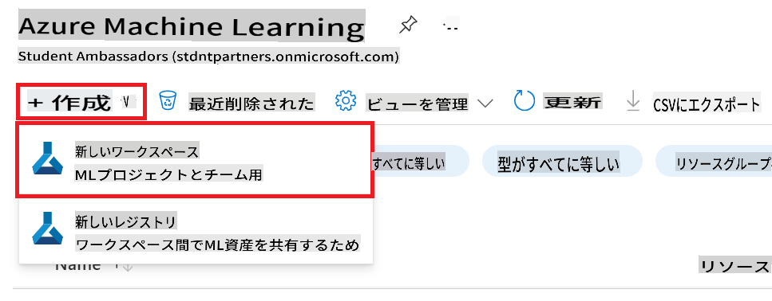

4. 以下のタスクを実行します：

    - Azure **サブスクリプション**を選択します。
    - 使用する**リソースグループ**を選択します（必要に応じて新しいものを作成します）。
    - **ワークスペース名**を入力します。これは一意の値でなければなりません。
    - 使用する**リージョン**を選択します。
    - 使用する**ストレージアカウント**を選択します（必要に応じて新しいものを作成します）。
    - 使用する**キーコンテナ**を選択します（必要に応じて新しいものを作成します）。
    - 使用する**アプリケーションインサイト**を選択します（必要に応じて新しいものを作成します）。
    - 使用する**コンテナレジストリ**を選択します（必要に応じて新しいものを作成します）。

    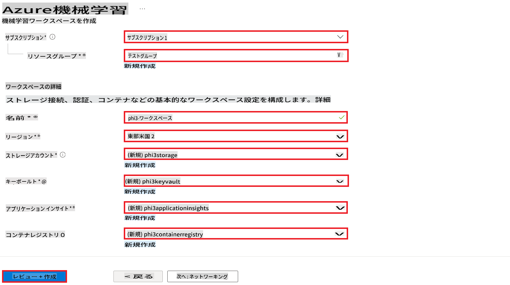

5. **Review + Create** を選択します。

6. **Create** を選択します。

### Azure サブスクリプションで GPU クォータをリクエストする

このチュートリアルでは、GPU を使用して Phi-3 モデルを微調整およびデプロイする方法を学びます。微調整には *Standard_NC24ads_A100_v4* GPU を使用し、デプロイには *Standard_NC6s_v3* GPU を使用します。これらの GPU にはクォータリクエストが必要です。

> [!NOTE]
>
> GPU 割り当ての対象となるのは、従量課金制のサブスクリプション（標準のサブスクリプションタイプ）のみであり、特典サブスクリプションは現在サポートされていません。
>

1. [Azure ML Studio](https://ml.azure.com/home?wt.mc_id=studentamb_279723) にアクセスします。

1. *Standard NCADSA100v4 Family* クォータをリクエストするために、以下のタスクを実行します：

    - 左側のタブから **Quota** を選択します。
    - 使用する **Virtual machine family** を選択します。例えば、*Standard NCADSA100v4 Family Cluster Dedicated vCPUs* を選択します。これには *Standard_NC24ads_A100_v4* GPU が含まれます。
    - ナビゲーションメニューから **Request quota** を選択します。

        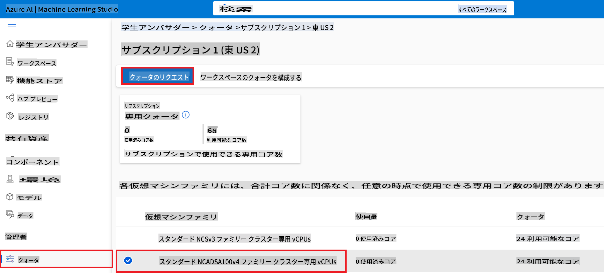

    - Request quota ページで、使用したい **New cores limit** を入力します。例えば、24。
    - Request quota ページで、**Submit** を選択して GPU クォータをリクエストします。

1. *Standard NCSv3 Family* クォータをリクエストするために、以下のタスクを実行します：

    - 左側のタブから **Quota** を選択します。
    - 使用する **Virtual machine family** を選択します。例えば、*Standard NCSv3 Family Cluster Dedicated vCPUs* を選択します。これには *Standard_NC6s_v3* GPU が含まれます。
    - ナビゲーションメニューから **Request quota** を選択します。
    - Request quota ページで、使用したい **New cores limit** を入力します。例えば、24。
    - Request quota ページで、**Submit** を選択して GPU クォータをリクエストします。

### ロール割り当てを追加する

モデルを微調整およびデプロイするには、まずユーザー割り当てマネージドアイデンティティ (UAI) を作成し、適切な権限を割り当てる必要があります。この UAI はデプロイ時の認証に使用されます。

#### ユーザー割り当てマネージドアイデンティティ (UAI) を作成する

1. ポータルページの上部にある**検索バー**に *managed identities* と入力し、表示されたオプションから **Managed Identities** を選択します。

    

1. **+ Create** を選択します。

    

1. 以下のタスクを実行します：

    - Azure **サブスクリプション**を選択します。
    - 使用する**リソースグループ**を選択します（必要に応じて新しいものを作成します）。
    - 使用する**リージョン**を選択します。
    - **名前**を入力します。これは一意の値でなければなりません。

    

1. **Review + create** を選択します。

1. **+ Create** を選択します。

#### マネージドアイデンティティに Contributor ロールを割り当てる

1. 作成したマネージドアイデンティティリソースに移動します。

1. 左側のタブから **Azure role assignments** を選択します。

1. ナビゲーションメニューから **+Add role assignment** を選択します。

1. Add role assignment ページで、以下のタスクを実行します：
    - **Scope** を **Resource group** に設定します。
    - Azure **サブスクリプション**を選択します。
    - 使用する**リソースグループ**を選択します。
    - **Role** を **Contributor** に設定します。

    

1. **Save** を選択します。

#### マネージドアイデンティティに Storage Blob Data Reader ロールを割り当てる

1. ポータルページの上部にある**検索バー**に *storage accounts* と入力し、表示されたオプションから **Storage accounts** を選択します。

    

1. 作成した Azure Machine Learning ワークスペースに関連付けられたストレージアカウントを選択します。例えば、*finetunephistorage*。

1. Add role assignment ページに移動するために以下のタスクを実行します：

    - 作成した Azure ストレージアカウントに移動します。
    - 左側のタブから **Access Control (IAM)** を選択します。
    - ナビゲーションメニューから **+ Add** を選択します。
    - ナビゲーションメニューから **Add role assignment** を選択します。

    

1. Add role assignment ページで、以下のタスクを実行します：

    - Role ページで **Storage Blob Data Reader** と入力し、表示されたオプションから **Storage Blob Data Reader** を選択します。
    - Role ページで **Next** を選択します。
    - Members ページで **Assign access to** を **Managed identity** に設定します。
    - Members ページで **+ Select members** を選択します。
    - Select managed identities ページで Azure **サブスクリプション**を選択します。
    - Select managed identities ページで **Managed identity** を **Manage Identity** に設定します。
    - Select managed identities ページで作成したマネージドアイデンティティを選択します。例えば、*finetunephi-managedidentity*。
    - Select managed identities ページで **Select** を選択します。

    

1. **Review + assign** を選択します。

#### マネージドアイデンティティに AcrPull ロールを割り当てる

1. ポータルページの上部にある**検索バー**に *container registries* と入力し、表示されたオプションから **Container registries** を選択します。

    

1. Azure Machine Learning ワークスペースに関連付けられたコンテナレジストリを選択します。例えば、*finetunephicontainerregistry*

1. Add role assignment ページに移動するために以下のタスクを実行します：

    - 左側のタブから **Access Control (IAM)** を選択します。
    - ナビゲーションメニューから **+ Add** を選択します。
    - ナビゲーションメニューから **Add role assignment** を選択します。

1. Add role assignment ページで、以下のタスクを実行します：

    - Role ページで **AcrPull** と入力し、表示されたオプションから **AcrPull** を選択します。
    - Role ページで **Next** を選択します。
    - Members ページで **Assign access to** を **Managed identity** に設定します。
    - Members ページで **+ Select members** を選択します。
    - Select managed identities ページで Azure **サブスクリプション**を選択します。
    - Select managed identities ページで **Managed identity** を **Manage Identity** に設定します。
    - Select managed identities ページで作成したマネージドアイデンティティを選択します。例えば、*finetunephi-managedidentity*。
    - Select managed identities ページで **Select** を選択します。
    - **Review + assign** を選択します。

### プロジェクトを設定する

微調整に必要なデータセットをダウンロードするために、ローカル環境を設定します。

この演習では、以下のことを行います：

- 作業用のフォルダを作成します。
- 仮想環境を作成します。
- 必要なパッケージをインストールします。
- データセットをダウンロードするための *download_dataset.py* ファイルを作成します。

#### 作業用のフォルダを作成する

1. ターミナルウィンドウを開き、以下のコマンドを入力してデフォルトのパスに *finetune-phi* フォルダを作成します。

    ```console
    mkdir finetune-phi
    ```

2. ターミナル内で以下のコマンドを入力して作成した *finetune-phi* フォルダに移動します。

    ```console
    cd finetune-phi
    ```

#### 仮想環境を作成する

1. ターミナル内で以下のコマンドを入力して *.venv* という名前の仮想環境を作成します。

    ```console
    python -m venv .venv
    ```

2. ターミナル内で以下のコマンドを入力して仮想環境をアクティブにします。

    ```console
    .venv\Scripts\activate.bat
    ```

> [!NOTE]
> 成功すると、コマンドプロンプトの前に *(.venv)* が表示されます。

#### 必要なパッケージをインストールする

1. ターミナル内で以下のコマンドを入力して必要なパッケージをインストールします。

    ```console
    pip install datasets==2.19.1
    ```

#### `download_dataset.py` を作成する

> [!NOTE]
> 完全なフォルダ構造：
>
> ```text
> └── YourUserName
> .    └── finetune-phi
> .        └── download_dataset.py
> ```

1. **Visual Studio Code** を開きます。

1. メニューバーから **File** を選択します。

1. **Open Folder** を選択します。

1. 作成した *finetune-phi* フォルダを選択します。これは *C:\Users\yourUserName\finetune-phi* にあります。

    

1. Visual Studio Code の左ペインで右クリックして **New File** を選択し、*download_dataset.py* という名前の新しいファイルを作成します。

     を訪問します。

1. 左側のタブから **Compute** を選択します。

1. ナビゲーションメニューから **Compute clusters** を選択します。

1. **+ New** を選択します。

    

1. 以下のタスクを実行します:

    - 使用したい **Region** を選択します。
    - **Virtual machine tier** を **Dedicated** に設定します。
    - **Virtual machine type** を **GPU** に設定します。
    - **Virtual machine size** フィルターを **Select from all options** に設定します。
    - **Virtual machine size** を **Standard_NC24ads_A100_v4** に設定します。

    

1. **Next** を選択します。

1. 以下のタスクを実行します:

    - **Compute name** を入力します。これは一意の値でなければなりません。
    - **Minimum number of nodes** を **0** に設定します。
    - **Maximum number of nodes** を **1** に設定します。
    - **Idle seconds before scale down** を **120** に設定します。

    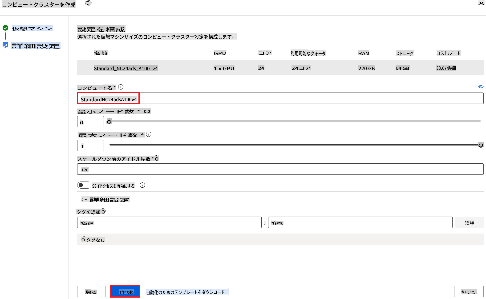

1. **Create** を選択します。

#### Phi-3 モデルのファインチューニング

1. [Azure ML Studio](https://ml.azure.com/home?wt.mc_id=studentamb_279723) を訪問します。

1. 作成した Azure Machine Learning ワークスペースを選択します。

    

1. 以下のタスクを実行します:

    - 左側のタブから **Model catalog** を選択します。
    - **検索バー** に *phi-3-mini-4k* と入力し、表示されるオプションから **Phi-3-mini-4k-instruct** を選択します。

    

1. ナビゲーションメニューから **Fine-tune** を選択します。

    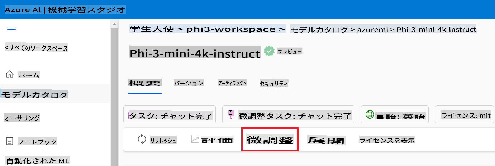

1. 以下のタスクを実行します:

    - **Select task type** を **Chat completion** に設定します。
    - **+ Select data** を選択して **Traning data** をアップロードします。
    - Validation data のアップロードタイプを **Provide different validation data** に設定します。
    - **+ Select data** を選択して **Validation data** をアップロードします。

    

    > [!TIP]
    >
    > **Advanced settings** を選択して、**learning_rate** や **lr_scheduler_type** などの設定をカスタマイズし、特定のニーズに合わせてファインチューニングプロセスを最適化できます。

1. **Finish** を選択します。

1. この演習では、Azure Machine Learning を使用して Phi-3 モデルのファインチューニングに成功しました。ファインチューニングプロセスはかなりの時間がかかることがあります。ファインチューニングジョブを実行した後、その完了を待つ必要があります。Azure Machine Learning Workspace の左側のタブの Jobs に移動して、ファインチューニングジョブのステータスを監視できます。次のシリーズでは、ファインチューニングされたモデルをデプロイし、Prompt flow と統合します。

    

### ファインチューニングされた Phi-3 モデルのデプロイ

ファインチューニングされた Phi-3 モデルを Prompt flow と統合するには、モデルをデプロイしてリアルタイム推論にアクセスできるようにする必要があります。このプロセスには、モデルの登録、オンラインエンドポイントの作成、およびモデルのデプロイが含まれます。

この演習では、以下を行います:

- ファインチューニングされたモデルを Azure Machine Learning ワークスペースに登録します。
- オンラインエンドポイントを作成します。
- 登録されたファインチューニングされた Phi-3 モデルをデプロイします。

#### ファインチューニングされたモデルの登録

1. [Azure ML Studio](https://ml.azure.com/home?wt.mc_id=studentamb_279723) を訪問します。

1. 作成した Azure Machine Learning ワークスペースを選択します。

    

1. 左側のタブから **Models** を選択します。
1. **+ Register** を選択します。
1. **From a job output** を選択します。

    

1. 作成したジョブを選択します。

    

1. **Next** を選択します。

1. **Model type** を **MLflow** に設定します。

1. **Job output** が選択されていることを確認します。自動的に選択されているはずです。

    

1. **Next** を選択します。

1. **Register** を選択します。

    

1. 左側のタブから **Models** メニューに移動して、登録されたモデルを確認できます。

    

#### ファインチューニングされたモデルのデプロイ

1. 作成した Azure Machine Learning ワークスペースに移動します。

1. 左側のタブから **Endpoints** を選択します。

1. ナビゲーションメニューから **Real-time endpoints** を選択します。

    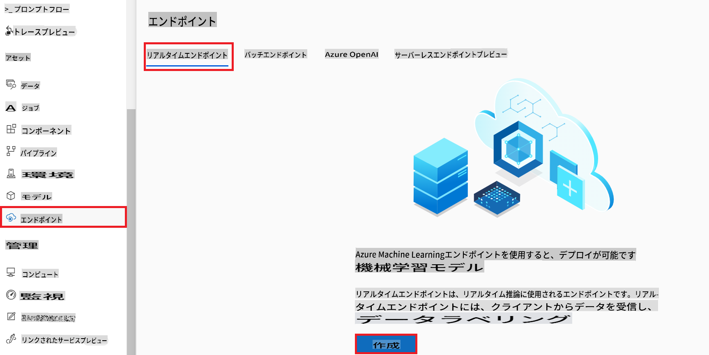

1. **Create** を選択します。

1. 作成した登録済みモデルを選択します。

    

1. **Select** を選択します。

1. 以下のタスクを実行します:

    - **Virtual machine** を *Standard_NC6s_v3* に設定します。
    - 使用したい **Instance count** を選択します。例えば、*1*。
    - **Endpoint** を **New** に設定してエンドポイントを作成します。
    - **Endpoint name** を入力します。これは一意の値でなければなりません。
    - **Deployment name** を入力します。これも一意の値でなければなりません。

    

1. **Deploy** を選択します。

> [!WARNING]
> アカウントへの追加料金を避けるために、Azure Machine Learning ワークスペースで作成したエンドポイントを削除することを忘れないでください。
>

#### Azure Machine Learning ワークスペースでデプロイメントステータスを確認

1. 作成した Azure Machine Learning ワークスペースに移動します。

1. 左側のタブから **Endpoints** を選択します。

1. 作成したエンドポイントを選択します。

    

1. このページで、デプロイメントプロセス中にエンドポイントを管理できます。

> [!NOTE]
> デプロイメントが完了したら、**Live traffic** が **100%** に設定されていることを確認してください。設定されていない場合は、**Update traffic** を選択してトラフィック設定を調整してください。トラフィックが0%に設定されていると、モデルをテストできません。
>
> 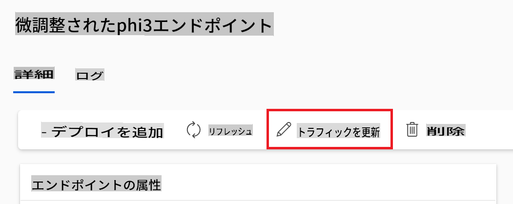
>

## シナリオ 3: Prompt flow と統合し、Azure AI Studio でカスタムモデルとチャットする

### カスタム Phi-3 モデルを Prompt flow と統合

ファインチューニングされたモデルのデプロイに成功した後、Prompt Flow と統合してリアルタイムアプリケーションでモデルを使用できます。これにより、カスタム Phi-3 モデルを使用したさまざまなインタラクティブタスクが可能になります。

この演習では、以下を行います:

- Azure AI Studio Hub を作成します。
- Azure AI Studio Project を作成します。
- Prompt flow を作成します。
- ファインチューニングされた Phi-3 モデルのカスタム接続を追加します。
- Prompt flow を設定してカスタム Phi-3 モデルとチャットします。

> [!NOTE]
> Promptflow を使用して Azure ML Studio と統合することもできます。同じ統合プロセスを Azure ML Studio に適用できます。

#### Azure AI Studio Hub の作成

Project を作成する前に Hub を作成する必要があります。Hub はリソースグループのようなもので、Azure AI Studio 内で複数のプロジェクトを整理して管理できます。

1. [Azure AI Studio](https://ai.azure.com/?WT.mc_id=aiml-137032-kinfeylo) を訪問します。

1. 左側のタブから **All hubs** を選択します。

1. ナビゲーションメニューから **+ New hub** を選択します。

    

1. 以下のタスクを実行します:

    - **Hub name** を入力します。これは一意の値でなければなりません。
    - Azure の **Subscription** を選択します。
    - 使用する **Resource group** を選択します（必要に応じて新しいものを作成します）。
    - 使用したい **Location** を選択します。
    - 使用する **Connect Azure AI Services** を選択します（必要に応じて新しいものを作成します）。
    - **Connect Azure AI Search** を **Skip connecting** に設定します。

    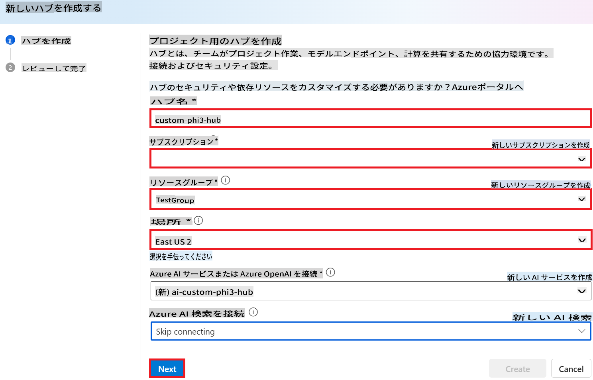

1. **Next** を選択します。

#### Azure AI Studio Project の作成

1. 作成した Hub で、左側のタブから **All projects** を選択します。

1. ナビゲーションメニューから **+ New project** を選択します。

    

1. **Project name** を入力します。これは一意の値でなければなりません。

    

1. **Create a project** を選択します。

#### ファインチューニングされた Phi-3 モデルのカスタム接続を追加

カスタム Phi-3 モデルを Prompt flow と統合するには、モデルのエンドポイントとキーをカスタム接続に保存する必要があります。この設定により、Prompt flow でカスタム Phi-3 モデルにアクセスできるようになります。

#### ファインチューニングされた Phi-3 モデルの API キーとエンドポイント URI を設定

1. [Azure ML Studio](https://ml.azure.com/home?WT.mc_id=aiml-137032-kinfeylo) を訪問します。

1. 作成した Azure Machine Learning ワークスペースに移動します。

1. 左側のタブから **Endpoints** を選択します。

    

1. 作成したエンドポイントを選択します。

    

1. ナビゲーションメニューから **Consume** を選択します。

1. **REST endpoint** と **Primary key** をコピーします。


#### カスタム接続を追加

1. [Azure AI Studio](https://ai.azure.com/?WT.mc_id=aiml-137032-kinfeylo)にアクセスします。

1. 作成したAzure AI Studioプロジェクトに移動します。

1. 作成したプロジェクトで、左側のタブから**Settings**を選択します。

1. **+ New connection**を選択します。

    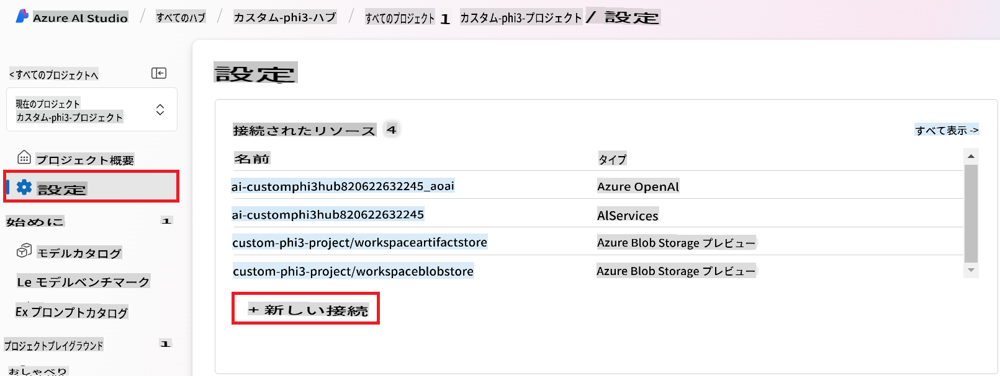

1. ナビゲーションメニューから**Custom keys**を選択します。

    

1. 以下のタスクを実行します：

    - **+ Add key value pairs**を選択します。
    - キー名に**endpoint**を入力し、Azure ML Studioからコピーしたエンドポイントを値フィールドに貼り付けます。
    - 再度**+ Add key value pairs**を選択します。
    - キー名に**key**を入力し、Azure ML Studioからコピーしたキーを値フィールドに貼り付けます。
    - キーを追加した後、**is secret**を選択してキーが露出しないようにします。

    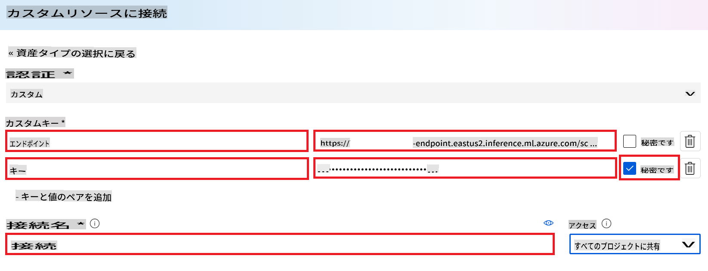

1. **Add connection**を選択します。

#### プロンプトフローを作成

Azure AI Studioにカスタム接続を追加しました。次に、以下の手順に従ってプロンプトフローを作成します。その後、このプロンプトフローをカスタム接続に接続して、プロンプトフロー内で微調整されたモデルを使用できるようにします。

1. 作成したAzure AI Studioプロジェクトに移動します。

1. 左側のタブから**Prompt flow**を選択します。

1. ナビゲーションメニューから**+ Create**を選択します。

    

1. ナビゲーションメニューから**Chat flow**を選択します。

    

1. 使用する**Folder name**を入力します。

    

1. **Create**を選択します。

#### カスタムPhi-3モデルとチャットするためのプロンプトフローの設定

微調整されたPhi-3モデルをプロンプトフローに統合する必要があります。しかし、既存のプロンプトフローはこの目的のために設計されていません。そのため、カスタムモデルの統合を可能にするためにプロンプトフローを再設計する必要があります。

1. プロンプトフロー内で、以下のタスクを実行して既存のフローを再構築します：

    - **Raw file mode**を選択します。
    - *flow.dag.yml*ファイル内の既存のコードをすべて削除します。
    - 以下のコードを*flow.dag.yml*ファイルに追加します。

        ```yml
        inputs:
          input_data:
            type: string
            default: "Who founded Microsoft?"

        outputs:
          answer:
            type: string
            reference: ${integrate_with_promptflow.output}

        nodes:
        - name: integrate_with_promptflow
          type: python
          source:
            type: code
            path: integrate_with_promptflow.py
          inputs:
            input_data: ${inputs.input_data}
        ```

    - **Save**を選択します。

    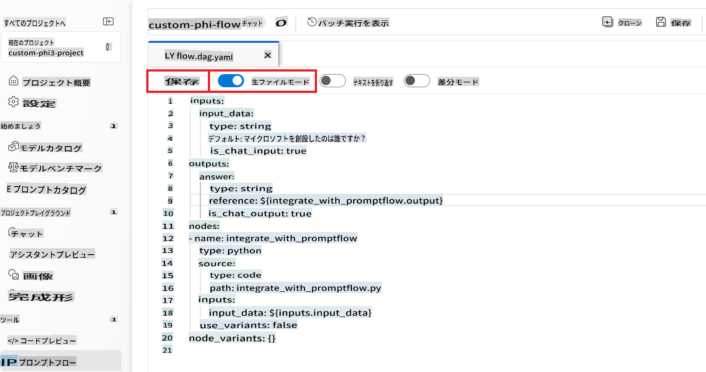

1. *integrate_with_promptflow.py*ファイルに以下のコードを追加して、プロンプトフロー内でカスタムPhi-3モデルを使用します。

    ```python
    import logging
    import requests
    from promptflow import tool
    from promptflow.connections import CustomConnection

    # ログ設定
    logging.basicConfig(
        format="%(asctime)s - %(levelname)s - %(name)s - %(message)s",
        datefmt="%Y-%m-%d %H:%M:%S",
        level=logging.DEBUG
    )
    logger = logging.getLogger(__name__)

    def query_phi3_model(input_data: str, connection: CustomConnection) -> str:
        """
        カスタム接続を使用して、与えられた入力データでPhi-3モデルのエンドポイントにリクエストを送信します。
        """

        # "connection"はカスタム接続の名前、"endpoint"、"key"はカスタム接続のキーです
        endpoint_url = connection.endpoint
        api_key = connection.key

        headers = {
            "Content-Type": "application/json",
            "Authorization": f"Bearer {api_key}"
        }
        data = {
            "input_data": {
                "input_string": [
                    {"role": "user", "content": input_data}
                ],
                "parameters": {
                    "temperature": 0.7,
                    "max_new_tokens": 128
                }
            }
        }
        try:
            response = requests.post(endpoint_url, json=data, headers=headers)
            response.raise_for_status()
            
            # JSONレスポンス全体をログに記録
            logger.debug(f"Full JSON response: {response.json()}")

            result = response.json()["output"]
            logger.info("Azure MLエンドポイントからのレスポンスを正常に受信しました。")
            return result
        except requests.exceptions.RequestException as e:
            logger.error(f"Azure MLエンドポイントへのクエリ中にエラーが発生しました: {e}")
            raise

    @tool
    def my_python_tool(input_data: str, connection: CustomConnection) -> str:
        """
        入力データを処理し、Phi-3モデルにクエリを送信するためのツール関数。
        """
        return query_phi3_model(input_data, connection)

    ```

    

> [!NOTE]
> Azure AI Studioでプロンプトフローを使用する詳細情報については、[Azure AI Studioのプロンプトフロー](https://learn.microsoft.com/azure/ai-studio/how-to/prompt-flow)を参照してください。

1. **Chat input**、**Chat output**を選択して、モデルとのチャットを有効にします。

    

1. これで、カスタムPhi-3モデルとチャットする準備が整いました。次の演習では、プロンプトフローを開始して、微調整されたPhi-3モデルとチャットする方法を学びます。

> [!NOTE]
>
> 再構築されたフローは以下の画像のようになります：
>
> 
>

### カスタムPhi-3モデルとのチャット

微調整されたカスタムPhi-3モデルをプロンプトフローに統合したので、いよいよそれと対話を開始する準備が整いました。この演習では、モデルとのチャットを設定し開始する手順をガイドします。これらの手順に従うことで、微調整されたPhi-3モデルの能力をさまざまなタスクや会話で最大限に活用できるようになります。

- プロンプトフローを使用してカスタムPhi-3モデルとチャットする。

#### プロンプトフローを開始

1. **Start compute sessions**を選択してプロンプトフローを開始します。

    

1. **Validate and parse input**を選択してパラメータを更新します。

    

1. 作成したカスタム接続の**connection**の**Value**を選択します。例えば、*connection*。

    

#### カスタムモデルとチャット

1. **Chat**を選択します。

    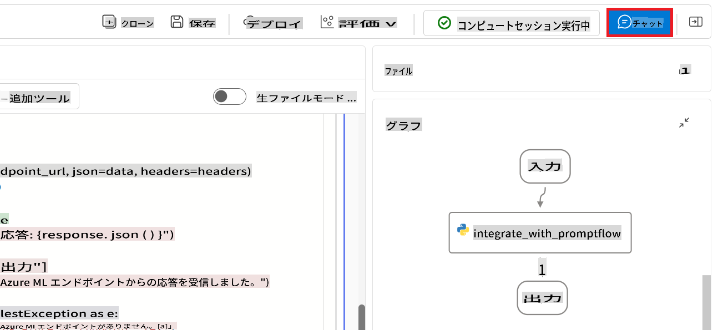

1. これが結果の一例です：これでカスタムPhi-3モデルとチャットできます。微調整に使用したデータに基づいた質問をすることをお勧めします。

    

免責事項: この翻訳はAIモデルによって原文から翻訳されたものであり、完璧ではない可能性があります。 出力を確認し、必要な修正を行ってください。