# Phi-3カスタムモデルをAzure AI FoundryのPrompt Flowで微調整・統合する

このエンドツーエンド（E2E）サンプルは、Microsoft Tech Communityのガイド「[Fine-Tune and Integrate Custom Phi-3 Models with Prompt Flow in Azure AI Foundry](https://techcommunity.microsoft.com/t5/educator-developer-blog/fine-tune-and-integrate-custom-phi-3-models-with-prompt-flow-in/ba-p/4191726?WT.mc_id=aiml-137032-kinfeylo)」に基づいています。Azure AI FoundryでカスタムPhi-3モデルを微調整、デプロイ、統合するプロセスを紹介します。
ローカルでコードを実行するE2Eサンプル「[Fine-Tune and Integrate Custom Phi-3 Models with Prompt Flow](./E2E_Phi-3-FineTuning_PromptFlow_Integration.md)」とは異なり、このチュートリアルはAzure AI / ML Studio内でモデルを微調整および統合することに焦点を当てています。

## 概要

このE2Eサンプルでは、Phi-3モデルを微調整し、Azure AI FoundryのPrompt Flowと統合する方法を学びます。Azure AI / ML Studioを活用して、カスタムAIモデルをデプロイおよび利用するためのワークフローを確立します。このE2Eサンプルは、以下の3つのシナリオに分かれています：

**シナリオ1: Azureリソースをセットアップし、微調整の準備をする**

**シナリオ2: Phi-3モデルを微調整し、Azure Machine Learning Studioにデプロイする**

**シナリオ3: Prompt Flowと統合し、Azure AI Foundryでカスタムモデルとチャットする**

以下は、このE2Eサンプルの概要です。

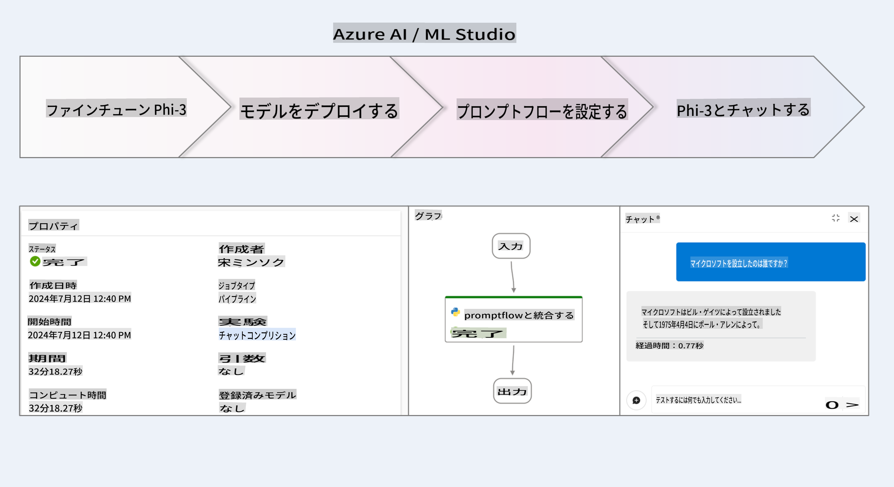

### 目次

1. **[シナリオ1: Azureリソースをセットアップし、微調整の準備をする](../../../../md/06.E2ESamples)**
    - [Azure Machine Learningワークスペースを作成する](../../../../md/06.E2ESamples)
    - [AzureサブスクリプションでGPUクォータをリクエストする](../../../../md/06.E2ESamples)
    - [ロール割り当てを追加する](../../../../md/06.E2ESamples)
    - [プロジェクトをセットアップする](../../../../md/06.E2ESamples)
    - [微調整用のデータセットを準備する](../../../../md/06.E2ESamples)

1. **[シナリオ2: Phi-3モデルを微調整し、Azure Machine Learning Studioにデプロイする](../../../../md/06.E2ESamples)**
    - [Phi-3モデルを微調整する](../../../../md/06.E2ESamples)
    - [微調整されたPhi-3モデルをデプロイする](../../../../md/06.E2ESamples)

1. **[シナリオ3: Prompt Flowと統合し、Azure AI Foundryでカスタムモデルとチャットする](../../../../md/06.E2ESamples)**
    - [カスタムPhi-3モデルをPrompt Flowと統合する](../../../../md/06.E2ESamples)
    - [カスタムPhi-3モデルとチャットする](../../../../md/06.E2ESamples)

## シナリオ1: Azureリソースをセットアップし、微調整の準備をする

### Azure Machine Learningワークスペースを作成する

1. ポータルページの上部にある**検索バー**に「*azure machine learning*」と入力し、表示されるオプションから**Azure Machine Learning**を選択します。

    

2. ナビゲーションメニューから**+ Create**を選択します。

3. ナビゲーションメニューから**New workspace**を選択します。

    

4. 次のタスクを実行します：

    - Azureの**サブスクリプション**を選択します。
    - 使用する**リソースグループ**を選択します（必要に応じて新しいものを作成）。
    - **ワークスペース名**を入力します。一意の値である必要があります。
    - 使用する**リージョン**を選択します。
    - 使用する**ストレージアカウント**を選択します（必要に応じて新しいものを作成）。
    - 使用する**キーボールト**を選択します（必要に応じて新しいものを作成）。
    - 使用する**アプリケーションインサイト**を選択します（必要に応じて新しいものを作成）。
    - 使用する**コンテナレジストリ**を選択します（必要に応じて新しいものを作成）。

    

5. **Review + Create**を選択します。

6. **Create**を選択します。

### AzureサブスクリプションでGPUクォータをリクエストする

このチュートリアルでは、GPUを使用してPhi-3モデルを微調整およびデプロイする方法を学びます。微調整には*Standard_NC24ads_A100_v4* GPUを使用し、デプロイには*Standard_NC6s_v3* GPUを使用します。これらにはクォータリクエストが必要です。

> [!NOTE]
>
> GPU割り当てが可能なのは従量課金制サブスクリプション（標準のサブスクリプションタイプ）のみであり、特典サブスクリプションは現在サポートされていません。
>

1. [Azure ML Studio](https://ml.azure.com/home?wt.mc_id=studentamb_279723)を訪問します。

1. *Standard NCADSA100v4 Family*クォータをリクエストするために次のタスクを実行します：

    - 左側のタブから**Quota**を選択します。
    - 使用する**バーチャルマシンファミリー**を選択します。例えば、*Standard_NC24ads_A100_v4* GPUを含む**Standard NCADSA100v4 Family Cluster Dedicated vCPUs**を選択します。
    - ナビゲーションメニューから**Request quota**を選択します。

        

    - Request quotaページ内で、使用したい**New cores limit**を入力します。例えば、24。
    - Request quotaページ内で、GPUクォータをリクエストするために**Submit**を選択します。

1. *Standard NCSv3 Family*クォータをリクエストするために次のタスクを実行します：

    - 左側のタブから**Quota**を選択します。
    - 使用する**バーチャルマシンファミリー**を選択します。例えば、*Standard_NC6s_v3* GPUを含む**Standard NCSv3 Family Cluster Dedicated vCPUs**を選択します。
    - ナビゲーションメニューから**Request quota**を選択します。
    - Request quotaページ内で、使用したい**New cores limit**を入力します。例えば、24。
    - Request quotaページ内で、GPUクォータをリクエストするために**Submit**を選択します。

### ロール割り当てを追加する

モデルを微調整およびデプロイするためには、まずユーザー割り当てマネージドID（UAI）を作成し、適切な権限を割り当てる必要があります。このUAIはデプロイ時の認証に使用されます。

#### ユーザー割り当てマネージドID（UAI）を作成する

1. ポータルページの上部にある**検索バー**に「*managed identities*」と入力し、表示されるオプションから**Managed Identities**を選択します。

    

1. **+ Create**を選択します。

    

1. 次のタスクを実行します：

    - Azureの**サブスクリプション**を選択します。
    - 使用する**リソースグループ**を選択します（必要に応じて新しいものを作成）。
    - 使用する**リージョン**を選択します。
    - **名前**を入力します。一意の値である必要があります。

    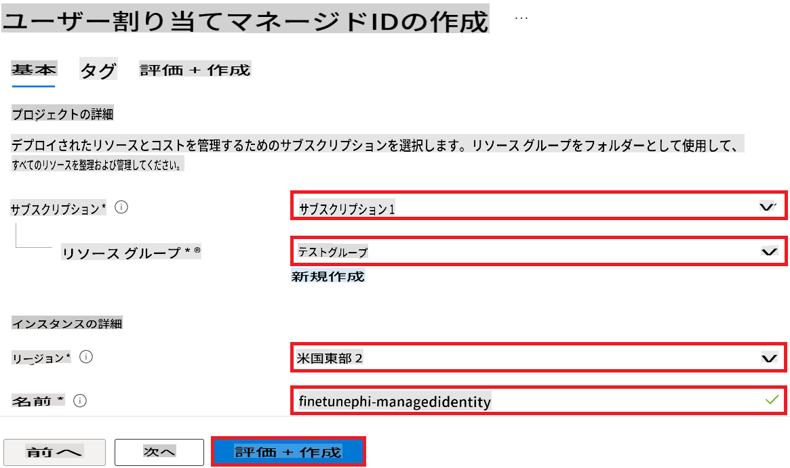

1. **Review + create**を選択します。

1. **+ Create**を選択します。

#### マネージドIDにコントリビューターロールを割り当てる

1. 作成したマネージドIDリソースに移動します。

1. 左側のタブから**Azure role assignments**を選択します。

1. ナビゲーションメニューから**+Add role assignment**を選択します。

1. Add role assignmentページ内で次のタスクを実行します：
    - **Scope**を**Resource group**に設定します。
    - Azureの**サブスクリプション**を選択します。
    - 使用する**リソースグループ**を選択します。
    - **Role**を**Contributor**に設定します。

    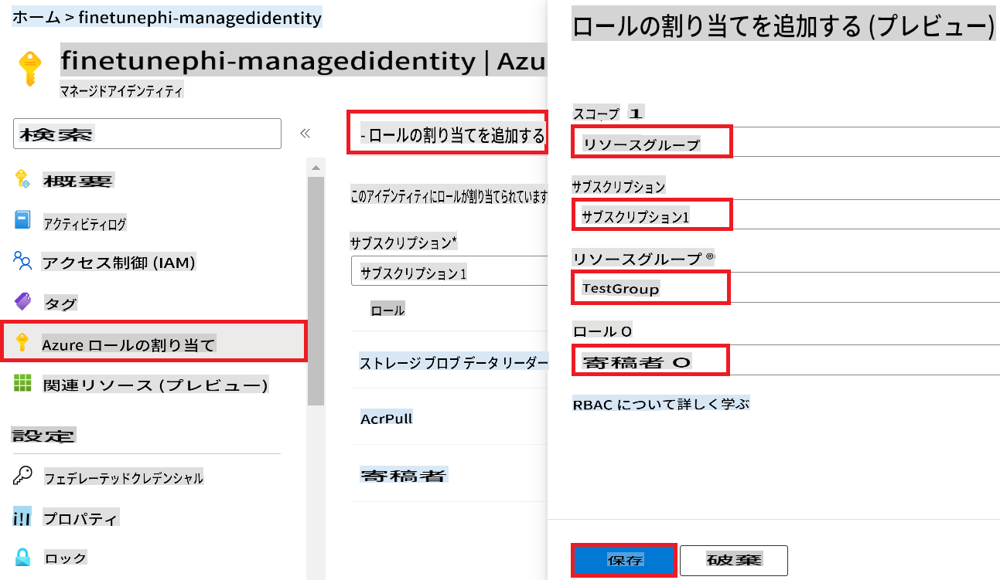

1. **Save**を選択します。

#### ストレージBlobデータリーダーロールをマネージドIDに割り当てる

1. ポータルページの上部にある**検索バー**に「*storage accounts*」と入力し、表示されるオプションから**Storage accounts**を選択します。

    

1. 作成したAzure Machine Learningワークスペースに関連付けられているストレージアカウントを選択します。例えば、*finetunephistorage*。

1. 次のタスクを実行してAdd role assignmentページに移動します：

    - 作成したAzureストレージアカウントに移動します。
    - 左側のタブから**Access Control (IAM)**を選択します。
    - ナビゲーションメニューから**+ Add**を選択します。
    - ナビゲーションメニューから**Add role assignment**を選択します。

    

1. Add role assignmentページ内で次のタスクを実行します：

    - ロールページ内で**検索バー**に「*Storage Blob Data Reader*」と入力し、表示されるオプションから**Storage Blob Data Reader**を選択します。
    - ロールページ内で**Next**を選択します。
    - メンバーページ内で**Assign access to**を**Managed identity**に設定します。
    - メンバーページ内で**+ Select members**を選択します。
    - Select managed identitiesページ内でAzureの**サブスクリプション**を選択します。
    - Select managed identitiesページ内で**Managed identity**を**Manage Identity**に設定します。
    - Select managed identitiesページ内で作成したManage Identityを選択します。例えば、*finetunephi-managedidentity*。
    - Select managed identitiesページ内で**Select**を選択します。

    

1. **Review + assign**を選択します。

#### AcrPullロールをマネージドIDに割り当てる

1. ポータルページの上部にある**検索バー**に「*container registries*」と入力し、表示されるオプションから**Container registries**を選択します。

    

1. Azure Machine Learningワークスペースに関連付けられているコンテナレジストリを選択します。例えば、*finetunephicontainerregistry*

1. 次のタスクを実行してAdd role assignmentページに移動します：

    - 左側のタブから**Access Control (IAM)**を選択します。
    - ナビゲーションメニューから**+ Add**を選択します。
    - ナビゲーションメニューから**Add role assignment**を選択します。

1. Add role assignmentページ内で次のタスクを実行します：

    - ロールページ内で**検索バー**に「*AcrPull*」と入力し、表示されるオプションから**AcrPull**を選択します。
    - ロールページ内で**Next**を選択します。
    - メンバーページ内で**Assign access to**を**Managed identity**に設定します。
    - メンバーページ内で**+ Select members**を選択します。
    - Select managed identitiesページ内でAzureの**サブスクリプション**を選択します。
    - Select managed identitiesページ内で**Managed identity**を**Manage Identity**に設定します。
    - Select managed identitiesページ内で作成したManage Identityを選択します。例えば、*finetunephi-managedidentity*。
    - Select managed identitiesページ内で**Select**を選択します。
    - **Review + assign**を選択します。

### プロジェクトをセットアップする

微調整に必要なデータセットをダウンロードするために、ローカル環境をセットアップします。

この演習では、

- 作業するフォルダを作成します。
- 仮想環境を作成します。
- 必要なパッケージをインストールします。
- データセットをダウンロードするための*download_dataset.py*ファイルを作成します。

#### 作業するフォルダを作成する

1. ターミナルウィンドウを開き、デフォルトパスに*finetune-phi*という名前のフォルダを作成するために次のコマンドを入力します。

    ```console
    mkdir finetune-phi
    ```

2. 作成した*finetune-phi*フォルダに移動するために、ターミナル内で次のコマンドを入力します。

    ```console
    cd finetune-phi
    ```

#### 仮想環境を作成する

1. ターミナル内で次のコマンドを入力し、*.venv*という名前の仮想環境を作成します。

    ```console
    python -m venv .venv
    ```

2. ターミナル内で次のコマンドを入力して、仮想環境をアクティブにします。

    ```console
    .venv\Scripts\activate.bat
    ```

> [!NOTE]
> 正常に動作した場合、コマンドプロンプトの前に*(.venv)*が表示されます。

#### 必要なパッケージをインストールする

1. ターミナル内で次のコマンドを入力し、必要なパッケージをインストールします。

    ```console
    pip install datasets==2.19.1
    ```

#### `download_dataset.py`を作成する

> [!NOTE]
> 完全なフォルダ構成：
>
> ```text
> └── YourUserName
> .    └── finetune-phi
> .        └── download_dataset.py
> ```

1. **Visual Studio Code**を開きます。

1. メニューバーから**ファイル**を選択します。

1. **フォルダを開く**を選択します。

1. 作成した*finetune-phi*フォルダを選択します。場所は*C:\Users\yourUserName\finetune-phi*です。

    

1. Visual Studio Codeの左ペインで右クリックし、**新しいファイル**を選択して*download_dataset.py*という名前の新しいファイルを作成します。

    

### 微調整用のデータセットを準備する

この演習では、*download_dataset.py*ファイルを実行して*ultrachat_200k*データセットをローカル環境にダウンロードします。次に、このデータセットを使用してAzure Machine LearningでPhi-3モデルを微調整します。

この演習では：

- *
1. [Azure ML Studio](https://ml.azure.com/home?wt.mc_id=studentamb_279723) にアクセスします。

1. 左側のタブから **Compute** を選択します。

1. ナビゲーションメニューから **Compute clusters** を選択します。

1. **+ New** を選択します。

    

1. 次のタスクを実行します:

    - 使用したい **Region** を選択します。
    - **Virtual machine tier** を **Dedicated** に設定します。
    - **Virtual machine type** を **GPU** に設定します。
    - **Virtual machine size** のフィルターを **Select from all options** に設定します。
    - **Virtual machine size** を **Standard_NC24ads_A100_v4** に設定します。

    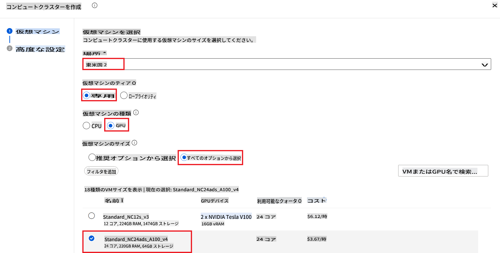

1. **Next** を選択します。

1. 次のタスクを実行します:

    - **Compute name** を入力します。これは一意の値でなければなりません。
    - **Minimum number of nodes** を **0** に設定します。
    - **Maximum number of nodes** を **1** に設定します。
    - **Idle seconds before scale down** を **120** に設定します。

    

1. **Create** を選択します。

#### Phi-3 モデルの微調整

1. [Azure ML Studio](https://ml.azure.com/home?wt.mc_id=studentamb_279723) にアクセスします。

1. 作成した Azure Machine Learning ワークスペースを選択します。

    

1. 次のタスクを実行します:

    - 左側のタブから **Model catalog** を選択します。
    - **search bar** に *phi-3-mini-4k* と入力し、表示されたオプションから **Phi-3-mini-4k-instruct** を選択します。

    

1. ナビゲーションメニューから **Fine-tune** を選択します。

    

1. 次のタスクを実行します:

    - **Select task type** を **Chat completion** に設定します。
    - **+ Select data** を選択して **Traning data** をアップロードします。
    - Validation data upload type を **Provide different validation data** に設定します。
    - **+ Select data** を選択して **Validation data** をアップロードします。

    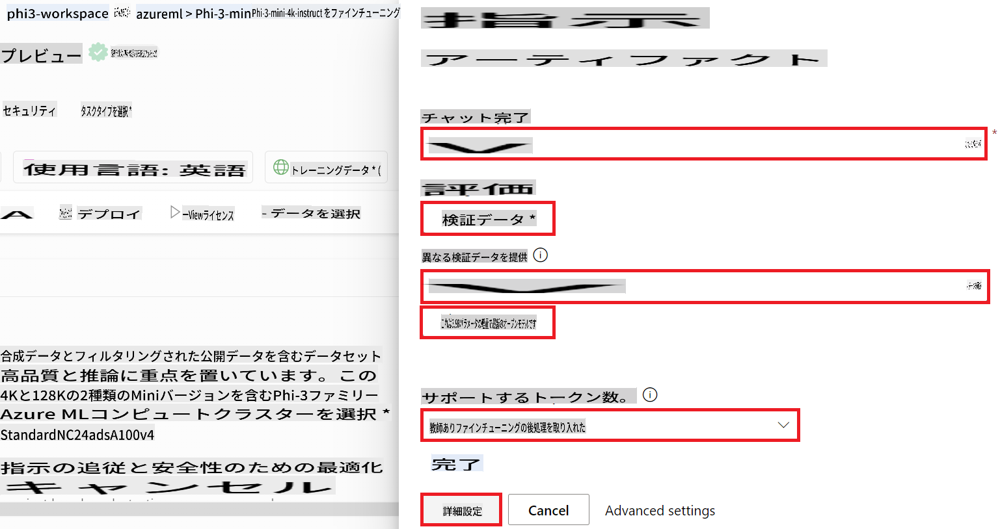

    > [!TIP]
    >
    > **Advanced settings** を選択して、**learning_rate** や **lr_scheduler_type** などの設定をカスタマイズし、特定のニーズに応じて微調整プロセスを最適化できます。

1. **Finish** を選択します。

1. この演習では、Azure Machine Learning を使用して Phi-3 モデルの微調整に成功しました。微調整プロセスにはかなりの時間がかかることに注意してください。微調整ジョブを実行した後、完了するまで待つ必要があります。Azure Machine Learning ワークスペースの左側のタブの Jobs タブに移動して、微調整ジョブのステータスを監視できます。次のシリーズでは、微調整されたモデルをデプロイし、Prompt flow と統合します。

    

### 微調整された Phi-3 モデルのデプロイ

微調整された Phi-3 モデルを Prompt flow と統合するには、モデルをデプロイしてリアルタイム推論にアクセスできるようにする必要があります。このプロセスには、モデルの登録、オンラインエンドポイントの作成、およびモデルのデプロイが含まれます。

この演習では、次のことを行います:

- 微調整されたモデルを Azure Machine Learning ワークスペースに登録します。
- オンラインエンドポイントを作成します。
- 登録された微調整 Phi-3 モデルをデプロイします。

#### 微調整されたモデルの登録

1. [Azure ML Studio](https://ml.azure.com/home?wt.mc_id=studentamb_279723) にアクセスします。

1. 作成した Azure Machine Learning ワークスペースを選択します。

    

1. 左側のタブから **Models** を選択します。
1. **+ Register** を選択します。
1. **From a job output** を選択します。

    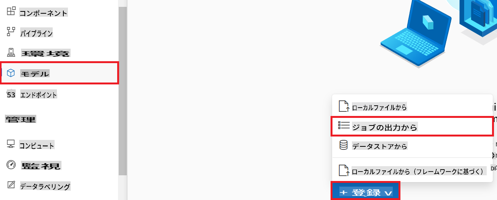

1. 作成したジョブを選択します。

    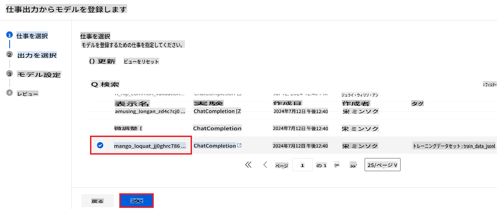

1. **Next** を選択します。

1. **Model type** を **MLflow** に設定します。

1. **Job output** が選択されていることを確認します。自動的に選択されているはずです。

    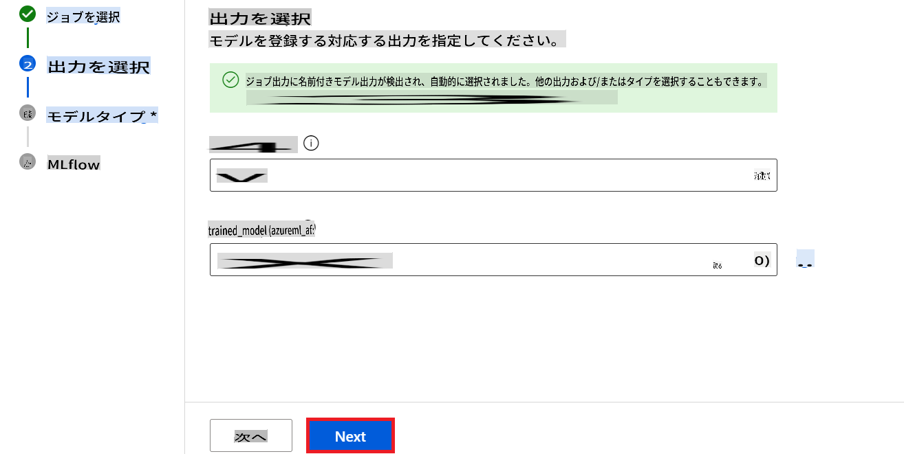

1. **Next** を選択します。

1. **Register** を選択します。

    

1. 左側のタブから **Models** メニューに移動して、登録されたモデルを表示できます。

    

#### 微調整されたモデルのデプロイ

1. 作成した Azure Machine Learning ワークスペースに移動します。

1. 左側のタブから **Endpoints** を選択します。

1. ナビゲーションメニューから **Real-time endpoints** を選択します。

    

1. **Create** を選択します。

1. 作成した登録済みモデルを選択します。

    

1. **Select** を選択します。

1. 次のタスクを実行します:

    - **Virtual machine** を *Standard_NC6s_v3* に設定します。
    - 使用する **Instance count** を選択します。例えば、*1*。
    - **Endpoint** を **New** に設定してエンドポイントを作成します。
    - **Endpoint name** を入力します。これは一意の値でなければなりません。
    - **Deployment name** を入力します。これも一意の値でなければなりません。

    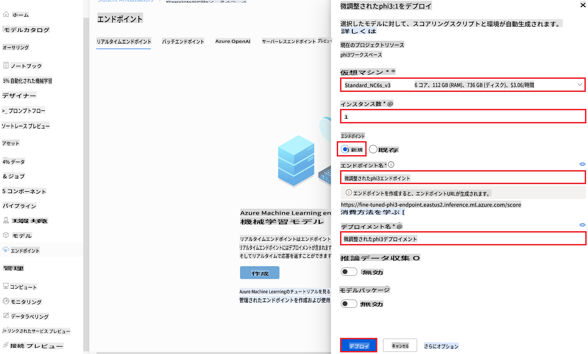

1. **Deploy** を選択します。

> [!WARNING]
> アカウントに追加料金が発生しないようにするため、Azure Machine Learning ワークスペースで作成したエンドポイントを削除することを忘れないでください。
>

#### Azure Machine Learning ワークスペースでのデプロイステータスの確認

1. 作成した Azure Machine Learning ワークスペースに移動します。

1. 左側のタブから **Endpoints** を選択します。

1. 作成したエンドポイントを選択します。

    

1. このページでは、デプロイメントプロセス中にエンドポイントを管理できます。

> [!NOTE]
> デプロイメントが完了したら、**Live traffic** が **100%** に設定されていることを確認してください。設定されていない場合は、**Update traffic** を選択してトラフィック設定を調整します。トラフィックが 0% に設定されていると、モデルをテストできないことに注意してください。
>
> 
>

## シナリオ 3: Prompt flow と統合し、Azure AI Foundry でカスタムモデルとチャット

### カスタム Phi-3 モデルを Prompt flow と統合

微調整されたモデルを正常にデプロイした後、Prompt Flow と統合してリアルタイムアプリケーションでモデルを使用できるようにし、カスタム Phi-3 モデルを使用したさまざまなインタラクティブタスクを可能にします。

この演習では、次のことを行います:

- Azure AI Foundry Hub を作成します。
- Azure AI Foundry Project を作成します。
- Prompt flow を作成します。
- 微調整された Phi-3 モデルのカスタム接続を追加します。
- カスタム Phi-3 モデルとチャットするために Prompt flow を設定します。

> [!NOTE]
> Azure ML Studio を使用して Promptflow と統合することもできます。同じ統合プロセスが Azure ML Studio にも適用されます。

#### Azure AI Foundry Hub の作成

プロジェクトを作成する前に Hub を作成する必要があります。Hub はリソースグループのように機能し、Azure AI Foundry 内で複数のプロジェクトを整理および管理できます。

1. [Azure AI Foundry](https://ai.azure.com/?WT.mc_id=aiml-137032-kinfeylo) にアクセスします。

1. 左側のタブから **All hubs** を選択します。

1. ナビゲーションメニューから **+ New hub** を選択します。

    

1. 次のタスクを実行します:

    - **Hub name** を入力します。これは一意の値でなければなりません。
    - Azure **Subscription** を選択します。
    - 使用する **Resource group** を選択します（必要に応じて新しいものを作成します）。
    - 使用したい **Location** を選択します。
    - 使用する **Connect Azure AI Services** を選択します（必要に応じて新しいものを作成します）。
    - **Connect Azure AI Search** を **Skip connecting** に設定します。

    

1. **Next** を選択します。

#### Azure AI Foundry Project の作成

1. 作成した Hub で、左側のタブから **All projects** を選択します。

1. ナビゲーションメニューから **+ New project** を選択します。

    

1. **Project name** を入力します。これは一意の値でなければなりません。

    

1. **Create a project** を選択します。

#### 微調整された Phi-3 モデルのカスタム接続を追加

カスタム Phi-3 モデルを Prompt flow と統合するには、モデルのエンドポイントとキーをカスタム接続に保存する必要があります。この設定により、Prompt flow でカスタム Phi-3 モデルにアクセスできます。

#### 微調整された Phi-3 モデルの API キーとエンドポイント URI の設定

1. [Azure ML Studio](https://ml.azure.com/home?WT.mc_id=aiml-137032-kinfeylo) にアクセスします。

1. 作成した Azure Machine Learning ワークスペースに移動します。

1. 左側のタブから **Endpoints** を選択します。

    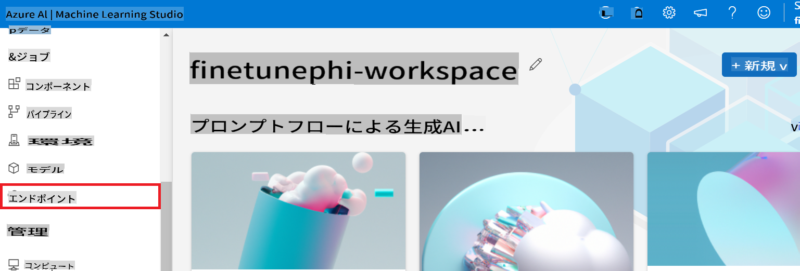

1. 作成したエンドポイントを選択します。

    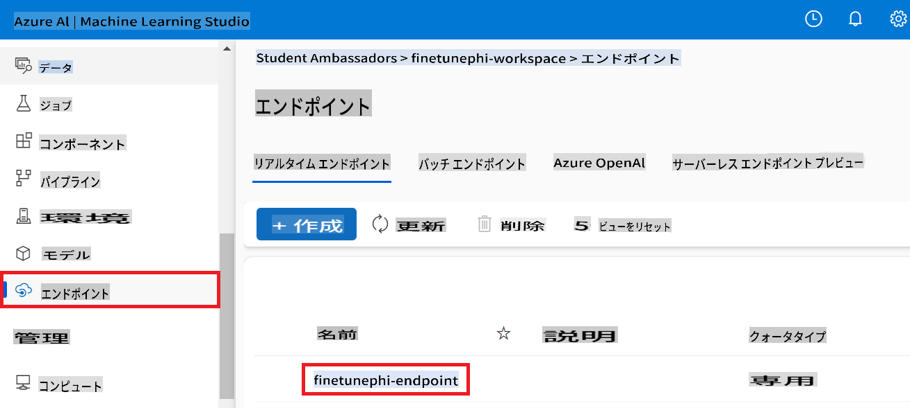

1. ナビゲーションメニューから **Consume** を選択します。

1. **REST endpoint** と **Primary key** をコピーします。
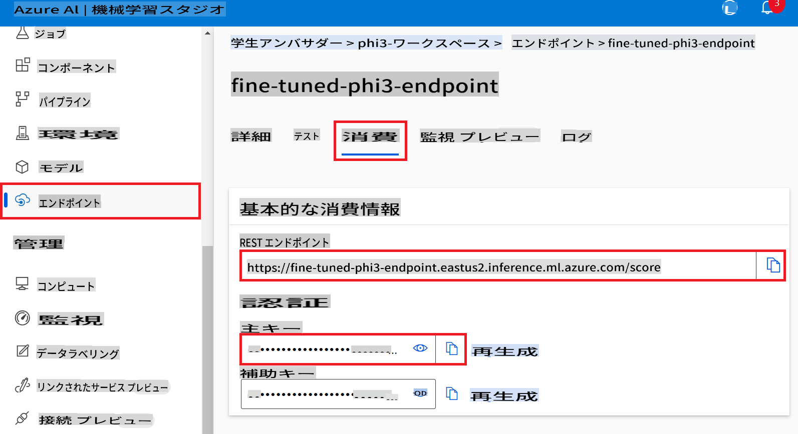

#### カスタム接続の追加

1. [Azure AI Foundry](https://ai.azure.com/?WT.mc_id=aiml-137032-kinfeylo)にアクセスします。

1. 作成したAzure AI Foundryプロジェクトに移動します。

1. 作成したプロジェクトで、左側のタブから**設定**を選択します。

1. **+ 新しい接続**を選択します。

    

1. ナビゲーションメニューから**カスタムキー**を選択します。

    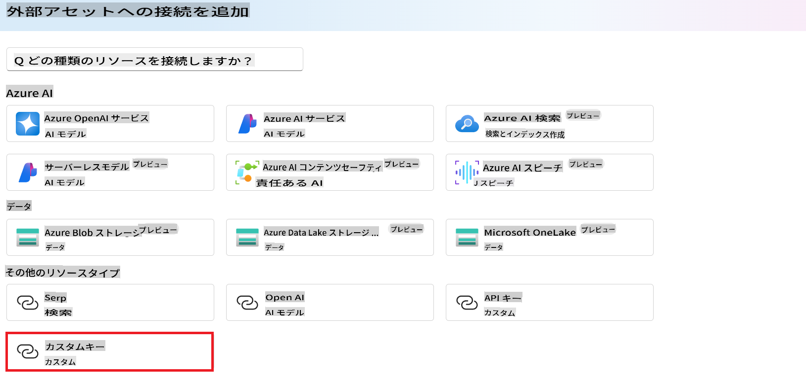

1. 次のタスクを実行します：

    - **+ キーと値のペアを追加**を選択します。
    - キー名には**endpoint**を入力し、Azure ML Studioからコピーしたエンドポイントを値フィールドに貼り付けます。
    - 再度**+ キーと値のペアを追加**を選択します。
    - キー名には**key**を入力し、Azure ML Studioからコピーしたキーを値フィールドに貼り付けます。
    - キーを追加した後、キーが公開されないように**is secret**を選択します。

    

1. **接続を追加**を選択します。

#### Prompt flowの作成

Azure AI Foundryにカスタム接続を追加しました。次に、以下の手順でPrompt flowを作成しましょう。その後、このPrompt flowをカスタム接続に接続し、調整済みモデルをPrompt flow内で使用できるようにします。

1. 作成したAzure AI Foundryプロジェクトに移動します。

1. 左側のタブから**Prompt flow**を選択します。

1. ナビゲーションメニューから**+ 作成**を選択します。

    

1. ナビゲーションメニューから**チャットフロー**を選択します。

    

1. 使用する**フォルダ名**を入力します。

    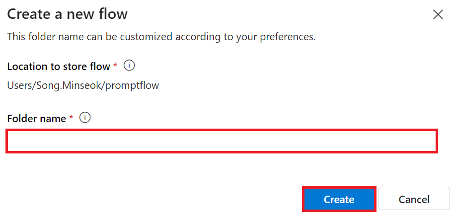

1. **作成**を選択します。

#### カスタムPhi-3モデルとチャットするためのPrompt flowの設定

調整済みのPhi-3モデルをPrompt flowに統合する必要があります。しかし、既存のPrompt flowはこの目的に設計されていないため、カスタムモデルの統合を可能にするためにPrompt flowを再設計する必要があります。

1. Prompt flowで、既存のフローを再構築するために次のタスクを実行します：

    - **生ファイルモード**を選択します。
    - *flow.dag.yml*ファイル内の既存のコードをすべて削除します。
    - 次のコードを*flow.dag.yml*ファイルに追加します。

        ```yml
        inputs:
          input_data:
            type: string
            default: "Who founded Microsoft?"

        outputs:
          answer:
            type: string
            reference: ${integrate_with_promptflow.output}

        nodes:
        - name: integrate_with_promptflow
          type: python
          source:
            type: code
            path: integrate_with_promptflow.py
          inputs:
            input_data: ${inputs.input_data}
        ```

    - **保存**を選択します。

    

1. カスタムPhi-3モデルをPrompt flowで使用するために、次のコードを*integrate_with_promptflow.py*ファイルに追加します。

    ```python
    import logging
    import requests
    from promptflow import tool
    from promptflow.connections import CustomConnection

    # Logging setup
    logging.basicConfig(
        format="%(asctime)s - %(levelname)s - %(name)s - %(message)s",
        datefmt="%Y-%m-%d %H:%M:%S",
        level=logging.DEBUG
    )
    logger = logging.getLogger(__name__)

    def query_phi3_model(input_data: str, connection: CustomConnection) -> str:
        """
        Send a request to the Phi-3 model endpoint with the given input data using Custom Connection.
        """

        # "connection" is the name of the Custom Connection, "endpoint", "key" are the keys in the Custom Connection
        endpoint_url = connection.endpoint
        api_key = connection.key

        headers = {
            "Content-Type": "application/json",
            "Authorization": f"Bearer {api_key}"
        }
        data = {
            "input_data": {
                "input_string": [
                    {"role": "user", "content": input_data}
                ],
                "parameters": {
                    "temperature": 0.7,
                    "max_new_tokens": 128
                }
            }
        }
        try:
            response = requests.post(endpoint_url, json=data, headers=headers)
            response.raise_for_status()
            
            # Log the full JSON response
            logger.debug(f"Full JSON response: {response.json()}")

            result = response.json()["output"]
            logger.info("Successfully received response from Azure ML Endpoint.")
            return result
        except requests.exceptions.RequestException as e:
            logger.error(f"Error querying Azure ML Endpoint: {e}")
            raise

    @tool
    def my_python_tool(input_data: str, connection: CustomConnection) -> str:
        """
        Tool function to process input data and query the Phi-3 model.
        """
        return query_phi3_model(input_data, connection)

    ```

    

> [!NOTE]
> Azure AI FoundryでPrompt flowを使用する方法の詳細については、[Prompt flow in Azure AI Foundry](https://learn.microsoft.com/azure/ai-studio/how-to/prompt-flow)を参照してください。

1. **チャット入力**、**チャット出力**を選択して、モデルとのチャットを有効にします。

    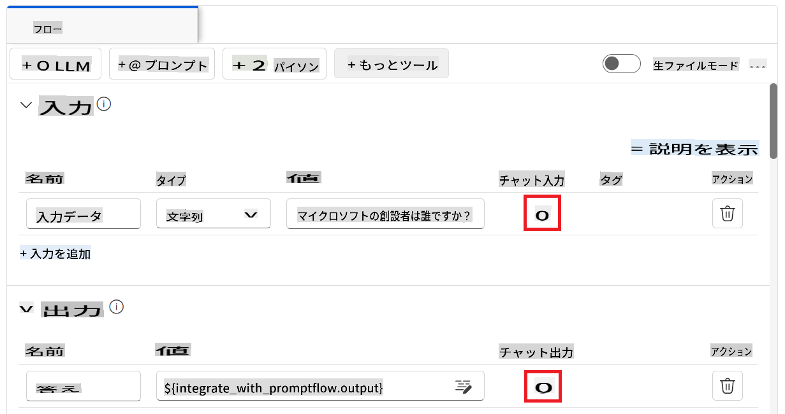

1. これで、カスタムPhi-3モデルとのチャットの準備が整いました。次の演習では、Prompt flowを開始し、調整済みのPhi-3モデルとチャットする方法を学びます。

> [!NOTE]
>
> 再構築されたフローは、以下の画像のようになります：
>
> 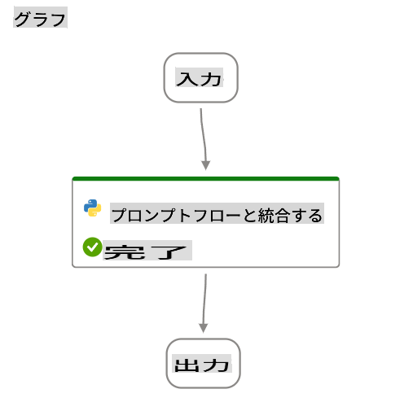
>

### カスタムPhi-3モデルとのチャット

カスタムPhi-3モデルを調整し、Prompt flowに統合したので、いよいよそれとの対話を開始する準備が整いました。この演習では、Prompt flowを使用してモデルとのチャットを設定し、開始する手順を案内します。これらの手順に従うことで、調整済みのPhi-3モデルの機能をさまざまなタスクや会話に最大限に活用できるようになります。

- Prompt flowを使用してカスタムPhi-3モデルとチャットします。

#### Prompt flowの開始

1. **コンピュートセッションの開始**を選択して、Prompt flowを開始します。

    

1. **入力の検証と解析**を選択して、パラメータを更新します。

    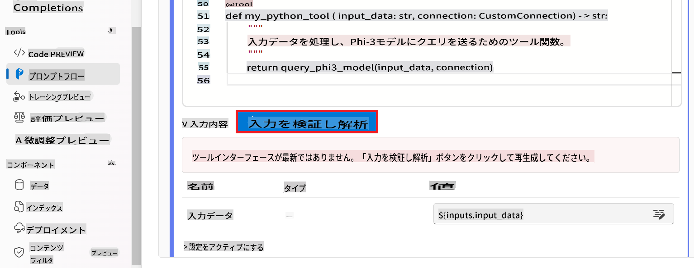

1. 作成したカスタム接続の**接続**の**値**を選択します。例えば、*connection*。

    

#### カスタムモデルとのチャット

1. **チャット**を選択します。

    

1. ここに結果の例があります：これでカスタムPhi-3モデルとチャットできます。調整に使用したデータに基づいて質問することをお勧めします。

    

**免責事項**:
この文書は、機械ベースのAI翻訳サービスを使用して翻訳されています。正確さを期すよう努めておりますが、自動翻訳には誤りや不正確さが含まれる場合がありますのでご注意ください。元の言語で書かれた原文を権威ある情報源とみなしてください。重要な情報については、専門の人間による翻訳をお勧めします。この翻訳の使用に起因する誤解や誤解について、当社は一切の責任を負いません。