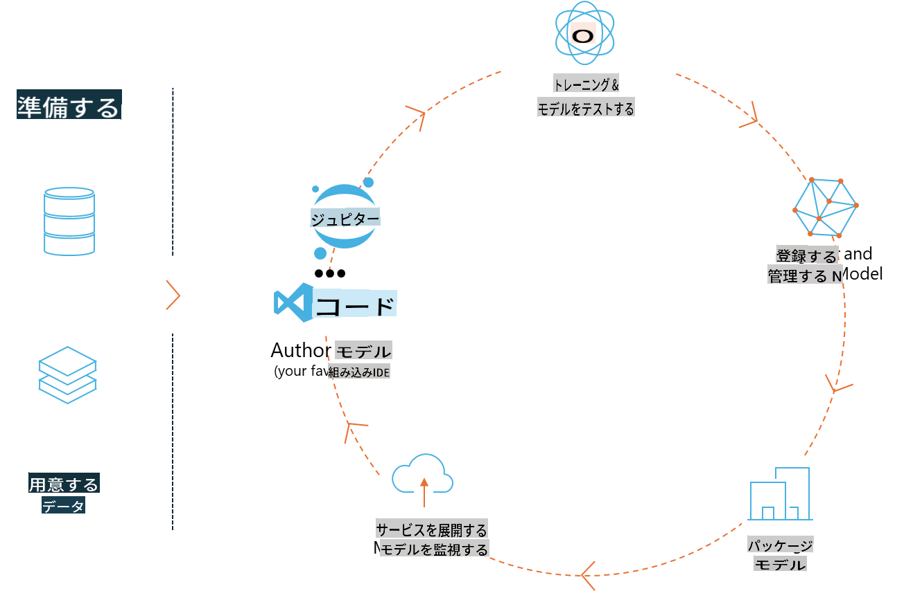

# MLflow

[MLflow](https://mlflow.org/) は、機械学習のライフサイクル全体を管理するために設計されたオープンソースプラットフォームです。



MLFlowは、実験、再現性、デプロイメント、中央モデルレジストリを含むMLライフサイクルを管理するために使用されます。現在、MLFlowは以下の4つのコンポーネントを提供しています。

- **MLflow Tracking:** 実験、コード、データ設定、結果を記録およびクエリします。
- **MLflow Projects:** データサイエンスコードを任意のプラットフォームで再現可能な形式でパッケージ化します。
- **Mlflow Models:** 様々なサービング環境に機械学習モデルをデプロイします。
- **Model Registry:** モデルを中央リポジトリに保存、注釈、管理します。

これには、実験の追跡、再現可能な実行へのコードのパッケージ化、モデルの共有およびデプロイの機能が含まれます。MLFlowはDatabricksに統合されており、様々なMLライブラリをサポートしているため、ライブラリに依存しません。REST APIとCLIを提供しているため、任意の機械学習ライブラリおよびプログラミング言語で使用できます。


MLFlowの主な機能は以下の通りです：

- **実験追跡:** パラメータと結果を記録および比較します。
- **モデル管理:** モデルを様々なサービングおよび推論プラットフォームにデプロイします。
- **モデルレジストリ:** MLflowモデルのライフサイクルを共同で管理し、バージョン管理および注釈を行います。
- **プロジェクト:** 共有または本番使用のためにMLコードをパッケージ化します。

MLFlowは、データの準備、モデルの登録と管理、実行のためのモデルのパッケージ化、サービスのデプロイ、モデルの監視を含むMLOpsループもサポートしています。特にクラウドやエッジ環境で、プロトタイプから本番ワークフローへの移行プロセスを簡素化することを目的としています。

## E2Eシナリオ - ラッパーを構築し、Phi-3をMLFlowモデルとして使用する

このE2Eサンプルでは、Phi-3小型言語モデル（SLM）をラッパーで囲み、それをローカルまたはクラウド（例えばAzure Machine Learningワークスペース）でMLFlowモデルとして実行する2つの異なるアプローチを示します。


| プロジェクト | 説明 | 場所 |
| ------------ | ----------- | -------- |
| Transformer Pipeline | Transformer Pipelineは、HuggingFaceモデルをMLFlowの実験的なトランスフォーマーフレーバーで使用する場合に、ラッパーを構築する最も簡単なオプションです。 | [**TransformerPipeline.ipynb**](../../../../code/06.E2E/E2E_Phi-3-MLflow_TransformerPipeline.ipynb) |
| Custom Python Wrapper | 記述時点では、トランスフォーマーパイプラインはONNX形式のHuggingFaceモデルのためのMLFlowラッパー生成をサポートしていませんでした。このような場合には、MLFlowモードのためのカスタムPythonラッパーを構築できます。 | [**CustomPythonWrapper.ipynb**](../../../../code/06.E2E/E2E_Phi-3-MLflow_CustomPythonWrapper.ipynb) |

## プロジェクト: Transformer Pipeline

1. MLFlowとHuggingFaceの関連Pythonパッケージが必要です：

    ``` Python
    import mlflow
    import transformers
    ```

2. 次に、HuggingFaceレジストリ内のターゲットPhi-3モデルを参照してトランスフォーマーパイプラインを開始します。_Phi-3-mini-4k-instruct_のモデルカードからわかるように、そのタスクは「テキスト生成」タイプです：

    ``` Python
    pipeline = transformers.pipeline(
        task = "text-generation",
        model = "microsoft/Phi-3-mini-4k-instruct"
    )
    ```

3. Phi-3モデルのトランスフォーマーパイプラインをMLFlow形式で保存し、ターゲットアーティファクトパス、特定のモデル設定、推論APIタイプなどの追加詳細を提供します：

    ``` Python
    model_info = mlflow.transformers.log_model(
        transformers_model = pipeline,
        artifact_path = "phi3-mlflow-model",
        model_config = model_config,
        task = "llm/v1/chat"
    )
    ```

## プロジェクト: カスタムPythonラッパー

1. ここでは、ONNXモデルの推論とトークンのエンコード/デコードのためにMicrosoftの[ONNX Runtime generate() API](https://github.com/microsoft/onnxruntime-genai)を利用します。以下の例ではCPUをターゲットにした_onnxruntime_genai_パッケージを選択します：

    ``` Python
    import mlflow
    from mlflow.models import infer_signature
    import onnxruntime_genai as og
    ```

1. 私たちのカスタムクラスは2つのメソッドを実装します：Phi-3 Mini 4K Instructの**ONNXモデル**、**生成パラメータ**、**トークナイザー**を初期化する_load_context()_と、提供されたプロンプトに対して出力トークンを生成する_predict()_です：

    ``` Python
    class Phi3Model(mlflow.pyfunc.PythonModel):
        def load_context(self, context):
            # アーティファクトからモデルを取得
            model_path = context.artifacts["phi3-mini-onnx"]
            model_options = {
                 "max_length": 300,
                 "temperature": 0.2,         
            }
        
            # モデルの定義
            self.phi3_model = og.Model(model_path)
            self.params = og.GeneratorParams(self.phi3_model)
            self.params.set_search_options(**model_options)
            
            # トークナイザーの定義
            self.tokenizer = og.Tokenizer(self.phi3_model)
    
        def predict(self, context, model_input):
            # 入力からプロンプトを取得
            prompt = model_input["prompt"][0]
            self.params.input_ids = self.tokenizer.encode(prompt)
    
            # モデルの応答を生成
            response = self.phi3_model.generate(self.params)
    
            return self.tokenizer.decode(response[0][len(self.params.input_ids):])
    ```

1. _mlflow.pyfunc.log_model()_ 関数を使用して、Phi-3モデルのためのカスタムPythonラッパー（ピクル形式）を生成し、元のONNXモデルおよび必要な依存関係を含めます：

    ``` Python
    model_info = mlflow.pyfunc.log_model(
        artifact_path = artifact_path,
        python_model = Phi3Model(),
        artifacts = {
            "phi3-mini-onnx": "cpu_and_mobile/cpu-int4-rtn-block-32-acc-level-4",
        },
        input_example = input_example,
        signature = infer_signature(input_example, ["Run"]),
        extra_pip_requirements = ["torch", "onnxruntime_genai", "numpy"],
    )
    ```

## 生成されたMLFlowモデルのシグネチャ

1. 上記のTransformer Pipelineプロジェクトのステップ3で、MLFlowモデルのタスクを「_llm/v1/chat_」に設定しました。この指示により、以下のようにOpenAIのChat APIと互換性のあるモデルのAPIラッパーが生成されます：

    ``` Python
    {inputs: 
      ['messages': Array({content: string (required), name: string (optional), role: string (required)}) (required), 'temperature': double (optional), 'max_tokens': long (optional), 'stop': Array(string) (optional), 'n': long (optional), 'stream': boolean (optional)],
    outputs: 
      ['id': string (required), 'object': string (required), 'created': long (required), 'model': string (required), 'choices': Array({finish_reason: string (required), index: long (required), message: {content: string (required), name: string (optional), role: string (required)} (required)}) (required), 'usage': {completion_tokens: long (required), prompt_tokens: long (required), total_tokens: long (required)} (required)],
    params: 
      None}
    ```

1. その結果、以下の形式でプロンプトを送信できます：

    ``` Python
    messages = [{"role": "user", "content": "スペインの首都はどこですか？"}]
    ```

1. その後、OpenAI API互換の後処理を使用して、例えば_response[0][‘choices’][0][‘message’][‘content’]_などで出力を美しく整え、以下のようにします：

    ``` JSON
    質問: スペインの首都はどこですか？
    
    答え: スペインの首都はマドリードです。スペインで最大の都市であり、政治、経済、文化の中心地です。マドリードはイベリア半島の中央に位置し、王宮、プラド美術館、プラザ・マヨールなどの豊かな歴史、芸術、建築で知られています。
    
    使用量: {'prompt_tokens': 11, 'completion_tokens': 73, 'total_tokens': 84}
    ```

1. 上記のカスタムPythonラッパープロジェクトのステップ3では、MLFlowパッケージに入力例からモデルのシグネチャを生成させます。私たちのMLFlowラッパーのシグネチャは次のようになります：

    ``` Python
    {inputs: 
      ['prompt': string (required)],
    outputs: 
      [string (required)],
    params: 
      None}
    ```

1. したがって、プロンプトには次のように「prompt」辞書キーを含める必要があります：

    ``` Python
    {"prompt": "<|system|>あなたはスタンドアップコメディアンです。<|end|><|user|>原子に関するジョークを教えてください<|end|><|assistant|>",}
    ```

1. モデルの出力は文字列形式で提供されます：

    ``` JSON
    よし、原子に関するジョークを一つどうぞ！
    
    なぜ電子はプロトンと鬼ごっこをしないのか？
    
    だって、いつも電子を「共有」しているから見つけるのが難しいんだよ！
    
    これは全部冗談で、原子レベルのユーモアを楽しんでいるだけだからね！
    ```

