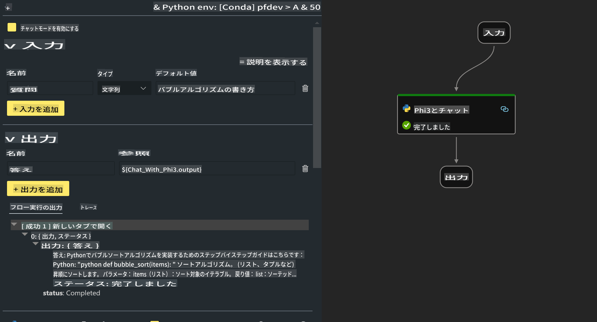

# **Lab 2 - AIPCでPhi-3-miniを使ってPrompt flowを実行する**

## **Prompt flowとは**

Prompt flowは、LLMベースのAIアプリケーションの開発サイクルを効率化するための開発ツール群です。アイデア出しからプロトタイピング、テスト、評価、そして本番展開と監視までをサポートします。Prompt flowを使えば、プロンプトエンジニアリングが非常に簡単になり、プロダクション品質のLLMアプリを構築することができます。

Prompt flowを使用すると、以下のことが可能になります：

- LLM、プロンプト、Pythonコード、およびその他のツールをリンクさせ、実行可能なワークフローを作成します。

- 特にLLMとのやり取りを簡単にデバッグし、フローを繰り返し改善します。

- 大規模なデータセットを使ってフローを評価し、品質とパフォーマンスの指標を計算します。

- フローの品質を確保するために、テストと評価をCI/CDシステムに統合します。

- 選択した提供プラットフォームにフローをデプロイするか、アプリのコードベースに簡単に統合します。

- （オプションですが強く推奨）Azure AIのクラウド版Prompt flowを活用してチームと協力します。

## **AIPCとは**

AI PCは、CPU、GPU、およびNPUを備え、それぞれが特定のAIアクセラレーション機能を持っています。NPU（ニューラルプロセッシングユニット）は、クラウドにデータを送信せずにPC上でAIおよび機械学習（ML）タスクを処理するための専門的なアクセラレータです。GPUやCPUもこれらのワークロードを処理できますが、NPUは低消費電力のAI計算に特に優れています。AI PCは、コンピュータの動作方法において根本的な変化をもたらします。これは以前には存在しなかった問題の解決策ではなく、日常的なPCの使用に大きな改善をもたらすことを約束します。

では、どのように機能するのでしょうか？大量の公開データを使って訓練された生成AIや大規模なLLMとは異なり、PC上で実行されるAIはほぼすべてのレベルでよりアクセスしやすくなります。概念が理解しやすく、クラウドにアクセスする必要がないため、より広範な人々にとって即座に魅力的な利点があります。

近い将来、AI PCの世界では、個人アシスタントや小規模なAIモデルがPC上で直接実行され、あなたのデータを使用して、日常的に行うことに対して個人用でプライベートかつ安全なAI強化を提供します。例えば、会議の議事録を取る、ファンタジーフットボールリーグを整理する、写真やビデオ編集の自動強化、家族の再会のための完璧な旅程を皆の到着と出発の時間に基づいて計画するなどです。

## **AIPCでの生成コードフローの構築**

***Note***：環境インストールを完了していない場合は、[Lab 0 - Installations](./01.Installations.md)を参照してください。

1. Visual Studio CodeでPrompt flow Extensionを開き、空のフロープロジェクトを作成します。


2. 入力と出力のパラメータを追加し、新しいフローとしてPythonコードを追加します。



この構造（flow.dag.yaml）を参照してフローを構築することができます。

```yaml

inputs:
  question:
    type: string
    default: how to write Bubble Algorithm
outputs:
  answer:
    type: string
    reference: ${Chat_With_Phi3.output}
nodes:
- name: Chat_With_Phi3
  type: python
  source:
    type: code
    path: Chat_With_Phi3.py
  inputs:
    question: ${inputs.question}


```

3. ***Chat_With_Phi3.py***にコードを追加します。

```python


from promptflow.core import tool

# import torch
from transformers import AutoTokenizer, pipeline,TextStreamer
import intel_npu_acceleration_library as npu_lib

import warnings

import asyncio
import platform

class Phi3CodeAgent:
    
    model = None
    tokenizer = None
    text_streamer = None
    
    model_id = "microsoft/Phi-3-mini-4k-instruct"

    @staticmethod
    def init_phi3():
        
        if Phi3CodeAgent.model is None or Phi3CodeAgent.tokenizer is None or Phi3CodeAgent.text_streamer is None:
            Phi3CodeAgent.model = npu_lib.NPUModelForCausalLM.from_pretrained(
                                    Phi3CodeAgent.model_id,
                                    torch_dtype="auto",
                                    dtype=npu_lib.int4,
                                    trust_remote_code=True
                                )
            Phi3CodeAgent.tokenizer = AutoTokenizer.from_pretrained(Phi3CodeAgent.model_id)
            Phi3CodeAgent.text_streamer = TextStreamer(Phi3CodeAgent.tokenizer, skip_prompt=True)

    

    @staticmethod
    def chat_with_phi3(prompt):
        
        Phi3CodeAgent.init_phi3()

        messages = "<|system|>You are a AI Python coding assistant. Please help me to generate code in Python.The answer only genertated Python code, but any comments and instructions do not need to be generated<|end|><|user|>" + prompt +"<|end|><|assistant|>"


        generation_args = {
            "max_new_tokens": 1024,
            "return_full_text": False,
            "temperature": 0.3,
            "do_sample": False,
            "streamer": Phi3CodeAgent.text_streamer,
        }

        pipe = pipeline(
            "text-generation",
            model=Phi3CodeAgent.model,
            tokenizer=Phi3CodeAgent.tokenizer,
            # **generation_args
        )

        result = ''

        with warnings.catch_warnings():
            warnings.simplefilter("ignore")
            response = pipe(messages, **generation_args)
            result =response[0]['generated_text']
            return result


@tool
def my_python_tool(question: str) -> str:
    if platform.system() == 'Windows':
        asyncio.set_event_loop_policy(asyncio.WindowsSelectorEventLoopPolicy())
    return Phi3CodeAgent.chat_with_phi3(question)


```

4. デバッグまたは実行からフローをテストし、生成コードが正しいかどうかを確認できます。


5. ターミナルで開発APIとしてフローを実行します。

```

pf flow serve --source ./ --port 8080 --host localhost   

```

Postman / Thunder Clientでテストできます。

### **注意点**

1. 初回の実行には時間がかかります。Hugging face CLIからphi-3モデルをダウンロードすることをお勧めします。

2. Intel NPUの計算能力が限られているため、Phi-3-mini-4k-instructを使用することをお勧めします。

3. Intel NPUアクセラレーションを使用してINT4変換を量子化しますが、サービスを再実行する場合は、キャッシュとnc_workshopフォルダーを削除する必要があります。

## **リソース**

1. Promptflowについて学ぶ [https://microsoft.github.io/promptflow/](https://microsoft.github.io/promptflow/)

2. Intel NPU Accelerationについて学ぶ [https://github.com/intel/intel-npu-acceleration-library](https://github.com/intel/intel-npu-acceleration-library)

3. サンプルコードをダウンロードする [Local NPU Agent Sample Code](../../../../../../../code/07.Lab/01/AIPC/local-npu-agent)

**免責事項**:
この文書は、機械ベースのAI翻訳サービスを使用して翻訳されています。正確さを期しておりますが、自動翻訳には誤りや不正確さが含まれる可能性があります。原文の言語で書かれたオリジナル文書を権威ある情報源と見なすべきです。重要な情報については、専門の人間による翻訳をお勧めします。この翻訳の使用に起因する誤解や誤訳については、一切の責任を負いかねます。