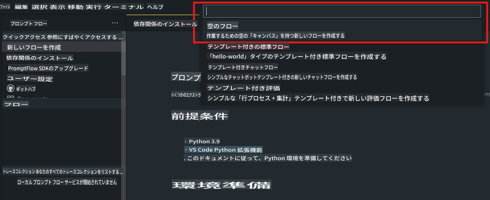

# **Lab 2 - AIPCでPhi-3-miniを使ったプロンプトフローの実行**

## **プロンプトフローとは**

プロンプトフローは、LLMベースのAIアプリケーションのアイデア出し、プロトタイピング、テスト、評価から本番環境へのデプロイおよび監視まで、エンドツーエンドの開発サイクルを簡素化するための開発ツール群です。プロンプトエンジニアリングを容易にし、プロダクション品質のLLMアプリを構築することができます。

プロンプトフローを使用すると、以下のことが可能になります：

- LLM、プロンプト、Pythonコード、その他のツールをリンクするフローを作成し、実行可能なワークフローにする。

- 特にLLMとのインタラクションを簡単にデバッグし、フローを繰り返し改善する。

- フローを評価し、大規模なデータセットで品質とパフォーマンスのメトリクスを計算する。

- フローの品質を確保するために、テストと評価をCI/CDシステムに統合する。

- 選択したサービングプラットフォームにフローをデプロイするか、アプリのコードベースに簡単に統合する。

- （オプションですが強く推奨）Azure AIのクラウドバージョンのPrompt flowを活用してチームと協力する。


## **Apple Siliconでの生成コードフローの構築**

***Note*** ：環境インストールが完了していない場合は、[Lab 0 -Installations](./01.Installations.md)をご覧ください。

1. Visual Studio CodeでPrompt flow Extensionを開き、空のフロープロジェクトを作成します。



2. 入力と出力のパラメータを追加し、新しいフローとしてPythonコードを追加します。


この構造（flow.dag.yaml）を参照してフローを構築できます。

```yaml

inputs:
  prompt:
    type: string
    default: Write python code for Fibonacci serie. Please use markdown as output
outputs:
  result:
    type: string
    reference: ${gen_code_by_phi3.output}
nodes:
- name: gen_code_by_phi3
  type: python
  source:
    type: code
    path: gen_code_by_phi3.py
  inputs:
    prompt: ${inputs.prompt}


```

3. phi-3-miniを量子化する

ローカルデバイスでSLMをより良く実行するために、一般的にモデルを量子化します（INT4, FP16, FP32）。

```bash

python -m mlx_lm.convert --hf-path microsoft/Phi-3-mini-4k-instruct

```

**Note:** デフォルトフォルダはmlx_modelです。

4. ***Chat_With_Phi3.py*** にコードを追加します。

```python


from promptflow import tool

from mlx_lm import load, generate


# The inputs section will change based on the arguments of the tool function, after you save the code
# Adding type to arguments and return value will help the system show the types properly
# Please update the function name/signature per need
@tool
def my_python_tool(prompt: str) -> str:

    model_id = './mlx_model_phi3_mini'

    model, tokenizer = load(model_id)

    # <|user|>\nWrite python code for Fibonacci serie. Please use markdown as output<|end|>\n<|assistant|>

    response = generate(model, tokenizer, prompt="<|user|>\n" + prompt  + "<|end|>\n<|assistant|>", max_tokens=2048, verbose=True)

    return response


```

4. デバッグまたは実行からフローをテストして、生成コードが正しいか確認できます。


5. ターミナルで開発APIとしてフローを実行します。

```

pf flow serve --source ./ --port 8080 --host localhost   

```

Postman / Thunder Clientでテストできます。


### **注意点**

1. 最初の実行には時間がかかります。Hugging face CLIからphi-3モデルをダウンロードすることをお勧めします。

2. Intel NPUの計算能力が限られているため、Phi-3-mini-4k-instructの使用をお勧めします。

3. INT4変換のためにIntel NPUアクセラレーションを使用しますが、サービスを再実行する場合はキャッシュとnc_workshopフォルダを削除する必要があります。


## **リソース**

1. Promptflowの学習 [https://microsoft.github.io/promptflow/](https://microsoft.github.io/promptflow/)

2. Intel NPU Accelerationの学習 [https://github.com/intel/intel-npu-acceleration-library](https://github.com/intel/intel-npu-acceleration-library)

3. サンプルコードのダウンロード [Local NPU Agent Sample Code](../../../../../../../code/07.Lab/01/AIPC/local-npu-agent)

**免責事項**:
この文書は機械翻訳サービスを使用して翻訳されています。正確性を期すために努めていますが、自動翻訳にはエラーや不正確さが含まれる場合がありますのでご注意ください。原文が信頼できる情報源として考慮されるべきです。重要な情報については、専門の人間による翻訳をお勧めします。この翻訳の使用によって生じた誤解や誤訳について、当社は一切の責任を負いかねます。