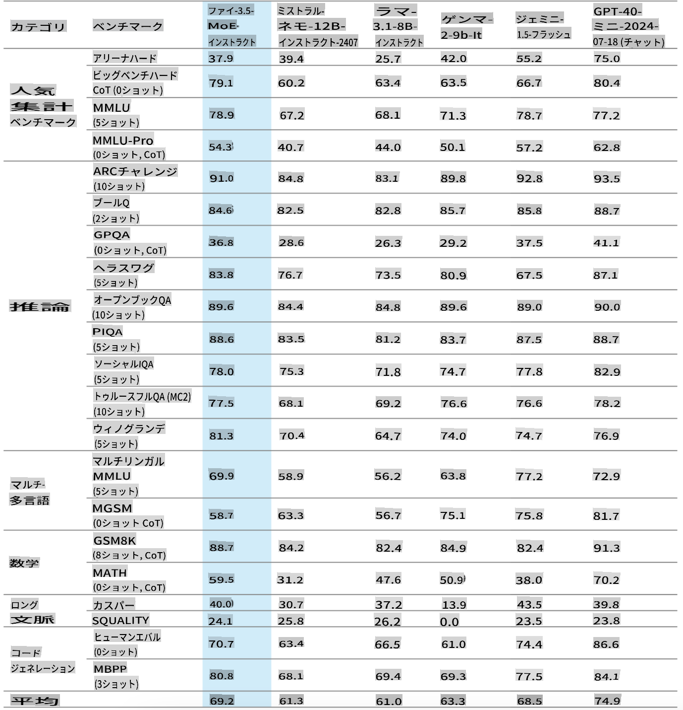
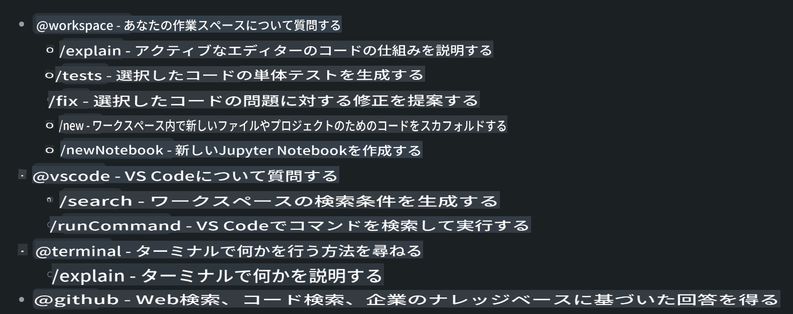
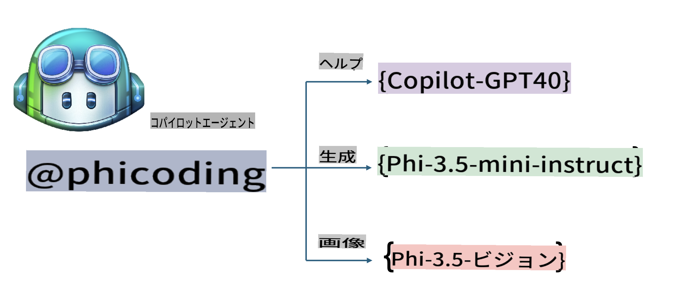
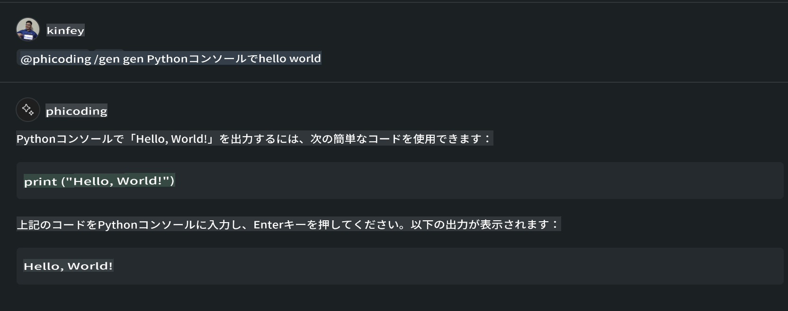
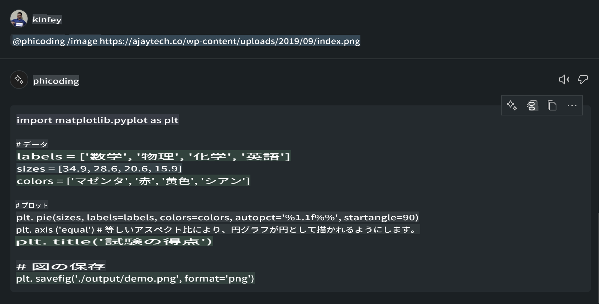

# **Phi-3.5を使って自分のVisual Studio Code Chat Copilotエージェントを作成しよう**

Visual Studio Code Copilotを使用していますか？特にChatでは、さまざまなエージェントを使って、Visual Studio Codeでのプロジェクト作成、執筆、保守の能力を向上させることができます。Visual Studio Codeは、企業や個人が自分のビジネスに基づいたエージェントを作成し、さまざまな専有分野での機能を拡張するためのAPIを提供しています。この記事では、GitHub Modelsの**Phi-3.5-mini-instruct (128k)**と**Phi-3.5-vision-instruct (128k)**を使って、自分のVisual Studio Codeエージェントを作成する方法に焦点を当てます。

## **GitHub ModelsのPhi-3.5について**

Phi-3/3.5ファミリーのPhi-3/3.5-mini-instructは、強力なコード理解および生成能力を持ち、Gemma-2-9bやMistral-Nemo-12B-instruct-2407に比べて優れた性能を発揮します。



最新のGitHub Modelsでは、Phi-3.5-mini-instruct (128k)とPhi-3.5-vision-instruct (128k)モデルへのアクセスがすでに提供されています。開発者はOpenAI SDK、Azure AI Inference SDK、およびREST APIを通じてこれらにアクセスできます。


***Note: *** ここではAzure AI Inference SDKの使用をお勧めします。これは、Azure Model Catalogとの切り替えが生産環境でよりスムーズに行えるためです。

以下は、GitHub Modelsと連携した**Phi-3.5-mini-instruct (128k)**および**Phi-3.5-vision-instruct (128k)**のコード生成シナリオでの結果です。次の例に備えます。

**デモ: GitHub Models Phi-3.5-mini-instruct (128k)がプロンプトからコードを生成する** ([このリンクをクリック](../../../../../code/09.UpdateSamples/Aug/ghmodel_phi35_instruct_demo.ipynb))

**デモ: GitHub Models Phi-3.5-vision-instruct (128k)が画像からコードを生成する** ([このリンクをクリック](../../../../../code/09.UpdateSamples/Aug/ghmodel_phi35_vision_demo.ipynb))

## **GitHub Copilot Chat Agentについて**

GitHub Copilot Chat Agentは、コードに基づいてさまざまなプロジェクトシナリオで異なるタスクを完了することができます。システムには4つのエージェントがあります: workspace, github, terminal, vscode



エージェント名に‘@’を追加することで、対応する作業を迅速に完了できます。企業にとって、自分のビジネス関連のコンテンツ（要件、コーディング、テスト仕様、リリースなど）を追加することで、GitHub Copilotに基づいた強力な企業向けのプライベート機能を持つことができます。

Visual Studio Code Chat Agentは公式にAPIをリリースしており、企業や企業開発者が異なるソフトウェアビジネスエコシステムに基づいたエージェントを開発することができます。Visual Studio Code Extension Developmentの開発方法に基づいて、Visual Studio Code Chat Agent APIのインターフェースに簡単にアクセスできます。このプロセスに基づいて開発を行うことができます。


開発シナリオは、サードパーティのモデルAPI（GitHub Models、Azure Model Catalog、オープンソースモデルに基づく自社サービスなど）へのアクセスをサポートし、GitHub Copilotが提供するgpt-35-turbo、gpt-4、gpt-4oモデルも使用できます。

## **Phi-3.5に基づいたエージェント@phicodingの追加**

Phi-3.5のプログラミング能力を統合して、コードの作成、画像生成コードなどのタスクを完了します。Phi-3.5を中心に構築されたエージェント@PHIを完成させます。以下はいくつかの機能です。

1. **@phicoding /help**コマンドを通じて、GitHub Copilotが提供するGPT-4oに基づいた自己紹介を生成

2. **@phicoding /gen**コマンドを通じて、**Phi-3.5-mini-instruct (128k)**に基づいた異なるプログラミング言語のコードを生成

3. **@phicoding /image**コマンドを通じて、**Phi-3.5-vision-instruct (128k)**と画像を使ったコード生成を完了



## **関連手順**

1. npmを使用してVisual Studio Code Extension開発サポートをインストール

```bash

npm install --global yo generator-code 

```
2. Visual Studio Code Extensionプラグインを作成（Typescript開発モードを使用、名前はphiext）


```bash

yo code 

```

3. 作成したプロジェクトを開き、package.jsonを修正。ここには関連する指示と設定、およびGitHub Modelsの設定が含まれています。ここでGitHub Modelsのトークンを追加する必要があります。

```json

{
  "name": "phiext",
  "displayName": "phiext",
  "description": "",
  "version": "0.0.1",
  "engines": {
    "vscode": "^1.93.0"
  },
  "categories": [
    "AI",
    "Chat"
  ],
  "activationEvents": [],
  "enabledApiProposals": [
      "chatVariableResolver"
  ],
  "main": "./dist/extension.js",
  "contributes": {
    "chatParticipants": [
        {
            "id": "chat.phicoding",
            "name": "phicoding",
            "description": "Hey! I am Microsoft Phi-3.5, She can help me with coding problems, such as generation code with your natural language, or even generation code about chart from images. Just ask me anything!",
            "isSticky": true,
            "commands": [
                {
                    "name": "help",
                    "description": "Introduce myself to you"
                },
                {
                    "name": "gen",
                    "description": "Generate code for you with Microsoft Phi-3.5-mini-instruct"
                },
                {
                    "name": "image",
                    "description": "Generate code for chart from image(png or jpg) with Microsoft Phi-3.5-vision-instruct, please add image url like this : https://ajaytech.co/wp-content/uploads/2019/09/index.png"
                }
            ]
        }
    ],
    "commands": [
        {
            "command": "phicoding.namesInEditor",
            "title": "Use Microsoft Phi 3.5 in Editor"
        }
    ],
    "configuration": {
      "type": "object",
      "title": "githubmodels",
      "properties": {
        "githubmodels.endpoint": {
          "type": "string",
          "default": "https://models.inference.ai.azure.com",
          "description": "Your GitHub Models Endpoint",
          "order": 0
        },
        "githubmodels.api_key": {
          "type": "string",
          "default": "Your GitHub Models Token",
          "description": "Your GitHub Models Token",
          "order": 1
        },
        "githubmodels.phi35instruct": {
          "type": "string",
          "default": "Phi-3.5-mini-instruct",
          "description": "Your Phi-35-Instruct Model",
          "order": 2
        },
        "githubmodels.phi35vision": {
          "type": "string",
          "default": "Phi-3.5-vision-instruct",
          "description": "Your Phi-35-Vision Model",
          "order": 3
        }
      }
    }
  },
  "scripts": {
    "vscode:prepublish": "npm run package",
    "compile": "webpack",
    "watch": "webpack --watch",
    "package": "webpack --mode production --devtool hidden-source-map",
    "compile-tests": "tsc -p . --outDir out",
    "watch-tests": "tsc -p . -w --outDir out",
    "pretest": "npm run compile-tests && npm run compile && npm run lint",
    "lint": "eslint src",
    "test": "vscode-test"
  },
  "devDependencies": {
    "@types/vscode": "^1.93.0",
    "@types/mocha": "^10.0.7",
    "@types/node": "20.x",
    "@typescript-eslint/eslint-plugin": "^8.3.0",
    "@typescript-eslint/parser": "^8.3.0",
    "eslint": "^9.9.1",
    "typescript": "^5.5.4",
    "ts-loader": "^9.5.1",
    "webpack": "^5.94.0",
    "webpack-cli": "^5.1.4",
    "@vscode/test-cli": "^0.0.10",
    "@vscode/test-electron": "^2.4.1"
  },
  "dependencies": {
    "@types/node-fetch": "^2.6.11",
    "node-fetch": "^3.3.2",
    "@azure-rest/ai-inference": "latest",
    "@azure/core-auth": "latest",
    "@azure/core-sse": "latest"
  }
}


```

4. src/extension.tsを修正


```typescript

// The module 'vscode' contains the VS Code extensibility API
// Import the module and reference it with the alias vscode in your code below
import * as vscode from 'vscode';
import ModelClient from "@azure-rest/ai-inference";
import { AzureKeyCredential } from "@azure/core-auth";


interface IPhiChatResult extends vscode.ChatResult {
    metadata: {
        command: string;
    };
}


const MODEL_SELECTOR: vscode.LanguageModelChatSelector = { vendor: 'copilot', family: 'gpt-4o' };

function isValidImageUrl(url: string): boolean {
    const regex = /^(https?:\/\/.*\.(?:png|jpg))$/i;
    return regex.test(url);
}
  

// This method is called when your extension is activated
// Your extension is activated the very first time the command is executed
export function activate(context: vscode.ExtensionContext) {

    const codinghandler: vscode.ChatRequestHandler = async (request: vscode.ChatRequest, context: vscode.ChatContext, stream: vscode.ChatResponseStream, token: vscode.CancellationToken): Promise<IPhiChatResult> => {


        const config : any = vscode.workspace.getConfiguration('githubmodels');
        const endPoint: string = config.get('endpoint');
        const apiKey: string = config.get('api_key');
        const phi35instruct: string = config.get('phi35instruct');
        const phi35vision: string = config.get('phi35vision');
        
        if (request.command === 'help') {

            const content = "Welcome to Coding assistant with Microsoft Phi-3.5"; 
            stream.progress(content);


            try {
                const [model] = await vscode.lm.selectChatModels(MODEL_SELECTOR);
                if (model) {
                    const messages = [
                        vscode.LanguageModelChatMessage.User("Please help me express this content in a humorous way: I am a programming assistant who can help you convert natural language into code and generate code based on the charts in the images. output format like this : Hey I am Phi ......")
                    ];
                    const chatResponse = await model.sendRequest(messages, {}, token);
                    for await (const fragment of chatResponse.text) {
                        stream.markdown(fragment);
                    }
                }
            } catch(err) {
                console.log(err);
            }


            return { metadata: { command: 'help' } };

        }

        
        if (request.command === 'gen') {

            const content = "Welcome to use phi-3.5 to generate code";

            stream.progress(content);

            const client = new ModelClient(endPoint, new AzureKeyCredential(apiKey));

            const response = await client.path("/chat/completions").post({
              body: {
                messages: [
                  { role:"system", content: "You are a coding assistant.Help answer all code generation questions." },
                  { role:"user", content: request.prompt }
                ],
                model: phi35instruct,
                temperature: 0.4,
                max_tokens: 1000,
                top_p: 1.
              }
            });

            stream.markdown(response.body.choices[0].message.content);

            return { metadata: { command: 'gen' } };

        }


        
        if (request.command === 'image') {


            const content = "Welcome to use phi-3.5 to generate code from image(png or jpg),image url like this:https://ajaytech.co/wp-content/uploads/2019/09/index.png";

            stream.progress(content);

            if (!isValidImageUrl(request.prompt)) {
                stream.markdown('Please provide a valid image URL');
                return { metadata: { command: 'image' } };
            }
            else
            {

                const client = new ModelClient(endPoint, new AzureKeyCredential(apiKey));
    
                const response = await client.path("/chat/completions").post({
                    body: {
                      messages: [
                        { role: "system", content: "You are a helpful assistant that describes images in details." },
                        { role: "user", content: [
                            { type: "text", text: "Please generate code according to the chart in the picture according to the following requirements\n1. Keep all information in the chart, including data and text\n2. Do not generate additional information that is not included in the chart\n3. Please extract data from the picture, do not generate it from csv\n4. Please save the regenerated chart as a chart and save it to ./output/demo.png"},
                            { type: "image_url", image_url: {url: request.prompt}
                            }
                          ]
                        }
                      ],
                      model: phi35vision,
                      temperature: 0.4,
                      max_tokens: 2048,
                      top_p: 1.
                    }
                  });
    
                
                stream.markdown(response.body.choices[0].message.content);
    
                return { metadata: { command: 'image' } };
            }


        }


        return { metadata: { command: '' } };
    };


    const phi_ext = vscode.chat.createChatParticipant("chat.phicoding", codinghandler);

    phi_ext.iconPath = new vscode.ThemeIcon('sparkle');


    phi_ext.followupProvider = {
        provideFollowups(result: IPhiChatResult, context: vscode.ChatContext, token: vscode.CancellationToken) {
            return [{
                prompt: 'Let us coding with Phi-3.5 😋😋😋😋',
                label: vscode.l10n.t('Enjoy coding with Phi-3.5'),
                command: 'help'
            } satisfies vscode.ChatFollowup];
        }
    };

    context.subscriptions.push(phi_ext);
}

// This method is called when your extension is deactivated
export function deactivate() {}


```

6. 実行

***/help***


***@phicoding /help***


***@phicoding /gen***




***@phicoding /image***




サンプルコードをダウンロードできます: [クリック](../../../../../code/09.UpdateSamples/Aug/vscode)

## **リソース**

1. GitHub Modelsにサインアップ [https://gh.io/models](https://gh.io/models)

2. Visual Studio Code Extension開発を学ぶ [https://code.visualstudio.com/api/get-started/your-first-extension](https://code.visualstudio.com/api/get-started/your-first-extension)

3. Visual Studio Code Copilot Chat APIについて学ぶ [https://code.visualstudio.com/api/extension-guides/chat](https://code.visualstudio.com/api/extension-guides/chat)

免責事項: この翻訳はAIモデルによって元の言語から翻訳されたものであり、完全ではない可能性があります。
出力を確認し、必要な修正を行ってください。