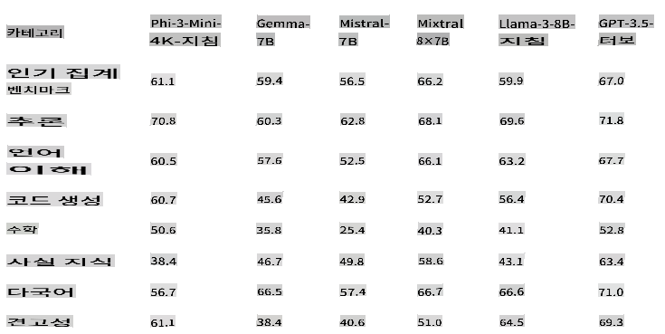
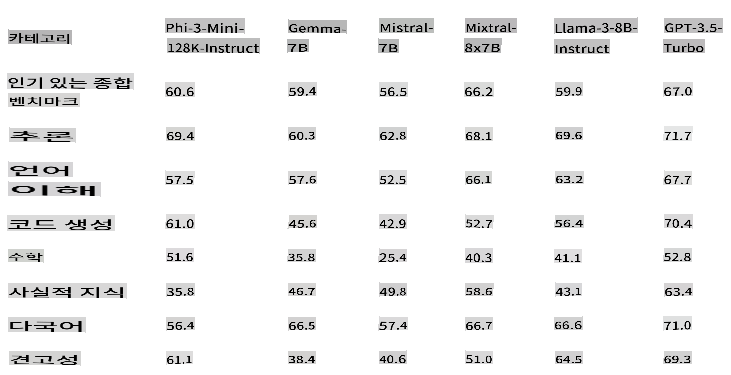
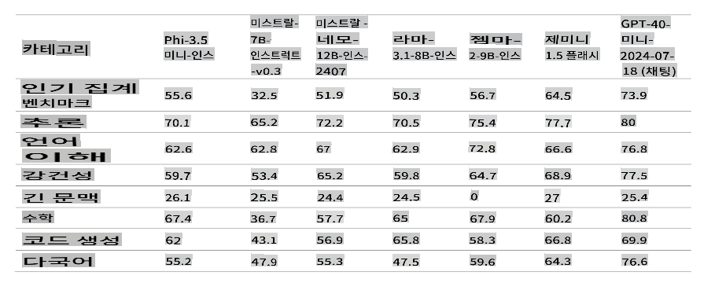
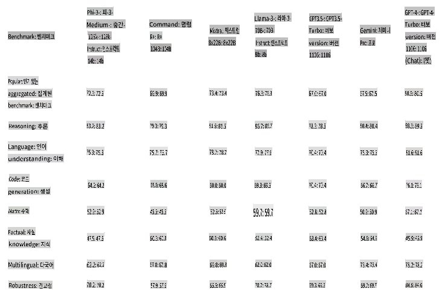
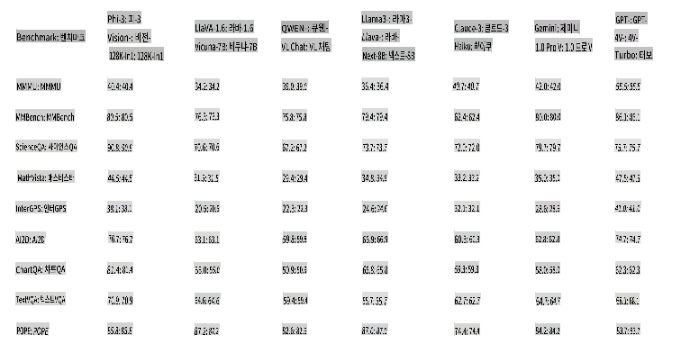
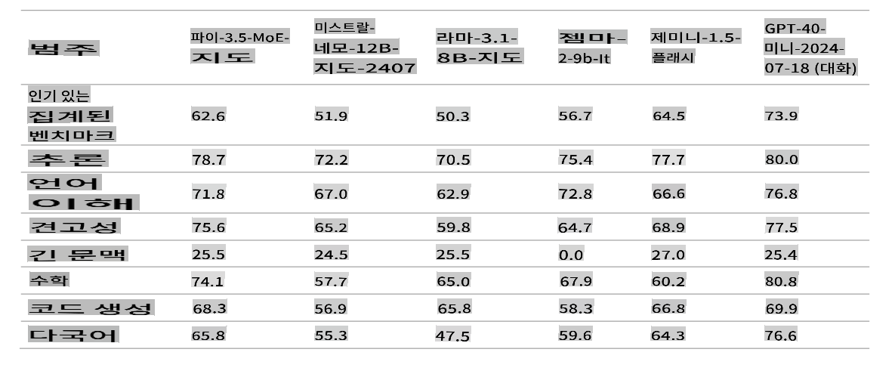

# Microsoft's Phi-3 패밀리

Phi-3 모델은 현재 이용 가능한 가장 유능하고 비용 효율적인 소형 언어 모델(SLM)로, 다양한 언어, 추론, 코딩, 수학 벤치마크에서 같은 크기와 그 다음 크기의 모델을 능가합니다. 이번 릴리스는 고객에게 더 많은 고품질 모델 선택지를 제공하여 생성 AI 애플리케이션을 작성하고 구축하는 데 있어 더 실용적인 선택지를 제공합니다.

Phi-3 패밀리에는 미니, 소형, 중형, 비전 버전이 포함되며, 각기 다른 파라미터 양을 기반으로 다양한 애플리케이션 시나리오에 맞게 훈련되었습니다. 각 모델은 Microsoft의 책임 있는 AI, 안전 및 보안 표준에 따라 개발되어 바로 사용할 수 있도록 준비되었습니다. Phi-3-mini는 두 배 크기의 모델을 능가하며, Phi-3-small 및 Phi-3-medium은 GPT-3.5T를 포함한 훨씬 더 큰 모델을 능가합니다.

## Phi-3 작업 예시

| | |
|-|-|
|작업|Phi-3|
|언어 작업|Yes|
|수학 및 추론|Yes|
|코딩|Yes|
|함수 호출|No|
|자체 오케스트레이션(어시스턴트)|No|
|전용 임베딩 모델|No|

## Phi-3-mini

Phi-3-mini, 3.8B 파라미터 언어 모델은 [Microsoft Azure AI Studio](https://ai.azure.com/explore/models?selectedCollection=phi), [Hugging Face](https://huggingface.co/collections/microsoft/phi-3-6626e15e9585a200d2d761e3), 그리고 [Ollama](https://ollama.com/library/phi3)에서 사용할 수 있습니다. 두 가지 컨텍스트 길이 [128K](https://ai.azure.com/explore/models/Phi-3-mini-128k-instruct/version/9/registry/azureml)와 [4K](https://ai.azure.com/explore/models/Phi-3-mini-4k-instruct/version/9/registry/azureml)를 제공합니다.

Phi-3-mini는 3.8억 파라미터를 가진 Transformer 기반 언어 모델입니다. 교육적으로 유용한 정보를 포함한 고품질 데이터를 사용해 훈련되었으며, 다양한 NLP 합성 텍스트와 내부 및 외부 채팅 데이터셋을 포함한 새로운 데이터 소스로 보강되었습니다. 이로 인해 채팅 기능이 크게 향상되었습니다. 또한, Phi-3-mini는 감독된 미세 조정(SFT)과 직접 선호 최적화(DPO)를 통해 사전 훈련 후 채팅 미세 조정을 거쳤습니다. 이 후 훈련을 통해 Phi-3-mini는 여러 기능, 특히 정렬, 견고성 및 안전성에서 상당한 개선을 보였습니다. 이 모델은 Phi-3 패밀리의 일부로, 4K 및 128K 두 가지 버전으로 제공되며 이는 지원할 수 있는 컨텍스트 길이(토큰)를 나타냅니다.

## Phi-3.5-mini-instruct 

[Phi-3.5 mini](https://ai.azure.com/explore/models/Phi-3.5-mini-instruct/version/1/registry/azureml)는 Phi-3에 사용된 데이터셋 - 합성 데이터와 필터링된 공개 웹사이트 -를 기반으로 구축된 가벼운 최신 오픈 모델로, 매우 고품질의 추론 밀도가 높은 데이터를 중점으로 합니다. 이 모델은 Phi-3 모델 패밀리에 속하며 128K 토큰 컨텍스트 길이를 지원합니다. 모델은 정확한 지침 준수와 견고한 안전 조치를 보장하기 위해 감독된 미세 조정, 근접 정책 최적화 및 직접 선호 최적화를 포함한 엄격한 향상 과정을 거쳤습니다.

Phi-3.5 Mini는 3.8억 파라미터를 가지며 Phi-3 Mini와 동일한 토크나이저를 사용하는 밀집 디코더 전용 Transformer 모델입니다.

전체적으로, 단 3.8억 파라미터로도 훨씬 더 큰 모델들과 유사한 수준의 다국어 언어 이해 및 추론 능력을 달성합니다. 그러나 특정 작업에서는 여전히 크기에 의해 근본적으로 제한됩니다. 모델은 너무 많은 사실적 지식을 저장할 수 있는 용량이 부족하므로 사용자는 사실적 부정확성을 경험할 수 있습니다. 그러나 이러한 약점은 특히 RAG 설정에서 모델을 사용할 때 검색 엔진을 추가하여 해결할 수 있다고 믿습니다.

### 언어 지원 

아래 표는 다국어 MMLU, MEGA, 다국어 MMLU-pro 데이터셋에서 Phi-3의 다국어 능력을 강조합니다. 전반적으로, 단 3.8억 활성 파라미터만으로도 훨씬 더 큰 활성 파라미터를 가진 다른 모델과 비교하여 다국어 작업에서 매우 경쟁력이 있음을 관찰했습니다.

## Phi-3-small

Phi-3-small, 7B 파라미터 언어 모델은 두 가지 컨텍스트 길이 [128K](https://ai.azure.com/explore/models/Phi-3-small-128k-instruct/version/2/registry/azureml)와 [8K](https://ai.azure.com/explore/models/Phi-3-small-8k-instruct/version/2/registry/azureml)로 제공되며, 다양한 언어, 추론, 코딩, 수학 벤치마크에서 GPT-3.5T를 능가합니다.

Phi-3-small은 7억 파라미터를 가진 Transformer 기반 언어 모델입니다. 교육적으로 유용한 정보를 포함한 고품질 데이터를 사용해 훈련되었으며, 다양한 NLP 합성 텍스트와 내부 및 외부 채팅 데이터셋을 포함한 새로운 데이터 소스로 보강되었습니다. 이로 인해 채팅 기능이 크게 향상되었습니다. 또한, Phi-3-small은 감독된 미세 조정(SFT)과 직접 선호 최적화(DPO)를 통해 사전 훈련 후 채팅 미세 조정을 거쳤습니다. 이 후 훈련을 통해 Phi-3-small은 여러 기능, 특히 정렬, 견고성 및 안전성에서 상당한 개선을 보였습니다. Phi-3-small은 Phi-3-Mini에 비해 다국어 데이터셋에 더 집중적으로 훈련되었습니다. 모델 패밀리는 두 가지 버전, 8K 및 128K를 제공하며 이는 지원할 수 있는 컨텍스트 길이(토큰)를 나타냅니다.

## Phi-3-medium

Phi-3-medium, 14B 파라미터 언어 모델은 두 가지 컨텍스트 길이 [128K](https://ai.azure.com/explore/models/Phi-3-medium-128k-instruct/version/2/registry/azureml)와 [4K](https://ai.azure.com/explore/models/Phi-3-medium-4k-instruct/version/2/registry/azureml)로 제공되며, Gemini 1.0 Pro를 능가하는 성능을 보입니다.

Phi-3-medium은 14억 파라미터를 가진 Transformer 기반 언어 모델입니다. 교육적으로 유용한 정보를 포함한 고품질 데이터를 사용해 훈련되었으며, 다양한 NLP 합성 텍스트와 내부 및 외부 채팅 데이터셋을 포함한 새로운 데이터 소스로 보강되었습니다. 이로 인해 채팅 기능이 크게 향상되었습니다. 또한, Phi-3-medium은 감독된 미세 조정(SFT)과 직접 선호 최적화(DPO)를 통해 사전 훈련 후 채팅 미세 조정을 거쳤습니다. 이 후 훈련을 통해 Phi-3-medium은 여러 기능, 특히 정렬, 견고성 및 안전성에서 상당한 개선을 보였습니다. 모델 패밀리는 두 가지 버전, 4K 및 128K를 제공하며 이는 지원할 수 있는 컨텍스트 길이(토큰)를 나타냅니다.

[!NOTE]
Phi-3-medium의 업그레이드로서 Phi-3.5-MoE로 전환하는 것을 권장합니다. MoE 모델은 훨씬 더 우수하고 비용 효율적인 모델입니다.

## Phi-3-vision

[Phi-3-vision](https://ai.azure.com/explore/models/Phi-3-vision-128k-instruct/version/2/registry/azureml), 4.2B 파라미터 다중 모달 모델로, 언어 및 비전 기능을 가지고 있으며, 일반 시각적 추론, OCR, 표 및 차트 이해 작업에서 Claude-3 Haiku와 Gemini 1.0 Pro V와 같은 더 큰 모델을 능가합니다.

Phi-3-vision은 Phi-3 패밀리의 첫 번째 다중 모달 모델로, 텍스트와 이미지를 결합합니다. Phi-3-vision은 실제 이미지에 대한 추론과 이미지에서 텍스트를 추출하고 추론하는 데 사용할 수 있습니다. 또한 차트 및 다이어그램 이해를 위해 최적화되어 있으며, 통찰력을 생성하고 질문에 답하는 데 사용할 수 있습니다. Phi-3-vision은 Phi-3-mini의 언어 기능을 기반으로 하여 작은 크기에도 강력한 언어 및 이미지 추론 품질을 계속 유지합니다.

## Phi-3.5-vision
[Phi-3.5 Vision](https://ai.azure.com/explore/models/Phi-3.5-vision-instruct/version/1/registry/azureml)은 매우 고품질의 텍스트 및 비전에서 추론 밀도가 높은 데이터를 중점으로 한 데이터셋 - 합성 데이터와 필터링된 공개 웹사이트 -을 기반으로 구축된 가벼운 최신 오픈 다중 모달 모델입니다. 이 모델은 Phi-3 모델 패밀리에 속하며, 다중 모달 버전은 128K 토큰 컨텍스트 길이를 지원합니다. 모델은 정확한 지침 준수와 견고한 안전 조치를 보장하기 위해 감독된 미세 조정과 직접 선호 최적화를 포함한 엄격한 향상 과정을 거쳤습니다.

Phi-3.5 Vision은 4.2억 파라미터를 가지고 있으며 이미지 인코더, 커넥터, 프로젝터, Phi-3 Mini 언어 모델을 포함합니다.

이 모델은 영어로 광범위한 상업 및 연구 사용을 위해 설계되었습니다. 모델은 시각 및 텍스트 입력 기능을 필요로 하는 일반 목적 AI 시스템 및 애플리케이션에 사용될 수 있습니다.
1) 메모리/컴퓨팅 제한 환경.
2) 지연 시간 제한 시나리오.
3) 일반 이미지 이해.
4) OCR.
5) 차트 및 표 이해.
6) 다중 이미지 비교.
7) 다중 이미지 또는 비디오 클립 요약.

Phi-3.5-vision 모델은 효율적인 언어 및 다중 모달 모델에 대한 연구를 가속화하고 생성 AI 기능의 구성 요소로 사용되도록 설계되었습니다.

## Phi-3.5-MoE

[Phi-3.5 MoE](https://ai.azure.com/explore/models/Phi-3.5-MoE-instruct/version/1/registry/azureml)는 Phi-3에 사용된 데이터셋 - 합성 데이터와 필터링된 공개 문서 -을 기반으로 구축된 가벼운 최신 오픈 모델로, 매우 고품질의 추론 밀도가 높은 데이터를 중점으로 합니다. 이 모델은 다국어를 지원하며 128K 토큰 컨텍스트 길이를 지원합니다. 모델은 정확한 지침 준수와 견고한 안전 조치를 보장하기 위해 감독된 미세 조정, 근접 정책 최적화 및 직접 선호 최적화를 포함한 엄격한 향상 과정을 거쳤습니다.

Phi-3 MoE는 16x3.8억 파라미터를 가지며 2명의 전문가를 사용할 때 6.6억 활성 파라미터를 가집니다. 모델은 32,064의 어휘 크기를 가진 토크나이저를 사용하는 전문가 혼합 디코더 전용 Transformer 모델입니다.

이 모델은 영어로 광범위한 상업 및 연구 사용을 위해 설계되었습니다. 모델은 일반 목적 AI 시스템 및 애플리케이션에 사용될 수 있습니다.
1) 메모리/컴퓨팅 제한 환경.
2) 지연 시간 제한 시나리오.
3) 강력한 추론(특히 수학 및 논리).

MoE 모델은 생성 AI 기능의 구성 요소로 사용하기 위해 언어 및 다중 모달 모델에 대한 연구를 가속화하도록 설계되었으며 추가 컴퓨팅 자원이 필요합니다.

> [!NOTE]
>
> Phi-3 모델은 작은 모델 크기로 인해 사실적 지식을 유지할 용량이 적어 사실적 지식 벤치마크(예: TriviaQA)에서 성능이 좋지 않습니다.

## Phi 실리카

우리는 Copilot+ PC의 NPU에 맞게 설계된 Phi 시리즈 모델에서 구축된 Phi Silica를 소개합니다. Windows는 NPU에 맞게 맞춤 제작된 최신 소형 언어 모델(SLM)을 최초로 제공하며 기본 제공됩니다. Phi Silica API와 함께 OCR, Studio Effects, Live Captions, Recall User Activity API는 6월에 Windows Copilot Library에서 사용할 수 있습니다. Vector Embedding, RAG API, Text Summarization과 같은 추가 API는 나중에 제공될 예정입니다.

## **모든 Phi-3 모델 찾기** 

- [Azure AI](https://ai.azure.com/explore/models?selectedCollection=phi)
- [Hugging Face](https://huggingface.co/collections/microsoft/phi-3-6626e15e9585a200d2d761e3) 

## ONNX 모델

두 ONNX 모델, “cpu-int4-rtn-block-32”와 “cpu-int4-rtn-block-32-acc-level-4”의 주요 차이점은 정확도 수준입니다. “acc-level-4” 모델은 지연 시간과 정확도 간의 균형을 맞추도록 설계되었으며, 약간의 정확도 손실을 감수하면서 더 나은 성능을 제공합니다. 이는 특히 모바일 장치에 적합할 수 있습니다.

## 모델 선택 예시

| | | | |
|-|-|-|-|
|고객 필요|작업|시작 모델|자세한 내용|
|메시지 스레드를 요약하는 모델이 필요|대화 요약|Phi-3 텍스트 모델|고객이 명확하고 간단한 언어 작업을 가지고 있다는 것이 결정적인 요소|
|아이들을 위한 무료 수학 튜터 앱|수학 및 추론|Phi-3 텍스트 모델|앱이 무료이므로 고객은 반복 비용이 들지 않는 솔루션을 원함|
|자체 순찰 카메라|비전 분석|Phi-Vision|인터넷 없이 엣지에서 작동할 수 있는 솔루션 필요|
|AI 기반 여행 예약 에이전트를 구축하고 싶음|복잡한 계획, 함수 호출 및 오케스트레이션 필요|GPT 모델|정보를 수집하고 실행하기 위해 API를 호출할 수 있는 계획 능력 필요|
|직원을 위한 코파일럿을 구축하고 싶음|RAG, 여러 도메인, 복잡하고 개방형|GPT 모델|개방형 시나리오, 더 넓은 세계 지식 필요, 따라서 더 큰 모델이 더 적합|

