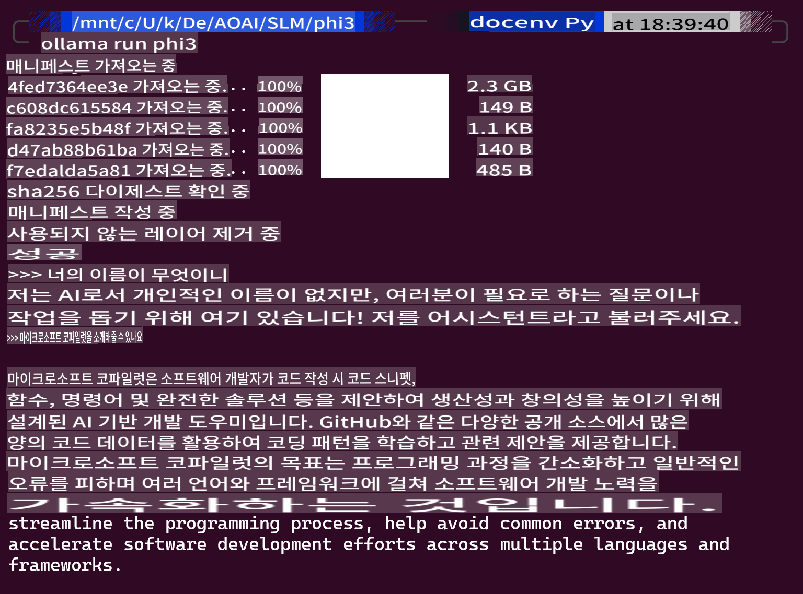

# **Ollama에서 Phi-3 사용하기**

[Ollama](https://ollama.com)는 간단한 스크립트를 통해 더 많은 사람들이 오픈 소스 LLM 또는 SLM을 직접 배포할 수 있게 하며, 로컬 Copilot 응용 시나리오를 돕기 위해 API도 구축할 수 있습니다.

## **1. 설치**

Ollama는 Windows, macOS, Linux에서 실행을 지원합니다. 이 링크를 통해 Ollama를 설치할 수 있습니다 ([https://ollama.com/download](https://ollama.com/download)). 설치가 완료되면 터미널 창을 통해 Ollama 스크립트를 사용하여 Phi-3을 직접 호출할 수 있습니다. [Ollama에서 사용 가능한 모든 라이브러리](https://ollama.com/library)를 확인할 수 있습니다. Codespace에서 이 리포지토리를 열면 이미 Ollama가 설치되어 있을 것입니다.

```bash

ollama run phi3

```

> [!NOTE]
> 처음 실행할 때 모델이 다운로드됩니다. 물론, 이미 다운로드한 Phi-3 모델을 직접 지정할 수도 있습니다. WSL을 예로 들어 명령어를 실행합니다. 모델이 성공적으로 다운로드되면 터미널에서 직접 상호작용할 수 있습니다.



## **2. Ollama에서 phi-3 API 호출하기**

Ollama가 생성한 Phi-3 API를 호출하려면 터미널에서 이 명령어를 사용하여 Ollama 서버를 시작할 수 있습니다.

```bash

ollama serve

```

> [!NOTE]
> MacOS 또는 Linux를 실행 중인 경우 **"Error: listen tcp 127.0.0.1:11434: bind: address already in use"** 오류를 만날 수 있습니다. 이 오류는 일반적으로 서버가 이미 실행 중임을 나타내므로 무시할 수 있습니다. 또는 Ollama를 중지하고 다시 시작할 수 있습니다:

**macOS**

```bash

brew services restart ollama

```

**Linux**

```bash

sudo systemctl stop ollama

```

Ollama는 두 가지 API를 지원합니다: generate와 chat. 필요에 따라 Ollama가 제공하는 모델 API를 호출하여 11434 포트에서 실행 중인 로컬 서비스에 요청을 보낼 수 있습니다.

**Chat**

```bash

curl http://127.0.0.1:11434/api/chat -d '{
  "model": "phi3",
  "messages": [
    {
      "role": "system",
      "content": "Your are a python developer."
    },
    {
      "role": "user",
      "content": "Help me generate a bubble algorithm"
    }
  ],
  "stream": false
  
}'


```

이것은 Postman에서의 결과입니다


```bash

curl http://127.0.0.1:11434/api/generate -d '{
  "model": "phi3",
  "prompt": "<|system|>Your are my AI assistant.<|end|><|user|>tell me how to learn AI<|end|><|assistant|>",
  "stream": false
}'


```

이것은 Postman에서의 결과입니다


## 추가 자료

Ollama의 사용 가능한 모델 목록을 [라이브러리](https://ollama.com/library)에서 확인하세요.

이 명령어를 사용하여 Ollama 서버에서 모델을 가져오세요

```bash
ollama pull phi3
```

이 명령어를 사용하여 모델을 실행하세요

```bash
ollama run phi3
```

***참고:*** 이 링크를 방문하여 더 많은 정보를 알아보세요 [https://github.com/ollama/ollama/blob/main/docs/api.md](https://github.com/ollama/ollama/blob/main/docs/api.md)

## Python에서 Ollama 호출하기

`requests` or `urllib3`를 사용하여 위에서 사용한 로컬 서버 엔드포인트에 요청을 보낼 수 있습니다. 그러나 Python에서 Ollama를 사용하는 인기 있는 방법은 [openai](https://pypi.org/project/openai/) SDK를 사용하는 것입니다. Ollama는 OpenAI 호환 서버 엔드포인트도 제공하기 때문입니다.

여기 phi3-mini의 예시가 있습니다:

```python
import openai

client = openai.OpenAI(
    base_url="http://localhost:11434/v1",
    api_key="nokeyneeded",
)

response = client.chat.completions.create(
    model="phi3",
    temperature=0.7,
    n=1,
    messages=[
        {"role": "system", "content": "You are a helpful assistant."},
        {"role": "user", "content": "Write a haiku about a hungry cat"},
    ],
)

print("Response:")
print(response.choices[0].message.content)
```

## JavaScript에서 Ollama 호출하기 

```javascript
// Example of Summarize a file with Phi-3
script({
    model: "ollama:phi3",
    title: "Summarize with Phi-3",
    system: ["system"],
})

// Example of summarize
const file = def("FILE", env.files)
$`Summarize ${file} in a single paragraph.`
```

## C#에서 Ollama 호출하기

새로운 C# 콘솔 애플리케이션을 만들고 다음 NuGet 패키지를 추가하세요:

```bash
dotnet add package Microsoft.SemanticKernel --version 1.13.0
```

그런 다음 `Program.cs` 파일에 이 코드를 추가하세요

```csharp
using Microsoft.SemanticKernel;
using Microsoft.SemanticKernel.ChatCompletion;

// add chat completion service using the local ollama server endpoint
#pragma warning disable SKEXP0001, SKEXP0003, SKEXP0010, SKEXP0011, SKEXP0050, SKEXP0052
builder.AddOpenAIChatCompletion(
    modelId: "phi3.5",
    endpoint: new Uri("http://localhost:11434/"),
    apiKey: "non required");

// invoke a simple prompt to the chat service
string prompt = "Write a joke about kittens";
var response = await kernel.InvokePromptAsync(prompt);
Console.WriteLine(response.GetValue<string>());
```

이 명령어로 앱을 실행하세요:

```bash
dotnet run
```

**면책 조항**:
이 문서는 기계 기반 AI 번역 서비스를 사용하여 번역되었습니다. 우리는 정확성을 위해 노력하지만, 자동 번역에는 오류나 부정확성이 있을 수 있습니다. 원본 문서를 권위 있는 출처로 간주해야 합니다. 중요한 정보에 대해서는 전문적인 인간 번역을 권장합니다. 이 번역 사용으로 인해 발생하는 오해나 잘못된 해석에 대해서는 책임을 지지 않습니다.