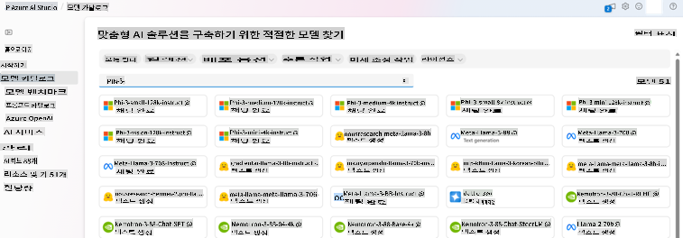
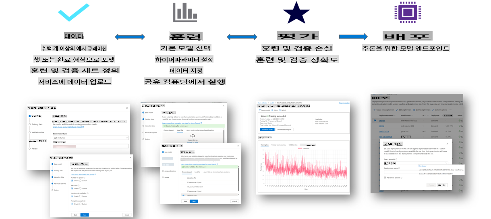
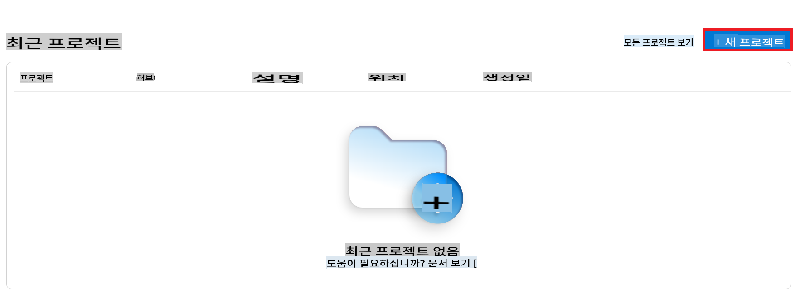
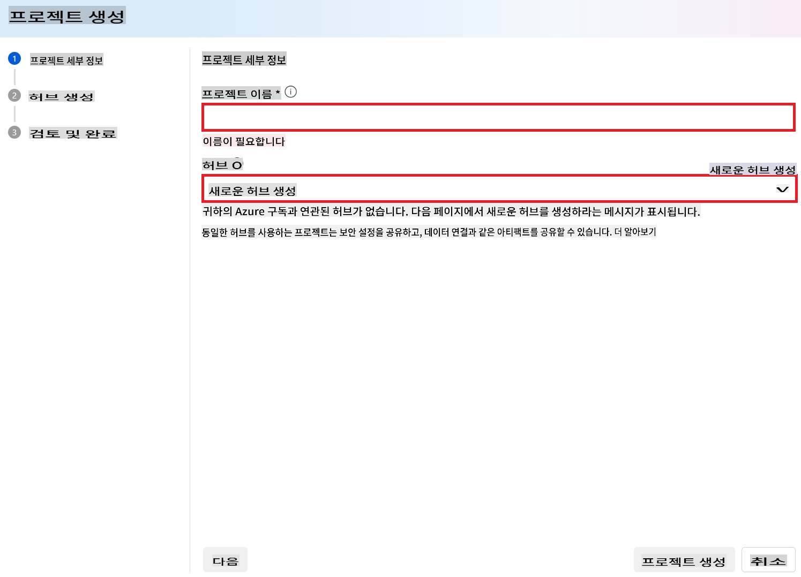
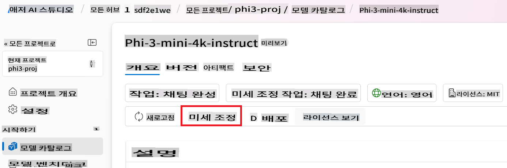
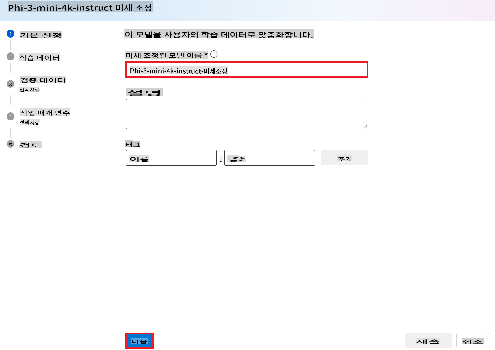
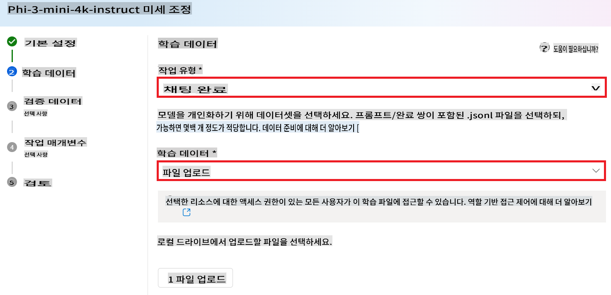
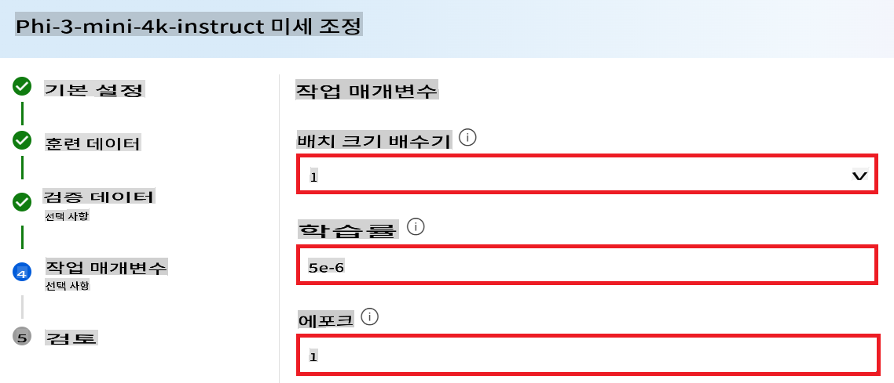
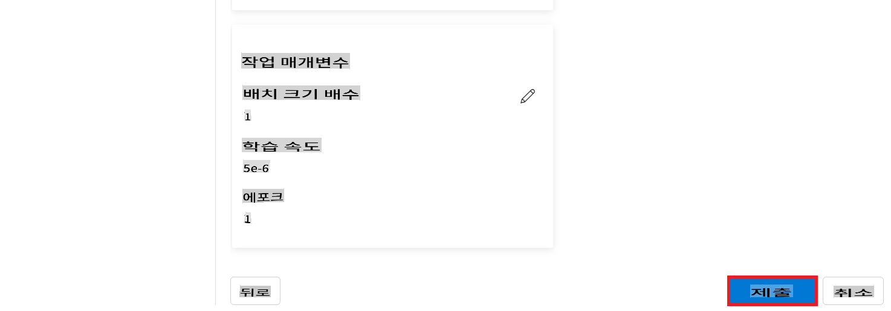
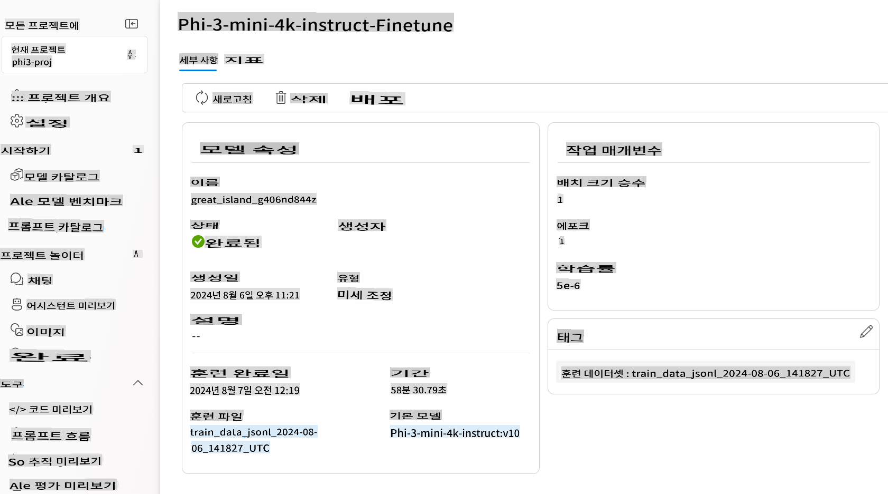

# Azure AI Foundry를 사용한 Phi-3 모델 미세 조정

Microsoft의 Phi-3 Mini 언어 모델을 Azure AI Foundry를 사용하여 어떻게 미세 조정할 수 있는지 알아보겠습니다. 미세 조정을 통해 Phi-3 Mini를 특정 작업에 맞게 조정하여 더 강력하고 문맥을 잘 이해하는 모델로 만들 수 있습니다.

## 고려 사항

- **기능:** 어떤 모델이 미세 조정 가능한가? 기본 모델을 무엇으로 미세 조정할 수 있는가?
- **비용:** 미세 조정의 가격 모델은 어떻게 되는가?
- **커스터마이징 가능성:** 기본 모델을 얼마나 수정할 수 있는가? 어떤 방식으로 수정할 수 있는가?
- **편리성:** 미세 조정은 실제로 어떻게 이루어지는가? 커스텀 코드를 작성해야 하는가? 자체 컴퓨팅 리소스를 가져와야 하는가?
- **안전성:** 미세 조정된 모델은 안전성 위험이 있을 수 있는데, 의도치 않은 피해를 방지하기 위한 보호 장치가 있는가?



## 미세 조정을 위한 준비

### 사전 요구 사항

> [!NOTE]
> Phi-3 패밀리 모델의 경우, 사용한 만큼 지불하는 모델 미세 조정 제공은 **East US 2** 지역에서 생성된 허브에서만 가능합니다.

- Azure 구독이 필요합니다. Azure 구독이 없는 경우, [유료 Azure 계정](https://azure.microsoft.com/pricing/purchase-options/pay-as-you-go)을 만들어 시작하세요.

- [AI Foundry 프로젝트](https://ai.azure.com?WT.mc_id=aiml-138114-kinfeylo).
- Azure 역할 기반 액세스 제어 (Azure RBAC)는 Azure AI Foundry에서 작업에 대한 액세스를 부여하는 데 사용됩니다. 이 문서의 단계를 수행하려면 사용자 계정이 리소스 그룹에 __Azure AI Developer 역할__로 할당되어 있어야 합니다.

### 구독 공급자 등록

구독이 `Microsoft.Network` 리소스 공급자에 등록되어 있는지 확인합니다.

1. [Azure 포털](https://portal.azure.com)에 로그인합니다.
1. 왼쪽 메뉴에서 **Subscriptions**을 선택합니다.
1. 사용하려는 구독을 선택합니다.
1. 왼쪽 메뉴에서 **AI project settings** > **Resource providers**를 선택합니다.
1. **Microsoft.Network**가 리소스 공급자 목록에 있는지 확인합니다. 그렇지 않으면 추가합니다.

### 데이터 준비

모델을 미세 조정하기 위해 훈련 및 검증 데이터를 준비합니다. 훈련 데이터와 검증 데이터 세트는 모델이 어떻게 동작하기를 원하는지에 대한 입력 및 출력 예제로 구성됩니다.

모든 훈련 예제가 추론을 위한 예상 형식을 따르도록 하세요. 모델을 효과적으로 미세 조정하려면 균형 잡히고 다양한 데이터 세트를 보장하세요.

이는 데이터 균형을 유지하고, 다양한 시나리오를 포함하며, 주기적으로 훈련 데이터를 실제 세계의 기대에 맞게 정제하는 것을 포함합니다. 궁극적으로 더 정확하고 균형 잡힌 모델 응답을 이끌어냅니다.

다른 모델 유형은 다른 형식의 훈련 데이터를 요구합니다.

### 채팅 완료

사용하는 훈련 및 검증 데이터는 **반드시** JSON Lines (JSONL) 문서 형식이어야 합니다. `Phi-3-mini-128k-instruct`의 경우, 미세 조정 데이터 세트는 Chat completions API에서 사용하는 대화 형식으로 포맷되어야 합니다.

### 예시 파일 형식

```json
    {"messages": [{"role": "system", "content": "You are an Xbox customer support agent whose primary goal is to help users with issues they are experiencing with their Xbox devices. You are friendly and concise. You only provide factual answers to queries, and do not provide answers that are not related to Xbox."}, {"role": "user", "content": "Is Xbox better than PlayStation?"}, {"role": "assistant", "content": "I apologize, but I cannot provide personal opinions. My primary job is to assist you with any issues related to your Xbox device. Do you have any Xbox-related issues that need addressing?"}]}
    {"messages": [{"role": "system", "content": "You are an Xbox customer support agent whose primary goal is to help users with issues they are experiencing with their Xbox devices. You are friendly and concise. You only provide factual answers to queries, and do not provide answers that are not related to Xbox."}, {"role": "user", "content": "Can I play PC games on my Xbox?"}, {"role": "assistant", "content": "While Xbox consoles don't natively support PC games, they can play an array of Xbox games, many of which are also available on PC. Can I assist you with finding games compatible with your Xbox device?"}]}
    {"messages": [{"role": "system", "content": "You are an Xbox customer support agent whose primary goal is to help users with issues they are experiencing with their Xbox devices. You are friendly and concise. You only provide factual answers to queries, and do not provide answers that are not related to Xbox."}, {"role": "user", "content": "I'm having trouble connecting my Xbox to the Wi-Fi."}, {"role": "assistant", "content": "No worries, let's go through the network settings on your Xbox. Can you please tell me what happens when you try to connect it to the Wi-Fi?"}]}
```

지원되는 파일 형식은 JSON Lines입니다. 파일은 기본 데이터 저장소에 업로드되며 프로젝트에서 사용할 수 있게 됩니다.

## Azure AI Foundry를 사용한 Phi-3 모델 미세 조정

Azure AI Foundry를 사용하면 미세 조정이라는 과정을 통해 대형 언어 모델을 개인 데이터 세트에 맞게 조정할 수 있습니다. 미세 조정은 특정 작업 및 응용 프로그램에 대한 맞춤화와 최적화를 가능하게 하여 성능 향상, 비용 효율성, 지연 시간 감소 및 맞춤 출력을 제공합니다.



### 새 프로젝트 생성

1. [Azure AI Foundry](https://ai.azure.com)에 로그인합니다.

1. **+New project**를 선택하여 Azure AI Foundry에서 새 프로젝트를 생성합니다.

    

1. 다음 작업을 수행합니다:

    - 프로젝트 **Hub name**을 입력합니다. 고유한 값이어야 합니다.
    - 사용할 **Hub**를 선택합니다 (필요시 새로 생성).

    

1. 새 허브를 생성하려면 다음 작업을 수행합니다:

    - **Hub name**을 입력합니다. 고유한 값이어야 합니다.
    - Azure **Subscription**을 선택합니다.
    - 사용할 **Resource group**을 선택합니다 (필요시 새로 생성).
    - 사용할 **Location**을 선택합니다.
    - 사용할 **Connect Azure AI Services**를 선택합니다 (필요시 새로 생성).
    - **Connect Azure AI Search**를 선택하여 **연결 생략**을 선택합니다.

    

1. **Next**를 선택합니다.
1. **Create a project**를 선택합니다.

### 데이터 준비

미세 조정 전에 작업과 관련된 데이터 세트를 수집하거나 생성하세요. 예를 들어 채팅 지침, 질문-답변 쌍 또는 기타 관련 텍스트 데이터를 사용할 수 있습니다. 노이즈 제거, 누락된 값 처리, 텍스트 토큰화 등을 통해 데이터를 정리하고 전처리하세요.

### Azure AI Foundry에서 Phi-3 모델 미세 조정

> [!NOTE]
> Phi-3 모델의 미세 조정은 현재 East US 2에 위치한 프로젝트에서 지원됩니다.

1. 왼쪽 탭에서 **Model catalog**를 선택합니다.

1. **검색 창**에 *phi-3*을 입력하고 사용하려는 phi-3 모델을 선택합니다.

    

1. **Fine-tune**을 선택합니다.

    

1. **Fine-tuned model name**을 입력합니다.

    

1. **Next**를 선택합니다.

1. 다음 작업을 수행합니다:

    - **task type**을 **Chat completion**으로 선택합니다.
    - 사용할 **Training data**를 선택합니다. Azure AI Foundry의 데이터를 통해 업로드하거나 로컬 환경에서 업로드할 수 있습니다.

    

1. **Next**를 선택합니다.

1. 사용할 **Validation data**를 업로드하거나 **훈련 데이터의 자동 분할**을 선택할 수 있습니다.

    

1. **Next**를 선택합니다.

1. 다음 작업을 수행합니다:

    - 사용할 **Batch size multiplier**를 선택합니다.
    - 사용할 **Learning rate**를 선택합니다.
    - 사용할 **Epochs**를 선택합니다.

    

1. **Submit**을 선택하여 미세 조정 과정을 시작합니다.

    

1. 모델이 미세 조정되면 상태가 **Completed**로 표시됩니다. 이제 모델을 배포하여 자체 응용 프로그램, 플레이그라운드 또는 프롬프트 흐름에서 사용할 수 있습니다. 자세한 내용은 [Azure AI Foundry를 사용하여 Phi-3 소형 언어 모델 배포 방법](https://learn.microsoft.com/azure/ai-studio/how-to/deploy-models-phi-3?tabs=phi-3-5&pivots=programming-language-python)을 참조하세요.

    

> [!NOTE]
> Phi-3 모델 미세 조정에 대한 자세한 내용은 [Azure AI Foundry에서 Phi-3 모델 미세 조정](https://learn.microsoft.com/azure/ai-studio/how-to/fine-tune-phi-3?tabs=phi-3-mini)을 참조하세요.

## 미세 조정된 모델 정리

미세 조정된 모델은 [Azure AI Foundry](https://ai.azure.com)의 미세 조정 모델 목록이나 모델 세부 정보 페이지에서 삭제할 수 있습니다. 미세 조정 페이지에서 삭제할 미세 조정된 모델을 선택한 다음 삭제 버튼을 선택하여 미세 조정된 모델을 삭제하세요.

> [!NOTE]
> 기존 배포가 있는 경우 커스텀 모델을 삭제할 수 없습니다. 커스텀 모델을 삭제하기 전에 모델 배포를 먼저 삭제해야 합니다.

## 비용 및 할당량

### 서비스로서 미세 조정된 Phi-3 모델의 비용 및 할당량 고려 사항

서비스로서 미세 조정된 Phi 모델은 Microsoft에서 제공되며 Azure AI Foundry와 통합되어 사용됩니다. 모델을 [배포](https://learn.microsoft.com/azure/ai-studio/how-to/deploy-models-phi-3?tabs=phi-3-5&pivots=programming-language-python)하거나 미세 조정할 때 배포 마법사의 가격 및 조건 탭에서 가격을 확인할 수 있습니다.

## 콘텐츠 필터링

사용한 만큼 지불하는 서비스로 배포된 모델은 Azure AI Content Safety에 의해 보호됩니다. 실시간 엔드포인트에 배포할 때 이 기능을 옵트아웃할 수 있습니다. Azure AI 콘텐츠 안전이 활성화된 경우, 프롬프트와 완료가 모두 유해 콘텐츠 출력을 감지하고 방지하기 위한 분류 모델 집합을 통해 전달됩니다. 콘텐츠 필터링 시스템은 입력 프롬프트와 출력 완료 모두에서 잠재적으로 유해한 콘텐츠의 특정 범주를 감지하고 조치를 취합니다. 자세한 내용은 [Azure AI Content Safety](https://learn.microsoft.com/azure/ai-studio/concepts/content-filtering)를 참조하세요.

**미세 조정 구성**

하이퍼파라미터: 학습률, 배치 크기 및 훈련 에포크 수와 같은 하이퍼파라미터를 정의합니다.

**손실 함수**

작업에 적합한 손실 함수를 선택합니다 (예: 교차 엔트로피).

**최적화기**

훈련 중 경사 업데이트를 위한 최적화기 (예: Adam)를 선택합니다.

**미세 조정 과정**

- 사전 훈련된 모델 로드: Phi-3 Mini 체크포인트를 로드합니다.
- 커스텀 레이어 추가: 작업에 특화된 레이어를 추가합니다 (예: 채팅 지침을 위한 분류 헤드).

**모델 훈련**
준비된 데이터 세트를 사용하여 모델을 미세 조정합니다. 훈련 진행 상황을 모니터링하고 필요에 따라 하이퍼파라미터를 조정합니다.

**평가 및 검증**

검증 세트: 데이터를 훈련 세트와 검증 세트로 나눕니다.

**성능 평가**

정확도, F1-스코어 또는 퍼플렉서티와 같은 지표를 사용하여 모델 성능을 평가합니다.

## 미세 조정된 모델 저장

**체크포인트**
미세 조정된 모델 체크포인트를 저장하여 나중에 사용할 수 있습니다.

## 배포

- 웹 서비스로 배포: 미세 조정된 모델을 Azure AI Foundry에서 웹 서비스로 배포합니다.
- 엔드포인트 테스트: 배포된 엔드포인트에 테스트 쿼리를 보내 기능을 확인합니다.

## 반복 및 개선

반복: 성능이 만족스럽지 않으면 하이퍼파라미터를 조정하거나 더 많은 데이터를 추가하거나 추가 에포크 동안 미세 조정하여 반복합니다.

## 모니터링 및 정제

모델의 동작을 지속적으로 모니터링하고 필요에 따라 정제합니다.

## 커스터마이징 및 확장

커스텀 작업: Phi-3 Mini는 채팅 지침 외에도 다양한 작업을 위해 미세 조정할 수 있습니다. 다른 사용 사례를 탐색하세요!
실험: 성능을 향상시키기 위해 다양한 아키텍처, 레이어 조합 및 기술을 시도해 보세요.

> [!NOTE]
> 미세 조정은 반복적인 과정입니다. 실험하고 배우며 모델을 조정하여 특정 작업에 최상의 결과를 얻으세요!

**면책 조항**:
이 문서는 기계 기반 AI 번역 서비스를 사용하여 번역되었습니다. 정확성을 기하기 위해 노력하지만, 자동 번역에는 오류나 부정확한 내용이 포함될 수 있습니다. 원본 문서의 모국어 버전이 권위 있는 출처로 간주되어야 합니다. 중요한 정보에 대해서는 전문적인 인간 번역을 권장합니다. 이 번역 사용으로 인해 발생하는 오해나 오역에 대해 당사는 책임을 지지 않습니다.