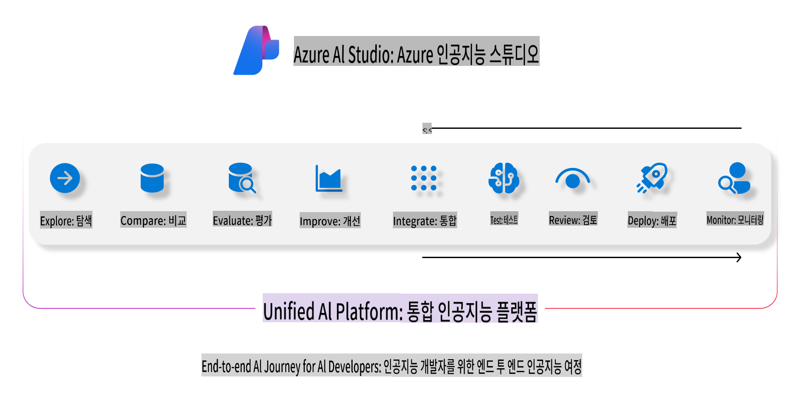

# **Azure AI Foundry를 사용한 평가**

[Azure AI Foundry](https://ai.azure.com?WT.mc_id=aiml-138114-kinfeylo)를 사용하여 생성형 AI 애플리케이션을 평가하는 방법을 알아보세요. 단일 회차 또는 다중 회차 대화를 평가하든, Azure AI Foundry는 모델 성능과 안전성을 평가할 수 있는 도구를 제공합니다.

## Azure AI Foundry로 생성형 AI 앱 평가하기
자세한 내용은 [Azure AI Foundry Documentation](https://learn.microsoft.com/azure/ai-studio/how-to/evaluate-generative-ai-app?WT.mc_id=aiml-138114-kinfeylo)을 참조하세요.

다음은 시작하는 단계입니다:

## Azure AI Foundry에서 생성형 AI 모델 평가

**사전 요구 사항**

- CSV 또는 JSON 형식의 테스트 데이터셋.
- 배포된 생성형 AI 모델 (예: Phi-3, GPT 3.5, GPT 4, 또는 Davinci 모델).
- 평가를 실행할 컴퓨팅 인스턴스가 있는 런타임.

## 내장 평가 지표

Azure AI Foundry는 단일 회차 및 복잡한 다중 회차 대화를 모두 평가할 수 있습니다.
모델이 특정 데이터에 기반한 경우, Retrieval Augmented Generation (RAG) 시나리오에서 내장된 평가 지표를 사용하여 성능을 평가할 수 있습니다.
또한, 일반적인 단일 회차 질문 응답 시나리오(비 RAG)도 평가할 수 있습니다.

## 평가 실행 생성

Azure AI Foundry UI에서 Evaluate 페이지 또는 Prompt Flow 페이지로 이동합니다.
평가 생성 마법사를 따라 평가 실행을 설정하세요. 평가에 대한 선택적 이름을 제공할 수 있습니다.
애플리케이션의 목표와 일치하는 시나리오를 선택하세요.
모델의 출력을 평가할 하나 이상의 평가 지표를 선택하세요.

## 사용자 정의 평가 흐름 (선택 사항)

더 큰 유연성을 위해 사용자 정의 평가 흐름을 설정할 수 있습니다. 특정 요구 사항에 맞게 평가 프로세스를 맞춤 설정하세요.

## 결과 보기

평가를 실행한 후, Azure AI Foundry에서 자세한 평가 지표를 기록, 조회 및 분석하세요. 애플리케이션의 능력과 한계를 파악할 수 있습니다.

**Note** Azure AI Foundry는 현재 공개 프리뷰 중이므로 실험 및 개발 목적으로 사용하세요. 프로덕션 워크로드에는 다른 옵션을 고려하세요. 자세한 내용과 단계별 지침은 공식 [AI Foundry documentation](https://learn.microsoft.com/azure/ai-studio/?WT.mc_id=aiml-138114-kinfeylo)을 참조하세요.

**면책 조항**:
이 문서는 기계 기반 AI 번역 서비스를 사용하여 번역되었습니다. 정확성을 위해 노력하고 있지만, 자동 번역에는 오류나 부정확한 내용이 포함될 수 있습니다. 원본 문서의 모국어 버전이 권위 있는 출처로 간주되어야 합니다. 중요한 정보의 경우, 전문 인간 번역을 권장합니다. 이 번역의 사용으로 인해 발생하는 오해나 잘못된 해석에 대해서는 책임을 지지 않습니다.