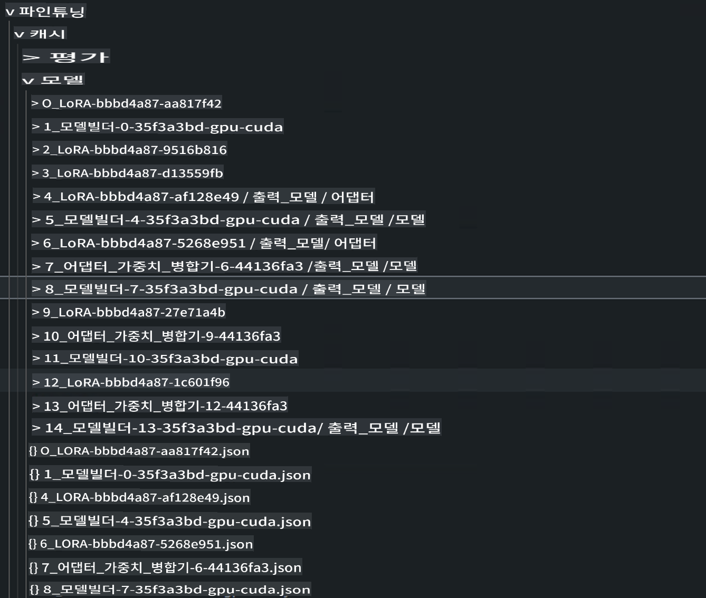

# **Microsoft Olive을 사용하여 프로젝트 설계하기**

기업이 자체 산업 수직 모델을 갖고자 한다면, 데이터, 미세 조정, 배포부터 시작해야 합니다. 이전 콘텐츠에서는 Microsoft Olive에 대해 소개했으며, 이제 E2E 작업을 기반으로 더 자세한 소개를 완성하겠습니다.

## **아키텍처**

VS Code용 AI Toolkit에서 생성된 프로젝트를 참조하여 데이터, 모델, 미세 조정 형식 및 추론을 포함한 프로젝트를 구조화할 수 있습니다. 예를 들어,

```txt

｜-- Your Phi-3-mini E2E Proj
    ｜-- datasets
    ｜-- fine-tuning
    ｜-- inferences
    ｜-- model-cache
    ｜-- gen-model
    ｜-- setup
     

```

- **datasets**

    데이터는 csv, json 등의 형식으로 저장될 수 있습니다. 이 예제에서는 내보낸 json 데이터를 사용합니다. [dataset](./E2E_Datasets.md) 

    ***Note*** 데이터는 이미 Azure ML에 업로드되었기 때문에 여기서 관련 설정을 무시할 수 있습니다 (로컬일 경우 여기서 데이터를 업로드할 수 있습니다).

- **fine-tuning**
    
    QLoRA 및 LoRA 알고리즘과 관련 매개변수를 지정합니다.

- **inferences**

    추론은 미세 조정 후의 모델입니다. 미세 조정된 Adapter 레이어를 참조하거나, 미세 조정 후 Adapter와 통합된 모델을 참조하거나, 양자화된 ONNX Runtime 모델일 수 있습니다.

- **model-cache**

    Hugging face CLI를 통해 다운로드된 모델로, 여기서는 Phi-3-Mini 모델입니다 (Azure ML을 사용하면 이 내용을 무시할 수 있으며, 로컬에서 작업하려면 다음 스크립트를 실행하여 phi-3 모델을 얻으십시오).


```bash

huggingface-cli login

# input your key from Hugging Face Portal

huggingface-cli download microsoft/Phi-3-mini-4k-instruct --local-dir Your Phi-3-mini location

```

- **gen-model**

작업 후 저장된 모델에는 미세 조정된 Adapter 모델, 통합된 미세 조정 Adapter 모델, ONNX Runtime에서 실행되는 양자화 모델이 포함됩니다.

- **setup**

필요한 설치 환경을 설정하기 위해 이 명령어를 실행하여 Olive Env를 설정하십시오.


```bash

pip install -r requirements.txt

```

## **Microsoft Olive 구성**

Microsoft Olive의 구성에 대해 알고 싶다면 [Fine Tuning with Microsoft Olive](../04.Fine-tuning/FineTuning_MicrosoftOlive.md)를 방문하십시오.

***Note*** 최신 상태를 유지하려면 다음 명령어를 사용하여 Microsoft Olive를 설치하십시오.


```bash

pip install git+https://github.com/microsoft/Olive

```

## **Azure ML에서 Microsoft Olive 실행하기**

**LoRA**

이 샘플은 클라우드 컴퓨팅과 클라우드 데이터셋을 사용하며, fine-tuning 폴더에 olive.config를 추가합니다.


```json

{
    "azureml_client": {
        "subscription_id": "Your Azure Subscription ID",
        "resource_group": "Your Azure Resource Group",
        "workspace_name": "Your Azure ML Worksapce",
        "keyvault_name":  "Your Azure Key Valuts"
    },
    "input_model":{
        "type": "PyTorchModel",
        "config": {
            "hf_config": {
                "model_name": "microsoft/Phi-3-mini-4k-instruct",
                "task": "text-generation",
                "from_pretrained_args": {
                    "trust_remote_code": true
                }
            }
        }
    },
    "systems": {
        "aml": {
            "type": "AzureML",
            "config": {
                "accelerators": [
                    {
                        "device": "gpu",
                        "execution_providers": [
                            "CUDAExecutionProvider"
                        ]
                    }
                ],
                "hf_token": true,
                "aml_compute": "Your Azure ML Compute Cluster",
                "aml_docker_config": {
                    "base_image": "mcr.microsoft.com/azureml/openmpi4.1.0-cuda11.8-cudnn8-ubuntu22.04",
                    "conda_file_path": "conda.yaml"
                }
            }
        },
        "azure_arc": {
            "type": "AzureML",
            "config": {
                "accelerators": [
                    {
                        "device": "gpu",
                        "execution_providers": [
                            "CUDAExecutionProvider"
                        ]
                    }
                ],
                "aml_compute": "Your Azure ML Compute",
                "aml_docker_config": {
                    "base_image": "mcr.microsoft.com/azureml/openmpi4.1.0-cuda11.8-cudnn8-ubuntu22.04",
                    "conda_file_path": "conda.yaml"
                }
            }
        }
    },
    "data_configs": [
        {
            "name": "dataset_default_train",
            "type": "HuggingfaceContainer",
            "load_dataset_config": {
                "params": {
                    "data_name": "json", 
                    "data_files": {
                        "type": "azureml_datastore",
                        "config": {
                            "azureml_client": {
                                "subscription_id": "Your Azure Subscrition ID",
                                "resource_group": "Your Azure Resource Group",
                                "workspace_name": "Your Azure ML Workspaces name"
                            },
                            "datastore_name": "workspaceblobstore",
                            "relative_path": "Your train_data.json Azure ML Location"
                        }
                    },
                    "split": "train"
                }
            },
            "pre_process_data_config": {
                "params": {
                    "dataset_type": "corpus",
                    "text_cols": [
                            "Question",
                            "Best Answer"
                    ],
                    "text_template": "<|user|>\n{Question}<|end|>\n<|assistant|>\n{Best Answer}\n<|end|>",
                    "corpus_strategy": "join",
                    "source_max_len": 2048,
                    "pad_to_max_len": false,
                    "use_attention_mask": false
                }
            }
        }
    ],
    "passes": {
        "lora": {
            "type": "LoRA",
            "config": {
                "target_modules": [
                    "o_proj",
                    "qkv_proj"
                ],
                "double_quant": true,
                "lora_r": 64,
                "lora_alpha": 64,
                "lora_dropout": 0.1,
                "train_data_config": "dataset_default_train",
                "eval_dataset_size": 0.1,
                "training_args": {
                    "seed": 0,
                    "data_seed": 42,
                    "per_device_train_batch_size": 1,
                    "per_device_eval_batch_size": 1,
                    "gradient_accumulation_steps": 4,
                    "gradient_checkpointing": false,
                    "learning_rate": 0.0001,
                    "num_train_epochs": 1000,
                    "max_steps": 100,
                    "logging_steps": 100,
                    "evaluation_strategy": "steps",
                    "eval_steps": 187,
                    "group_by_length": true,
                    "adam_beta2": 0.999,
                    "max_grad_norm": 0.3
                }
            }
        },
        "merge_adapter_weights": {
            "type": "MergeAdapterWeights"
        },
        "builder": {
            "type": "ModelBuilder",
            "config": {
                "precision": "int4"
            }
        }
    },
    "engine": {
        "log_severity_level": 0,
        "host": "aml",
        "target": "aml",
        "search_strategy": false,
        "cache_dir": "cache",
        "output_dir" : "../model-cache/models/phi3-finetuned"
    }
}


```


**QLoRA**


```json

{
    "azureml_client": {
        "subscription_id": "Your Azure Subscription ID",
        "resource_group": "Your Azure Resource Group",
        "workspace_name": "Your Azure ML Worksapce",
        "keyvault_name":  "Your Azure Key Valuts"
    },
    "input_model":{
        "type": "PyTorchModel",
        "config": {
            "hf_config": {
                "model_name": "microsoft/Phi-3-mini-4k-instruct",
                "task": "text-generation",
                "from_pretrained_args": {
                    "trust_remote_code": true
                }
            }
        }
    },
    "systems": {
        "aml": {
            "type": "AzureML",
            "config": {
                "accelerators": [
                    {
                        "device": "gpu",
                        "execution_providers": [
                            "CUDAExecutionProvider"
                        ]
                    }
                ],
                "hf_token": true,
                "aml_compute": "Your Azure ML Compute Cluster",
                "aml_docker_config": {
                    "base_image": "mcr.microsoft.com/azureml/openmpi4.1.0-cuda11.8-cudnn8-ubuntu22.04",
                    "conda_file_path": "conda.yaml"
                }
            }
        },
        "azure_arc": {
            "type": "AzureML",
            "config": {
                "accelerators": [
                    {
                        "device": "gpu",
                        "execution_providers": [
                            "CUDAExecutionProvider"
                        ]
                    }
                ],
                "aml_compute": "Your Azure ML Compute",
                "aml_docker_config": {
                    "base_image": "mcr.microsoft.com/azureml/openmpi4.1.0-cuda11.8-cudnn8-ubuntu22.04",
                    "conda_file_path": "conda.yaml"
                }
            }
        }
    },
    "data_configs": [
        {
            "name": "dataset_default_train",
            "type": "HuggingfaceContainer",
            "load_dataset_config": {
                "params": {
                    "data_name": "json", 
                    "data_files": {
                        "type": "azureml_datastore",
                        "config": {
                            "azureml_client": {
                                "subscription_id": "Your Azure Subscrition ID",
                                "resource_group": "Your Azure Resource Group",
                                "workspace_name": "Your Azure ML Workspaces name"
                            },
                            "datastore_name": "workspaceblobstore",
                            "relative_path": "Your train_data.json Azure ML Location"
                        }
                    },
                    "split": "train"
                }
            },
            "pre_process_data_config": {
                "params": {
                    "dataset_type": "corpus",
                    "text_cols": [
                            "Question",
                            "Best Answer"
                    ],
                    "text_template": "<|user|>\n{Question}<|end|>\n<|assistant|>\n{Best Answer}\n<|end|>",
                    "corpus_strategy": "join",
                    "source_max_len": 2048,
                    "pad_to_max_len": false,
                    "use_attention_mask": false
                }
            }
        }
    ],
    "passes": {
        "qlora": {
            "type": "QLoRA",
            "config": {
                "compute_dtype": "bfloat16",
                "quant_type": "nf4",
                "double_quant": true,
                "lora_r": 64,
                "lora_alpha": 64,
                "lora_dropout": 0.1,
                "train_data_config": "dataset_default_train",
                "eval_dataset_size": 0.3,
                "training_args": {
                    "seed": 0,
                    "data_seed": 42,
                    "per_device_train_batch_size": 1,
                    "per_device_eval_batch_size": 1,
                    "gradient_accumulation_steps": 4,
                    "gradient_checkpointing": false,
                    "learning_rate": 0.0001,
                    "num_train_epochs": 3,
                    "max_steps": 10,
                    "logging_steps": 10,
                    "evaluation_strategy": "steps",
                    "eval_steps": 187,
                    "group_by_length": true,
                    "adam_beta2": 0.999,
                    "max_grad_norm": 0.3
                }
            }
        },
        "merge_adapter_weights": {
            "type": "MergeAdapterWeights"
        }
    },
    "engine": {
        "log_severity_level": 0,
        "host": "aml",
        "target": "aml",
        "search_strategy": false,
        "cache_dir": "cache",
        "output_dir" : "../model-cache/models/phi3-finetuned"
    }
}


```

***Notice*** 

- QLoRA를 사용할 경우, ONNXRuntime-genai의 양자화 변환은 현재 지원되지 않습니다.

- 여기서는 자신의 필요에 따라 위의 단계를 설정할 수 있음을 명확히 합니다. 위의 단계를 완전히 구성할 필요는 없습니다. 필요에 따라 알고리즘의 단계를 직접 사용할 수 있으며, 최종적으로 관련 엔진을 구성해야 합니다.

### **Microsoft Olive 실행하기**


Microsoft Olive를 완료한 후 터미널에서 다음 명령어를 실행해야 합니다.


```bash

olive run --config olive-config.json  

```

***Notice*** 

1. Microsoft Olive가 실행되면 각 단계는 캐시에 저장될 수 있습니다. 미세 조정 디렉터리를 확인하여 관련 단계의 결과를 볼 수 있습니다.




2. 여기서는 LoRA와 QLoRA 모두를 제공하며, 필요에 따라 설정할 수 있습니다.

3. 권장 실행 환경은 WSL / Ubuntu 22.04+입니다.

4. 왜 ORT를 선택해야 하나요? ORT는 엣지 디바이스에 배포될 수 있기 때문이며, 추론은 ORT 환경에서 구현됩니다.


**면책 조항**:
이 문서는 기계 기반 AI 번역 서비스를 사용하여 번역되었습니다. 정확성을 위해 노력하지만, 자동 번역에는 오류나 부정확성이 있을 수 있음을 유의하시기 바랍니다. 원본 문서는 원어로 작성된 문서를 권위 있는 출처로 간주해야 합니다. 중요한 정보에 대해서는 전문적인 인간 번역을 권장합니다. 이 번역을 사용함으로써 발생하는 오해나 잘못된 해석에 대해 우리는 책임을 지지 않습니다.