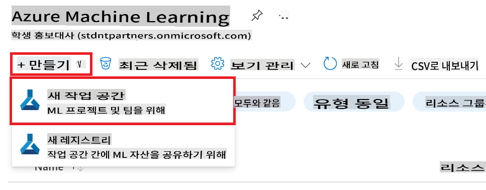
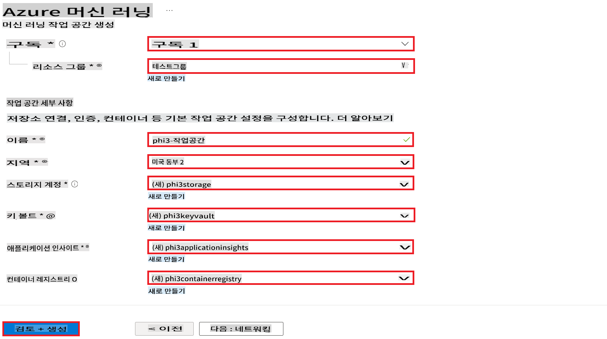
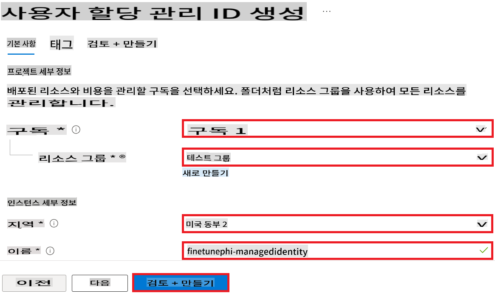
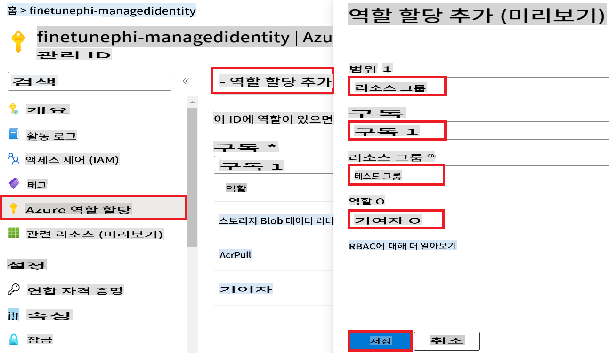
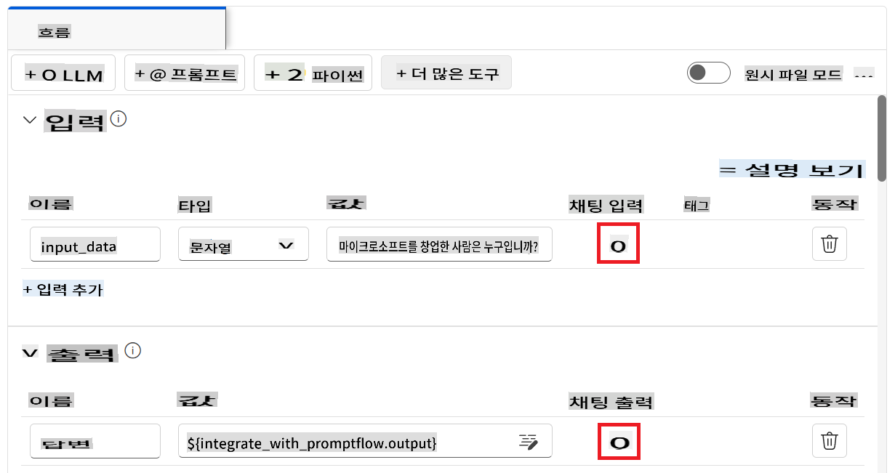
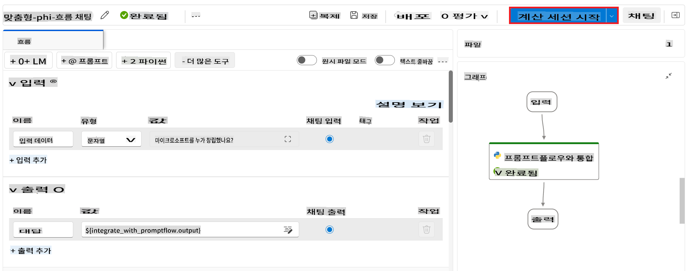
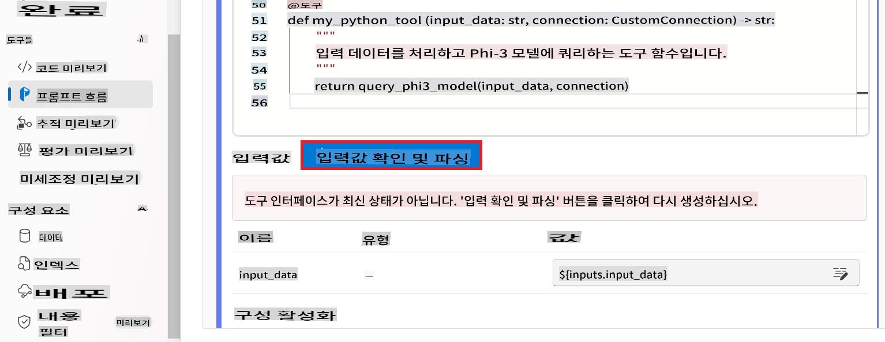

# Fine-tune and Integrate custom Phi-3 models with Prompt flow in Azure AI Studio

이 E2E(End-to-End) 샘플은 Microsoft Tech Community의 가이드 "[Fine-Tune and Integrate Custom Phi-3 Models with Prompt Flow in Azure AI Studio](https://techcommunity.microsoft.com/t5/educator-developer-blog/fine-tune-and-integrate-custom-phi-3-models-with-prompt-flow-in/ba-p/4191726?WT.mc_id=aiml-137032-kinfeylo)"를 기반으로 작성되었습니다. 이 샘플은 Azure AI Studio에서 Prompt flow를 사용하여 맞춤형 Phi-3 모델을 미세 조정하고 배포 및 통합하는 과정을 소개합니다.
로컬에서 코드를 실행하는 "[Fine-Tune and Integrate Custom Phi-3 Models with Prompt Flow](./E2E_Phi-3-FineTuning_PromptFlow_Integration.md)"와는 달리, 이 튜토리얼은 Azure AI / ML Studio 내에서 모델을 미세 조정하고 통합하는 데 중점을 둡니다.

## 개요

이 E2E 샘플에서는 Phi-3 모델을 미세 조정하고 Azure AI Studio의 Prompt flow와 통합하는 방법을 배웁니다. Azure AI / ML Studio를 활용하여 맞춤형 AI 모델을 배포하고 사용하는 워크플로우를 구축하게 됩니다. 이 E2E 샘플은 세 가지 시나리오로 나뉩니다:

**시나리오 1: Azure 리소스 설정 및 미세 조정 준비**

**시나리오 2: Phi-3 모델 미세 조정 및 Azure Machine Learning Studio에 배포**

**시나리오 3: Prompt flow와 통합 및 Azure AI Studio에서 맞춤형 모델과 채팅**

아래는 이 E2E 샘플의 개요입니다.


### 목차

1. **[시나리오 1: Azure 리소스 설정 및 미세 조정 준비](../../../../md/06.E2ESamples)**
    - [Azure Machine Learning 작업 영역 만들기](../../../../md/06.E2ESamples)
    - [Azure 구독에서 GPU 할당량 요청](../../../../md/06.E2ESamples)
    - [역할 할당 추가](../../../../md/06.E2ESamples)
    - [프로젝트 설정](../../../../md/06.E2ESamples)
    - [미세 조정을 위한 데이터셋 준비](../../../../md/06.E2ESamples)

1. **[시나리오 2: Phi-3 모델 미세 조정 및 Azure Machine Learning Studio에 배포](../../../../md/06.E2ESamples)**
    - [Phi-3 모델 미세 조정](../../../../md/06.E2ESamples)
    - [미세 조정된 Phi-3 모델 배포](../../../../md/06.E2ESamples)

1. **[시나리오 3: Prompt flow와 통합 및 Azure AI Studio에서 맞춤형 모델과 채팅](../../../../md/06.E2ESamples)**
    - [맞춤형 Phi-3 모델을 Prompt flow와 통합](../../../../md/06.E2ESamples)
    - [맞춤형 Phi-3 모델과 채팅](../../../../md/06.E2ESamples)

## 시나리오 1: Azure 리소스 설정 및 미세 조정 준비

### Azure Machine Learning 작업 영역 만들기

1. 포털 페이지 상단의 **검색 창**에 *azure machine learning*을 입력하고 나타나는 옵션 중 **Azure Machine Learning**을 선택합니다.

    

2. 탐색 메뉴에서 **+ 만들기**를 선택합니다.

3. 탐색 메뉴에서 **새 작업 영역**을 선택합니다.

    

4. 다음 작업을 수행합니다:

    - Azure **구독**을 선택합니다.
    - 사용할 **리소스 그룹**을 선택합니다 (필요시 새로 생성).
    - **작업 영역 이름**을 입력합니다. 고유한 값이어야 합니다.
    - 사용할 **지역**을 선택합니다.
    - 사용할 **스토리지 계정**을 선택합니다 (필요시 새로 생성).
    - 사용할 **키 볼트**를 선택합니다 (필요시 새로 생성).
    - 사용할 **애플리케이션 인사이트**를 선택합니다 (필요시 새로 생성).
    - 사용할 **컨테이너 레지스트리**를 선택합니다 (필요시 새로 생성).

    

5. **검토 + 만들기**를 선택합니다.

6. **만들기**를 선택합니다.

### Azure 구독에서 GPU 할당량 요청

이 튜토리얼에서는 GPU를 사용하여 Phi-3 모델을 미세 조정하고 배포하는 방법을 배웁니다. 미세 조정을 위해서는 *Standard_NC24ads_A100_v4* GPU가 필요하며, 이는 할당량 요청이 필요합니다. 배포를 위해서는 *Standard_NC6s_v3* GPU가 필요하며, 이 역시 할당량 요청이 필요합니다.

> [!NOTE]
>
> GPU 할당은 Pay-As-You-Go 구독(표준 구독 유형)만 가능하며, 혜택 구독은 현재 지원되지 않습니다.
>

1. [Azure ML Studio](https://ml.azure.com/home?wt.mc_id=studentamb_279723)를 방문합니다.

1. *Standard NCADSA100v4 Family* 할당량을 요청하기 위해 다음 작업을 수행합니다:

    - 왼쪽 탭에서 **할당량**을 선택합니다.
    - 사용할 **가상 머신 패밀리**를 선택합니다. 예를 들어, *Standard_NC24ads_A100_v4* GPU를 포함하는 **Standard NCADSA100v4 Family Cluster Dedicated vCPUs**를 선택합니다.
    - 탐색 메뉴에서 **할당량 요청**을 선택합니다.

        

    - 할당량 요청 페이지에서 사용할 **새 코어 한도**를 입력합니다. 예를 들어, 24.
    - 할당량 요청 페이지에서 **제출**을 선택하여 GPU 할당량을 요청합니다.

1. *Standard NCSv3 Family* 할당량을 요청하기 위해 다음 작업을 수행합니다:

    - 왼쪽 탭에서 **할당량**을 선택합니다.
    - 사용할 **가상 머신 패밀리**를 선택합니다. 예를 들어, *Standard_NC6s_v3* GPU를 포함하는 **Standard NCSv3 Family Cluster Dedicated vCPUs**를 선택합니다.
    - 탐색 메뉴에서 **할당량 요청**을 선택합니다.
    - 할당량 요청 페이지에서 사용할 **새 코어 한도**를 입력합니다. 예를 들어, 24.
    - 할당량 요청 페이지에서 **제출**을 선택하여 GPU 할당량을 요청합니다.

### 역할 할당 추가

모델을 미세 조정하고 배포하려면 먼저 사용자 할당 관리 ID(UAI)를 생성하고 적절한 권한을 부여해야 합니다. 이 UAI는 배포 중 인증에 사용됩니다.

#### 사용자 할당 관리 ID(UAI) 생성

1. 포털 페이지 상단의 **검색 창**에 *managed identities*를 입력하고 나타나는 옵션 중 **Managed Identities**를 선택합니다.

    

1. **+ 만들기**를 선택합니다.

    

1. 다음 작업을 수행합니다:

    - Azure **구독**을 선택합니다.
    - 사용할 **리소스 그룹**을 선택합니다 (필요시 새로 생성).
    - 사용할 **지역**을 선택합니다.
    - **이름**을 입력합니다. 고유한 값이어야 합니다.

    

1. **검토 + 만들기**를 선택합니다.

1. **+ 만들기**를 선택합니다.

#### 관리 ID에 Contributor 역할 할당 추가

1. 생성한 관리 ID 리소스로 이동합니다.

1. 왼쪽 탭에서 **Azure 역할 할당**을 선택합니다.

1. 탐색 메뉴에서 **+ 역할 할당 추가**를 선택합니다.

1. 역할 할당 추가 페이지에서 다음 작업을 수행합니다:
    - **범위**를 **리소스 그룹**으로 선택합니다.
    - Azure **구독**을 선택합니다.
    - 사용할 **리소스 그룹**을 선택합니다.
    - **역할**을 **Contributor**로 선택합니다.

    

1. **저장**을 선택합니다.

#### 관리 ID에 Storage Blob Data Reader 역할 할당 추가

1. 포털 페이지 상단의 **검색 창**에 *storage accounts*를 입력하고 나타나는 옵션 중 **Storage accounts**를 선택합니다.

    

1. 생성한 Azure Machine Learning 작업 영역과 연관된 스토리지 계정을 선택합니다. 예를 들어, *finetunephistorage*.

1. 역할 할당 추가 페이지로 이동하려면 다음 작업을 수행합니다:

    - 생성한 Azure 스토리지 계정으로 이동합니다.
    - 왼쪽 탭에서 **액세스 제어 (IAM)**를 선택합니다.
    - 탐색 메뉴에서 **+ 추가**를 선택합니다.
    - 탐색 메뉴에서 **역할 할당 추가**를 선택합니다.

    

1. 역할 할당 추가 페이지에서 다음 작업을 수행합니다:

    - 역할 페이지에서 **Storage Blob Data Reader**를 검색 창에 입력하고 나타나는 옵션 중 **Storage Blob Data Reader**를 선택합니다.
    - 역할 페이지에서 **다음**을 선택합니다.
    - 멤버 페이지에서 **액세스 할당 대상**을 **Managed identity**로 선택합니다.
    - 멤버 페이지에서 **+ 멤버 선택**을 선택합니다.
    - 관리 ID 선택 페이지에서 Azure **구독**을 선택합니다.
    - 관리 ID 선택 페이지에서 **Managed identity**를 **Manage Identity**로 선택합니다.
    - 관리 ID 선택 페이지에서 생성한 관리 ID를 선택합니다. 예를 들어, *finetunephi-managedidentity*.
    - 관리 ID 선택 페이지에서 **선택**을 선택합니다.

    

1. **검토 + 할당**을 선택합니다.

#### 관리 ID에 AcrPull 역할 할당 추가

1. 포털 페이지 상단의 **검색 창**에 *container registries*를 입력하고 나타나는 옵션 중 **Container registries**를 선택합니다.

    

1. Azure Machine Learning 작업 영역과 연관된 컨테이너 레지스트리를 선택합니다. 예를 들어, *finetunephicontainerregistry*

1. 역할 할당 추가 페이지로 이동하려면 다음 작업을 수행합니다:

    - 왼쪽 탭에서 **액세스 제어 (IAM)**를 선택합니다.
    - 탐색 메뉴에서 **+ 추가**를 선택합니다.
    - 탐색 메뉴에서 **역할 할당 추가**를 선택합니다.

1. 역할 할당 추가 페이지에서 다음 작업을 수행합니다:

    - 역할 페이지에서 **AcrPull**을 검색 창에 입력하고 나타나는 옵션 중 **AcrPull**을 선택합니다.
    - 역할 페이지에서 **다음**을 선택합니다.
    - 멤버 페이지에서 **액세스 할당 대상**을 **Managed identity**로 선택합니다.
    - 멤버 페이지에서 **+ 멤버 선택**을 선택합니다.
    - 관리 ID 선택 페이지에서 Azure **구독**을 선택합니다.
    - 관리 ID 선택 페이지에서 **Managed identity**를 **Manage Identity**로 선택합니다.
    - 관리 ID 선택 페이지에서 생성한 관리 ID를 선택합니다. 예를 들어, *finetunephi-managedidentity*.
    - 관리 ID 선택 페이지에서 **선택**을 선택합니다.
    - **검토 + 할당**을 선택합니다.

### 프로젝트 설정

미세 조정을 위한 데이터셋을 다운로드하기 위해 로컬 환경을 설정합니다.

이 연습에서는

- 작업할 폴더를 생성합니다.
- 가상 환경을 만듭니다.
- 필요한 패키지를 설치합니다.
- 데이터셋을 다운로드하기 위한 *download_dataset.py* 파일을 만듭니다.

#### 작업할 폴더 생성

1. 터미널 창을 열고 다음 명령어를 입력하여 기본 경로에 *finetune-phi* 폴더를 생성합니다.

    ```console
    mkdir finetune-phi
    ```

2. 터미널에서 다음 명령어를 입력하여 생성한 *finetune-phi* 폴더로 이동합니다.

    ```console
    cd finetune-phi
    ```

#### 가상 환경 생성

1. 터미널에서 다음 명령어를 입력하여 *.venv*라는 가상 환경을 생성합니다.

    ```console
    python -m venv .venv
    ```

2. 터미널에서 다음 명령어를 입력하여 가상 환경을 활성화합니다.

    ```console
    .venv\Scripts\activate.bat
    ```

> [!NOTE]
> 제대로 작동했다면 명령 프롬프트 앞에 *(.venv)*가 표시됩니다.

#### 필요한 패키지 설치

1. 터미널에서 다음 명령어를 입력하여 필요한 패키지를 설치합니다.

    ```console
    pip install datasets==2.19.1
    ```

#### `download_dataset.py` 파일 생성

> [!NOTE]
> 전체 폴더 구조:
>
> ```text
> └── YourUserName
> .    └── finetune-phi
> .        └── download_dataset.py
> ```

1. **Visual Studio Code**를 엽니다.

1. 메뉴 바에서 **파일**을 선택합니다.

1. **폴더 열기**를 선택합니다.

1. 생성한 *finetune-phi* 폴더를 선택합니다. 경로는 *C:\Users\yourUserName\finetune-phi*에 있습니다.

    

1. Visual Studio Code의 왼쪽 창에서 마우스 오른쪽 버튼을 클릭하고 **새 파일**을 선택하여 *download_dataset.py*라는 새 파일을 만듭니다.

    

### 미세 조정을 위한 데이터셋 준비

이 연습에서는 *download_dataset.py* 파일을 실행하여 *ultrachat_200k* 데이터셋을 로컬 환경에 다운로드합니다. 그런 다음 이 데이터셋을 사용하여 Azure Machine Learning에서 Phi-3 모델을 미세 조정합니다.

이 연습에서는:

- *download_dataset.py* 파일에 데이터셋을 다운로드하는 코드를 추가합니다.
- *download_dataset.py* 파일을 실행하여 데이터셋을 로컬 환경에 다운로드합니다.

#### *download_dataset.py*를 사용하여 데이터셋 다운로드

1. Visual Studio Code에서 *download_dataset.py* 파일을 엽니다.

1. *download_dataset.py* 파일에 다음 코드를 추가합니다.

    ```python
    import json
    import os
    from datasets import load_dataset

    def load_and_split_dataset(dataset_name, config_name, split_ratio):
        """
        데이터셋을 로드하고 분할합니다.
        """
        # 지정된 이름, 구성, 분할 비율로 데이터셋을 로드합니다.
        dataset = load_dataset(dataset_name, config_name, split=split_ratio)
        print(f"원본 데이터셋 크기: {len(dataset)}")
        
        # 데이터셋을 학습과 테스트 세트로 분할합니다 (80% 학습, 20% 테스트).
        split_dataset = dataset.train_test_split(test_size=0.2)
        print(f"학습 데이터셋 크기: {len(split_dataset['train'])}")
        print(f"테스트 데이터셋 크기: {len(split_dataset['test'])}")
        
        return split_dataset

    def save_dataset_to_jsonl(dataset, filepath):
        """
        데이터셋을 JSONL 파일로 저장합니다.
        """
        # 디렉토리가 존재하지 않으면 생성합니다.
        os.makedirs(os.path.dirname(filepath), exist_ok=True)
        
        # 파일을 쓰기 모드로 엽니다.
        with open(filepath, 'w', encoding='utf-8') as f:
            # 데이터셋의 각 레코드를 반복합니다.
            for record in dataset:
                # 레코드를 JSON 객체로 덤프하고 파일에 씁니다.
                json.dump(record, f)
                # 레코드를 구분하기 위해 개행 문자를 씁니다.
                f.write('\n')
        
        print(f"데이터셋이 {filepath}에 저장되었습니다.")

    def main():
        """
        데이터셋을 로드,
1. [Azure ML Studio](https://ml.azure.com/home?wt.mc_id=studentamb_279723)에 방문하세요.

1. 왼쪽 탭에서 **Compute**를 선택하세요.

1. 탐색 메뉴에서 **Compute clusters**를 선택하세요.

1. **+ New**를 선택하세요.

    

1. 다음 작업을 수행하세요:

    - 사용할 **Region**을 선택하세요.
    - **Virtual machine tier**를 **Dedicated**로 선택하세요.
    - **Virtual machine type**을 **GPU**로 선택하세요.
    - **Virtual machine size** 필터를 **Select from all options**로 선택하세요.
    - **Virtual machine size**를 **Standard_NC24ads_A100_v4**로 선택하세요.

    

1. **Next**를 선택하세요.

1. 다음 작업을 수행하세요:

    - **Compute name**을 입력하세요. 고유한 값이어야 합니다.
    - **Minimum number of nodes**를 **0**으로 선택하세요.
    - **Maximum number of nodes**를 **1**으로 선택하세요.
    - **Idle seconds before scale down**을 **120**으로 선택하세요.

    

1. **Create**를 선택하세요.

#### Phi-3 모델 미세 조정

1. [Azure ML Studio](https://ml.azure.com/home?wt.mc_id=studentamb_279723)에 방문하세요.

1. 생성한 Azure Machine Learning 작업 공간을 선택하세요.

    

1. 다음 작업을 수행하세요:

    - 왼쪽 탭에서 **Model catalog**를 선택하세요.
    - **검색 창**에 *phi-3-mini-4k*를 입력하고 나타나는 옵션 중 **Phi-3-mini-4k-instruct**를 선택하세요.

    

1. 탐색 메뉴에서 **Fine-tune**을 선택하세요.

    

1. 다음 작업을 수행하세요:

    - **Select task type**을 **Chat completion**으로 선택하세요.
    - **+ Select data**를 선택하여 **Training data**를 업로드하세요.
    - 검증 데이터 업로드 유형을 **Provide different validation data**로 선택하세요.
    - **+ Select data**를 선택하여 **Validation data**를 업로드하세요.

    

    > [!TIP]
    >
    > **Advanced settings**를 선택하여 **learning_rate** 및 **lr_scheduler_type**과 같은 설정을 사용자 정의하여 미세 조정 프로세스를 최적화할 수 있습니다.

1. **Finish**를 선택하세요.

1. 이 연습에서, Azure Machine Learning을 사용하여 Phi-3 모델을 성공적으로 미세 조정했습니다. 미세 조정 프로세스는 상당한 시간이 소요될 수 있습니다. 미세 조정 작업을 실행한 후 완료될 때까지 기다려야 합니다. Azure Machine Learning 작업 공간의 왼쪽 탭에서 Jobs 탭으로 이동하여 미세 조정 작업의 상태를 모니터링할 수 있습니다. 다음 시리즈에서는 미세 조정된 모델을 배포하고 Prompt flow와 통합할 것입니다.

    

### 미세 조정된 Phi-3 모델 배포

미세 조정된 Phi-3 모델을 Prompt flow와 통합하려면 모델을 배포하여 실시간 추론에 사용할 수 있도록 해야 합니다. 이 과정에는 모델 등록, 온라인 엔드포인트 생성 및 모델 배포가 포함됩니다.

이 연습에서, 당신은:

- Azure Machine Learning 작업 공간에 미세 조정된 모델을 등록합니다.
- 온라인 엔드포인트를 생성합니다.
- 등록된 미세 조정된 Phi-3 모델을 배포합니다.

#### 미세 조정된 모델 등록

1. [Azure ML Studio](https://ml.azure.com/home?wt.mc_id=studentamb_279723)에 방문하세요.

1. 생성한 Azure Machine Learning 작업 공간을 선택하세요.

    

1. 왼쪽 탭에서 **Models**를 선택하세요.
1. **+ Register**를 선택하세요.
1. **From a job output**를 선택하세요.

    

1. 생성한 작업을 선택하세요.

    

1. **Next**를 선택하세요.

1. **Model type**을 **MLflow**로 선택하세요.

1. **Job output**이 선택되어 있는지 확인하세요; 자동으로 선택되어 있어야 합니다.

    

1. **Next**를 선택하세요.

1. **Register**를 선택하세요.

    

1. 왼쪽 탭에서 **Models** 메뉴로 이동하여 등록된 모델을 확인할 수 있습니다.

    

#### 미세 조정된 모델 배포

1. 생성한 Azure Machine Learning 작업 공간으로 이동하세요.

1. 왼쪽 탭에서 **Endpoints**를 선택하세요.

1. 탐색 메뉴에서 **Real-time endpoints**를 선택하세요.

    

1. **Create**를 선택하세요.

1. 생성한 등록된 모델을 선택하세요.

    

1. **Select**를 선택하세요.

1. 다음 작업을 수행하세요:

    - **Virtual machine**을 *Standard_NC6s_v3*로 선택하세요.
    - 사용할 **Instance count**를 선택하세요. 예를 들어, *1*.
    - **Endpoint**를 **New**로 선택하여 엔드포인트를 생성하세요.
    - **Endpoint name**을 입력하세요. 고유한 값이어야 합니다.
    - **Deployment name**을 입력하세요. 고유한 값이어야 합니다.

    

1. **Deploy**를 선택하세요.

> [!WARNING]
> 계정에 추가 요금이 부과되지 않도록 생성된 엔드포인트를 Azure Machine Learning 작업 공간에서 삭제하세요.
>

#### Azure Machine Learning 작업 공간에서 배포 상태 확인

1. 생성한 Azure Machine Learning 작업 공간으로 이동하세요.

1. 왼쪽 탭에서 **Endpoints**를 선택하세요.

1. 생성한 엔드포인트를 선택하세요.

    

1. 이 페이지에서 배포 과정 중 엔드포인트를 관리할 수 있습니다.

> [!NOTE]
> 배포가 완료되면 **Live traffic**이 **100%**로 설정되어 있는지 확인하세요. 설정되지 않은 경우 **Update traffic**을 선택하여 트래픽 설정을 조정하세요. 트래픽이 0%로 설정되어 있으면 모델을 테스트할 수 없습니다.
>
> 
>

## 시나리오 3: Prompt flow와 통합하여 Azure AI Studio에서 커스텀 모델과 채팅하기

### 커스텀 Phi-3 모델을 Prompt flow와 통합하기

미세 조정된 모델을 성공적으로 배포한 후, 이제 Prompt Flow와 통합하여 실시간 애플리케이션에서 모델을 사용할 수 있습니다. 이를 통해 커스텀 Phi-3 모델을 사용한 다양한 인터랙티브 작업이 가능합니다.

이 연습에서, 당신은:

- Azure AI Studio Hub를 생성합니다.
- Azure AI Studio Project를 생성합니다.
- Prompt flow를 생성합니다.
- 미세 조정된 Phi-3 모델을 위한 커스텀 연결을 추가합니다.
- Prompt flow를 설정하여 커스텀 Phi-3 모델과 채팅합니다.

> [!NOTE]
> Azure ML Studio를 사용하여 Promptflow와 통합할 수도 있습니다. 동일한 통합 프로세스가 Azure ML Studio에도 적용될 수 있습니다.

#### Azure AI Studio Hub 생성

Project를 생성하기 전에 Hub를 생성해야 합니다. Hub는 Resource Group과 유사하게 여러 프로젝트를 Azure AI Studio 내에서 조직하고 관리할 수 있게 해줍니다.

1. [Azure AI Studio](https://ai.azure.com/?WT.mc_id=aiml-137032-kinfeylo)에 방문하세요.

1. 왼쪽 탭에서 **All hubs**를 선택하세요.

1. 탐색 메뉴에서 **+ New hub**를 선택하세요.

    

1. 다음 작업을 수행하세요:

    - **Hub name**을 입력하세요. 고유한 값이어야 합니다.
    - Azure **Subscription**을 선택하세요.
    - 사용할 **Resource group**을 선택하세요 (필요 시 새로 생성).
    - 사용할 **Location**을 선택하세요.
    - 사용할 **Connect Azure AI Services**를 선택하세요 (필요 시 새로 생성).
    - **Connect Azure AI Search**를 **Skip connecting**으로 선택하세요.

    

1. **Next**를 선택하세요.

#### Azure AI Studio Project 생성

1. 생성한 Hub에서 왼쪽 탭에서 **All projects**를 선택하세요.

1. 탐색 메뉴에서 **+ New project**를 선택하세요.

    

1. **Project name**을 입력하세요. 고유한 값이어야 합니다.

    

1. **Create a project**를 선택하세요.

#### 미세 조정된 Phi-3 모델을 위한 커스텀 연결 추가

커스텀 Phi-3 모델을 Prompt flow와 통합하려면 모델의 엔드포인트와 키를 커스텀 연결에 저장해야 합니다. 이 설정은 Prompt flow에서 커스텀 Phi-3 모델에 접근할 수 있도록 보장합니다.

#### 미세 조정된 Phi-3 모델의 API 키 및 엔드포인트 URI 설정

1. [Azure ML Studio](https://ml.azure.com/home?WT.mc_id=aiml-137032-kinfeylo)에 방문하세요.

1. 생성한 Azure Machine learning 작업 공간으로 이동하세요.

1. 왼쪽 탭에서 **Endpoints**를 선택하세요.

    

1. 생성한 엔드포인트를 선택하세요.

    

1. 탐색 메뉴에서 **Consume**을 선택하세요.

1. **REST endpoint**와 **Primary key**를 복사하세요.


#### 사용자 지정 연결 추가

1. [Azure AI Studio](https://ai.azure.com/?WT.mc_id=aiml-137032-kinfeylo) 방문.

1. 생성한 Azure AI Studio 프로젝트로 이동.

1. 생성한 프로젝트에서 왼쪽 탭에서 **Settings** 선택.

1. **+ New connection** 선택.

    

1. 탐색 메뉴에서 **Custom keys** 선택.

    

1. 다음 작업 수행:

    - **+ Add key value pairs** 선택.
    - 키 이름으로 **endpoint** 입력하고 Azure ML Studio에서 복사한 endpoint를 값 필드에 붙여넣기.
    - 다시 **+ Add key value pairs** 선택.
    - 키 이름으로 **key** 입력하고 Azure ML Studio에서 복사한 키를 값 필드에 붙여넣기.
    - 키를 추가한 후 **is secret** 선택하여 키가 노출되지 않도록 설정.

    

1. **Add connection** 선택.

#### 프롬프트 플로우 생성

Azure AI Studio에 사용자 지정 연결을 추가했습니다. 이제 다음 단계를 통해 프롬프트 플로우를 생성하겠습니다. 그런 다음, 이 프롬프트 플로우를 사용자 지정 연결에 연결하여 프롬프트 플로우 내에서 미세 조정된 모델을 사용할 수 있게 됩니다.

1. 생성한 Azure AI Studio 프로젝트로 이동.

1. 왼쪽 탭에서 **Prompt flow** 선택.

1. 탐색 메뉴에서 **+ Create** 선택.

    

1. 탐색 메뉴에서 **Chat flow** 선택.

    

1. 사용할 **Folder name** 입력.

    

1. **Create** 선택.

#### 사용자 지정 Phi-3 모델과 채팅하도록 프롬프트 플로우 설정

미세 조정된 Phi-3 모델을 프롬프트 플로우에 통합해야 합니다. 그러나 제공된 기존 프롬프트 플로우는 이 목적에 맞게 설계되지 않았습니다. 따라서 사용자 지정 모델 통합을 위해 프롬프트 플로우를 재설계해야 합니다.

1. 프롬프트 플로우에서 다음 작업을 수행하여 기존 플로우를 재구성:

    - **Raw file mode** 선택.
    - *flow.dag.yml* 파일의 기존 코드를 모두 삭제.
    - *flow.dag.yml* 파일에 다음 코드를 추가.

        ```yml
        inputs:
          input_data:
            type: string
            default: "Who founded Microsoft?"

        outputs:
          answer:
            type: string
            reference: ${integrate_with_promptflow.output}

        nodes:
        - name: integrate_with_promptflow
          type: python
          source:
            type: code
            path: integrate_with_promptflow.py
          inputs:
            input_data: ${inputs.input_data}
        ```

    - **Save** 선택.

    

1. *integrate_with_promptflow.py* 파일에 사용자 지정 Phi-3 모델을 프롬프트 플로우에서 사용하기 위한 다음 코드를 추가.

    ```python
    import logging
    import requests
    from promptflow import tool
    from promptflow.connections import CustomConnection

    # 로깅 설정
    logging.basicConfig(
        format="%(asctime)s - %(levelname)s - %(name)s - %(message)s",
        datefmt="%Y-%m-%d %H:%M:%S",
        level=logging.DEBUG
    )
    logger = logging.getLogger(__name__)

    def query_phi3_model(input_data: str, connection: CustomConnection) -> str:
        """
        사용자 지정 연결을 사용하여 주어진 입력 데이터를 Phi-3 모델 엔드포인트에 요청합니다.
        """

        # "connection"은 사용자 지정 연결의 이름, "endpoint", "key"는 사용자 지정 연결의 키입니다.
        endpoint_url = connection.endpoint
        api_key = connection.key

        headers = {
            "Content-Type": "application/json",
            "Authorization": f"Bearer {api_key}"
        }
        data = {
            "input_data": {
                "input_string": [
                    {"role": "user", "content": input_data}
                ],
                "parameters": {
                    "temperature": 0.7,
                    "max_new_tokens": 128
                }
            }
        }
        try:
            response = requests.post(endpoint_url, json=data, headers=headers)
            response.raise_for_status()
            
            # 전체 JSON 응답 로그 기록
            logger.debug(f"Full JSON response: {response.json()}")

            result = response.json()["output"]
            logger.info("Azure ML Endpoint에서 성공적으로 응답을 받았습니다.")
            return result
        except requests.exceptions.RequestException as e:
            logger.error(f"Azure ML Endpoint 요청 오류: {e}")
            raise

    @tool
    def my_python_tool(input_data: str, connection: CustomConnection) -> str:
        """
        입력 데이터를 처리하고 Phi-3 모델을 쿼리하는 도구 함수입니다.
        """
        return query_phi3_model(input_data, connection)

    ```

    

> [!NOTE]
> Azure AI Studio에서 프롬프트 플로우 사용에 대한 자세한 내용은 [Prompt flow in Azure AI Studio](https://learn.microsoft.com/azure/ai-studio/how-to/prompt-flow)를 참조하십시오.

1. **Chat input**, **Chat output** 선택하여 모델과 채팅 가능하도록 설정.

    

1. 이제 사용자 지정 Phi-3 모델과 채팅할 준비가 되었습니다. 다음 연습에서는 프롬프트 플로우를 시작하고 이를 사용하여 미세 조정된 Phi-3 모델과 채팅하는 방법을 배웁니다.

> [!NOTE]
>
> 재구성된 플로우는 아래 이미지와 같아야 합니다:
>
> 
>

### 사용자 지정 Phi-3 모델과 채팅하기

이제 사용자 지정 Phi-3 모델을 미세 조정하고 프롬프트 플로우에 통합했으므로 상호 작용을 시작할 준비가 되었습니다. 이 연습에서는 프롬프트 플로우를 사용하여 모델과 채팅을 설정하고 시작하는 과정을 안내합니다. 이 단계를 따르면 미세 조정된 Phi-3 모델의 기능을 다양한 작업과 대화에 완전히 활용할 수 있습니다.

- 프롬프트 플로우를 사용하여 사용자 지정 Phi-3 모델과 채팅하기.

#### 프롬프트 플로우 시작

1. **Start compute sessions** 선택하여 프롬프트 플로우 시작.

    

1. **Validate and parse input** 선택하여 매개변수 갱신.

    

1. 생성한 사용자 지정 연결의 **connection** 값을 선택. 예: *connection*.

    

#### 사용자 지정 모델과 채팅

1. **Chat** 선택.

    

1. 결과 예시: 이제 사용자 지정 Phi-3 모델과 채팅할 수 있습니다. 미세 조정에 사용된 데이터를 기반으로 질문하는 것이 좋습니다.

    

면책 조항: 이 번역은 원본에서 AI 모델에 의해 번역되었으며 완벽하지 않을 수 있습니다. 
출력을 검토하고 필요한 수정 사항을 반영해 주세요.