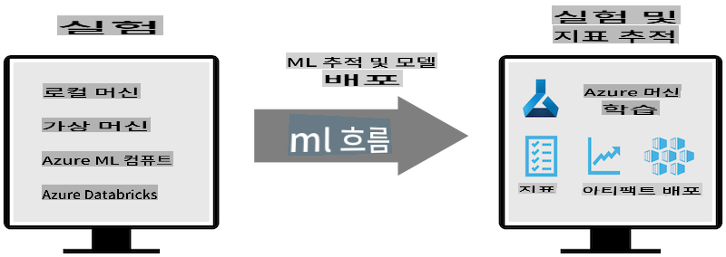
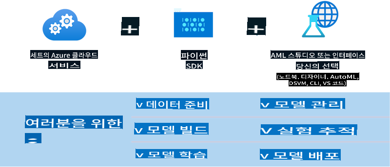

# MLflow

[MLflow](https://mlflow.org/)는 머신 러닝 라이프사이클을 관리하기 위해 설계된 오픈 소스 플랫폼입니다.


MLFlow는 실험, 재현성, 배포 및 중앙 모델 레지스트리를 포함한 ML 라이프사이클을 관리하는 데 사용됩니다. 현재 MLFlow는 네 가지 주요 구성 요소를 제공합니다.

- **MLflow Tracking:** 실험, 코드, 데이터 구성 및 결과를 기록하고 조회합니다.
- **MLflow Projects:** 데이터 과학 코드를 어떤 플랫폼에서도 실행할 수 있는 형식으로 패키징합니다.
- **Mlflow Models:** 다양한 서비스 환경에 머신 러닝 모델을 배포합니다.
- **Model Registry:** 중앙 저장소에서 모델을 저장, 주석 추가 및 관리합니다.

MLFlow는 실험 추적, 재현 가능한 실행을 위한 코드 패키징, 모델 공유 및 배포 기능을 포함하고 있습니다. MLFlow는 Databricks에 통합되어 있으며 다양한 ML 라이브러리를 지원하여 라이브러리 독립성을 제공합니다. REST API와 CLI를 제공하여 어떤 머신 러닝 라이브러리와 프로그래밍 언어에서도 사용할 수 있습니다.



MLFlow의 주요 기능은 다음과 같습니다:

- **실험 추적:** 매개변수와 결과를 기록하고 비교합니다.
- **모델 관리:** 다양한 서비스 및 추론 플랫폼에 모델을 배포합니다.
- **모델 레지스트리:** 버전 관리와 주석을 포함하여 MLflow 모델의 라이프사이클을 협업적으로 관리합니다.
- **프로젝트:** ML 코드를 공유하거나 프로덕션 용도로 패키징합니다.
MLFlow는 데이터 준비, 모델 등록 및 관리, 모델 실행 패키징, 서비스 배포 및 모델 모니터링을 포함하는 MLOps 루프도 지원합니다. 특히 클라우드 및 엣지 환경에서 프로토타입에서 프로덕션 워크플로우로의 전환 과정을 단순화하는 것을 목표로 합니다.

## E2E 시나리오 - 래퍼 구축 및 Phi-3를 MLFlow 모델로 사용하기

이 E2E 샘플에서는 Phi-3 소형 언어 모델(SLM)을 래퍼로 감싸는 두 가지 접근 방식을 보여주고, 이를 MLFlow 모델로 로컬 또는 클라우드(예: Azure Machine Learning 워크스페이스)에서 실행하는 방법을 시연합니다.



| 프로젝트 | 설명 | 위치 |
| ------------ | ----------- | -------- |
| Transformer Pipeline | Transformer Pipeline은 HuggingFace 모델을 MLFlow의 실험적 transformers flavour와 함께 사용하려는 경우 가장 쉬운 래퍼 구축 옵션입니다. | [**TransformerPipeline.ipynb**](../../../../code/06.E2E/E2E_Phi-3-MLflow_TransformerPipeline.ipynb) |
| Custom Python Wrapper | 작성 시점에 transformer pipeline은 HuggingFace 모델의 ONNX 형식에 대한 MLFlow 래퍼 생성을 지원하지 않았습니다. 이러한 경우에는 MLFlow 모드를 위한 맞춤형 Python 래퍼를 구축할 수 있습니다. | [**CustomPythonWrapper.ipynb**](../../../../code/06.E2E/E2E_Phi-3-MLflow_CustomPythonWrapper.ipynb) |

## 프로젝트: Transformer Pipeline

1. MLFlow와 HuggingFace의 관련 Python 패키지가 필요합니다:

    ``` Python
    import mlflow
    import transformers
    ```

2. 다음으로, HuggingFace 레지스트리에서 대상 Phi-3 모델을 참조하여 transformer pipeline을 시작해야 합니다. _Phi-3-mini-4k-instruct_의 모델 카드에서 볼 수 있듯이, 이 모델의 작업 유형은 "텍스트 생성"입니다:

    ``` Python
    pipeline = transformers.pipeline(
        task = "text-generation",
        model = "microsoft/Phi-3-mini-4k-instruct"
    )
    ```

3. 이제 Phi-3 모델의 transformer pipeline을 MLFlow 형식으로 저장하고, 대상 아티팩트 경로, 특정 모델 구성 설정 및 추론 API 유형과 같은 추가 세부 정보를 제공할 수 있습니다:

    ``` Python
    model_info = mlflow.transformers.log_model(
        transformers_model = pipeline,
        artifact_path = "phi3-mlflow-model",
        model_config = model_config,
        task = "llm/v1/chat"
    )
    ```

## 프로젝트: Custom Python Wrapper

1. 여기서는 ONNX 모델의 추론 및 토큰 인코딩/디코딩을 위해 Microsoft's [ONNX Runtime generate() API](https://github.com/microsoft/onnxruntime-genai)를 사용할 수 있습니다. 아래 예시는 CPU를 대상으로 _onnxruntime_genai_ 패키지를 선택한 것입니다:

    ``` Python
    import mlflow
    from mlflow.models import infer_signature
    import onnxruntime_genai as og
    ```

1. 우리의 커스텀 클래스는 두 가지 메서드를 구현합니다: **ONNX 모델**인 Phi-3 Mini 4K Instruct, **생성기 매개변수** 및 **토크나이저**를 초기화하는 _load_context()_와 제공된 프롬프트에 대한 출력 토큰을 생성하는 _predict()_:

    ``` Python
    class Phi3Model(mlflow.pyfunc.PythonModel):
        def load_context(self, context):
            # 아티팩트에서 모델 가져오기
            model_path = context.artifacts["phi3-mini-onnx"]
            model_options = {
                 "max_length": 300,
                 "temperature": 0.2,         
            }
        
            # 모델 정의
            self.phi3_model = og.Model(model_path)
            self.params = og.GeneratorParams(self.phi3_model)
            self.params.set_search_options(**model_options)
            
            # 토크나이저 정의
            self.tokenizer = og.Tokenizer(self.phi3_model)
    
        def predict(self, context, model_input):
            # 입력에서 프롬프트 가져오기
            prompt = model_input["prompt"][0]
            self.params.input_ids = self.tokenizer.encode(prompt)
    
            # 모델의 응답 생성
            response = self.phi3_model.generate(self.params)
    
            return self.tokenizer.decode(response[0][len(self.params.input_ids):])
    ```

1. 이제 _mlflow.pyfunc.log_model()_ 함수를 사용하여 Phi-3 모델을 위한 커스텀 Python 래퍼(피클 형식)와 원본 ONNX 모델 및 필요한 종속성을 생성할 수 있습니다:

    ``` Python
    model_info = mlflow.pyfunc.log_model(
        artifact_path = artifact_path,
        python_model = Phi3Model(),
        artifacts = {
            "phi3-mini-onnx": "cpu_and_mobile/cpu-int4-rtn-block-32-acc-level-4",
        },
        input_example = input_example,
        signature = infer_signature(input_example, ["Run"]),
        extra_pip_requirements = ["torch", "onnxruntime_genai", "numpy"],
    )
    ```

## 생성된 MLFlow 모델의 시그니처

1. Transformer Pipeline 프로젝트의 3단계에서, 우리는 MLFlow 모델의 작업을 “_llm/v1/chat_”으로 설정했습니다. 이러한 지시 사항은 OpenAI의 Chat API와 호환되는 모델의 API 래퍼를 생성합니다:

    ``` Python
    {inputs: 
      ['messages': Array({content: string (required), name: string (optional), role: string (required)}) (required), 'temperature': double (optional), 'max_tokens': long (optional), 'stop': Array(string) (optional), 'n': long (optional), 'stream': boolean (optional)],
    outputs: 
      ['id': string (required), 'object': string (required), 'created': long (required), 'model': string (required), 'choices': Array({finish_reason: string (required), index: long (required), message: {content: string (required), name: string (optional), role: string (required)} (required)}) (required), 'usage': {completion_tokens: long (required), prompt_tokens: long (required), total_tokens: long (required)} (required)],
    params: 
      None}
    ```

1. 따라서 다음 형식으로 프롬프트를 제출할 수 있습니다:

    ``` Python
    messages = [{"role": "user", "content": "What is the capital of Spain?"}]
    ```

1. 그런 다음, OpenAI API와 호환되는 후처리(예: _response[0][‘choices’][0][‘message’][‘content’]_)를 사용하여 출력 결과를 다음과 같이 아름답게 만들 수 있습니다:

    ``` JSON
    Question: What is the capital of Spain?
    
    Answer: The capital of Spain is Madrid. It is the largest city in Spain and serves as the political, economic, and cultural center of the country. Madrid is located in the center of the Iberian Peninsula and is known for its rich history, art, and architecture, including the Royal Palace, the Prado Museum, and the Plaza Mayor.
    
    Usage: {'prompt_tokens': 11, 'completion_tokens': 73, 'total_tokens': 84}
    ```

1. Custom Python Wrapper 프로젝트의 3단계에서는, 주어진 입력 예제를 기반으로 MLFlow 패키지가 모델의 시그니처를 생성하도록 했습니다. 우리의 MLFlow 래퍼의 시그니처는 다음과 같습니다:

    ``` Python
    {inputs: 
      ['prompt': string (required)],
    outputs: 
      [string (required)],
    params: 
      None}
    ```

1. 따라서 프롬프트는 다음과 같은 "prompt" 딕셔너리 키를 포함해야 합니다:

    ``` Python
    {"prompt": "<|system|>You are a stand-up comedian.<|end|><|user|>Tell me a joke about atom<|end|><|assistant|>",}
    ```

1. 모델의 출력은 문자열 형식으로 제공됩니다:

    ``` JSON
    Alright, here's a little atom-related joke for you!
    
    Why don't electrons ever play hide and seek with protons?
    
    Because good luck finding them when they're always "sharing" their electrons!
    
    Remember, this is all in good fun, and we're just having a little atomic-level humor!
    ```

면책 조항: 이 번역은 원본을 AI 모델에 의해 번역된 것으로 완벽하지 않을 수 있습니다. 
출력을 검토하고 필요한 수정 사항을 반영해 주시기 바랍니다.