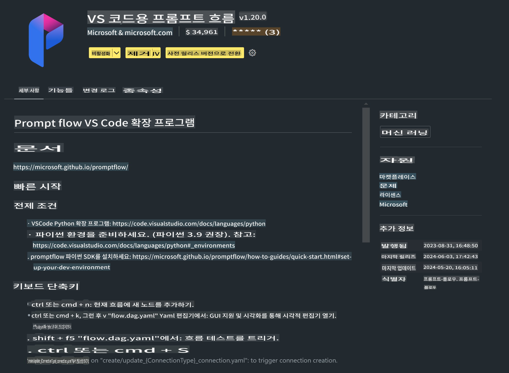

# **Lab 0 - 설치**

Lab에 들어가면 관련 환경을 구성해야 합니다:

### **1. Python 3.11+**

Python 환경을 구성하는 데 miniforge를 사용하는 것이 좋습니다.

miniforge를 구성하려면 [https://github.com/conda-forge/miniforge](https://github.com/conda-forge/miniforge)를 참조하세요.

miniforge를 구성한 후, Power Shell에서 다음 명령어를 실행하세요.

```bash

conda create -n pyenv python==3.11.8 -y

conda activate pyenv

```

### **2. Prompt flow SDK 설치**

Lab 1에서는 Prompt flow를 사용하므로, Prompt flow SDK를 구성해야 합니다.

```bash

pip install promptflow --upgrade

```

다음 명령어로 promptflow sdk를 확인할 수 있습니다.

```bash

pf --version

```

### **3. Visual Studio Code Prompt flow 확장 설치**



### **4. Apple's MLX 프레임워크**

MLX는 Apple 실리콘에서 머신 러닝 연구를 위한 배열 프레임워크로, Apple 머신 러닝 연구팀에서 제공합니다. **Apple MLX 프레임워크**를 사용하여 Apple Silicon에서 LLM / SLM을 가속화할 수 있습니다. 더 알고 싶다면 [https://github.com/microsoft/Phi-3CookBook/blob/main/md/03.Inference/MLX_Inference.md](https://github.com/microsoft/Phi-3CookBook/blob/main/md/03.Inference/MLX_Inference.md)를 읽어보세요.

bash에서 MLX 프레임워크 라이브러리를 설치하세요.

```bash

pip install mlx-lm

```

### **5. 기타 Python 라이브러리**

requirements.txt 파일을 생성하고 다음 내용을 추가하세요.

```txt

notebook
numpy 
scipy 
scikit-learn 
matplotlib 
pandas 
pillow 
graphviz

```

### **6. NVM 설치**

Powershell에서 nvm을 설치하세요.

```bash

brew install nvm

```

nodejs 18.20 설치

```bash

nvm install 18.20.0

nvm use 18.20.0

```

### **7. Visual Studio Code 개발 지원 설치**

```bash

npm install --global yo generator-code

```

축하합니다! SDK 구성을 성공적으로 완료했습니다. 이제 실습 단계로 진행하세요.

면책 조항: 이 번역은 원본을 AI 모델이 번역한 것이며 완벽하지 않을 수 있습니다.
출력 내용을 검토하시고 필요한 수정 사항이 있으면 수정해 주시기 바랍니다.