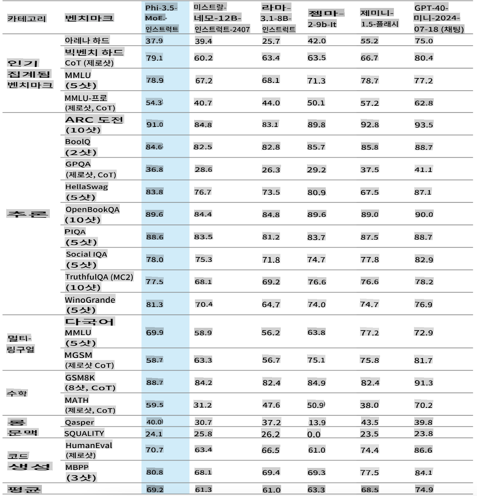
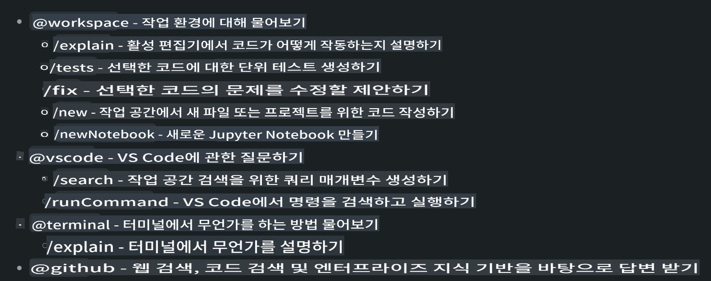
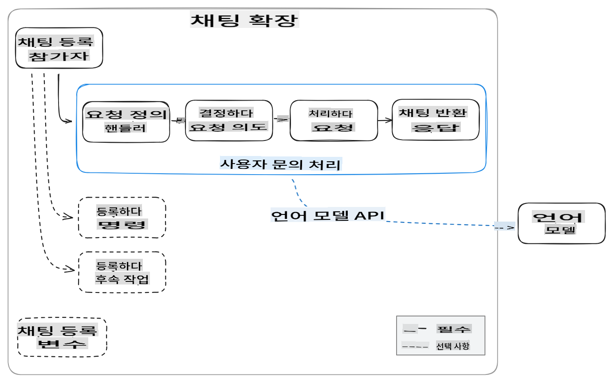
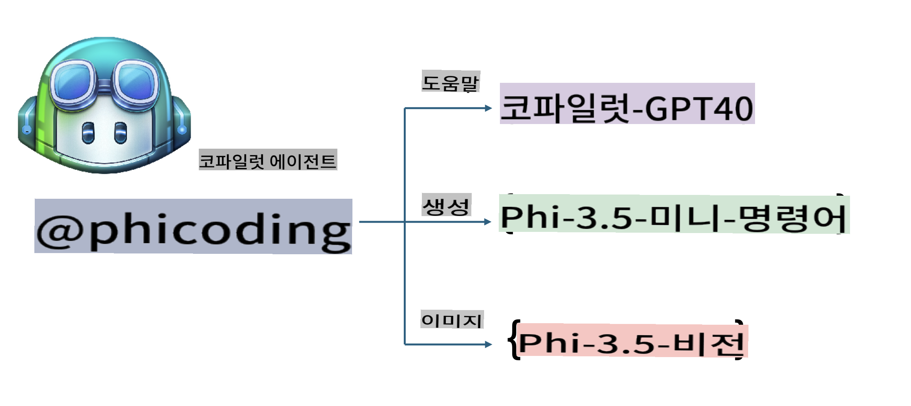
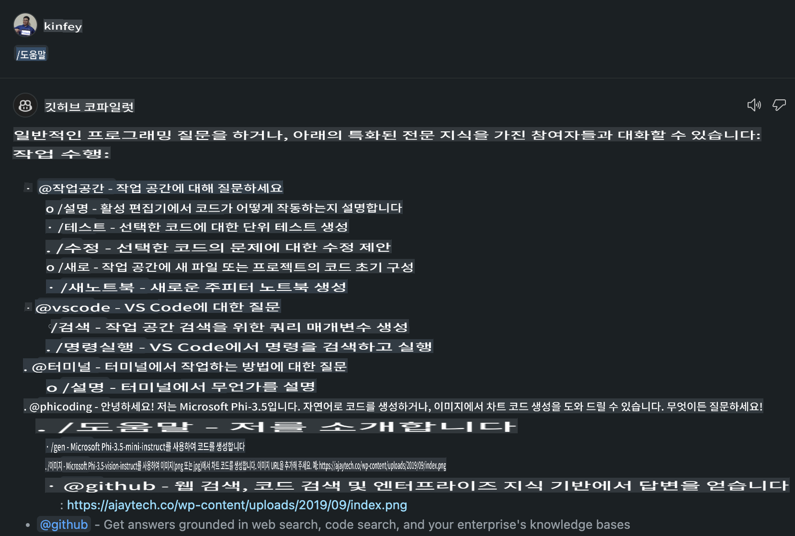
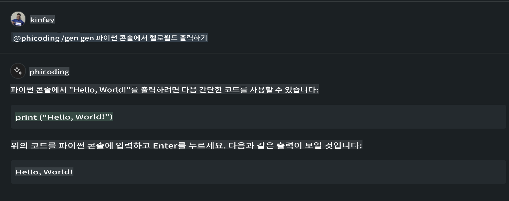
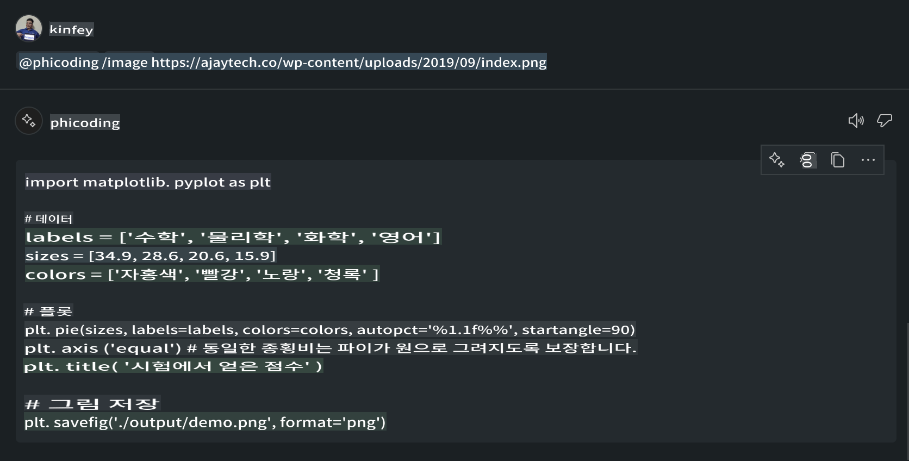

# **GitHub Models의 Phi-3.5를 사용하여 Visual Studio Code Chat Copilot Agent 만들기**

Visual Studio Code Copilot을 사용하고 계신가요? 특히 Chat에서, 다양한 에이전트를 사용하여 Visual Studio Code에서 프로젝트를 생성, 작성 및 유지 관리하는 능력을 향상시킬 수 있습니다. Visual Studio Code는 기업과 개인이 다양한 독점 분야에서 기능을 확장하기 위해 비즈니스 기반의 다양한 에이전트를 만들 수 있는 API를 제공합니다. 이 기사에서는 GitHub Models의 **Phi-3.5-mini-instruct (128k)**와 **Phi-3.5-vision-instruct (128k)**를 사용하여 자신만의 Visual Studio Code 에이전트를 만드는 방법에 대해 설명합니다.

## **GitHub Models의 Phi-3.5에 대해**

Phi-3/3.5 Family의 Phi-3/3.5-mini-instruct는 강력한 코드 이해 및 생성 능력을 가지고 있으며, Gemma-2-9b 및 Mistral-Nemo-12B-instruct-2407보다 우수합니다.



최신 GitHub Models는 이미 Phi-3.5-mini-instruct (128k)와 Phi-3.5-vision-instruct (128k) 모델에 대한 액세스를 제공합니다. 개발자는 OpenAI SDK, Azure AI Inference SDK 및 REST API를 통해 이 모델에 접근할 수 있습니다.


***Note: *** 여기서는 Azure AI Inference SDK를 사용하는 것이 좋습니다. 이는 생산 환경에서 Azure Model Catalog와 더 잘 전환할 수 있기 때문입니다.

다음은 GitHub Models와 연동 후 코드 생성 시나리오에서 **Phi-3.5-mini-instruct (128k)**와 **Phi-3.5-vision-instruct (128k)**의 결과이며, 다음 예제를 준비하기 위한 것입니다.

**Demo: GitHub Models Phi-3.5-mini-instruct (128k)에서 프롬프트로 코드 생성** ([이 링크를 클릭하세요](../../../../../code/09.UpdateSamples/Aug/ghmodel_phi35_instruct_demo.ipynb))

**Demo: GitHub Models Phi-3.5-vision-instruct (128k)에서 이미지로 코드 생성** ([이 링크를 클릭하세요](../../../../../code/09.UpdateSamples/Aug/ghmodel_phi35_vision_demo.ipynb))

## **GitHub Copilot Chat Agent에 대해**

GitHub Copilot Chat Agent는 코드 기반으로 다양한 프로젝트 시나리오에서 다양한 작업을 수행할 수 있습니다. 시스템에는 workspace, github, terminal, vscode 네 가지 에이전트가 있습니다.



에이전트 이름 앞에 ‘@’를 추가하면 해당 작업을 빠르게 완료할 수 있습니다. 기업의 경우 요구 사항, 코딩, 테스트 사양 및 릴리스와 같은 비즈니스 관련 콘텐츠를 추가하면 GitHub Copilot을 기반으로 한 더 강력한 기업 전용 기능을 가질 수 있습니다.

Visual Studio Code Chat Agent는 이제 공식적으로 API를 출시하여 기업 또는 기업 개발자가 다양한 소프트웨어 비즈니스 생태계를 기반으로 에이전트를 개발할 수 있도록 합니다. Visual Studio Code Extension Development의 개발 방법을 기반으로, Visual Studio Code Chat Agent API의 인터페이스에 쉽게 접근할 수 있습니다. 우리는 이 과정을 기반으로 개발할 수 있습니다.



개발 시나리오는 제3자 모델 API (예: GitHub Models, Azure Model Catalog, 오픈 소스 모델 기반의 자체 구축 서비스)에 대한 접근을 지원할 수 있으며, GitHub Copilot에서 제공하는 gpt-35-turbo, gpt-4 및 gpt-4o 모델도 사용할 수 있습니다.

## **Phi-3.5 기반의 @phicoding 에이전트 추가하기**

Phi-3.5의 프로그래밍 능력을 통합하여 코드 작성, 이미지 생성 코드 등의 작업을 완료하려고 합니다. Phi-3.5를 중심으로 구축된 에이전트 - @PHI를 완성합니다. 다음은 몇 가지 기능입니다.

1. **@phicoding /help** 명령을 통해 GitHub Copilot이 제공하는 GPT-4o 기반의 자기소개 생성

2. **@phicoding /gen** 명령을 통해 **Phi-3.5-mini-instruct (128k)** 기반의 다양한 프로그래밍 언어에 대한 코드 생성

3. **@phicoding /image** 명령을 통해 **Phi-3.5-vision-instruct (128k)** 및 이미지 완성을 기반으로 코드 생성



## **관련 단계**

1. npm을 사용하여 Visual Studio Code Extension 개발 지원 설치

```bash

npm install --global yo generator-code 

```
2. Visual Studio Code Extension 플러그인 생성 (Typescript 개발 모드를 사용하여, 이름은 phiext로 설정)

```bash

yo code 

```

3. 생성된 프로젝트를 열고 package.json을 수정합니다. 여기에 관련 설명과 구성, 그리고 GitHub Models의 구성이 포함됩니다. 여기에 GitHub Models 토큰을 추가해야 합니다.

```json

{
  "name": "phiext",
  "displayName": "phiext",
  "description": "",
  "version": "0.0.1",
  "engines": {
    "vscode": "^1.93.0"
  },
  "categories": [
    "AI",
    "Chat"
  ],
  "activationEvents": [],
  "enabledApiProposals": [
      "chatVariableResolver"
  ],
  "main": "./dist/extension.js",
  "contributes": {
    "chatParticipants": [
        {
            "id": "chat.phicoding",
            "name": "phicoding",
            "description": "Hey! I am Microsoft Phi-3.5, She can help me with coding problems, such as generation code with your natural language, or even generation code about chart from images. Just ask me anything!",
            "isSticky": true,
            "commands": [
                {
                    "name": "help",
                    "description": "Introduce myself to you"
                },
                {
                    "name": "gen",
                    "description": "Generate code for you with Microsoft Phi-3.5-mini-instruct"
                },
                {
                    "name": "image",
                    "description": "Generate code for chart from image(png or jpg) with Microsoft Phi-3.5-vision-instruct, please add image url like this : https://ajaytech.co/wp-content/uploads/2019/09/index.png"
                }
            ]
        }
    ],
    "commands": [
        {
            "command": "phicoding.namesInEditor",
            "title": "Use Microsoft Phi 3.5 in Editor"
        }
    ],
    "configuration": {
      "type": "object",
      "title": "githubmodels",
      "properties": {
        "githubmodels.endpoint": {
          "type": "string",
          "default": "https://models.inference.ai.azure.com",
          "description": "Your GitHub Models Endpoint",
          "order": 0
        },
        "githubmodels.api_key": {
          "type": "string",
          "default": "Your GitHub Models Token",
          "description": "Your GitHub Models Token",
          "order": 1
        },
        "githubmodels.phi35instruct": {
          "type": "string",
          "default": "Phi-3.5-mini-instruct",
          "description": "Your Phi-35-Instruct Model",
          "order": 2
        },
        "githubmodels.phi35vision": {
          "type": "string",
          "default": "Phi-3.5-vision-instruct",
          "description": "Your Phi-35-Vision Model",
          "order": 3
        }
      }
    }
  },
  "scripts": {
    "vscode:prepublish": "npm run package",
    "compile": "webpack",
    "watch": "webpack --watch",
    "package": "webpack --mode production --devtool hidden-source-map",
    "compile-tests": "tsc -p . --outDir out",
    "watch-tests": "tsc -p . -w --outDir out",
    "pretest": "npm run compile-tests && npm run compile && npm run lint",
    "lint": "eslint src",
    "test": "vscode-test"
  },
  "devDependencies": {
    "@types/vscode": "^1.93.0",
    "@types/mocha": "^10.0.7",
    "@types/node": "20.x",
    "@typescript-eslint/eslint-plugin": "^8.3.0",
    "@typescript-eslint/parser": "^8.3.0",
    "eslint": "^9.9.1",
    "typescript": "^5.5.4",
    "ts-loader": "^9.5.1",
    "webpack": "^5.94.0",
    "webpack-cli": "^5.1.4",
    "@vscode/test-cli": "^0.0.10",
    "@vscode/test-electron": "^2.4.1"
  },
  "dependencies": {
    "@types/node-fetch": "^2.6.11",
    "node-fetch": "^3.3.2",
    "@azure-rest/ai-inference": "latest",
    "@azure/core-auth": "latest",
    "@azure/core-sse": "latest"
  }
}


```

4. src/extension.ts 수정

```typescript

// The module 'vscode' contains the VS Code extensibility API
// Import the module and reference it with the alias vscode in your code below
import * as vscode from 'vscode';
import ModelClient from "@azure-rest/ai-inference";
import { AzureKeyCredential } from "@azure/core-auth";


interface IPhiChatResult extends vscode.ChatResult {
    metadata: {
        command: string;
    };
}


const MODEL_SELECTOR: vscode.LanguageModelChatSelector = { vendor: 'copilot', family: 'gpt-4o' };

function isValidImageUrl(url: string): boolean {
    const regex = /^(https?:\/\/.*\.(?:png|jpg))$/i;
    return regex.test(url);
}
  

// This method is called when your extension is activated
// Your extension is activated the very first time the command is executed
export function activate(context: vscode.ExtensionContext) {

    const codinghandler: vscode.ChatRequestHandler = async (request: vscode.ChatRequest, context: vscode.ChatContext, stream: vscode.ChatResponseStream, token: vscode.CancellationToken): Promise<IPhiChatResult> => {


        const config : any = vscode.workspace.getConfiguration('githubmodels');
        const endPoint: string = config.get('endpoint');
        const apiKey: string = config.get('api_key');
        const phi35instruct: string = config.get('phi35instruct');
        const phi35vision: string = config.get('phi35vision');
        
        if (request.command === 'help') {

            const content = "Welcome to Coding assistant with Microsoft Phi-3.5"; 
            stream.progress(content);


            try {
                const [model] = await vscode.lm.selectChatModels(MODEL_SELECTOR);
                if (model) {
                    const messages = [
                        vscode.LanguageModelChatMessage.User("Please help me express this content in a humorous way: I am a programming assistant who can help you convert natural language into code and generate code based on the charts in the images. output format like this : Hey I am Phi ......")
                    ];
                    const chatResponse = await model.sendRequest(messages, {}, token);
                    for await (const fragment of chatResponse.text) {
                        stream.markdown(fragment);
                    }
                }
            } catch(err) {
                console.log(err);
            }


            return { metadata: { command: 'help' } };

        }

        
        if (request.command === 'gen') {

            const content = "Welcome to use phi-3.5 to generate code";

            stream.progress(content);

            const client = new ModelClient(endPoint, new AzureKeyCredential(apiKey));

            const response = await client.path("/chat/completions").post({
              body: {
                messages: [
                  { role:"system", content: "You are a coding assistant.Help answer all code generation questions." },
                  { role:"user", content: request.prompt }
                ],
                model: phi35instruct,
                temperature: 0.4,
                max_tokens: 1000,
                top_p: 1.
              }
            });

            stream.markdown(response.body.choices[0].message.content);

            return { metadata: { command: 'gen' } };

        }


        
        if (request.command === 'image') {


            const content = "Welcome to use phi-3.5 to generate code from image(png or jpg),image url like this:https://ajaytech.co/wp-content/uploads/2019/09/index.png";

            stream.progress(content);

            if (!isValidImageUrl(request.prompt)) {
                stream.markdown('Please provide a valid image URL');
                return { metadata: { command: 'image' } };
            }
            else
            {

                const client = new ModelClient(endPoint, new AzureKeyCredential(apiKey));
    
                const response = await client.path("/chat/completions").post({
                    body: {
                      messages: [
                        { role: "system", content: "You are a helpful assistant that describes images in details." },
                        { role: "user", content: [
                            { type: "text", text: "Please generate code according to the chart in the picture according to the following requirements\n1. Keep all information in the chart, including data and text\n2. Do not generate additional information that is not included in the chart\n3. Please extract data from the picture, do not generate it from csv\n4. Please save the regenerated chart as a chart and save it to ./output/demo.png"},
                            { type: "image_url", image_url: {url: request.prompt}
                            }
                          ]
                        }
                      ],
                      model: phi35vision,
                      temperature: 0.4,
                      max_tokens: 2048,
                      top_p: 1.
                    }
                  });
    
                
                stream.markdown(response.body.choices[0].message.content);
    
                return { metadata: { command: 'image' } };
            }


        }


        return { metadata: { command: '' } };
    };


    const phi_ext = vscode.chat.createChatParticipant("chat.phicoding", codinghandler);

    phi_ext.iconPath = new vscode.ThemeIcon('sparkle');


    phi_ext.followupProvider = {
        provideFollowups(result: IPhiChatResult, context: vscode.ChatContext, token: vscode.CancellationToken) {
            return [{
                prompt: 'Let us coding with Phi-3.5 😋😋😋😋',
                label: vscode.l10n.t('Enjoy coding with Phi-3.5'),
                command: 'help'
            } satisfies vscode.ChatFollowup];
        }
    };

    context.subscriptions.push(phi_ext);
}

// This method is called when your extension is deactivated
export function deactivate() {}


```

6. 실행하기

***/help***



***@phicoding /help***


***@phicoding /gen***




***@phicoding /image***




샘플 코드를 다운로드할 수 있습니다: [클릭](../../../../../code/09.UpdateSamples/Aug/vscode)

## **Resources**

1. GitHub Models 가입하기 [https://gh.io/models](https://gh.io/models)

2. Visual Studio Code Extension Development 배우기 [https://code.visualstudio.com/api/get-started/your-first-extension](https://code.visualstudio.com/api/get-started/your-first-extension)

3. Visual Studio Code Coilot Chat API에 대해 배우기 [https://code.visualstudio.com/api/extension-guides/chat](https://code.visualstudio.com/api/extension-guides/chat)

면책 조항: 이 번역은 AI 모델에 의해 원본에서 번역되었으며 완벽하지 않을 수 있습니다. 
출력을 검토하고 필요한 수정 사항을 반영해 주세요.