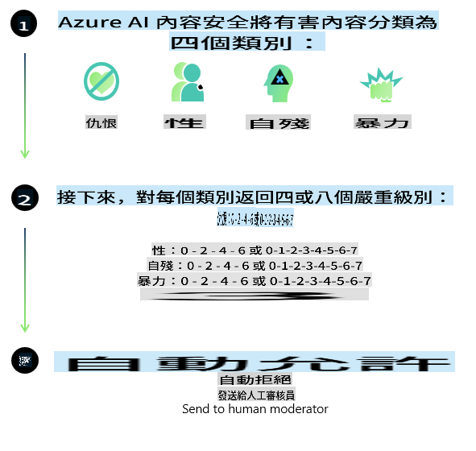
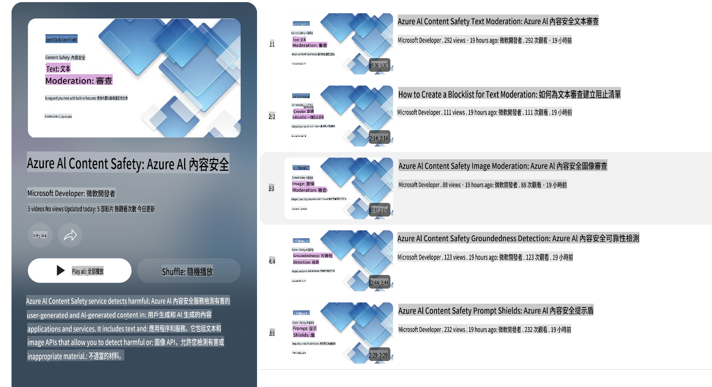

# Phi-3 模型的 AI 安全性
Phi-3 系列模型是依照 [Microsoft 負責任 AI 標準](https://query.prod.cms.rt.microsoft.com/cms/api/am/binary/RE5cmFl) 開發的，這是一套公司內部的要求，基於以下六個原則：問責性、透明度、公平性、可靠性和安全性、隱私和安全性，以及包容性，這些原則構成了 [Microsoft 的負責任 AI 原則](https://www.microsoft.com/ai/responsible-ai)。

像之前的 Phi-3 模型一樣，我們採用了多方面的安全評估和安全後訓練方法，並針對此版本的多語言能力採取了額外的措施。我們的安全訓練和評估方法，包括跨多種語言和風險類別的測試，詳述在 [Phi-3 安全後訓練論文](https://arxiv.org/abs/2407.13833) 中。雖然 Phi-3 模型受益於這種方法，開發者應該應用負責任的 AI 最佳實踐，包括對其特定用例和文化語言背景相關風險的映射、測量和緩解。

## 最佳實踐

像其他模型一樣，Phi 系列模型可能會表現出不公平、不可靠或冒犯的行為。

一些需要注意的 SLM 和 LLM 限制行為包括：

- **服務質量:** Phi 模型主要以英文文本進行訓練。其他語言的表現會較差。訓練數據中代表性較少的英語變體可能比標準美式英語表現更差。
- **傷害的表現與刻板印象的延續:** 這些模型可能會過度或不足地代表某些群體，抹去某些群體的代表性，或強化貶低或負面的刻板印象。儘管進行了安全後訓練，這些限制仍可能存在，因為不同群體的代表性水平不同，或訓練數據中反映現實世界模式和社會偏見的負面刻板印象例子存在。
- **不當或冒犯性內容:** 這些模型可能會生成其他類型的不當或冒犯性內容，這可能使其在敏感環境下部署時不合適，除非針對具體用例採取額外的緩解措施。
- **信息可靠性:** 語言模型可能會生成無意義的內容或捏造內容，這些內容可能聽起來合理但實際上不準確或過時。
- **代碼範圍有限:** Phi-3 訓練數據大部分基於 Python 並使用常見包如 "typing, math, random, collections, datetime, itertools"。如果模型生成的 Python 腳本使用了其他包或其他語言的腳本，我們強烈建議用戶手動驗證所有 API 的使用。

開發者應該應用負責任的 AI 最佳實踐，並確保特定用例符合相關法律和法規（例如隱私、貿易等）。

## 負責任的 AI 考量

像其他語言模型一樣，Phi 系列模型可能會表現出不公平、不可靠或冒犯的行為。一些需要注意的限制行為包括：

**服務質量:** Phi 模型主要以英文文本進行訓練。其他語言的表現會較差。訓練數據中代表性較少的英語變體可能比標準美式英語表現更差。

**傷害的表現與刻板印象的延續:** 這些模型可能會過度或不足地代表某些群體，抹去某些群體的代表性，或強化貶低或負面的刻板印象。儘管進行了安全後訓練，這些限制仍可能存在，因為不同群體的代表性水平不同，或訓練數據中反映現實世界模式和社會偏見的負面刻板印象例子存在。

**不當或冒犯性內容:** 這些模型可能會生成其他類型的不當或冒犯性內容，這可能使其在敏感環境下部署時不合適，除非針對具體用例採取額外的緩解措施。
信息可靠性: 語言模型可能會生成無意義的內容或捏造內容，這些內容可能聽起來合理但實際上不準確或過時。

**代碼範圍有限:** Phi-3 訓練數據大部分基於 Python 並使用常見包如 "typing, math, random, collections, datetime, itertools"。如果模型生成的 Python 腳本使用了其他包或其他語言的腳本，我們強烈建議用戶手動驗證所有 API 的使用。

開發者應該應用負責任的 AI 最佳實踐，並確保特定用例符合相關法律和法規（例如隱私、貿易等）。重要的考量領域包括：

**分配:** 模型可能不適合可能對法律地位或資源或生活機會的分配（如住房、就業、信貸等）有重大影響的場景，除非進行進一步的評估和額外的去偏技術。

**高風險場景:** 開發者應評估在高風險場景中使用模型的適用性，因為不公平、不可靠或冒犯性的輸出可能會非常昂貴或導致傷害。這包括在敏感或專業領域提供建議，這些領域的準確性和可靠性至關重要（如法律或健康建議）。應根據部署情境在應用層面實施額外的保護措施。

**錯誤信息:** 模型可能會生成不準確的信息。開發者應遵循透明性最佳實踐，告知最終用戶他們正在與 AI 系統互動。在應用層面，開發者可以建立反饋機制和管道，將回應基於特定用例的上下文信息，這種技術稱為檢索增強生成 (RAG)。

**生成有害內容:** 開發者應根據其情境評估輸出，並使用可用的安全分類器或適合其用例的自定義解決方案。

**濫用:** 其他形式的濫用如欺詐、垃圾郵件或惡意軟件生成可能是可能的，開發者應確保其應用程序不違反適用的法律和法規。

### 微調和 AI 內容安全

在微調模型後，我們強烈建議利用 [Azure AI 內容安全](https://learn.microsoft.com/azure/ai-services/content-safety/overview) 措施來監控模型生成的內容，識別並阻止潛在的風險、威脅和質量問題。

[Azure AI 內容安全](https://learn.microsoft.com/azure/ai-services/content-safety/overview) 支持文本和圖像內容。它可以在雲端、離線容器以及邊緣/嵌入式設備上部署。

## Azure AI 內容安全概述

Azure AI 內容安全並非一刀切的解決方案；它可以根據企業的具體政策進行定制。此外，其多語言模型使其能夠同時理解多種語言。

- **Azure AI 內容安全**
- **Microsoft 開發者**
- **5 部影片**

Azure AI 內容安全服務能夠檢測應用程序和服務中由用戶生成和 AI 生成的有害內容。它包括文本和圖像 API，允許您檢測有害或不當的材料。

[AI 內容安全播放列表](https://www.youtube.com/playlist?list=PLlrxD0HtieHjaQ9bJjyp1T7FeCbmVcPkQ)

免责声明：本翻译由AI模型从原文翻译而来，可能不够完美。请审阅输出并做出任何必要的修改。