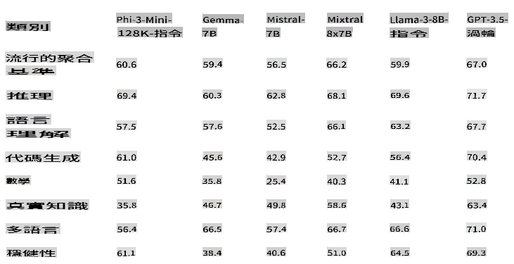
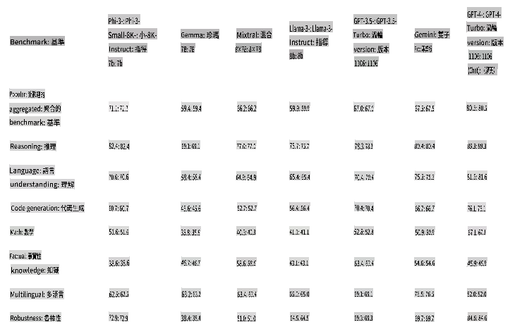
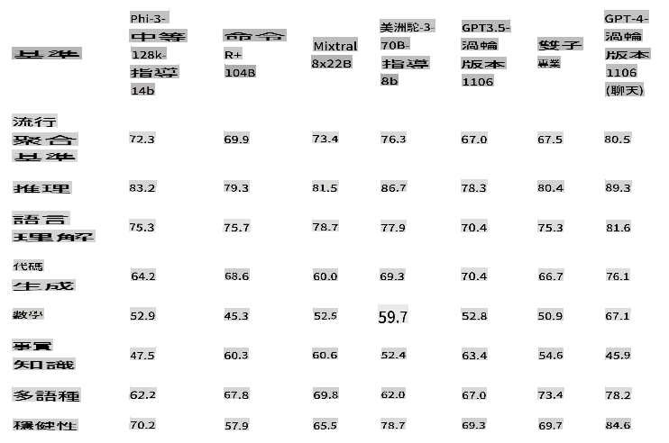
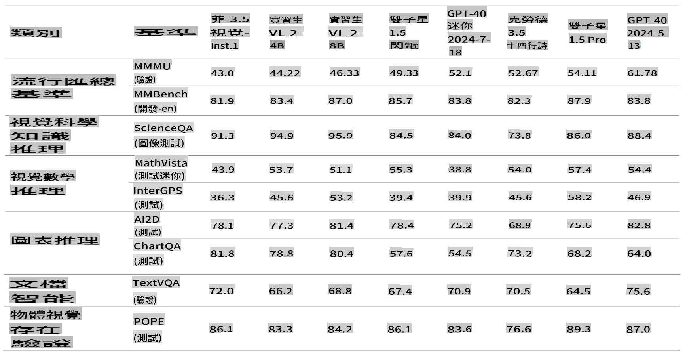

# Microsoft 的 Phi-3 系列

Phi-3 模型是目前最強大且具成本效益的小型語言模型（SLMs），在各種語言、推理、編碼和數學基準測試中表現優於同尺寸和更大尺寸的模型。這次發佈擴展了高質量模型的選擇，為客戶提供更多實用的選擇來構建生成式 AI 應用程式。

Phi-3 系列包括 mini、small、medium 和 vision 版本，根據不同的參數量進行訓練，以滿足各種應用場景。每個模型都經過指令調整，並根據 Microsoft 的負責任 AI、安全和安全標準開發，確保可即開即用。Phi-3-mini 的表現超越了其兩倍大小的模型，而 Phi-3-small 和 Phi-3-medium 則超越了更大的模型，包括 GPT-3.5T。

## Phi-3 任務示例

| | |
|-|-|
|任務|Phi-3|
|語言任務|是|
|數學與推理|是|
|編碼|是|
|函數調用|否|
|自我編排（助手）|否|
|專用嵌入模型|否|

## Phi-3-mini

Phi-3-mini 是一個擁有 3.8B 參數的語言模型，可在 [Microsoft Azure AI Studio](https://ai.azure.com/explore/models?selectedCollection=phi)、[Hugging Face](https://huggingface.co/collections/microsoft/phi-3-6626e15e9585a200d2d761e3) 和 [Ollama](https://ollama.com/library/phi3) 上獲得。它提供兩種上下文長度：[128K](https://ai.azure.com/explore/models/Phi-3-mini-128k-instruct/version/9/registry/azureml) 和 [4K](https://ai.azure.com/explore/models/Phi-3-mini-4k-instruct/version/9/registry/azureml)。

Phi-3-mini 是基於 Transformer 的語言模型，擁有 38 億參數。它使用包含教育性信息的高質量數據進行訓練，並增強了各種 NLP 合成文本的新數據源，以及內部和外部的聊天數據集，顯著提升了聊天能力。此外，Phi-3-mini 在預訓練後通過監督微調（SFT）和直接偏好優化（DPO）進行了聊天微調。經過這些後期訓練，Phi-3-mini 在對齊性、魯棒性和安全性方面顯示出顯著改進。該模型是 Phi-3 系列的一部分，提供兩個版本，4K 和 128K，代表其可支持的上下文長度（以 tokens 計）。

## Phi-3.5-mini-instruct

[Phi-3.5 mini](https://ai.azure.com/explore/models/Phi-3.5-mini-instruct/version/1/registry/azureml) 是一個輕量級的、最先進的開放模型，基於 Phi-3 使用的數據集——合成數據和篩選的公開網站數據——專注於高質量、推理密集的數據。該模型屬於 Phi-3 模型系列，支持 128K token 的上下文長度。該模型經過嚴格的增強過程，結合監督微調、近端策略優化和直接偏好優化，以確保精確的指令遵循和強大的安全措施。

Phi-3.5 Mini 擁有 3.8B 參數，是一個僅解碼的 Transformer 模型，使用與 Phi-3 Mini 相同的 tokenizer。

總體而言，該模型僅使用 3.8B 參數便達到了與更大模型相似的多語言理解和推理能力。然而，對於某些任務而言，由於其尺寸限制，模型在存儲事實知識方面存在局限性，因此用戶可能會遇到事實不正確的情況。不過，我們相信這一弱點可以通過在 RAG 設置下使用搜索引擎來增強 Phi-3.5 來解決。

### 語言支持

下表突出顯示了 Phi-3 在多語言 MMLU、MEGA 和多語言 MMLU-pro 數據集上的多語言能力。總體而言，我們觀察到，即使僅有 3.8B 活躍參數，該模型在多語言任務中的競爭力也與具有更大活躍參數的模型相當。

## Phi-3-small

Phi-3-small 是一個擁有 7B 參數的語言模型，提供兩種上下文長度 [128K](https://ai.azure.com/explore/models/Phi-3-small-128k-instruct/version/2/registry/azureml) 和 [8K](https://ai.azure.com/explore/models/Phi-3-small-8k-instruct/version/2/registry/azureml)，在各種語言、推理、編碼和數學基準測試中表現優於 GPT-3.5T。

Phi-3-small 是基於 Transformer 的語言模型，擁有 70 億參數。它使用包含教育性信息的高質量數據進行訓練，並增強了各種 NLP 合成文本的新數據源，以及內部和外部的聊天數據集，顯著提升了聊天能力。此外，Phi-3-small 在預訓練後通過監督微調（SFT）和直接偏好優化（DPO）進行了聊天微調。經過這些後期訓練，Phi-3-small 在對齊性、魯棒性和安全性方面顯示出顯著改進。與 Phi-3-Mini 相比，Phi-3-small 在多語言數據集上的訓練更加深入。該模型系列提供兩個版本，8K 和 128K，代表其可支持的上下文長度（以 tokens 計）。

## Phi-3-medium

Phi-3-medium 是一個擁有 14B 參數的語言模型，提供兩種上下文長度 [128K](https://ai.azure.com/explore/models/Phi-3-medium-128k-instruct/version/2/registry/azureml) 和 [4K](https://ai.azure.com/explore/models/Phi-3-medium-4k-instruct/version/2/registry/azureml)，在性能上超越了 Gemini 1.0 Pro。

Phi-3-medium 是基於 Transformer 的語言模型，擁有 140 億參數。它使用包含教育性信息的高質量數據進行訓練，並增強了各種 NLP 合成文本的新數據源，以及內部和外部的聊天數據集，顯著提升了聊天能力。此外，Phi-3-medium 在預訓練後通過監督微調（SFT）和直接偏好優化（DPO）進行了聊天微調。經過這些後期訓練，Phi-3-medium 在對齊性、魯棒性和安全性方面顯示出顯著改進。該模型系列提供兩個版本，4K 和 128K，代表其可支持的上下文長度（以 tokens 計）。

[!NOTE]
我們建議升級到 Phi-3.5-MoE 作為 Phi-3-medium 的升級版，因為 MoE 模型在性能和成本效益上更佳。

## Phi-3-vision

[Phi-3-vision](https://ai.azure.com/explore/models/Phi-3-vision-128k-instruct/version/2/registry/azureml) 是一個擁有 4.2B 參數的多模態模型，具有語言和視覺能力，在一般視覺推理、OCR 和表格及圖表理解任務中超越了更大的模型如 Claude-3 Haiku 和 Gemini 1.0 Pro V。

Phi-3-vision 是 Phi-3 系列中的首個多模態模型，結合了文本和圖像。Phi-3-vision 可用於對真實世界的圖像進行推理，並從圖像中提取和推理文本。它還針對圖表和圖解理解進行了優化，可用於生成見解和回答問題。Phi-3-vision 基於 Phi-3-mini 的語言能力，繼續在小尺寸中保持強大的語言和圖像推理質量。

## Phi-3.5-vision

[Phi-3.5 Vision](https://ai.azure.com/explore/models/Phi-3.5-vision-instruct/version/1/registry/azureml) 是一個輕量級的、最先進的開放多模態模型，基於包含合成數據和篩選的公開網站數據的數據集，專注於高質量、推理密集的文本和視覺數據。該模型屬於 Phi-3 模型系列，多模態版本支持 128K token 的上下文長度。該模型經過嚴格的增強過程，結合監督微調和直接偏好優化，以確保精確的指令遵循和強大的安全措施。

Phi-3.5 Vision 擁有 4.2B 參數，包含圖像編碼器、連接器、投影器和 Phi-3 Mini 語言模型。

該模型旨在廣泛用於英語的商業和研究用途。該模型為需要視覺和文本輸入能力的通用 AI 系統和應用提供用途，這些應用包括：
1) 記憶/計算受限環境。
2) 延遲受限場景。
3) 一般圖像理解。
4) OCR。
5) 表格和圖表理解。
6) 多圖像比較。
7) 多圖像或視頻片段摘要。

Phi-3.5-vision 模型旨在加速高效語言和多模態模型的研究，作為生成式 AI 功能的構建塊。

## Phi-3.5-MoE

[Phi-3.5 MoE](https://ai.azure.com/explore/models/Phi-3.5-MoE-instruct/version/1/registry/azureml) 是一個輕量級的、最先進的開放模型，基於 Phi-3 使用的數據集——合成數據和篩選的公開文檔——專注於高質量、推理密集的數據。該模型支持多語言，並提供 128K token 的上下文長度。該模型經過嚴格的增強過程，結合監督微調、近端策略優化和直接偏好優化，以確保精確的指令遵循和強大的安全措施。

Phi-3 MoE 擁有 16x3.8B 參數，使用 2 個專家時有 6.6B 活躍參數。該模型是一個專家混合僅解碼的 Transformer 模型，使用的 tokenizer 的詞彙量為 32,064。

該模型旨在廣泛用於英語的商業和研究用途。該模型為需要以下功能的通用 AI 系統和應用提供用途：
1) 記憶/計算受限環境。
2) 延遲受限場景。
3) 強大的推理能力（尤其是數學和邏輯）。

MoE 模型旨在加速語言和多模態模型的研究，作為生成式 AI 功能的構建塊，並需要額外的計算資源。

> [!NOTE]
>
> Phi-3 模型在事實知識基準測試（如 TriviaQA）中的表現不如預期，因為較小的模型尺寸導致其在保留事實方面的能力較低。

## Phi Silica

我們推出了 Phi Silica，該模型基於 Phi 系列模型構建，專為 Copilot+ PC 中的 NPU 設計。Windows 是首個擁有為 NPU 定制的小型語言模型（SLM）並隨附的平臺。Phi Silica API 以及 OCR、Studio Effects、Live Captions 和 Recall User Activity API 將於六月在 Windows Copilot Library 中提供。更多的 API 如 Vector Embedding、RAG API 和 Text Summarization 將在後續推出。

## **尋找所有 Phi-3 模型**

- [Azure AI](https://ai.azure.com/explore/models?selectedCollection=phi)
- [Hugging Face](https://huggingface.co/collections/microsoft/phi-3-6626e15e9585a200d2d761e3)

## ONNX 模型

兩個 ONNX 模型 “cpu-int4-rtn-block-32” 和 “cpu-int4-rtn-block-32-acc-level-4” 之間的主要區別在於準確度等級。帶有 “acc-level-4” 的模型設計平衡延遲和準確度，略微犧牲準確度以獲得更好的性能，這可能特別適合移動設備。

## 模型選擇示例

| | | | |
|-|-|-|-|
|客戶需求|任務|推薦模型|更多細節|
|需要一個簡單總結對話的模型|對話總結|Phi-3 文本模型|決定因素是客戶有明確且簡單的語言任務|
|免費數學家教應用程式|數學與推理|Phi-3 文本模型|因為應用程式是免費的，客戶希望解決方案不會產生經常性的成本|
|自動巡邏車攝像頭|視覺分析|Phi-Vision|需要一個可以在無網絡情況下運行的解決方案|
|希望構建一個基於 AI 的旅行預訂助手|需要複雜的計劃、函數調用和編排|GPT 模型|需要計劃、調用 API 獲取信息並執行的能力|
|希望為員工構建一個助手|RAG、多領域、複雜且開放式|GPT 模型|開放式場景，需要更廣泛的世界知識，因此更大的模型更適合|

免責聲明：此翻譯由AI模型從原文翻譯而來，可能不完全準確。請檢查輸出並進行必要的修正。