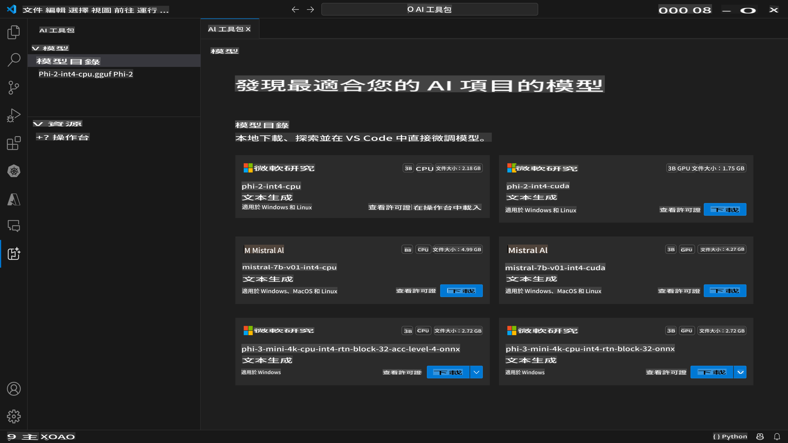

# AI Toolkit for VScode (Windows)

[AI Toolkit for VS Code](https://marketplace.visualstudio.com/items?itemName=ms-windows-ai-studio.windows-ai-studio) 讓生成式 AI 應用程式開發變得更簡單，結合了 Azure AI Studio Catalog 和 Hugging Face 等目錄中的先進 AI 開發工具和模型。你可以瀏覽由 Azure ML 和 Hugging Face 支援的 AI 模型目錄，下載到本地，進行微調、測試並在應用程式中使用。

AI Toolkit Preview 將在本地運行。根據你選擇的模型，有些任務僅支援 Windows 和 Linux。

本地推理或微調，取決於你選擇的模型，你可能需要 GPU，例如 NVIDIA CUDA GPU。

如果你在雲端運行，雲端資源需要具備 GPU，請確保檢查你的環境。若在 Windows + WSL 本地運行，請先安裝並設置 WSL Ubuntu 發行版 18.4 或更高版本為預設。

## 入門指南

[了解如何安裝 Windows Subsystem for Linux](https://learn.microsoft.com/windows/wsl/install?WT.mc_id=aiml-137032-kinfeylo)

以及[更改預設發行版](https://learn.microsoft.com/windows/wsl/install#change-the-default-linux-distribution-installed)。

[AI Tooklit GitHub Repo](https://github.com/microsoft/vscode-ai-toolkit/)

- Windows 或 Linux。
- **MacOS 支援即將推出**
- 在 Windows 和 Linux 上進行微調，你需要 Nvidia GPU。此外，**Windows** 需要安裝 Ubuntu 發行版 18.4 或更高版本的 Linux 子系統。[了解如何安裝 Windows Subsystem for Linux](https://learn.microsoft.com/windows/wsl/install) 和[更改預設發行版](https://learn.microsoft.com/windows/wsl/install#change-the-default-linux-distribution-installed)。

### 安裝 AI Toolkit

AI Toolkit 作為 [Visual Studio Code Extension](https://code.visualstudio.com/docs/setup/additional-components#_vs-code-extensions) 提供，所以你需要先安裝 [VS Code](https://code.visualstudio.com/docs/setup/windows?WT.mc_id=aiml-137032-kinfeylo)，並從 [VS Marketplace](https://marketplace.visualstudio.com/items?itemName=ms-windows-ai-studio.windows-ai-studio) 下載 AI Toolkit。
[AI Toolkit 可在 Visual Studio Marketplace 獲得](https://marketplace.visualstudio.com/items?itemName=ms-windows-ai-studio.windows-ai-studio)，可以像其他 VS Code 擴展一樣安裝。

如果你不熟悉安裝 VS Code 擴展，請按照以下步驟：

### 登錄

1. 在 VS Code 的活動欄中選擇 **Extensions**
1. 在擴展搜尋欄中輸入 "AI Toolkit"
1. 選擇 "AI Toolkit for Visual Studio code"
1. 選擇 **Install**

現在，你可以使用這個擴展了！

系統會提示你登錄 GitHub，請點擊 "Allow" 繼續。你將被重定向到 GitHub 登錄頁面。

請登錄並按照步驟操作。完成後，你將被重定向回 VS Code。

擴展安裝完成後，你會在活動欄中看到 AI Toolkit 圖標。

讓我們來探索可用的操作！

### 可用操作

AI Toolkit 的主要側邊欄組織成

- **Models**
- **Resources**
- **Playground**  
- **Fine-tuning**

在 Resources 部分可用。要開始，請選擇 **Model Catalog**。

### 從目錄下載模型

從 VS Code 側邊欄啟動 AI Toolkit 後，你可以選擇以下選項：



- 從 **Model Catalog** 找到支援的模型並下載到本地
- 在 **Model Playground** 中測試模型推理
- 在本地或遠端的 **Model Fine-tuning** 中進行模型微調
- 通過命令面板將微調後的模型部署到雲端

> [!NOTE]
>
> **GPU Vs CPU**
>
> 你會注意到模型卡片顯示了模型大小、平台和加速器類型（CPU，GPU）。對於具有至少一個 GPU 的 **Windows 設備**，選擇僅針對 Windows 的模型版本以獲得最佳性能。
>
> 這確保你擁有針對 DirectML 加速器優化的模型。
>
> 模型名稱格式為
>
> - `{model_name}-{accelerator}-{quantization}-{format}`。
>
>要檢查你的 Windows 設備是否具有 GPU，打開 **Task Manager**，然後選擇 **Performance** 標籤。如果你有 GPU，它們將顯示為 "GPU 0" 或 "GPU 1" 等名稱。

### 在 Playground 中運行模型

設置所有參數後，點擊 **Generate Project**。

模型下載完成後，在目錄中的模型卡片上選擇 **Load in Playground**：

- 啟動模型下載
- 安裝所有先決條件和依賴項
- 創建 VS Code 工作區


當模型下載完成後，你可以從 AI Toolkit 啟動項目。

> ***Note*** 如果你想嘗試預覽功能進行遠端推理或微調，請遵循[這個指南](https://aka.ms/previewFinetune)

### 針對 Windows 優化的模型

你應該會看到模型響應被流式傳回：

AI Toolkit 提供了一系列已針對 Windows 優化的公開可用 AI 模型。這些模型存儲在不同的位置，包括 Hugging Face、GitHub 等，但你可以瀏覽模型，並在一個地方找到所有這些模型，準備下載並在你的 Windows 應用程式中使用。


### 模型選擇

如果你的 *Windows* 設備上**沒有** **GPU**，但你選擇了

- Phi-3-mini-4k-**directml**-int4-awq-block-128-onnx 模型

模型響應會*非常慢*。

你應該下載 CPU 優化版本：

- Phi-3-mini-4k-**cpu**-int4-rtn-block-32-acc-level-4-onnx。

也可以更改：

**上下文說明：** 幫助模型理解你請求的更大背景。這可以是背景信息、示例/演示你想要的內容或解釋你的任務目的。

**推理參數：**

- *最大響應長度*: 模型返回的最大 token 數。
- *溫度*: 模型溫度是一個參數，控制語言模型輸出的隨機性。較高的溫度意味著模型冒更多風險，給你一個多樣化的詞語混合。而較低的溫度使模型更保守，給出更集中和可預測的響應。
- *Top P*: 也稱為核採樣，是一個控制語言模型在預測下一個詞時考慮多少可能詞語或短語的設置。
- *頻率懲罰*: 這個參數影響模型在輸出中重複詞語或短語的頻率。較高的值（接近 1.0）鼓勵模型*避免*重複詞語或短語。
- *存在懲罰*: 這個參數用於生成式 AI 模型，以鼓勵生成文本的多樣性和特異性。較高的值（接近 1.0）鼓勵模型包含更多新穎和多樣的 token。較低的值更可能使模型生成常見或陳詞濫調的短語。

### 在應用程式中使用 REST API

AI Toolkit 附帶一個本地 REST API 網絡伺服器 **端口 5272**，使用 [OpenAI chat completions 格式](https://platform.openai.com/docs/api-reference/chat/create)。

這使你能在本地測試應用程式，而不必依賴雲端 AI 模型服務。例如，以下 JSON 文件顯示如何配置請求的主體：

```json
{
    "model": "Phi-3-mini-4k-directml-int4-awq-block-128-onnx",
    "messages": [
        {
            "role": "user",
            "content": "what is the golden ratio?"
        }
    ],
    "temperature": 0.7,
    "top_p": 1,
    "top_k": 10,
    "max_tokens": 100,
    "stream": true
}
```

你可以使用（例如）[Postman](https://www.postman.com/) 或 CURL（客戶端 URL）實用程序測試 REST API：

```bash
curl -vX POST http://127.0.0.1:5272/v1/chat/completions -H 'Content-Type: application/json' -d @body.json
```

### 使用 OpenAI Python 客戶端庫

```python
from openai import OpenAI

client = OpenAI(
    base_url="http://127.0.0.1:5272/v1/", 
    api_key="x" # required for the API but not used
)

chat_completion = client.chat.completions.create(
    messages=[
        {
            "role": "user",
            "content": "what is the golden ratio?",
        }
    ],
    model="Phi-3-mini-4k-cuda-int4-onnx",
)

print(chat_completion.choices[0].message.content)
```

### 使用 Azure OpenAI .NET 客戶端庫

使用 NuGet 將 [Azure OpenAI .NET 客戶端庫](https://www.nuget.org/packages/Azure.AI.OpenAI/) 添加到你的項目中：

```bash
dotnet add {project_name} package Azure.AI.OpenAI --version 1.0.0-beta.17
```

將一個名為 **OverridePolicy.cs** 的 C# 文件添加到你的項目中，並粘貼以下代碼：

```csharp
// OverridePolicy.cs
using Azure.Core.Pipeline;
using Azure.Core;

internal partial class OverrideRequestUriPolicy(Uri overrideUri)
    : HttpPipelineSynchronousPolicy
{
    private readonly Uri _overrideUri = overrideUri;

    public override void OnSendingRequest(HttpMessage message)
    {
        message.Request.Uri.Reset(_overrideUri);
    }
}
```

接下來，將以下代碼粘貼到你的 **Program.cs** 文件中：

```csharp
// Program.cs
using Azure.AI.OpenAI;

Uri localhostUri = new("http://localhost:5272/v1/chat/completions");

OpenAIClientOptions clientOptions = new();
clientOptions.AddPolicy(
    new OverrideRequestUriPolicy(localhostUri),
    Azure.Core.HttpPipelinePosition.BeforeTransport);
OpenAIClient client = new(openAIApiKey: "unused", clientOptions);

ChatCompletionsOptions options = new()
{
    DeploymentName = "Phi-3-mini-4k-directml-int4-awq-block-128-onnx",
    Messages =
    {
        new ChatRequestSystemMessage("You are a helpful assistant. Be brief and succinct."),
        new ChatRequestUserMessage("What is the golden ratio?"),
    }
};

StreamingResponse<StreamingChatCompletionsUpdate> streamingChatResponse
    = await client.GetChatCompletionsStreamingAsync(options);

await foreach (StreamingChatCompletionsUpdate chatChunk in streamingChatResponse)
{
    Console.Write(chatChunk.ContentUpdate);
}
```

## 使用 AI Toolkit 進行微調

- 從模型發現和 Playground 開始。
- 使用本地計算資源進行模型微調和推理。
- 使用 Azure 資源進行遠端微調和推理。

[使用 AI Toolkit 進行微調](../04.Fine-tuning/Finetuning_VSCodeaitoolkit.md)

## AI Toolkit 問答資源

請參閱我們的 [問答頁面](https://github.com/microsoft/vscode-ai-toolkit/blob/main/QA.md)，了解最常見的問題和解決方案。

免责声明：此翻译由AI模型从原文翻译而来，可能不够完美。
请审阅翻译结果并做出任何必要的修改。