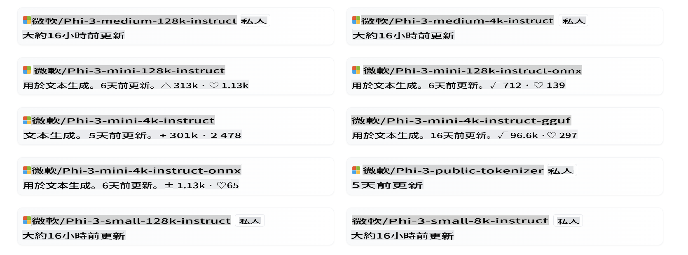

# **在 Hugging Face 上使用 Phi-3**

[Hugging Face](https://huggingface.co/) 是一個非常受歡迎的 AI 社群，擁有豐富的數據和開源模型資源。不同的廠商會通過 Hugging Face 發佈開源的 LLM 和 SLM，比如 Microsoft、Meta、Mistral、Apple、Google 等。



Microsoft Phi-3 已經在 Hugging Face 上發佈。開發者可以根據場景和業務需求下載相應的 Phi-3 模型。除了在 Hugging Face 部署 Phi-3 Pytorch 模型外，我們還發佈了量化模型，使用 GGUF 和 ONNX 格式，給最終用戶更多選擇。

## **1. 從 Hugging Face 下載 Phi-3**

```bash

git lfs install 

git clone https://huggingface.co/microsoft/Phi-3-mini-4k-instruct

```

## **2. 了解 Phi-3 的 Prompt 模板**

在訓練 Phi-3 時有特定的數據模板，所以在使用 Phi-3 時，發送 Prompt 需要通過模板設置。在微調時，數據也需要根據模板進行擴展。

模板有三個角色，包括 system、user 和 assistant。

```txt

<|system|>
Your Role<|end|>
<|user|>
Your Question?<|end|>
<|assistant|>

```

例如

```txt

<|system|>
Your are a python developer.<|end|>
<|user|>
Help me generate a bubble algorithm<|end|>
<|assistant|>

```

## **3. 使用 Python 進行 Phi-3 推理**

使用 Phi-3 進行推理是指根據輸入數據使用 Phi-3 模型生成預測或輸出。Phi-3 模型是一系列小型語言模型（SLM），包括 Phi-3-Mini、Phi-3-Small 和 Phi-3-Medium，每個模型設計用於不同的應用場景並具有不同的參數大小。這些模型經過高質量數據訓練，並針對聊天能力、對齊、魯棒性和安全性進行了微調。它們可以使用 ONNX 和 TensorFlow Lite 部署在邊緣和雲平台上，並按照 Microsoft 的負責任 AI 原則開發。

例如，Phi-3-Mini 是一個輕量級的、最先進的開源模型，擁有 38 億參數，適合使用聊天格式的提示，支持最多 128K tokens 的上下文長度。它是同重量級中首個支持如此長上下文的模型。

Phi-3 模型可在 Azure AI MaaS、HuggingFace、NVIDIA、Ollama、ONNX 等平台上獲取，可用於各種應用，包括實時交互、自主系統和需要低延遲的應用。

有很多種方式可以引用 Phi-3。您可以使用不同的編程語言來引用該模型。

這是一個 Python 的示例。

```python

import torch
from transformers import AutoModelForCausalLM, AutoTokenizer, pipeline

torch.random.manual_seed(0)

model = AutoModelForCausalLM.from_pretrained(
    "microsoft/Phi-3-mini-4k-instruct", 
    device_map="cuda", 
    torch_dtype="auto", 
    trust_remote_code=True, 
)
tokenizer = AutoTokenizer.from_pretrained("microsoft/Phi-3-mini-4k-instruct")

messages = [
    {"role": "system", "content": "Your are a python developer."},
    {"role": "user", "content": "Help me generate a bubble algorithm"},
]

pipe = pipeline(
    "text-generation",
    model=model,
    tokenizer=tokenizer,
)

generation_args = {
    "max_new_tokens": 600,
    "return_full_text": False,
    "temperature": 0.3,
    "do_sample": False,
}

output = pipe(messages, **generation_args)
print(output[0]['generated_text'])


```

> [!NOTE]
> 您可以看看這個結果是否與您想像中的一致

## **4. 使用 C# 進行 Phi-3 推理**

這是一個 .NET Console 應用程序中的示例。

C# 專案需要添加以下包：

```bash
dotnet add package Microsoft.ML.OnnxRuntime --version 1.18.0
dotnet add package Microsoft.ML.OnnxRuntimeGenAI --version 0.3.0-rc2
dotnet add package Microsoft.ML.OnnxRuntimeGenAI.Cuda --version 0.3.0-rc2
```

這是 C# 代碼。

```csharp
using System;
using Microsoft.ML.OnnxRuntimeGenAI;


// ONNX 模型文件的文件夾位置
var modelPath = @"..\models\Phi-3-mini-4k-instruct-onnx";
var model = new Model(modelPath);
var tokenizer = new Tokenizer(model);

var systemPrompt = "You are an AI assistant that helps people find information. Answer questions using a direct style. Do not share more information that the requested by the users.";

// 聊天開始
Console.WriteLine(@"Ask your question. Type an empty string to Exit.");


// 聊天循環
while (true)
{
    // 獲取用戶問題
    Console.WriteLine();
    Console.Write(@"Q: ");
    var userQ = Console.ReadLine();    
    if (string.IsNullOrEmpty(userQ))
    {
        break;
    }

    // 顯示 phi3 的回應
    Console.Write("Phi3: ");
    var fullPrompt = $"<|system|>{systemPrompt}<|end|><|user|>{userQ}<|end|><|assistant|>";
    var tokens = tokenizer.Encode(fullPrompt);

    var generatorParams = new GeneratorParams(model);
    generatorParams.SetSearchOption("max_length", 2048);
    generatorParams.SetSearchOption("past_present_share_buffer", false);
    generatorParams.SetInputSequences(tokens);

    var generator = new Generator(model, generatorParams);
    while (!generator.IsDone())
    {
        generator.ComputeLogits();
        generator.GenerateNextToken();
        var outputTokens = generator.GetSequence(0);
        var newToken = outputTokens.Slice(outputTokens.Length - 1, 1);
        var output = tokenizer.Decode(newToken);
        Console.Write(output);
    }
    Console.WriteLine();
}
```

運行示例類似於這個：


***注意:** 第一個問題有個拼寫錯誤，但 Phi-3 還是很棒地給出了正確答案！*

## **5. 在 Hugging Face 聊天中使用 Phi-3**

Hugging Face 聊天提供了相關體驗。進入 [這裡試試 Phi-3 聊天](https://huggingface.co/chat/models/microsoft/Phi-3-mini-4k-instruct) 在瀏覽器中體驗。


