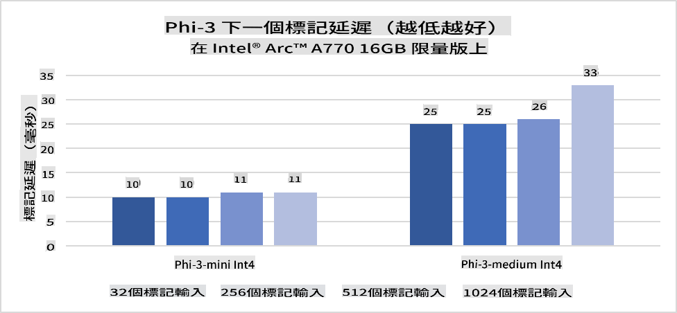
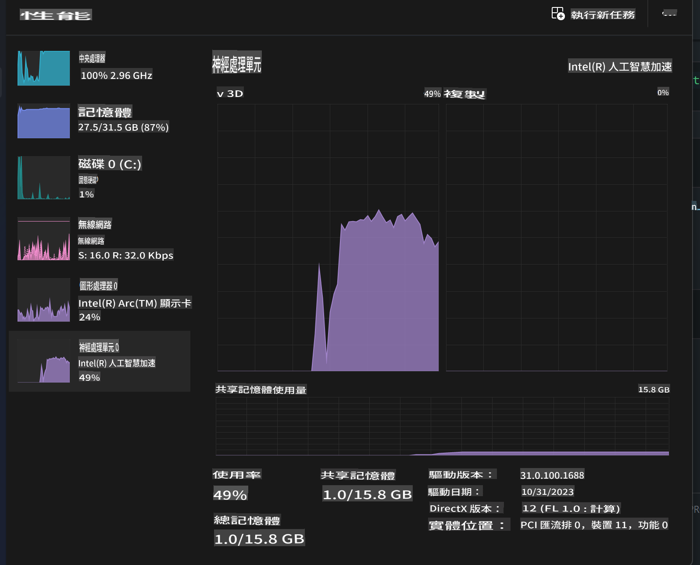
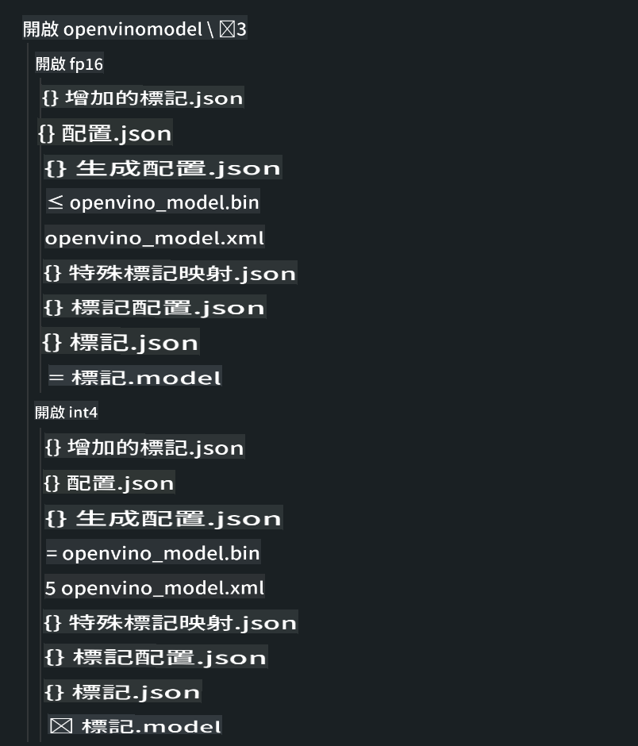
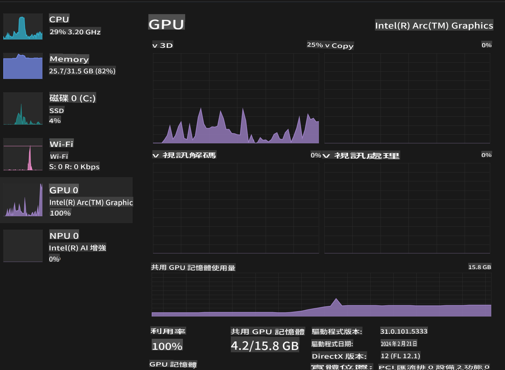

# **Inference Phi-3 in AI PC**

隨著生成式 AI 的進步以及邊緣設備硬件能力的提升，越來越多的生成式 AI 模型可以集成到用戶的自帶設備 (BYOD) 中。AI PC 就是這些模型中的一部分。從 2024 年開始，Intel、AMD 和 Qualcomm 與 PC 製造商合作，通過硬件改進推出 AI PC，方便本地生成式 AI 模型的部署。在這次討論中，我們將重點關注 Intel AI PC，並探討如何在 Intel AI PC 上部署 Phi-3。

### 什麼是 NPU

NPU（神經處理單元）是一種專門用於加速神經網絡操作和 AI 任務的專用處理器或處理單元。與通用 CPU 和 GPU 不同，NPU 專為數據驅動的並行計算優化，使其在處理大量多媒體數據（如視頻和圖像）以及神經網絡數據處理方面非常高效。它們特別擅長處理與 AI 相關的任務，如語音識別、視頻通話中的背景模糊以及物體檢測等照片或視頻編輯過程。

## NPU vs GPU

雖然許多 AI 和機器學習工作負載運行在 GPU 上，但 GPU 和 NPU 之間有一個關鍵區別。GPU 以其並行計算能力著稱，但並非所有 GPU 在處理圖形之外的任務時都同樣高效。而 NPU 是專為神經網絡操作中的複雜計算而設計的，使其在 AI 任務中非常有效。

總結來說，NPU 是加速 AI 計算的數學高手，在新興的 AI PC 時代中扮演著關鍵角色！

***這個例子基於 Intel 最新的 Intel Core Ultra 處理器***

## **1. 使用 NPU 運行 Phi-3 模型**

Intel® NPU 設備是一種集成在 Intel 客戶端 CPU 中的 AI 推理加速器，從 Intel® Core™ Ultra 代 CPU（以前稱為 Meteor Lake）開始。它能夠高效地執行人工神經網絡任務。




**Intel NPU 加速庫**

Intel NPU 加速庫 [https://github.com/intel/intel-npu-acceleration-library](https://github.com/intel/intel-npu-acceleration-library) 是一個 Python 庫，旨在通過利用 Intel 神經處理單元 (NPU) 的強大計算能力來提高應用程序的效率，適用於兼容的硬件。

Phi-3-mini 在由 Intel® Core™ Ultra 處理器驅動的 AI PC 上的示例。


使用 pip 安裝 Python 庫

```bash

   pip install intel-npu-acceleration-library

```

***Note*** 該項目仍在開發中，但參考模型已經非常完整。

### **使用 Intel NPU 加速庫運行 Phi-3**

使用 Intel NPU 加速時，該庫不會影響傳統的編碼過程。你只需要使用這個庫來量化原始 Phi-3 模型，例如 FP16，INT8，INT4，如下

```python

from transformers import AutoTokenizer, pipeline,TextStreamer
import intel_npu_acceleration_library as npu_lib
import warnings

model_id = "microsoft/Phi-3-mini-4k-instruct"

model = npu_lib.NPUModelForCausalLM.from_pretrained(
                                    model_id,
                                    torch_dtype="auto",
                                    dtype=npu_lib.int4,
                                    trust_remote_code=True
                                )

tokenizer = AutoTokenizer.from_pretrained(model_id)

text_streamer = TextStreamer(tokenizer, skip_prompt=True)

```
量化成功後，繼續執行以調用 NPU 運行 Phi-3 模型。

```python

generation_args = {
            "max_new_tokens": 1024,
            "return_full_text": False,
            "temperature": 0.3,
            "do_sample": False,
            "streamer": text_streamer,
        }

pipe = pipeline(
            "text-generation",
            model=model,
            tokenizer=tokenizer,
)

query = "<|system|>You are a helpful AI assistant.<|end|><|user|>Can you introduce yourself?<|end|><|assistant|>"

with warnings.catch_warnings():
    warnings.simplefilter("ignore")
    pipe(query, **generation_args)


```

執行代碼時，我們可以通過任務管理器查看 NPU 的運行狀態



***Samples*** : [AIPC_NPU_DEMO.ipynb](../../../../code/03.Inference/AIPC/AIPC_NPU_DEMO.ipynb)

## **2. 使用 DirectML + ONNX Runtime 運行 Phi-3 模型**

### **什麼是 DirectML**

[DirectML](https://github.com/microsoft/DirectML) 是一個高性能、硬件加速的 DirectX 12 機器學習庫。DirectML 為廣泛支持的硬件和驅動程序提供 GPU 加速，涵蓋所有來自 AMD、Intel、NVIDIA 和 Qualcomm 的 DirectX 12 兼容 GPU。

當單獨使用時，DirectML API 是一個低級 DirectX 12 庫，適合高性能、低延遲的應用，如框架、遊戲和其他實時應用。DirectML 與 Direct3D 12 的無縫互操作性以及其低開銷和跨硬件的一致性使其成為在需要高性能和結果可靠性和可預測性時加速機器學習的理想選擇。

***Note*** : 最新的 DirectML 已經支持 NPU (https://devblogs.microsoft.com/directx/introducing-neural-processor-unit-npu-support-in-directml-developer-preview/)

### DirectML 和 CUDA 在功能和性能方面的比較：

**DirectML** 是由 Microsoft 開發的機器學習庫。它旨在加速 Windows 設備上的機器學習工作負載，包括桌面、筆記本電腦和邊緣設備。
- 基於 DX12：DirectML 構建在 DirectX 12 (DX12) 之上，提供廣泛的硬件支持，包括 NVIDIA 和 AMD 的 GPU。
- 更廣泛的支持：由於利用 DX12，DirectML 可以與任何支持 DX12 的 GPU 一起工作，甚至是集成 GPU。
- 圖像處理：DirectML 使用神經網絡處理圖像和其他數據，適合圖像識別、物體檢測等任務。
- 安裝簡單：設置 DirectML 很簡單，不需要 GPU 廠商的特定 SDK 或庫。
- 性能：在某些情況下，DirectML 表現良好，甚至可以比 CUDA 更快，尤其是某些工作負載。
- 限制：但是，DirectML 在某些情況下可能會較慢，特別是對於 float16 大批量數據。

**CUDA** 是 NVIDIA 的並行計算平台和編程模型。它允許開發者利用 NVIDIA GPU 的強大計算能力進行通用計算，包括機器學習和科學模擬。
- NVIDIA 專用：CUDA 與 NVIDIA GPU 緊密集成，專為它們設計。
- 高度優化：它為 GPU 加速任務提供了卓越的性能，特別是使用 NVIDIA GPU 時。
- 廣泛使用：許多機器學習框架和庫（如 TensorFlow 和 PyTorch）都支持 CUDA。
- 可定制性：開發者可以為特定任務微調 CUDA 設置，從而達到最佳性能。
- 限制：然而，CUDA 對 NVIDIA 硬件的依賴可能會限制其在不同 GPU 之間的兼容性。

### 選擇 DirectML 還是 CUDA

選擇 DirectML 還是 CUDA 取決於你的具體用例、硬件可用性和偏好。如果你尋求更廣泛的兼容性和簡單的設置，DirectML 可能是個不錯的選擇。然而，如果你擁有 NVIDIA GPU 並且需要高度優化的性能，CUDA 仍然是一個強有力的競爭者。總結來說，DirectML 和 CUDA 各有優勢和劣勢，因此在做決定時請考慮你的需求和可用的硬件。

### **使用 ONNX Runtime 的生成式 AI**

在 AI 時代，AI 模型的可移植性非常重要。ONNX Runtime 可以輕鬆將訓練好的模型部署到不同的設備上。開發者不需要關注推理框架，使用統一的 API 完成模型推理。在生成式 AI 時代，ONNX Runtime 也進行了代碼優化（https://onnxruntime.ai/docs/genai/）。通過優化的 ONNX Runtime，量化的生成式 AI 模型可以在不同的終端上進行推理。在使用 ONNX Runtime 的生成式 AI 中，你可以通過 Python、C#、C/C++ 進行 AI 模型推理。當然，在 iPhone 上部署可以利用 C++ 的 ONNX Runtime API 進行生成式 AI。

[示例代碼](https://github.com/Azure-Samples/Phi-3MiniSamples/tree/main/onnx)

***編譯 ONNX Runtime 庫的生成式 AI***

```bash

winget install --id=Kitware.CMake  -e

git clone https://github.com/microsoft/onnxruntime.git

cd .\onnxruntime\

./build.bat --build_shared_lib --skip_tests --parallel --use_dml --config Release

cd ../

git clone https://github.com/microsoft/onnxruntime-genai.git

cd .\onnxruntime-genai\

mkdir ort

cd ort

mkdir include

mkdir lib

copy ..\onnxruntime\include\onnxruntime\core\providers\dml\dml_provider_factory.h ort\include

copy ..\onnxruntime\include\onnxruntime\core\session\onnxruntime_c_api.h ort\include

copy ..\onnxruntime\build\Windows\Release\Release\*.dll ort\lib

copy ..\onnxruntime\build\Windows\Release\Release\onnxruntime.lib ort\lib

python build.py --use_dml


```

**安裝庫**

```bash

pip install .\onnxruntime_genai_directml-0.3.0.dev0-cp310-cp310-win_amd64.whl

```

這是運行結果


***Samples*** : [AIPC_DirectML_DEMO.ipynb](../../../../code/03.Inference/AIPC/AIPC_DirectML_DEMO.ipynb)

## **3. 使用 Intel OpenVino 運行 Phi-3 模型**

### **什麼是 OpenVINO**

[OpenVINO](https://github.com/openvinotoolkit/openvino) 是一個開源工具包，用於優化和部署深度學習模型。它為來自流行框架（如 TensorFlow、PyTorch 等）的視覺、音頻和語言模型提供了加速的深度學習性能。開始使用 OpenVINO。OpenVINO 也可以與 CPU 和 GPU 結合使用來運行 Phi-3 模型。

***Note***: 目前，OpenVINO 尚不支持 NPU。

### **安裝 OpenVINO 庫**

```bash

 pip install git+https://github.com/huggingface/optimum-intel.git

 pip install git+https://github.com/openvinotoolkit/nncf.git

 pip install openvino-nightly

```

### **使用 OpenVINO 運行 Phi-3**

像 NPU 一樣，OpenVINO 通過運行量化模型來完成生成式 AI 模型的調用。我們需要先量化 Phi-3 模型，並通過命令行使用 optimum-cli 完成模型量化

**INT4**

```bash

optimum-cli export openvino --model "microsoft/Phi-3-mini-4k-instruct" --task text-generation-with-past --weight-format int4 --group-size 128 --ratio 0.6  --sym  --trust-remote-code ./openvinomodel/phi3/int4

```

**FP16**

```bash

optimum-cli export openvino --model "microsoft/Phi-3-mini-4k-instruct" --task text-generation-with-past --weight-format fp16 --trust-remote-code ./openvinomodel/phi3/fp16

```

轉換後的格式，如下所示



通過 OVModelForCausalLM 加載模型路徑（model_dir）、相關配置（ov_config = {"PERFORMANCE_HINT": "LATENCY", "NUM_STREAMS": "1", "CACHE_DIR": ""）和硬件加速設備（GPU.0）

```python

ov_model = OVModelForCausalLM.from_pretrained(
     model_dir,
     device='GPU.0',
     ov_config=ov_config,
     config=AutoConfig.from_pretrained(model_dir, trust_remote_code=True),
     trust_remote_code=True,
)

```

執行代碼時，我們可以通過任務管理器查看 GPU 的運行狀態



***Samples*** : [AIPC_OpenVino_Demo.ipynb](../../../../code/03.Inference/AIPC/AIPC_OpenVino_Demo.ipynb)

### ***Note*** : 上述三種方法各有優勢，但建議使用 NPU 加速進行 AI PC 推理。

**免责声明**：
本文件使用基于机器的AI翻译服务进行翻译。尽管我们努力确保准确性，但请注意，自动翻译可能包含错误或不准确之处。应将原始语言的文件视为权威来源。对于关键信息，建议进行专业的人类翻译。对于因使用本翻译而产生的任何误解或误读，我们不承担任何责任。