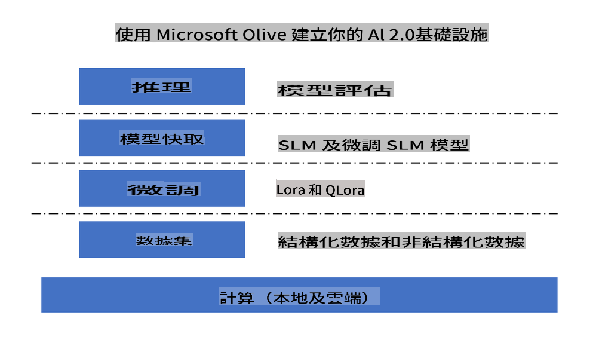
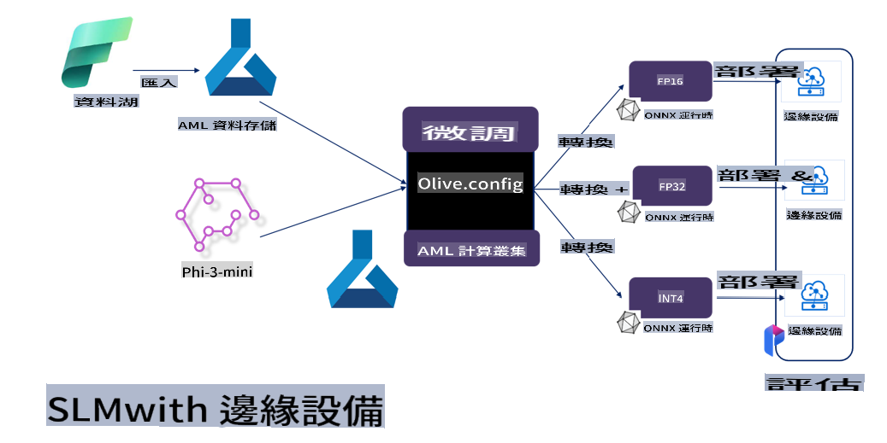

# **使用 Microsoft Olive 微調 Phi-3**

[Olive](https://github.com/microsoft/OLive?WT.mc_id=aiml-138114-kinfeylo) 是一款簡單易用的硬體感知模型優化工具，整合了業界領先的模型壓縮、優化和編譯技術。

它旨在簡化機器學習模型的優化過程，確保它們能最有效地利用特定的硬體架構。

無論你是在雲端應用還是邊緣設備上工作，Olive 都能讓你輕鬆有效地優化模型。

## 主要特點：
- Olive 集成並自動化了針對目標硬體的優化技術。
- 沒有一種單一的優化技術能適用於所有場景，因此 Olive 允許擴展性，讓業界專家能夠插入他們的優化創新。

## 減少工程工作量：
- 開發人員通常需要學習和使用多個硬體供應商特定的工具鏈，以準備和優化訓練好的模型進行部署。
- Olive 通過自動化優化技術簡化了這一體驗，針對所需的硬體進行優化。

## 即用的端到端優化解決方案：

通過組合和調整集成技術，Olive 提供了一個統一的端到端優化解決方案。
它在優化模型時會考慮到準確性和延遲等限制。

## 使用 Microsoft Olive 進行微調

Microsoft Olive 是一款非常易於使用的開源模型優化工具，能夠覆蓋生成式人工智慧領域的微調和參考。只需簡單配置，結合使用開源的小語言模型和相關運行環境（AzureML / 本地 GPU, CPU, DirectML），即可通過自動優化完成模型的微調或參考，並找到最佳模型部署到雲端或邊緣設備。允許企業在本地和雲端構建自己的行業垂直模型。



## 使用 Microsoft Olive 微調 Phi-3



## Phi-3 Olive 示例代碼和範例
在此範例中，你將使用 Olive 來：

- 微調一個 LoRA 轉接器來將短語分類為悲傷、喜悅、恐懼、驚訝。
- 將轉接器權重合併到基礎模型中。
- 將模型優化並量化為 int4。

[示例代碼](../../code/04.Finetuning/olive-ort-example/README.md)

### 設置 Microsoft Olive

Microsoft Olive 的安裝非常簡單，並且可以安裝在 CPU、GPU、DirectML 和 Azure ML 上

```bash
pip install olive-ai
```

如果你希望在 CPU 上運行 ONNX 模型，可以使用

```bash
pip install olive-ai[cpu]
```

如果你希望在 GPU 上運行 ONNX 模型，可以使用

```python
pip install olive-ai[gpu]
```

如果你希望使用 Azure ML，可以使用

```python
pip install git+https://github.com/microsoft/Olive#egg=olive-ai[azureml]
```

**注意**
操作系統要求：Ubuntu 20.04 / 22.04

### **Microsoft Olive 的 Config.json**

安裝後，你可以通過配置文件設置不同模型的特定配置，包括數據、計算、訓練、部署和模型生成。

**1. 數據**

在 Microsoft Olive 上，可以支持在本地數據和雲端數據上進行訓練，並可以在設置中進行配置。

*本地數據設置*

你可以簡單地設置需要微調訓練的數據集，通常是 json 格式，並與數據模板適配。這需要根據模型的要求進行調整（例如，適配到 Microsoft Phi-3-mini 所需的格式。如果你有其他模型，請參考其他模型所需的微調格式進行處理）

```json

    "data_configs": [
        {
            "name": "dataset_default_train",
            "type": "HuggingfaceContainer",
            "load_dataset_config": {
                "params": {
                    "data_name": "json", 
                    "data_files":"dataset/dataset-classification.json",
                    "split": "train"
                }
            },
            "pre_process_data_config": {
                "params": {
                    "dataset_type": "corpus",
                    "text_cols": [
                            "phrase",
                            "tone"
                    ],
                    "text_template": "### Text: {phrase}\n### The tone is:\n{tone}",
                    "corpus_strategy": "join",
                    "source_max_len": 2048,
                    "pad_to_max_len": false,
                    "use_attention_mask": false
                }
            }
        }
    ],
```

**雲端數據源設置**

通過鏈接 Azure AI Studio/Azure Machine Learning Service 的數據存儲來鏈接雲端數據，可以選擇通過 Microsoft Fabric 和 Azure Data 將不同的數據源引入 Azure AI Studio/Azure Machine Learning Service，作為微調數據的支持。

```json

    "data_configs": [
        {
            "name": "dataset_default_train",
            "type": "HuggingfaceContainer",
            "load_dataset_config": {
                "params": {
                    "data_name": "json", 
                    "data_files": {
                        "type": "azureml_datastore",
                        "config": {
                            "azureml_client": {
                                "subscription_id": "Your Azure Subscrition ID",
                                "resource_group": "Your Azure Resource Group",
                                "workspace_name": "Your Azure ML Workspaces name"
                            },
                            "datastore_name": "workspaceblobstore",
                            "relative_path": "Your train_data.json Azure ML Location"
                        }
                    },
                    "split": "train"
                }
            },
            "pre_process_data_config": {
                "params": {
                    "dataset_type": "corpus",
                    "text_cols": [
                            "Question",
                            "Best Answer"
                    ],
                    "text_template": "<|user|>\n{Question}<|end|>\n<|assistant|>\n{Best Answer}\n<|end|>",
                    "corpus_strategy": "join",
                    "source_max_len": 2048,
                    "pad_to_max_len": false,
                    "use_attention_mask": false
                }
            }
        }
    ],
    
```

**2. 計算配置**

如果你需要在本地進行，可以直接使用本地數據資源。你需要使用 Azure AI Studio / Azure Machine Learning Service 的資源，需要配置相關的 Azure 參數、計算資源名稱等。

```json

    "systems": {
        "aml": {
            "type": "AzureML",
            "config": {
                "accelerators": ["gpu"],
                "hf_token": true,
                "aml_compute": "Your Azure AI Studio / Azure Machine Learning Service Compute Name",
                "aml_docker_config": {
                    "base_image": "Your Azure AI Studio / Azure Machine Learning Service docker",
                    "conda_file_path": "conda.yaml"
                }
            }
        },
        "azure_arc": {
            "type": "AzureML",
            "config": {
                "accelerators": ["gpu"],
                "aml_compute": "Your Azure AI Studio / Azure Machine Learning Service Compute Name",
                "aml_docker_config": {
                    "base_image": "Your Azure AI Studio / Azure Machine Learning Service docker",
                    "conda_file_path": "conda.yaml"
                }
            }
        }
    },
```

***注意***

由於是在 Azure AI Studio/Azure Machine Learning Service 上通過容器運行，需要配置所需的環境。這是在 conda.yaml 環境中配置的。

```yaml

name: project_environment
channels:
  - defaults
dependencies:
  - python=3.8.13
  - pip=22.3.1
  - pip:
      - einops
      - accelerate
      - azure-keyvault-secrets
      - azure-identity
      - bitsandbytes
      - datasets
      - huggingface_hub
      - peft
      - scipy
      - sentencepiece
      - torch>=2.2.0
      - transformers
      - git+https://github.com/microsoft/Olive@jiapli/mlflow_loading_fix#egg=olive-ai[gpu]
      - --extra-index-url https://aiinfra.pkgs.visualstudio.com/PublicPackages/_packaging/ORT-Nightly/pypi/simple/ 
      - ort-nightly-gpu==1.18.0.dev20240307004
      - --extra-index-url https://aiinfra.pkgs.visualstudio.com/PublicPackages/_packaging/onnxruntime-genai/pypi/simple/
      - onnxruntime-genai-cuda

    

```

**3. 選擇你的 SLM**

你可以直接使用 Hugging face 上的模型，或者直接與 Azure AI Studio / Azure Machine Learning 的模型目錄結合來選擇使用的模型。在下面的代碼示例中，我們將以 Microsoft Phi-3-mini 為例。

如果你有本地模型，可以使用這種方法

```json

    "input_model":{
        "type": "PyTorchModel",
        "config": {
            "hf_config": {
                "model_name": "model-cache/microsoft/phi-3-mini",
                "task": "text-generation",
                "model_loading_args": {
                    "trust_remote_code": true
                }
            }
        }
    },
```

如果你希望使用 Azure AI Studio / Azure Machine Learning Service 上的模型，可以使用這種方法

```json

    "input_model":{
        "type": "PyTorchModel",
        "config": {
            "model_path": {
                "type": "azureml_registry_model",
                "config": {
                    "name": "microsoft/Phi-3-mini-4k-instruct",
                    "registry_name": "azureml-msr",
                    "version": "11"
                }
            },
             "model_file_format": "PyTorch.MLflow",
             "hf_config": {
                "model_name": "microsoft/Phi-3-mini-4k-instruct",
                "task": "text-generation",
                "from_pretrained_args": {
                    "trust_remote_code": true
                }
            }
        }
    },
```

**注意：**
我們需要與 Azure AI Studio / Azure Machine Learning Service 集成，因此在設置模型時，請參考版本號和相關命名。

所有在 Azure 上的模型需要設置為 PyTorch.MLflow

你需要擁有一個 Hugging face 帳號，並將密鑰綁定到 Azure AI Studio / Azure Machine Learning 的 Key 值。

**4. 算法**

Microsoft Olive 將 Lora 和 QLora 微調算法封裝得非常好。你只需要配置一些相關參數。這裡以 QLora 為例。

```json
        "lora": {
            "type": "LoRA",
            "config": {
                "target_modules": [
                    "o_proj",
                    "qkv_proj"
                ],
                "double_quant": true,
                "lora_r": 64,
                "lora_alpha": 64,
                "lora_dropout": 0.1,
                "train_data_config": "dataset_default_train",
                "eval_dataset_size": 0.3,
                "training_args": {
                    "seed": 0,
                    "data_seed": 42,
                    "per_device_train_batch_size": 1,
                    "per_device_eval_batch_size": 1,
                    "gradient_accumulation_steps": 4,
                    "gradient_checkpointing": false,
                    "learning_rate": 0.0001,
                    "num_train_epochs": 3,
                    "max_steps": 10,
                    "logging_steps": 10,
                    "evaluation_strategy": "steps",
                    "eval_steps": 187,
                    "group_by_length": true,
                    "adam_beta2": 0.999,
                    "max_grad_norm": 0.3
                }
            }
        },
```

如果你希望進行量化轉換，Microsoft Olive 主分支已經支持 onnxruntime-genai 方法。你可以根據需要進行設置：

1. 將轉接器權重合併到基礎模型中
2. 使用 ModelBuilder 將模型轉換為所需精度的 onnx 模型

例如轉換為量化的 INT4

```json

        "merge_adapter_weights": {
            "type": "MergeAdapterWeights"
        },
        "builder": {
            "type": "ModelBuilder",
            "config": {
                "precision": "int4"
            }
        }
```

**注意** 
- 如果你使用 QLoRA，暫時不支持 ONNXRuntime-genai 的量化轉換。

- 需要指出的是，你可以根據自己的需求設置上述步驟。不必完全配置上述步驟。根據需求，你可以直接使用算法的步驟而不進行微調。最後你需要配置相關的引擎。

```json

    "engine": {
        "log_severity_level": 0,
        "host": "aml",
        "target": "aml",
        "search_strategy": false,
        "execution_providers": ["CUDAExecutionProvider"],
        "cache_dir": "../model-cache/models/phi3-finetuned/cache",
        "output_dir" : "../model-cache/models/phi3-finetuned"
    }
```

**5. 完成微調**

在命令行中，在 olive-config.json 的目錄下執行

```bash
olive run --config olive-config.json  
```

**免責聲明**: 
本文件已使用機器翻譯服務進行翻譯。儘管我們努力確保準確性，但請注意，自動翻譯可能包含錯誤或不準確之處。應以原語言的原始文件為權威來源。對於關鍵信息，建議使用專業人工翻譯。我們不對因使用本翻譯而引起的任何誤解或誤釋承擔責任。