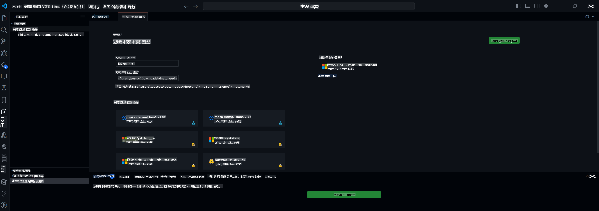

## 歡迎使用 VS Code 的 AI 工具包

[AI 工具包 for VS Code](https://github.com/microsoft/vscode-ai-toolkit/tree/main) 將來自 Azure AI Studio Catalog 和其他目錄（如 Hugging Face）的各種模型結合在一起。這個工具包通過以下方式簡化了使用生成式 AI 工具和模型構建 AI 應用程序的常見開發任務：
- 開始使用模型發現和遊樂場。
- 使用本地計算資源進行模型微調和推理。
- 使用 Azure 資源進行遠程微調和推理。

[安裝 AI 工具包 for VSCode](https://marketplace.visualstudio.com/items?itemName=ms-windows-ai-studio.windows-ai-studio)



**[私密預覽]** 一鍵配置 Azure Container Apps 以在雲端運行模型微調和推理。

現在讓我們開始您的 AI 應用開發：

- [本地開發](../../../../md/04.Fine-tuning)
    - [準備工作](../../../../md/04.Fine-tuning)
    - [啟動 Conda](../../../../md/04.Fine-tuning)
    - [僅進行基礎模型微調](../../../../md/04.Fine-tuning)
    - [模型微調和推理](../../../../md/04.Fine-tuning)
- [**[私密預覽]** 遠程開發](../../../../md/04.Fine-tuning)
    - [先決條件](../../../../md/04.Fine-tuning)
    - [設置遠程開發項目](../../../../md/04.Fine-tuning)
    - [配置 Azure 資源](../../../../md/04.Fine-tuning)
    - [[可選] 將 Huggingface Token 添加到 Azure Container App Secret](../../../../md/04.Fine-tuning)
    - [運行微調](../../../../md/04.Fine-tuning)
    - [配置推理端點](../../../../md/04.Fine-tuning)
    - [部署推理端點](../../../../md/04.Fine-tuning)
    - [高級用法](../../../../md/04.Fine-tuning)

## 本地開發
### 準備工作

1. 確保主機上已安裝 NVIDIA 驅動程序。
2. 如果您使用 HF 來利用數據集，請運行 `huggingface-cli login`。
3. `Olive` 鍵設置說明任何修改內存使用的內容。

### 啟動 Conda
由於我們使用的是 WSL 環境且是共享的，您需要手動啟動 conda 環境。完成此步驟後，您可以運行微調或推理。

```bash
conda activate [conda-env-name]
```

### 僅進行基礎模型微調
如果您只想嘗試基礎模型而不進行微調，可以在啟動 conda 後運行此命令。

```bash
cd inference

# Web 瀏覽器界面允許調整一些參數，如最大新令牌長度、溫度等。
# 用戶需要在 gradio 建立連接後手動在瀏覽器中打開鏈接（例如：http://0.0.0.0:7860）。
python gradio_chat.py --baseonly
```

### 模型微調和推理

一旦工作區在開發容器中打開，打開終端（默認路徑為項目根目錄），然後運行以下命令在選定數據集上微調 LLM。

```bash
python finetuning/invoke_olive.py
```

檢查點和最終模型將保存在 `models` 文件夾中。

接下來，通過 `控制台`、`網頁瀏覽器` 或 `prompt flow` 使用微調後的模型進行推理。

```bash
cd inference

# 控制台界面。
python console_chat.py

# Web 瀏覽器界面允許調整一些參數，如最大新令牌長度、溫度等。
# 用戶需要在 gradio 建立連接後手動在瀏覽器中打開鏈接（例如：http://127.0.0.1:7860）。
python gradio_chat.py
```

要在 VS Code 中使用 `prompt flow`，請參考此 [快速入門](https://microsoft.github.io/promptflow/how-to-guides/quick-start.html)。

### 模型微調

接下來，根據您的設備是否有 GPU 可用，下載以下模型。

要使用 QLoRA 啟動本地微調會話，從我們的目錄中選擇您想微調的模型。
| 平台 | GPU 可用 | 模型名稱 | 大小 (GB) |
|---------|---------|--------|--------|
| Windows | 有 | Phi-3-mini-4k-**directml**-int4-awq-block-128-onnx | 2.13GB |
| Linux | 有 | Phi-3-mini-4k-**cuda**-int4-onnx | 2.30GB |
| Windows<br>Linux | 無 | Phi-3-mini-4k-**cpu**-int4-rtn-block-32-acc-level-4-onnx | 2.72GB |

**_注意_** 您不需要 Azure 帳戶即可下載模型

Phi3-mini (int4) 模型大約為 2GB-3GB，下載時間取決於您的網速。

首先選擇項目名稱和位置。
接下來，從模型目錄中選擇一個模型。系統會提示您下載項目模板。然後您可以點擊 "配置項目" 來調整各種設置。

### Microsoft Olive

我們使用 [Olive](https://microsoft.github.io/Olive/why-olive.html) 在我們的目錄中運行 QLoRA 微調 PyTorch 模型。所有設置都預設為默認值，以優化本地運行微調過程的內存使用，但可以根據您的場景進行調整。

### 微調範例和資源

- [微調入門指南](https://learn.microsoft.com/windows/ai/toolkit/toolkit-fine-tune)
- [使用 HuggingFace 數據集進行微調](https://github.com/microsoft/vscode-ai-toolkit/blob/main/archive/walkthrough-hf-dataset.md)
- [使用簡單數據集進行微調](https://github.com/microsoft/vscode-ai-toolkit/blob/main/archive/walkthrough-simple-dataset.md)

## **[私密預覽]** 遠程開發
### 先決條件
1. 要在遠程 Azure Container App 環境中運行模型微調，確保您的訂閱有足夠的 GPU 容量。提交 [支持票](https://azure.microsoft.com/support/create-ticket/) 以請求應用所需的容量。[了解更多關於 GPU 容量的信息](https://learn.microsoft.com/azure/container-apps/workload-profiles-overview)
2. 如果您使用 HuggingFace 上的私人數據集，請確保您有一個 [HuggingFace 帳戶](https://huggingface.co/) 並 [生成一個訪問令牌](https://huggingface.co/docs/hub/security-tokens)
3. 在 AI 工具包 for VS Code 中啟用遠程微調和推理功能標誌
   1. 選擇 *文件 -> 首選項 -> 設置* 打開 VS Code 設置。
   2. 導航到 *擴展* 並選擇 *AI 工具包*。
   3. 選擇 *"啟用遠程微調和推理"* 選項。
   4. 重新加載 VS Code 以生效。

- [遠程微調](https://github.com/microsoft/vscode-ai-toolkit/blob/main/archive/remote-finetuning.md)

### 設置遠程開發項目
1. 執行命令面板 `AI Toolkit: Focus on Resource View`。
2. 導航到 *Model Fine-tuning* 以訪問模型目錄。為您的項目分配一個名稱並選擇其在機器上的位置。然後，點擊 *"配置項目"* 按鈕。
3. 項目配置
    1. 避免啟用 *"本地微調"* 選項。
    2. Olive 配置設置將顯示預設默認值。請根據需要調整和填寫這些配置。
    3. 移動到 *生成項目*。此階段利用 WSL 並設置一個新的 Conda 環境，為未來包含開發容器的更新做準備。
4. 點擊 *"在工作區中重新啟動窗口"* 以打開您的遠程開發項目。

> **注意：** 項目目前僅在 AI 工具包 for VS Code 中本地或遠程工作。如果在項目創建過程中選擇 *"本地微調"*，它將僅在 WSL 中運行，無法進行遠程開發。另一方面，如果不啟用 *"本地微調"*，該項目將僅限於遠程 Azure Container App 環境。

### 配置 Azure 資源
要開始，您需要配置遠程微調的 Azure 資源。通過在命令面板中運行 `AI Toolkit: Provision Azure Container Apps job for fine-tuning` 來完成此操作。

通過輸出頻道顯示的鏈接監控配置進度。

### [可選] 將 Huggingface Token 添加到 Azure Container App Secret
如果您使用的是私人 HuggingFace 數據集，請將您的 HuggingFace 令牌設置為環境變量，以避免在 Hugging Face Hub 上手動登錄。
您可以使用 `AI Toolkit: Add Azure Container Apps Job secret for fine-tuning` 命令來完成此操作。使用此命令，您可以將秘密名稱設置為 [`HF_TOKEN`](https://huggingface.co/docs/huggingface_hub/package_reference/environment_variables#hftoken) 並使用您的 Hugging Face 令牌作為秘密值。

### 運行微調
要開始遠程微調作業，執行 `AI Toolkit: Run fine-tuning` 命令。

要查看系統和控制台日誌，您可以使用輸出面板中的鏈接訪問 Azure 入口網站（更多步驟請參見 [在 Azure 上查看和查詢日誌](https://aka.ms/ai-toolkit/remote-provision#view-and-query-logs-on-azure)）。或者，您可以通過在 VSCode 輸出面板中運行命令 `AI Toolkit: Show the running fine-tuning job streaming logs` 直接查看控制台日誌。
> **注意：** 作業可能由於資源不足而排隊。如果日誌未顯示，請執行 `AI Toolkit: Show the running fine-tuning job streaming logs` 命令，等待一會兒，然後再次執行該命令以重新連接到流日誌。

在此過程中，QLoRA 將用於微調，並為模型創建 LoRA 適配器以在推理期間使用。
微調結果將存儲在 Azure 文件中。

### 配置推理端點
在遠程環境中訓練好適配器後，使用簡單的 Gradio 應用程序與模型進行交互。
與微調過程類似，您需要通過在命令面板中執行 `AI Toolkit: Provision Azure Container Apps for inference` 設置遠程推理的 Azure 資源。

默認情況下，推理的訂閱和資源組應與微調時使用的相同。推理將使用相同的 Azure Container App 環境，並訪問在微調步驟中生成的存儲在 Azure 文件中的模型和模型適配器。

### 部署推理端點
如果您希望修改推理代碼或重新加載推理模型，請執行 `AI Toolkit: Deploy for inference` 命令。這將同步您的最新代碼與 Azure Container App 並重新啟動副本。

部署成功完成後，您可以通過 VSCode 通知中顯示的 "*前往推理端點*" 按鈕訪問推理 API。或者，Web API 端點可以在 `./infra/inference.config.json` 中的 `ACA_APP_ENDPOINT` 和輸出面板中找到。您現在可以使用此端點評估模型。

### 高級用法
有關使用 AI 工具包進行遠程開發的更多信息，請參考 [遠程微調模型](https://aka.ms/ai-toolkit/remote-provision) 和 [使用微調模型進行推理](https://aka.ms/ai-toolkit/remote-inference) 文檔。

免責聲明：本翻譯由人工智慧模型從原文翻譯而來，可能不完美。請審查輸出並進行任何必要的修正。