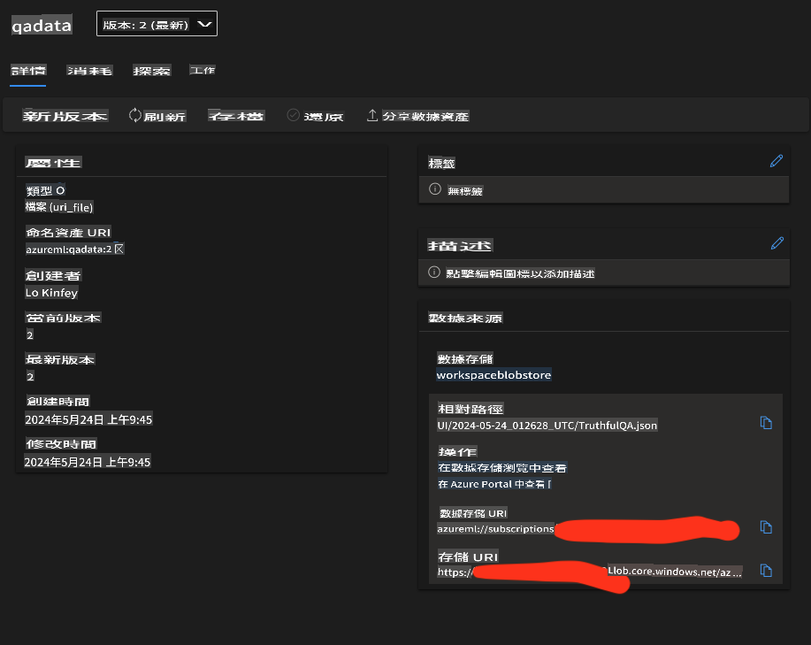

# **準備你的行業數據**

我們希望將 Phi-3-mini 注入 [TruthfulQA 的數據](https://github.com/sylinrl/TruthfulQA/blob/main/TruthfulQA.csv) 中。第一步是導入 TruthfulQA 的數據。

### **1. 將數據加載到 csv 並保存為 json**

```python

import csv
import json

csvfile = open('./datasets/TruthfulQA.csv', 'r')
jsonfile = open('./output/TruthfulQA.json', 'w')

fieldnames = ("Type","Category","Question","Best Answer","Correct Answers","Incorrect Answers","Source")

reader = csv.DictReader(csvfile, fieldnames)

for row in reader:
    json.dump(row, jsonfile)
    jsonfile.write('\n')

i = 1
data = []
with open('./output/TruthfulQA.json', 'r') as file:
    for line in file:
        print(line)
        data.append(json.loads(line))
        print(str(i))
        i+=1


```

### **2. 將數據上傳到 Azure ML 數據存儲**



### **恭喜！**

你的數據已成功加載。接下來，你需要通過 Microsoft Olive 配置你的數據和相關算法 [E2E_LoRA&QLoRA_Config_With_Olive.md](./E2E_LoRA&QLoRA_Config_With_Olive.md)

**免責聲明**：
本文檔使用機器翻譯服務進行翻譯。我們努力確保準確性，但請注意，自動翻譯可能包含錯誤或不準確之處。應將原文檔視為權威來源。對於關鍵信息，建議尋求專業人工翻譯。我們對因使用此翻譯而引起的任何誤解或誤釋不承擔責任。