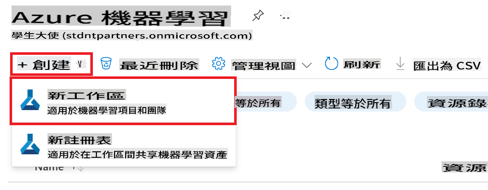
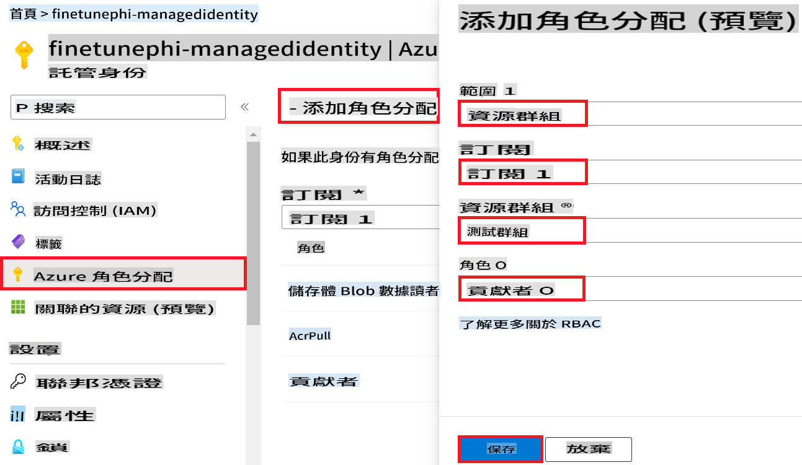
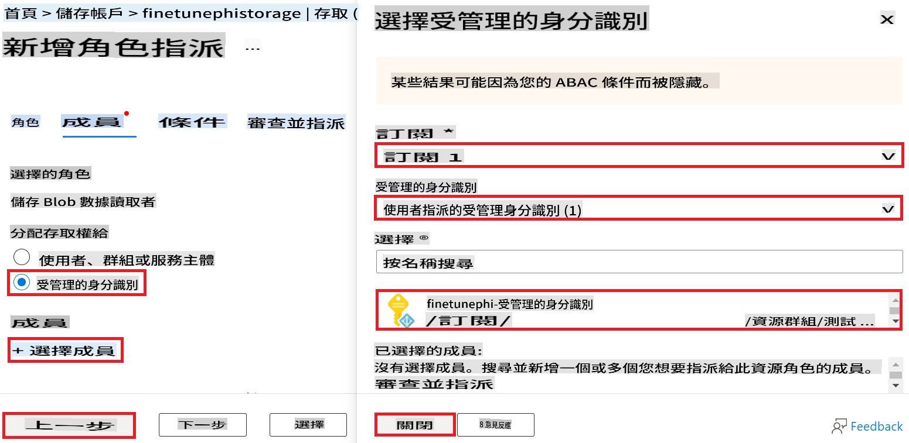

# 微調和整合自訂 Phi-3 模型與 Prompt flow

這個端到端 (E2E) 範例基於 Microsoft Tech Community 的指南 "[Fine-Tune and Integrate Custom Phi-3 Models with Prompt Flow: Step-by-Step Guide](https://techcommunity.microsoft.com/t5/educator-developer-blog/fine-tune-and-integrate-custom-phi-3-models-with-prompt-flow/ba-p/4178612?WT.mc_id=aiml-137032-kinfeylo)"。它介紹了如何微調、部署和整合自訂的 Phi-3 模型與 Prompt flow。

## 概述

在這個 E2E 範例中，你將學習如何微調 Phi-3 模型並將其與 Prompt flow 整合。通過利用 Azure Machine Learning 和 Prompt flow，你將建立一個部署和使用自訂 AI 模型的工作流程。這個 E2E 範例分為三個情境：

**情境 1: 設置 Azure 資源並準備微調**

**情境 2: 微調 Phi-3 模型並在 Azure Machine Learning Studio 中部署**

**情境 3: 與 Prompt flow 整合並與自訂模型對話**

以下是這個 E2E 範例的概述。


### 目錄

1. **[情境 1: 設置 Azure 資源並準備微調](../../../../md/06.E2ESamples)**
    - [創建 Azure Machine Learning 工作區](../../../../md/06.E2ESamples)
    - [在 Azure 訂閱中請求 GPU 配額](../../../../md/06.E2ESamples)
    - [添加角色分配](../../../../md/06.E2ESamples)
    - [設置專案](../../../../md/06.E2ESamples)
    - [準備微調的數據集](../../../../md/06.E2ESamples)

1. **[情境 2: 微調 Phi-3 模型並在 Azure Machine Learning Studio 中部署](../../../../md/06.E2ESamples)**
    - [設置 Azure CLI](../../../../md/06.E2ESamples)
    - [微調 Phi-3 模型](../../../../md/06.E2ESamples)
    - [部署微調後的模型](../../../../md/06.E2ESamples)

1. **[情境 3: 與 Prompt flow 整合並與自訂模型對話](../../../../md/06.E2ESamples)**
    - [將自訂 Phi-3 模型與 Prompt flow 整合](../../../../md/06.E2ESamples)
    - [與自訂模型對話](../../../../md/06.E2ESamples)

## 情境 1: 設置 Azure 資源並準備微調

### 創建 Azure Machine Learning 工作區

1. 在入口頁頂部的 **搜索欄** 中輸入 *azure machine learning*，並從出現的選項中選擇 **Azure Machine Learning**。

    

1. 從導航菜單中選擇 **+ 創建**。

1. 從導航菜單中選擇 **新建工作區**。

    

1. 執行以下任務：

    - 選擇你的 Azure **訂閱**。
    - 選擇要使用的 **資源群組**（如有需要，創建一個新的）。
    - 輸入 **工作區名稱**。它必須是唯一的值。
    - 選擇你想使用的 **區域**。
    - 選擇要使用的 **存儲帳戶**（如有需要，創建一個新的）。
    - 選擇要使用的 **金鑰保管庫**（如有需要，創建一個新的）。
    - 選擇要使用的 **應用洞察**（如有需要，創建一個新的）。
    - 選擇要使用的 **容器註冊表**（如有需要，創建一個新的）。

    

1. 選擇 **查看 + 創建**。

1. 選擇 **創建**。

### 在 Azure 訂閱中請求 GPU 配額

在這個 E2E 範例中，你將使用 *Standard_NC24ads_A100_v4 GPU* 進行微調，這需要請求配額，而 *Standard_E4s_v3* CPU 用於部署，這不需要請求配額。

> [!NOTE]
>
> 只有按次計費的訂閱（標準訂閱類型）才有資格分配 GPU；目前不支持福利訂閱。
>
> 對於使用福利訂閱（如 Visual Studio Enterprise 訂閱）或希望快速測試微調和部署過程的人，這個教程還提供了使用 CPU 進行微調的指導，但需要注意的是，使用 GPU 和較大數據集進行微調的結果會顯著更好。

1. 訪問 [Azure ML Studio](https://ml.azure.com/home?wt.mc_id=studentamb_279723)。

1. 執行以下任務來請求 *Standard NCADSA100v4 Family* 配額：

    - 從左側標籤中選擇 **配額**。
    - 選擇要使用的 **虛擬機系列**。例如，選擇 **Standard NCADSA100v4 Family Cluster Dedicated vCPUs**，其中包括 *Standard_NC24ads_A100_v4* GPU。
    - 從導航菜單中選擇 **請求配額**。

        

    - 在請求配額頁面中，輸入你想使用的 **新核心限制**。例如，24。
    - 在請求配額頁面中，選擇 **提交** 以請求 GPU 配額。

> [!NOTE]
> 你可以參考 [Azure 虛擬機的大小](https://learn.microsoft.com/azure/virtual-machines/sizes/overview?tabs=breakdownseries%2Cgeneralsizelist%2Ccomputesizelist%2Cmemorysizelist%2Cstoragesizelist%2Cgpusizelist%2Cfpgasizelist%2Chpcsizelist) 文件來選擇適合你需求的 GPU 或 CPU。

### 添加角色分配

要微調和部署你的模型，首先必須創建一個用戶分配的管理身份 (UAI) 並賦予其適當的權限。這個 UAI 將在部署期間用於身份驗證。

#### 創建用戶分配的管理身份 (UAI)

1. 在入口頁頂部的 **搜索欄** 中輸入 *managed identities*，並從出現的選項中選擇 **Managed Identities**。

    

1. 選擇 **+ 創建**。

    

1. 執行以下任務：

    - 選擇你的 Azure **訂閱**。
    - 選擇要使用的 **資源群組**（如有需要，創建一個新的）。
    - 選擇你想使用的 **區域**。
    - 輸入 **名稱**。它必須是唯一的值。

1. 選擇 **查看 + 創建**。

1. 選擇 **+ 創建**。

#### 為管理身份添加貢獻者角色分配

1. 導航到你創建的管理身份資源。

1. 從左側標籤中選擇 **Azure 角色分配**。

1. 從導航菜單中選擇 **+添加角色分配**。

1. 在添加角色分配頁面中，執行以下任務：
    - 將 **範圍** 設置為 **資源群組**。
    - 選擇你的 Azure **訂閱**。
    - 選擇要使用的 **資源群組**。
    - 將 **角色** 設置為 **貢獻者**。

    

1. 選擇 **保存**。

#### 為管理身份添加存儲 Blob 數據讀取者角色分配

1. 在入口頁頂部的 **搜索欄** 中輸入 *storage accounts*，並從出現的選項中選擇 **Storage accounts**。

    

1. 選擇與你創建的 Azure Machine Learning 工作區相關聯的存儲帳戶。例如，*finetunephistorage*。

1. 執行以下任務來導航到添加角色分配頁面：

    - 導航到你創建的 Azure 存儲帳戶。
    - 從左側標籤中選擇 **訪問控制 (IAM)**。
    - 從導航菜單中選擇 **+ 添加**。
    - 從導航菜單中選擇 **添加角色分配**。

    

1. 在添加角色分配頁面中，執行以下任務：

    - 在角色頁面中，在 **搜索欄** 中輸入 *Storage Blob Data Reader*，並從出現的選項中選擇 **Storage Blob Data Reader**。
    - 在角色頁面中，選擇 **下一步**。
    - 在成員頁面中，選擇 **分配訪問權限給** **管理身份**。
    - 在成員頁面中，選擇 **+ 選擇成員**。
    - 在選擇管理身份頁面中，選擇你的 Azure **訂閱**。
    - 在選擇管理身份頁面中，選擇 **管理身份**。
    - 在選擇管理身份頁面中，選擇你創建的管理身份。例如，*finetunephi-managedidentity*。
    - 在選擇管理身份頁面中，選擇 **選擇**。

    

1. 選擇 **查看 + 分配**。

#### 為管理身份添加 AcrPull 角色分配

1. 在入口頁頂部的 **搜索欄** 中輸入 *container registries*，並從出現的選項中選擇 **Container registries**。

    

1. 選擇與 Azure Machine Learning 工作區相關聯的容器註冊表。例如，*finetunephicontainerregistries*

1. 執行以下任務來導航到添加角色分配頁面：

    - 從左側標籤中選擇 **訪問控制 (IAM)**。
    - 從導航菜單中選擇 **+ 添加**。
    - 從導航菜單中選擇 **添加角色分配**。

1. 在添加角色分配頁面中，執行以下任務：

    - 在角色頁面中，在 **搜索欄** 中輸入 *AcrPull*，並從出現的選項中選擇 **AcrPull**。
    - 在角色頁面中，選擇 **下一步**。
    - 在成員頁面中，選擇 **分配訪問權限給** **管理身份**。
    - 在成員頁面中，選擇 **+ 選擇成員**。
    - 在選擇管理身份頁面中，選擇你的 Azure **訂閱**。
    - 在選擇管理身份頁面中，選擇 **管理身份**。
    - 在選擇管理身份頁面中，選擇你創建的管理身份。例如，*finetunephi-managedidentity*。
    - 在選擇管理身份頁面中，選擇 **選擇**。
    - 選擇 **查看 + 分配**。

### 設置專案

現在，你將創建一個文件夾來工作，並設置一個虛擬環境來開發一個與用戶互動並使用 Azure Cosmos DB 中存儲的聊天歷史記錄來提供響應的程序。

#### 創建工作文件夾

1. 打開終端窗口並輸入以下命令在默認路徑中創建一個名為 *finetune-phi* 的文件夾。

    ```console
    mkdir finetune-phi
    ```

1. 在終端中輸入以下命令導航到你創建的 *finetune-phi* 文件夾。

    ```console
    cd finetune-phi
    ```

#### 創建虛擬環境

1. 在終端中輸入以下命令創建一個名為 *.venv* 的虛擬環境。

    ```console
    python -m venv .venv
    ```

1. 在終端中輸入以下命令激活虛擬環境。

    ```console
    .venv\Scripts\activate.bat
    ```

> [!NOTE]
>
> 如果成功，你應該會在命令提示符前看到 *(.venv)*。

#### 安裝所需的套件

1. 在終端中輸入以下命令來安裝所需的套件。

    ```console
    pip install datasets==2.19.1
    pip install transformers==4.41.1
    pip install azure-ai-ml==1.16.0
    pip install torch==2.3.1
    pip install trl==0.9.4
    pip install promptflow==1.12.0
    ```

#### 創建專案文件

在這個練習中，你將創建專案的基本文件。這些文件包括下載數據集、設置 Azure Machine Learning 環境、微調 Phi-3 模型和部署微調後的模型的腳本。你還將創建一個 *conda.yml* 文件來設置微調環境。

在這個練習中，你將：

- 創建一個 *download_dataset.py* 文件來下載數據集。
- 創建一個 *setup_ml.py* 文件來設置 Azure Machine Learning 環境。
- 在 *finetuning_dir* 文件夾中創建一個 *fine_tune.py* 文件來使用數據集微調 Phi-3 模型。
- 創建一個 *conda.yml* 文件來設置微調環境。
- 創建一個 *deploy_model.py* 文件來部署微調後的模型。
- 創建一個 *integrate_with_promptflow.py* 文件來整合微調後的模型並使用 Prompt flow 執行模型。
- 創建一個 flow.dag.yml 文件來設置 Prompt flow 的工作流程結構。
- 創建一個 *config.py* 文件來輸入 Azure 資訊。

> [!NOTE]
>
> 完整的文件夾結構：
>
> ```text
> └── YourUserName
> .    └── finetune-phi
> .        ├── finetuning_dir
> .        │      └── fine_tune.py
> .        ├── conda.yml
> .        ├── config.py
> .        ├── deploy_model.py
> .        ├── download_dataset.py
> .        ├── flow.dag.yml
> .        ├── integrate_with_promptflow.py
> .        └── setup_ml.py
> ```

1. 打開 **Visual Studio Code**。

1. 從菜單欄中選擇 **文件**。

1. 選擇 **打開文件夾**。

1. 選擇你創建的 *finetune-phi* 文件夾，位於 *C:\Users\yourUserName\finetune-phi*。

    

1. 在 Visual Studio Code 的左側窗格中，右鍵單擊並選擇 **新建文件**，創建一個名為 *download_dataset.py* 的新文件。

1. 在 Visual Studio Code 的左側窗格中，右鍵單擊並選擇 **新建文件**，創建一個名為 *setup_ml.py* 的新文件。

1. 在 Visual Studio Code 的左側窗格中，右鍵單擊並選擇 **新建文件**，創建一個名為 *deploy_model.py* 的新文件。

    

1. 在 Visual Studio Code 的左側窗格中，右鍵單擊並選擇 **新建文件夾**，創建一個名


免責聲明：本翻譯由人工智能模型從原文翻譯而來，可能不完美。請檢查輸出並進行必要的更正。