# 微調並整合自訂 Phi-3 模型與 Azure AI Foundry 中的 Prompt flow

這個端到端（E2E）的範例基於 Microsoft Tech Community 的指南 "[Fine-Tune and Integrate Custom Phi-3 Models with Prompt Flow in Azure AI Foundry](https://techcommunity.microsoft.com/t5/educator-developer-blog/fine-tune-and-integrate-custom-phi-3-models-with-prompt-flow-in/ba-p/4191726?WT.mc_id=aiml-137032-kinfeylo)"，介紹了在 Azure AI Foundry 中微調、部署和整合自訂 Phi-3 模型與 Prompt flow 的過程。與需要在本地執行代碼的 E2E 範例 "[Fine-Tune and Integrate Custom Phi-3 Models with Prompt Flow](./E2E_Phi-3-FineTuning_PromptFlow_Integration.md)" 不同，本教程完全專注於在 Azure AI / ML Studio 中微調和整合模型。

## 概述

在這個 E2E 範例中，你將學習如何在 Azure AI Foundry 中微調 Phi-3 模型並與 Prompt flow 整合。通過利用 Azure AI / ML Studio，你將建立一個部署和使用自訂 AI 模型的工作流程。這個 E2E 範例分為三個場景：

**場景 1：設置 Azure 資源並準備微調**

**場景 2：在 Azure Machine Learning Studio 中微調 Phi-3 模型並部署**

**場景 3：與 Prompt flow 整合並在 Azure AI Foundry 中與你的自訂模型聊天**

以下是這個 E2E 範例的概述。


### 目錄

1. **[場景 1：設置 Azure 資源並準備微調](../../../../md/06.E2ESamples)**
    - [建立 Azure Machine Learning Workspace](../../../../md/06.E2ESamples)
    - [在 Azure 訂閱中請求 GPU 配額](../../../../md/06.E2ESamples)
    - [新增角色分配](../../../../md/06.E2ESamples)
    - [設置項目](../../../../md/06.E2ESamples)
    - [準備微調的數據集](../../../../md/06.E2ESamples)

1. **[場景 2：在 Azure Machine Learning Studio 中微調 Phi-3 模型並部署](../../../../md/06.E2ESamples)**
    - [微調 Phi-3 模型](../../../../md/06.E2ESamples)
    - [部署微調後的 Phi-3 模型](../../../../md/06.E2ESamples)

1. **[場景 3：與 Prompt flow 整合並在 Azure AI Foundry 中與你的自訂模型聊天](../../../../md/06.E2ESamples)**
    - [將自訂 Phi-3 模型與 Prompt flow 整合](../../../../md/06.E2ESamples)
    - [與你的自訂 Phi-3 模型聊天](../../../../md/06.E2ESamples)

## 場景 1：設置 Azure 資源並準備微調

### 建立 Azure Machine Learning Workspace

1. 在門戶頁面頂部的**搜索欄**中輸入 *azure machine learning*，並從出現的選項中選擇 **Azure Machine Learning**。

    

2. 從導航菜單中選擇 **+ Create**。

3. 從導航菜單中選擇 **New workspace**。

    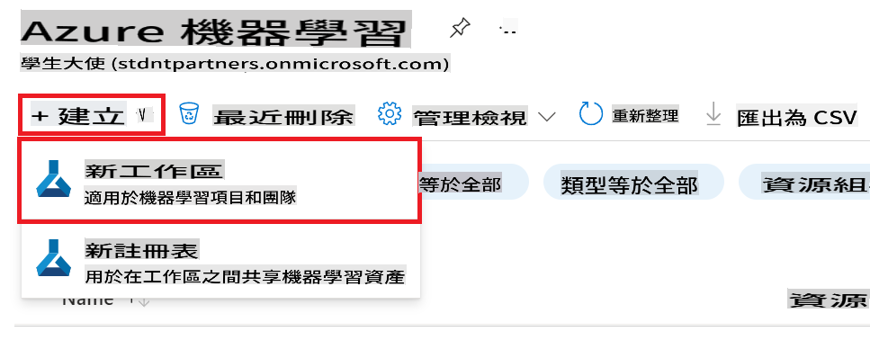

4. 執行以下任務：

    - 選擇你的 Azure **Subscription**。
    - 選擇要使用的 **Resource group**（如有需要，創建一個新的）。
    - 輸入 **Workspace Name**，它必須是唯一的。
    - 選擇你想使用的 **Region**。
    - 選擇要使用的 **Storage account**（如有需要，創建一個新的）。
    - 選擇要使用的 **Key vault**（如有需要，創建一個新的）。
    - 選擇要使用的 **Application insights**（如有需要，創建一個新的）。
    - 選擇要使用的 **Container registry**（如有需要，創建一個新的）。

    

5. 選擇 **Review + Create**。

6. 選擇 **Create**。

### 在 Azure 訂閱中請求 GPU 配額

在本教程中，你將學習如何使用 GPU 微調和部署 Phi-3 模型。微調將使用 *Standard_NC24ads_A100_v4* GPU，這需要請求配額。部署將使用 *Standard_NC6s_v3* GPU，這也需要請求配額。

> [!NOTE]
>
> 只有即付即用訂閱（標準訂閱類型）有資格獲得 GPU 配額；福利訂閱目前不支持。
>

1. 訪問 [Azure ML Studio](https://ml.azure.com/home?wt.mc_id=studentamb_279723)。

1. 執行以下任務來請求 *Standard NCADSA100v4 Family* 配額：

    - 從左側選項卡中選擇 **Quota**。
    - 選擇要使用的 **Virtual machine family**。例如，選擇 **Standard NCADSA100v4 Family Cluster Dedicated vCPUs**，其中包括 *Standard_NC24ads_A100_v4* GPU。
    - 從導航菜單中選擇 **Request quota**。

        

    - 在 Request quota 頁面中，輸入你想使用的 **New cores limit**。例如，24。
    - 在 Request quota 頁面中，選擇 **Submit** 來請求 GPU 配額。

1. 執行以下任務來請求 *Standard NCSv3 Family* 配額：

    - 從左側選項卡中選擇 **Quota**。
    - 選擇要使用的 **Virtual machine family**。例如，選擇 **Standard NCSv3 Family Cluster Dedicated vCPUs**，其中包括 *Standard_NC6s_v3* GPU。
    - 從導航菜單中選擇 **Request quota**。
    - 在 Request quota 頁面中，輸入你想使用的 **New cores limit**。例如，24。
    - 在 Request quota 頁面中，選擇 **Submit** 來請求 GPU 配額。

### 新增角色分配

要微調和部署你的模型，你必須首先創建一個 User Assigned Managed Identity（UAI）並賦予其適當的權限。這個 UAI 將在部署過程中用於身份驗證。

#### 創建 User Assigned Managed Identity（UAI）

1. 在門戶頁面頂部的**搜索欄**中輸入 *managed identities*，並從出現的選項中選擇 **Managed Identities**。

    

1. 選擇 **+ Create**。

    

1. 執行以下任務：

    - 選擇你的 Azure **Subscription**。
    - 選擇要使用的 **Resource group**（如有需要，創建一個新的）。
    - 選擇你想使用的 **Region**。
    - 輸入 **Name**，它必須是唯一的。

    

1. 選擇 **Review + create**。

1. 選擇 **+ Create**。

#### 新增 Contributor 角色分配到 Managed Identity

1. 導航到你創建的 Managed Identity 資源。

1. 從左側選項卡中選擇 **Azure role assignments**。

1. 從導航菜單中選擇 **+Add role assignment**。

1. 在 Add role assignment 頁面中，執行以下任務：
    - 將 **Scope** 設為 **Resource group**。
    - 選擇你的 Azure **Subscription**。
    - 選擇要使用的 **Resource group**。
    - 將 **Role** 設為 **Contributor**。

    

1. 選擇 **Save**。

#### 新增 Storage Blob Data Reader 角色分配到 Managed Identity

1. 在門戶頁面頂部的**搜索欄**中輸入 *storage accounts*，並從出現的選項中選擇 **Storage accounts**。

    

1. 選擇與你創建的 Azure Machine Learning workspace 關聯的存儲帳戶。例如，*finetunephistorage*。

1. 執行以下任務來導航到 Add role assignment 頁面：

    - 導航到你創建的 Azure Storage 帳戶。
    - 從左側選項卡中選擇 **Access Control (IAM)**。
    - 從導航菜單中選擇 **+ Add**。
    - 從導航菜單中選擇 **Add role assignment**。

    

1. 在 Add role assignment 頁面中，執行以下任務：

    - 在 Role 頁面中，輸入 *Storage Blob Data Reader* 在**搜索欄**中，並從出現的選項中選擇 **Storage Blob Data Reader**。
    - 在 Role 頁面中，選擇 **Next**。
    - 在 Members 頁面中，選擇 **Assign access to** **Managed identity**。
    - 在 Members 頁面中，選擇 **+ Select members**。
    - 在 Select managed identities 頁面中，選擇你的 Azure **Subscription**。
    - 在 Select managed identities 頁面中，選擇 **Managed identity** 為 **Manage Identity**。
    - 在 Select managed identities 頁面中，選擇你創建的 Manage Identity。例如，*finetunephi-managedidentity*。
    - 在 Select managed identities 頁面中，選擇 **Select**。

    

1. 選擇 **Review + assign**。

#### 新增 AcrPull 角色分配到 Managed Identity

1. 在門戶頁面頂部的**搜索欄**中輸入 *container registries*，並從出現的選項中選擇 **Container registries**。

    

1. 選擇與 Azure Machine Learning workspace 關聯的容器註冊表。例如，*finetunephicontainerregistry*

1. 執行以下任務來導航到 Add role assignment 頁面：

    - 從左側選項卡中選擇 **Access Control (IAM)**。
    - 從導航菜單中選擇 **+ Add**。
    - 從導航菜單中選擇 **Add role assignment**。

1. 在 Add role assignment 頁面中，執行以下任務：

    - 在 Role 頁面中，輸入 *AcrPull* 在**搜索欄**中，並從出現的選項中選擇 **AcrPull**。
    - 在 Role 頁面中，選擇 **Next**。
    - 在 Members 頁面中，選擇 **Assign access to** **Managed identity**。
    - 在 Members 頁面中，選擇 **+ Select members**。
    - 在 Select managed identities 頁面中，選擇你的 Azure **Subscription**。
    - 在 Select managed identities 頁面中，選擇 **Managed identity** 為 **Manage Identity**。
    - 在 Select managed identities 頁面中，選擇你創建的 Manage Identity。例如，*finetunephi-managedidentity*。
    - 在 Select managed identities 頁面中，選擇 **Select**。
    - 選擇 **Review + assign**。

### 設置項目

為了下載微調所需的數據集，你將設置一個本地環境。

在這個練習中，你將：

- 創建一個文件夾來進行操作。
- 創建一個虛擬環境。
- 安裝所需的包。
- 創建一個 *download_dataset.py* 文件來下載數據集。

#### 創建一個文件夾來進行操作

1. 打開終端窗口，輸入以下命令來在默認路徑中創建一個名為 *finetune-phi* 的文件夾。

    ```console
    mkdir finetune-phi
    ```

2. 在終端中輸入以下命令來導航到你創建的 *finetune-phi* 文件夾。

    ```console
    cd finetune-phi
    ```

#### 創建一個虛擬環境

1. 在終端中輸入以下命令來創建一個名為 *.venv* 的虛擬環境。

    ```console
    python -m venv .venv
    ```

2. 在終端中輸入以下命令來啟動虛擬環境。

    ```console
    .venv\Scripts\activate.bat
    ```

> [!NOTE]
> 如果成功，你應該會在命令提示符前看到 *(.venv)*。

#### 安裝所需的包

1. 在終端中輸入以下命令來安裝所需的包。

    ```console
    pip install datasets==2.19.1
    ```

#### 創建 `download_dataset.py`

> [!NOTE]
> 完整的文件夾結構：
>
> ```text
> └── YourUserName
> .    └── finetune-phi
> .        └── download_dataset.py
> ```

1. 打開 **Visual Studio Code**。

1. 從菜單欄中選擇 **File**。

1. 選擇 **Open Folder**。

1. 選擇你創建的 *finetune-phi* 文件夾，該文件夾位於 *C:\Users\yourUserName\finetune-phi*。

    

1. 在 Visual Studio Code 的左側窗格中右鍵單擊並選擇 **New File** 來創建一個名為 *download_dataset.py* 的新文件。

    

### 準備微調的數據集

在這個練習中，你將運行 *download_dataset.py* 文件來將 *ultrachat_200k* 數據集下載到本地環境。然後你將使用這些數據集來在 Azure Machine Learning 中微調 Phi-3 模型。

在這個練習中，你將：

- 在 *download_dataset.py* 文件中添加代碼來下載數據集。
- 運行 *download_dataset.py* 文件來將數據集下載到本地環境。

#### 使用 *download_dataset.py* 下載數據集

1. 在 Visual Studio Code 中打開 *download_dataset.py* 文件。

1. 在 *download_dataset.py* 文件中添加以下代碼。

    ```python
    import json
    import os
    from datasets import load_dataset

    def load_and_split_dataset(dataset_name, config_name, split_ratio):
        """
        Load and split a dataset.
        """
        # Load the dataset with the specified name, configuration, and split ratio
        dataset = load_dataset(dataset_name, config_name, split=split_ratio)
        print(f"Original dataset size: {len(dataset)}")
        
        # Split the dataset into train and test sets (80% train, 20% test)
        split_dataset = dataset.train_test_split(test_size=0.2)
        print(f"Train dataset size: {len(split_dataset['train'])}")
        print(f"Test dataset size: {len(split_dataset['test'])}")
        
        return split_dataset

    def save_dataset_to_jsonl(dataset, filepath):
        """
        Save a dataset to a JSONL file.
        """
        # Create the directory if it does not exist
        os.makedirs(os.path.dirname(filepath), exist_ok=True)
        
        # Open the file in write mode
        with open(filepath, 'w', encoding='utf-8') as f:
            # Iterate over each record in the dataset
            for record in dataset:
                # Dump the record as a JSON object and write it to the file
                json.dump(record, f)
                # Write a newline character to separate records
                f.write('\n')
        
        print(f"Dataset saved to {filepath}")

    def main():
        """
        Main function to load, split, and save the dataset.
        """
        # Load and split the ULTRACHAT_200k dataset with a specific configuration and split ratio
        dataset = load_and_split_dataset("HuggingFaceH4/ultrachat_200k", 'default', 'train_sft[:1%]')
        
        # Extract the train and test datasets from the split
        train_dataset = dataset['train']
        test_dataset = dataset['test']

        # Save the train dataset to a JSONL file
        save_dataset_to_jsonl(train_dataset, "data/train_data.jsonl")
        
        # Save the test dataset to a separate JSONL file
        save_dataset_to_jsonl(test_dataset, "data/test_data.jsonl")

    if __name__ == "__main__":
        main()

    ```

1. 在終端中輸入以下命令來運行腳本並將數據集下載到本地環境。

    ```console
    python download_dataset.py
    ```

1. 驗證數據集是否已成功保存到本地 *finetune-phi/data* 目錄。

> [!NOTE]
>
> #### 關於數據集大小和微調時間的說明
>
> 在本教程中，你只使用數據集的 1% (`split='train[:1%]'`)。這大大減少了數據量，加快了上傳和微調過程。你可以調整百分比以找到訓練時間和模型性能之間的平衡。使用較小的數據集子集可以減少微調所需的時間，使過程更易於管理。

## 場景 2：在 Azure Machine Learning Studio 中微調 Phi-3 模型並部署

### 微調 Phi-3 模型

在這個練習中，你將在 Azure Machine Learning Studio 中微調 Phi-3 模型。

在這個練習中，你將：

- 創建計算集群來進行微調。
- 在 Azure Machine Learning Studio 中微調 Phi-3 模型。

#### 創建計算集群來進行微調
1. 造訪 [Azure ML Studio](https://ml.azure.com/home?wt.mc_id=studentamb_279723).

1. 從左側標籤選擇 **Compute**。

1. 從導航選單中選擇 **Compute clusters**。

1. 選擇 **+ New**。

    

1. 執行以下任務：

    - 選擇你想使用的 **Region**。
    - 將 **Virtual machine tier** 設定為 **Dedicated**。
    - 將 **Virtual machine type** 設定為 **GPU**。
    - 將 **Virtual machine size** 過濾器設為 **Select from all options**。
    - 將 **Virtual machine size** 設定為 **Standard_NC24ads_A100_v4**。

    

1. 選擇 **Next**。

1. 執行以下任務：

    - 輸入 **Compute name**。這必須是唯一的值。
    - 將 **Minimum number of nodes** 設定為 **0**。
    - 將 **Maximum number of nodes** 設定為 **1**。
    - 將 **Idle seconds before scale down** 設定為 **120**。

    

1. 選擇 **Create**。

#### 微調 Phi-3 模型

1. 造訪 [Azure ML Studio](https://ml.azure.com/home?wt.mc_id=studentamb_279723).

1. 選擇你建立的 Azure Machine Learning workspace。

    

1. 執行以下任務：

    - 從左側標籤選擇 **Model catalog**。
    - 在 **search bar** 中輸入 *phi-3-mini-4k*，並從出現的選項中選擇 **Phi-3-mini-4k-instruct**。

    

1. 從導航選單中選擇 **Fine-tune**。

    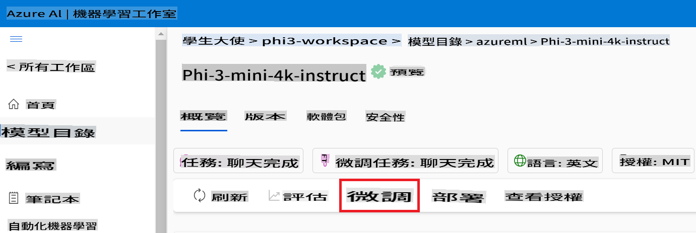

1. 執行以下任務：

    - 將 **Select task type** 設定為 **Chat completion**。
    - 選擇 **+ Select data** 以上傳 **Training data**。
    - 將 Validation data 上傳類型設為 **Provide different validation data**。
    - 選擇 **+ Select data** 以上傳 **Validation data**。

    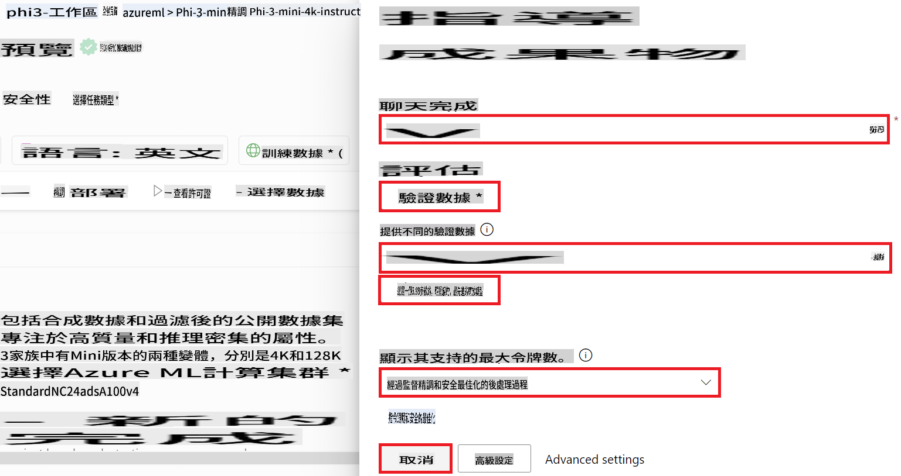

    > [!TIP]
    >
    > 你可以選擇 **Advanced settings** 來自訂配置，例如 **learning_rate** 和 **lr_scheduler_type**，以根據你的具體需求優化微調過程。

1. 選擇 **Finish**。

1. 在這個練習中，你成功地使用 Azure Machine Learning 微調了 Phi-3 模型。請注意，微調過程可能需要相當長的時間。在運行微調工作後，你需要等待其完成。你可以通過導航到 Azure Machine Learning Workspace 左側的 Jobs 標籤來監控微調工作的狀態。在下一個系列中，你將部署微調後的模型並將其與 Prompt flow 整合。

    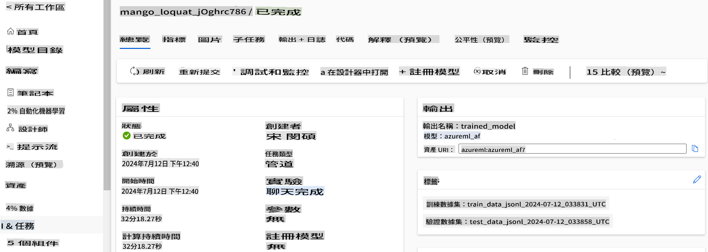

### 部署微調後的 Phi-3 模型

要將微調後的 Phi-3 模型與 Prompt flow 整合，你需要部署模型以使其可供實時推理使用。這個過程包括註冊模型、創建在線端點和部署模型。

在這個練習中，你將：

- 在 Azure Machine Learning workspace 中註冊微調後的模型。
- 創建一個在線端點。
- 部署註冊的微調後的 Phi-3 模型。

#### 註冊微調後的模型

1. 造訪 [Azure ML Studio](https://ml.azure.com/home?wt.mc_id=studentamb_279723).

1. 選擇你建立的 Azure Machine Learning workspace。

    

1. 從左側標籤選擇 **Models**。
1. 選擇 **+ Register**。
1. 選擇 **From a job output**。

    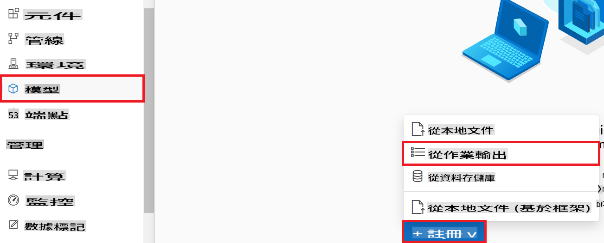

1. 選擇你創建的工作。

    

1. 選擇 **Next**。

1. 將 **Model type** 設定為 **MLflow**。

1. 確保 **Job output** 被選中；它應該自動選中。

    

1. 選擇 **Next**。

1. 選擇 **Register**。

    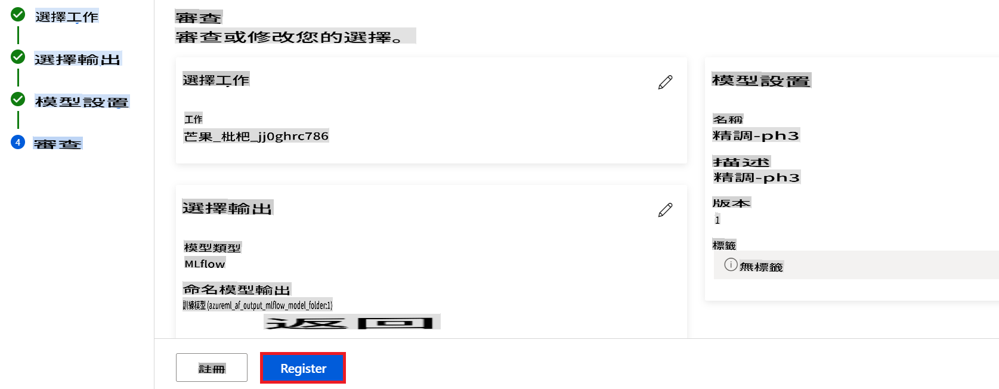

1. 你可以通過導航到左側標籤的 **Models** 菜單查看你註冊的模型。

    

#### 部署微調後的模型

1. 導航到你建立的 Azure Machine Learning workspace。

1. 從左側標籤選擇 **Endpoints**。

1. 從導航選單中選擇 **Real-time endpoints**。

    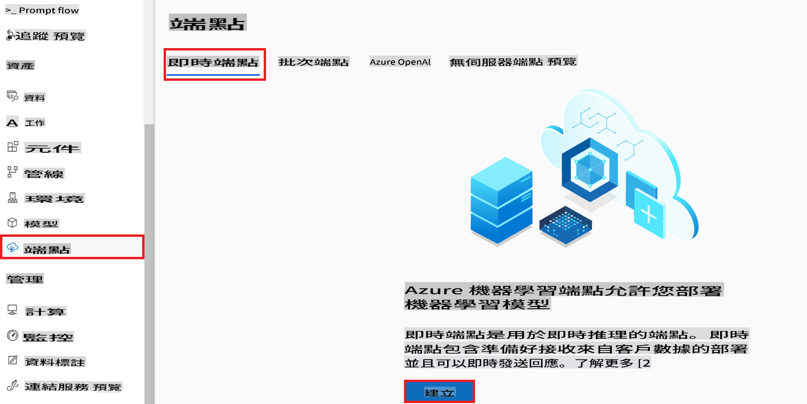

1. 選擇 **Create**。

1. 選擇你註冊的模型。

    

1. 選擇 **Select**。

1. 執行以下任務：

    - 將 **Virtual machine** 設定為 *Standard_NC6s_v3*。
    - 選擇你想使用的 **Instance count**。例如，*1*。
    - 將 **Endpoint** 設定為 **New** 以創建一個端點。
    - 輸入 **Endpoint name**。這必須是唯一的值。
    - 輸入 **Deployment name**。這必須是唯一的值。

    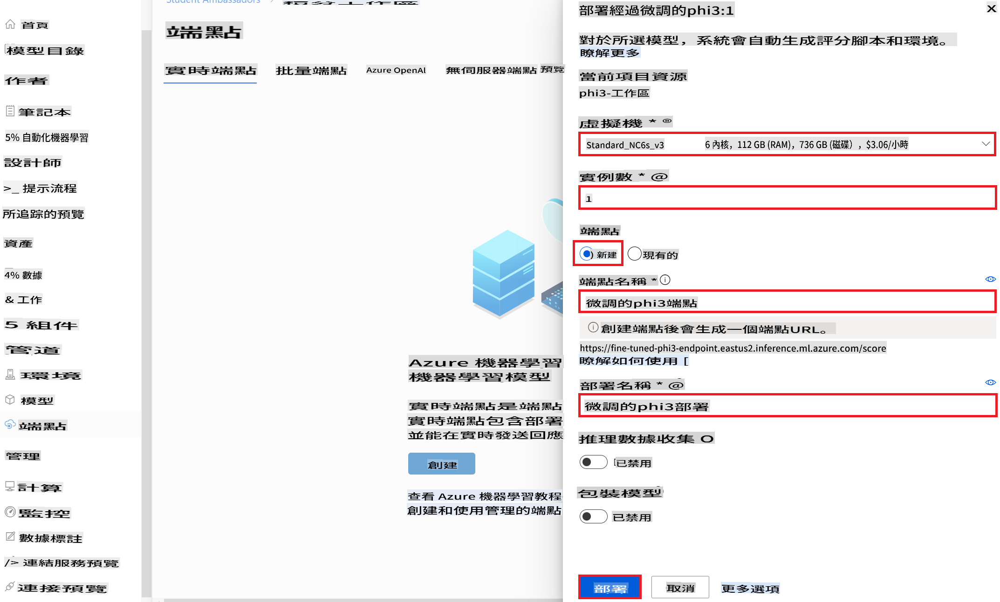

1. 選擇 **Deploy**。

> [!WARNING]
> 為了避免額外的費用，請確保在 Azure Machine Learning workspace 中刪除創建的端點。
>

#### 在 Azure Machine Learning Workspace 中檢查部署狀態

1. 導航到你建立的 Azure Machine Learning workspace。

1. 從左側標籤選擇 **Endpoints**。

1. 選擇你創建的端點。

    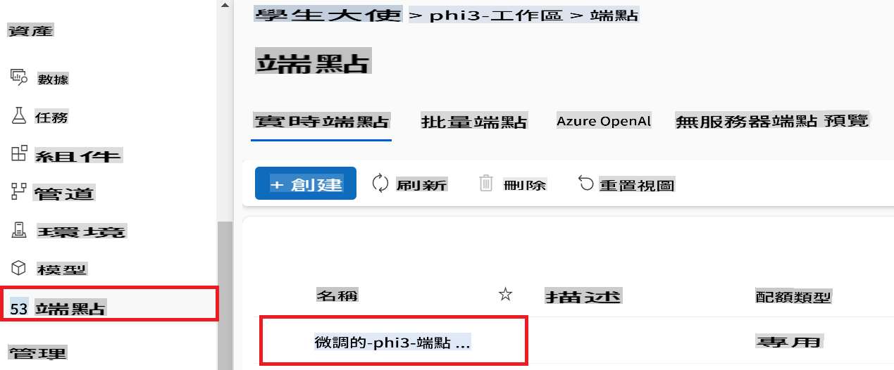

1. 在此頁面上，你可以在部署過程中管理端點。

> [!NOTE]
> 部署完成後，確保 **Live traffic** 設定為 **100%**。如果不是，請選擇 **Update traffic** 來調整流量設置。請注意，如果流量設置為 0%，你將無法測試模型。
>
> 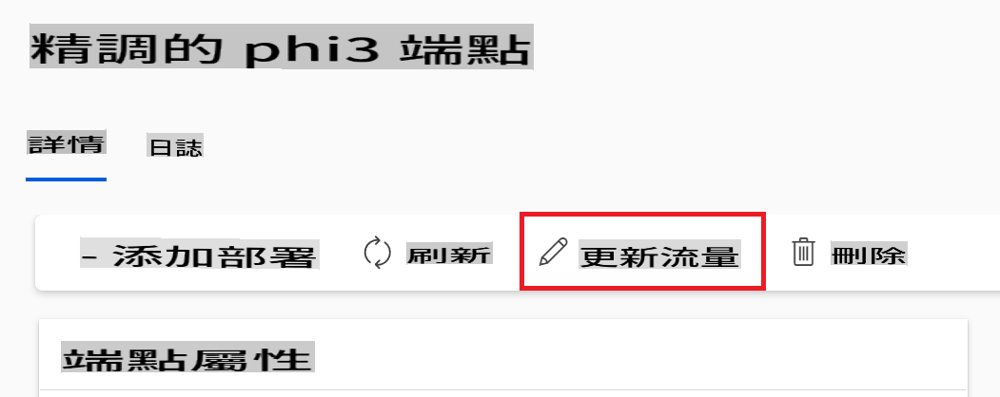
>

## 情境 3: 與 Prompt flow 整合並在 Azure AI Foundry 中與自定義模型進行對話

### 將自定義 Phi-3 模型與 Prompt flow 整合

成功部署微調後的模型後，你現在可以將其與 Prompt Flow 整合，以在實時應用中使用你的模型，從而啟用各種與自定義 Phi-3 模型的互動任務。

在這個練習中，你將：

- 創建 Azure AI Foundry Hub。
- 創建 Azure AI Foundry Project。
- 創建 Prompt flow。
- 為微調後的 Phi-3 模型添加自定義連接。
- 設置 Prompt flow 以與你的自定義 Phi-3 模型進行對話

> [!NOTE]
> 你也可以使用 Azure ML Studio 與 Promptflow 整合。相同的整合過程可以應用於 Azure ML Studio。

#### 創建 Azure AI Foundry Hub

在創建 Project 之前，你需要創建一個 Hub。Hub 就像一個 Resource Group，允許你在 Azure AI Foundry 中組織和管理多個 Project。

1. 造訪 [Azure AI Foundry](https://ai.azure.com/?WT.mc_id=aiml-137032-kinfeylo).

1. 從左側標籤選擇 **All hubs**。

1. 從導航選單中選擇 **+ New hub**。

    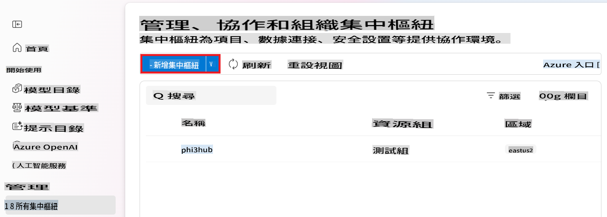

1. 執行以下任務：

    - 輸入 **Hub name**。這必須是唯一的值。
    - 選擇你的 Azure **Subscription**。
    - 選擇要使用的 **Resource group**（如有需要，創建一個新的）。
    - 選擇你想使用的 **Location**。
    - 選擇要使用的 **Connect Azure AI Services**（如有需要，創建一個新的）。
    - 將 **Connect Azure AI Search** 設定為 **Skip connecting**。

    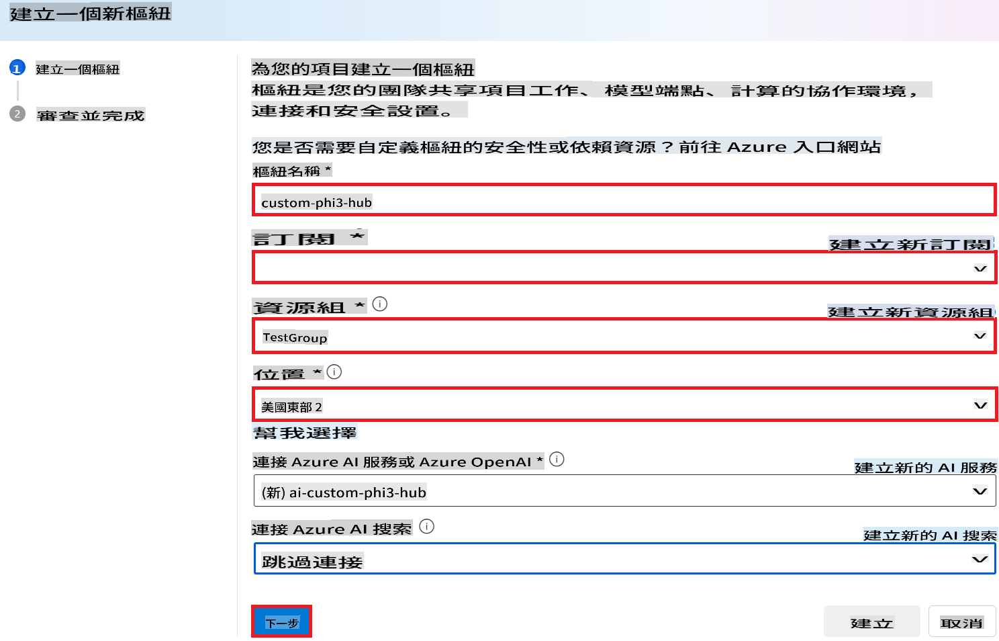

1. 選擇 **Next**。

#### 創建 Azure AI Foundry Project

1. 在你創建的 Hub 中，從左側標籤選擇 **All projects**。

1. 從導航選單中選擇 **+ New project**。

    

1. 輸入 **Project name**。這必須是唯一的值。

    

1. 選擇 **Create a project**。

#### 為微調後的 Phi-3 模型添加自定義連接

要將你的自定義 Phi-3 模型與 Prompt flow 整合，你需要在自定義連接中保存模型的端點和密鑰。這樣設置可以確保在 Prompt flow 中訪問你的自定義 Phi-3 模型。

#### 設置微調後 Phi-3 模型的 api key 和 endpoint uri

1. 造訪 [Azure ML Studio](https://ml.azure.com/home?WT.mc_id=aiml-137032-kinfeylo).

1. 導航到你建立的 Azure Machine learning workspace。

1. 從左側標籤選擇 **Endpoints**。

    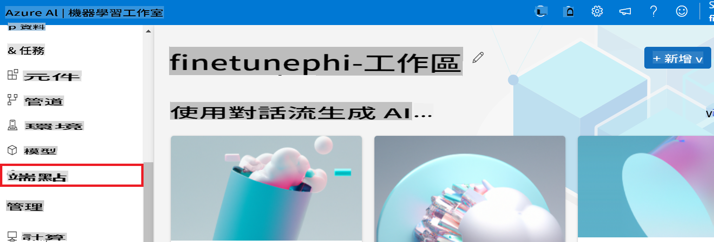

1. 選擇你創建的端點。

    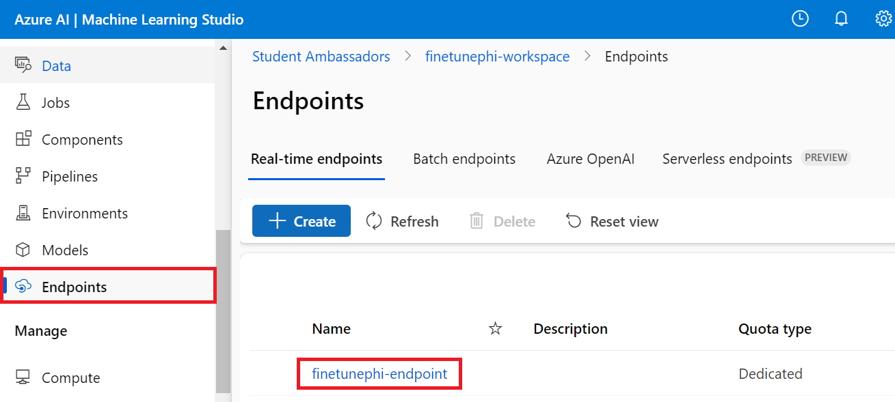

1. 從導航選單中選擇 **Consume**。

1. 複製你的 **REST endpoint** 和 **Primary key**。


#### 添加自定義連接

1. 訪問 [Azure AI Foundry](https://ai.azure.com/?WT.mc_id=aiml-137032-kinfeylo)。

1. 導航到你創建的 Azure AI Foundry 專案。

1. 在你創建的專案中，從左側選項卡中選擇 **Settings**。

1. 選擇 **+ New connection**。

    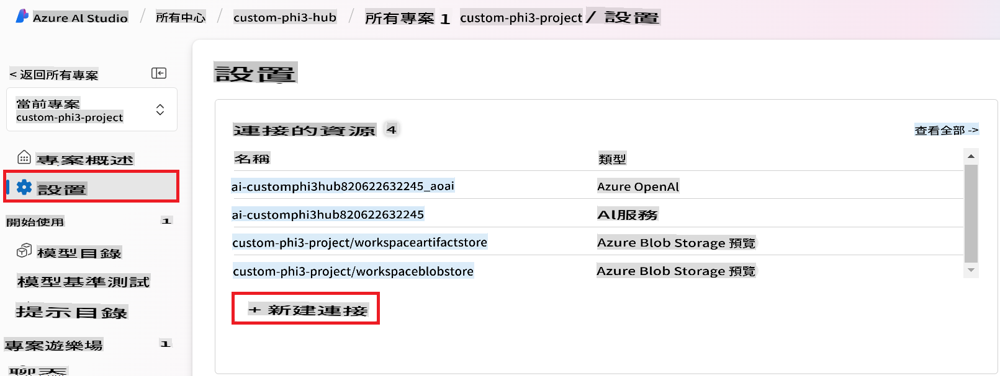

1. 從導航菜單中選擇 **Custom keys**。

    

1. 執行以下任務：

    - 選擇 **+ Add key value pairs**。
    - 對於鍵名稱，輸入 **endpoint** 並將你從 Azure ML Studio 複製的端點貼上到值欄位。
    - 再次選擇 **+ Add key value pairs**。
    - 對於鍵名稱，輸入 **key** 並將你從 Azure ML Studio 複製的金鑰貼上到值欄位。
    - 添加金鑰後，選擇 **is secret** 以防止金鑰暴露。

    

1. 選擇 **Add connection**。

#### 創建 Prompt flow

你已在 Azure AI Foundry 中添加了一個自定義連接。現在，讓我們使用以下步驟創建一個 Prompt flow。然後，你將把這個 Prompt flow 連接到自定義連接，以便在 Prompt flow 中使用微調的模型。

1. 導航到你創建的 Azure AI Foundry 專案。

1. 從左側選項卡中選擇 **Prompt flow**。

1. 從導航菜單中選擇 **+ Create**。

    

1. 從導航菜單中選擇 **Chat flow**。

    

1. 輸入 **Folder name**。

    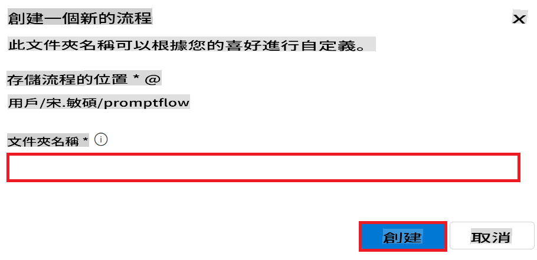

1. 選擇 **Create**。

#### 設置 Prompt flow 與你的自定義 Phi-3 模型進行聊天

你需要將微調的 Phi-3 模型集成到 Prompt flow 中。然而，現有的 Prompt flow 並未設計為此用途。因此，你必須重新設計 Prompt flow 以實現自定義模型的集成。

1. 在 Prompt flow 中，執行以下任務以重建現有的 flow：

    - 選擇 **Raw file mode**。
    - 刪除 *flow.dag.yml* 文件中的所有現有代碼。
    - 將以下代碼添加到 *flow.dag.yml* 文件中。

        ```yml
        inputs:
          input_data:
            type: string
            default: "Who founded Microsoft?"

        outputs:
          answer:
            type: string
            reference: ${integrate_with_promptflow.output}

        nodes:
        - name: integrate_with_promptflow
          type: python
          source:
            type: code
            path: integrate_with_promptflow.py
          inputs:
            input_data: ${inputs.input_data}
        ```

    - 選擇 **Save**。

    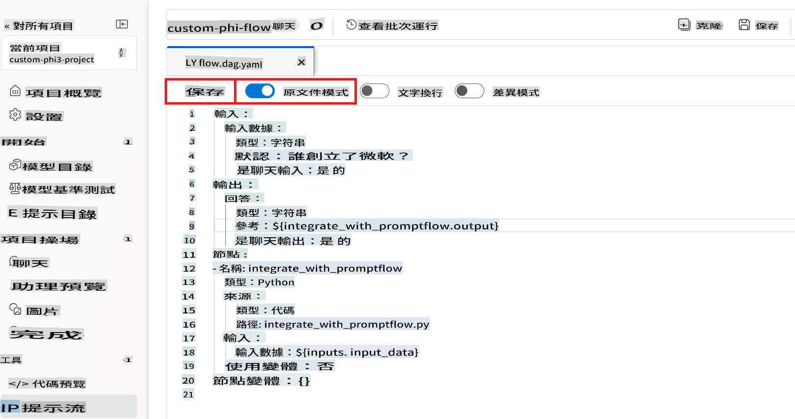

1. 將以下代碼添加到 *integrate_with_promptflow.py* 文件中，以在 Prompt flow 中使用自定義 Phi-3 模型。

    ```python
    import logging
    import requests
    from promptflow import tool
    from promptflow.connections import CustomConnection

    # Logging setup
    logging.basicConfig(
        format="%(asctime)s - %(levelname)s - %(name)s - %(message)s",
        datefmt="%Y-%m-%d %H:%M:%S",
        level=logging.DEBUG
    )
    logger = logging.getLogger(__name__)

    def query_phi3_model(input_data: str, connection: CustomConnection) -> str:
        """
        Send a request to the Phi-3 model endpoint with the given input data using Custom Connection.
        """

        # "connection" is the name of the Custom Connection, "endpoint", "key" are the keys in the Custom Connection
        endpoint_url = connection.endpoint
        api_key = connection.key

        headers = {
            "Content-Type": "application/json",
            "Authorization": f"Bearer {api_key}"
        }
        data = {
            "input_data": {
                "input_string": [
                    {"role": "user", "content": input_data}
                ],
                "parameters": {
                    "temperature": 0.7,
                    "max_new_tokens": 128
                }
            }
        }
        try:
            response = requests.post(endpoint_url, json=data, headers=headers)
            response.raise_for_status()
            
            # Log the full JSON response
            logger.debug(f"Full JSON response: {response.json()}")

            result = response.json()["output"]
            logger.info("Successfully received response from Azure ML Endpoint.")
            return result
        except requests.exceptions.RequestException as e:
            logger.error(f"Error querying Azure ML Endpoint: {e}")
            raise

    @tool
    def my_python_tool(input_data: str, connection: CustomConnection) -> str:
        """
        Tool function to process input data and query the Phi-3 model.
        """
        return query_phi3_model(input_data, connection)

    ```

    

> [!NOTE]
> 有關在 Azure AI Foundry 中使用 Prompt flow 的更多詳細信息，你可以參考 [Prompt flow in Azure AI Foundry](https://learn.microsoft.com/azure/ai-studio/how-to/prompt-flow)。

1. 選擇 **Chat input**、**Chat output** 以啟用與你的模型進行聊天。

    

1. 現在你已準備好與你的自定義 Phi-3 模型進行聊天。在下一個練習中，你將學習如何啟動 Prompt flow 並使用它與你微調的 Phi-3 模型進行聊天。

> [!NOTE]
>
> 重建的 flow 應如下圖所示：
>
> 
>

### 與你的自定義 Phi-3 模型聊天

現在你已經微調並將你的自定義 Phi-3 模型集成到 Prompt flow 中，你已準備好開始與它進行互動。本練習將指導你設置並啟動與模型聊天的過程。通過遵循這些步驟，你將能夠充分利用你的微調 Phi-3 模型在各種任務和對話中的能力。

- 使用 Prompt flow 與你的自定義 Phi-3 模型聊天。

#### 啟動 Prompt flow

1. 選擇 **Start compute sessions** 以啟動 Prompt flow。

    

1. 選擇 **Validate and parse input** 以更新參數。

    

1. 選擇 **connection** 的 **Value**，選擇你創建的自定義連接。例如，*connection*。

    

#### 與你的自定義模型聊天

1. 選擇 **Chat**。

    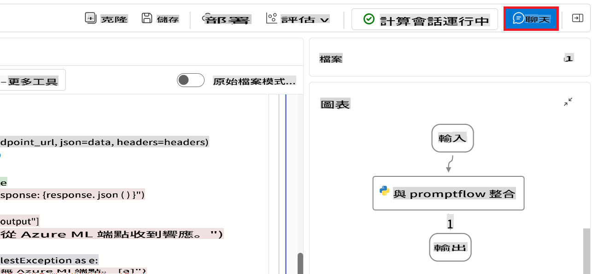

1. 以下是結果示例：現在你可以與你的自定義 Phi-3 模型聊天。建議根據用於微調的數據提出問題。

    

**免責聲明**：
本文件使用機器翻譯服務進行翻譯。我們力求準確，但請注意，自動翻譯可能包含錯誤或不準確之處。應以原文文件為權威來源。對於關鍵信息，建議尋求專業人工翻譯。我們不對因使用本翻譯而產生的任何誤解或誤讀承擔責任。