# Fine-tune and Integrate custom Phi-3 models with Prompt flow in Azure AI Studio

這個端到端（E2E）範例基於Microsoft Tech Community的指南"[Fine-Tune and Integrate Custom Phi-3 Models with Prompt Flow in Azure AI Studio](https://techcommunity.microsoft.com/t5/educator-developer-blog/fine-tune-and-integrate-custom-phi-3-models-with-prompt-flow-in/ba-p/4191726?WT.mc_id=aiml-137032-kinfeylo)"。它介紹了在Azure AI Studio中使用Prompt flow進行自定義Phi-3模型的微調、部署和整合過程。
與E2E範例"[Fine-Tune and Integrate Custom Phi-3 Models with Prompt Flow](./E2E_Phi-3-FineTuning_PromptFlow_Integration.md)"不同，本教程完全專注於在Azure AI / ML Studio內進行模型的微調和整合。

## 概述

在這個E2E範例中，你將學習如何在Azure AI Studio中微調Phi-3模型並將其與Prompt flow整合。通過利用Azure AI / ML Studio，你將建立一個工作流程來部署和使用自定義的AI模型。這個E2E範例分為三個場景：

**場景1：設置Azure資源並準備微調**

**場景2：微調Phi-3模型並在Azure Machine Learning Studio中部署**

**場景3：與Prompt flow整合並在Azure AI Studio中與自定義模型進行聊天**

以下是這個E2E範例的概述。

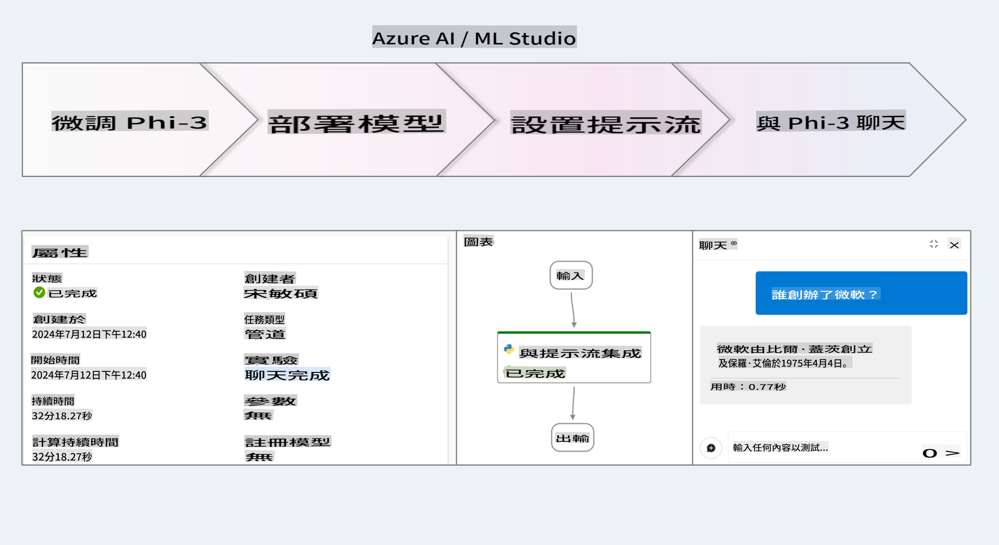

### 目錄

1. **[場景1：設置Azure資源並準備微調](../../../../md/06.E2ESamples)**
    - [創建Azure Machine Learning工作區](../../../../md/06.E2ESamples)
    - [在Azure訂閱中請求GPU配額](../../../../md/06.E2ESamples)
    - [添加角色分配](../../../../md/06.E2ESamples)
    - [設置項目](../../../../md/06.E2ESamples)
    - [準備微調數據集](../../../../md/06.E2ESamples)

1. **[場景2：微調Phi-3模型並在Azure Machine Learning Studio中部署](../../../../md/06.E2ESamples)**
    - [微調Phi-3模型](../../../../md/06.E2ESamples)
    - [部署微調後的Phi-3模型](../../../../md/06.E2ESamples)

1. **[場景3：與Prompt flow整合並在Azure AI Studio中與自定義模型進行聊天](../../../../md/06.E2ESamples)**
    - [將自定義Phi-3模型與Prompt flow整合](../../../../md/06.E2ESamples)
    - [與你的自定義Phi-3模型聊天](../../../../md/06.E2ESamples)

## 場景1：設置Azure資源並準備微調

### 創建Azure Machine Learning工作區

1. 在門戶頁面的**搜索欄**中輸入*azure machine learning*，然後從出現的選項中選擇**Azure Machine Learning**。

    

2. 從導航菜單中選擇**+ 創建**。

3. 從導航菜單中選擇**新工作區**。

    

4. 執行以下任務：

    - 選擇你的Azure **訂閱**。
    - 選擇要使用的**資源組**（如有需要，創建一個新的）。
    - 輸入**工作區名稱**。它必須是唯一的值。
    - 選擇你想使用的**區域**。
    - 選擇要使用的**存儲帳戶**（如有需要，創建一個新的）。
    - 選擇要使用的**密鑰保管庫**（如有需要，創建一個新的）。
    - 選擇要使用的**應用洞察**（如有需要，創建一個新的）。
    - 選擇要使用的**容器註冊表**（如有需要，創建一個新的）。

    

5. 選擇**審查 + 創建**。

6. 選擇**創建**。

### 在Azure訂閱中請求GPU配額

在本教程中，你將學習如何使用GPU微調和部署Phi-3模型。對於微調，你將使用*Standard_NC24ads_A100_v4* GPU，這需要請求配額。對於部署，你將使用*Standard_NC6s_v3* GPU，這也需要請求配額。

> [!NOTE]
>
> 只有按需付費訂閱（標準訂閱類型）有資格獲得GPU分配；目前不支持優惠訂閱。
>

1. 訪問[Azure ML Studio](https://ml.azure.com/home?wt.mc_id=studentamb_279723)。

1. 執行以下任務來請求*Standard NCADSA100v4 Family*配額：

    - 從左側選項卡中選擇**配額**。
    - 選擇要使用的**虛擬機系列**。例如，選擇**Standard NCADSA100v4 Family Cluster Dedicated vCPUs**，其中包括*Standard_NC24ads_A100_v4* GPU。
    - 從導航菜單中選擇**請求配額**。

        

    - 在請求配額頁面中，輸入你想使用的**新核心限制**。例如，24。
    - 在請求配額頁面中，選擇**提交**來請求GPU配額。

1. 執行以下任務來請求*Standard NCSv3 Family*配額：

    - 從左側選項卡中選擇**配額**。
    - 選擇要使用的**虛擬機系列**。例如，選擇**Standard NCSv3 Family Cluster Dedicated vCPUs**，其中包括*Standard_NC6s_v3* GPU。
    - 從導航菜單中選擇**請求配額**。
    - 在請求配額頁面中，輸入你想使用的**新核心限制**。例如，24。
    - 在請求配額頁面中，選擇**提交**來請求GPU配額。

### 添加角色分配

要微調和部署你的模型，必須首先創建一個用戶分配的托管身份（UAI）並賦予其適當的權限。此UAI將在部署期間用於身份驗證。

#### 創建用戶分配的托管身份（UAI）

1. 在門戶頁面的**搜索欄**中輸入*managed identities*，然後從出現的選項中選擇**Managed Identities**。

    

1. 選擇**+ 創建**。

    

1. 執行以下任務：

    - 選擇你的Azure **訂閱**。
    - 選擇要使用的**資源組**（如有需要，創建一個新的）。
    - 選擇你想使用的**區域**。
    - 輸入**名稱**。它必須是唯一的值。

    

1. 選擇**審查 + 創建**。

1. 選擇**+ 創建**。

#### 為托管身份添加貢獻者角色分配

1. 導航到你創建的托管身份資源。

1. 從左側選項卡中選擇**Azure角色分配**。

1. 從導航菜單中選擇**+ 添加角色分配**。

1. 在添加角色分配頁面中，執行以下任務：
    - 將**範圍**設置為**資源組**。
    - 選擇你的Azure **訂閱**。
    - 選擇要使用的**資源組**。
    - 將**角色**設置為**貢獻者**。

    

1. 選擇**保存**。

#### 為托管身份添加Storage Blob Data Reader角色分配

1. 在門戶頁面的**搜索欄**中輸入*storage accounts*，然後從出現的選項中選擇**Storage accounts**。

    

1. 選擇與你創建的Azure Machine Learning工作區相關聯的存儲帳戶。例如，*finetunephistorage*。

1. 執行以下任務以導航到添加角色分配頁面：

    - 導航到你創建的Azure存儲帳戶。
    - 從左側選項卡中選擇**訪問控制（IAM）**。
    - 從導航菜單中選擇**+ 添加**。
    - 從導航菜單中選擇**添加角色分配**。

    

1. 在添加角色分配頁面中，執行以下任務：

    - 在角色頁面中，在**搜索欄**中輸入*Storage Blob Data Reader*，然後從出現的選項中選擇**Storage Blob Data Reader**。
    - 在角色頁面中選擇**下一步**。
    - 在成員頁面中，選擇**分配訪問權限給** **托管身份**。
    - 在成員頁面中，選擇**+ 選擇成員**。
    - 在選擇托管身份頁面中，選擇你的Azure **訂閱**。
    - 在選擇托管身份頁面中，選擇**托管身份**為**管理身份**。
    - 在選擇托管身份頁面中，選擇你創建的托管身份。例如，*finetunephi-managedidentity*。
    - 在選擇托管身份頁面中，選擇**選擇**。

    

1. 選擇**審查 + 分配**。

#### 為托管身份添加AcrPull角色分配

1. 在門戶頁面的**搜索欄**中輸入*container registries*，然後從出現的選項中選擇**Container registries**。

    

1. 選擇與Azure Machine Learning工作區相關聯的容器註冊表。例如，*finetunephicontainerregistry*

1. 執行以下任務以導航到添加角色分配頁面：

    - 從左側選項卡中選擇**訪問控制（IAM）**。
    - 從導航菜單中選擇**+ 添加**。
    - 從導航菜單中選擇**添加角色分配**。

1. 在添加角色分配頁面中，執行以下任務：

    - 在角色頁面中，在**搜索欄**中輸入*AcrPull*，然後從出現的選項中選擇**AcrPull**。
    - 在角色頁面中選擇**下一步**。
    - 在成員頁面中，選擇**分配訪問權限給** **托管身份**。
    - 在成員頁面中，選擇**+ 選擇成員**。
    - 在選擇托管身份頁面中，選擇你的Azure **訂閱**。
    - 在選擇托管身份頁面中，選擇**托管身份**為**管理身份**。
    - 在選擇托管身份頁面中，選擇你創建的托管身份。例如，*finetunephi-managedidentity*。
    - 在選擇托管身份頁面中，選擇**選擇**。
    - 選擇**審查 + 分配**。

### 設置項目

要下載微調所需的數據集，你將設置一個本地環境。

在這個練習中，你將

- 創建一個文件夾來工作。
- 創建一個虛擬環境。
- 安裝所需的包。
- 創建一個*download_dataset.py*文件來下載數據集。

#### 創建一個文件夾來工作

1. 打開終端窗口，輸入以下命令在默認路徑中創建一個名為*finetune-phi*的文件夾。

    ```console
    mkdir finetune-phi
    ```

2. 在終端中輸入以下命令導航到你創建的*finetune-phi*文件夾。

    ```console
    cd finetune-phi
    ```

#### 創建一個虛擬環境

1. 在終端中輸入以下命令創建一個名為*.venv*的虛擬環境。

    ```console
    python -m venv .venv
    ```

2. 在終端中輸入以下命令激活虛擬環境。

    ```console
    .venv\Scripts\activate.bat
    ```

> [!NOTE]
> 如果成功，你應該會在命令提示符前看到*(.venv)*。

#### 安裝所需的包

1. 在終端中輸入以下命令安裝所需的包。

    ```console
    pip install datasets==2.19.1
    ```

#### 創建`donload_dataset.py`

> [!NOTE]
> 完整的文件夾結構：
>
> ```text
> └── YourUserName
> .    └── finetune-phi
> .        └── download_dataset.py
> ```

1. 打開**Visual Studio Code**。

1. 從菜單欄中選擇**文件**。

1. 選擇**打開文件夾**。

1. 選擇你創建的*finetune-phi*文件夾，位於*C:\Users\yourUserName\finetune-phi*。

    

1. 在Visual Studio Code的左側窗格中右鍵單擊並選擇**新建文件**來創建一個名為*download_dataset.py*的新文件。

    

### 準備微調數據集

在這個練習中，你將運行*download_dataset.py*文件以將*ultrachat_200k*數據集下載到你的本地環境。然後你將使用這些數據集在Azure Machine Learning中微調Phi-3模型。

在這個練習中，你將：

- 將代碼添加到*download_dataset.py*文件以下載數據集。
- 運行*download_dataset.py*文件將數據集下載到你的本地環境。

#### 使用*download_dataset.py*下載你的數據集

1. 在Visual Studio Code中打開*download_dataset.py*文件。

1. 將以下代碼添加到*download_dataset.py*文件中。

    ```python
    import json
    import os
    from datasets import load_dataset

    def load_and_split_dataset(dataset_name, config_name, split_ratio):
        """
        Load and split a dataset.
        """
        # Load the dataset with the specified name, configuration, and split ratio
        dataset = load_dataset(dataset_name, config_name, split=split_ratio)
        print(f"Original dataset size: {len(dataset)}")
        
        # Split the dataset into train and test sets (80% train, 20% test)
        split_dataset = dataset.train_test_split(test_size=0.2)
        print(f"Train dataset size: {len(split_dataset['train'])}")
        print(f"Test dataset size: {len(split_dataset['test'])}")
        
        return split_dataset

    def save_dataset_to_jsonl(dataset, filepath):
        """
        Save a dataset to a JSONL file.
        """
        # Create the directory if it does not exist
        os.makedirs(os.path.dirname(filepath), exist_ok=True)
        
        # Open the file in write mode
        with open(filepath, 'w', encoding='utf-8') as f:
            # Iterate over each record in the dataset
            for record in dataset:
                # Dump the record as a JSON object and write it to the file
                json.dump(record, f)
                # Write a newline character to separate records
                f.write('\n')
        
        print(f"Dataset saved to {filepath}")

    def main():
        """
        Main function to load, split, and save the dataset.
        """
        # Load and split the ULTRACHAT_200k dataset with a specific configuration and split ratio
        dataset = load_and_split_dataset("HuggingFaceH4/ultrachat_200k", 'default', 'train_sft[:1%]')
        
        # Extract the train and test datasets from the split
        train_dataset = dataset['train']
        test_dataset = dataset['test']

        # Save the train dataset to a JSONL file
        save_dataset_to_jsonl(train_dataset, "data/train_data.jsonl")
        
        # Save the test dataset to a separate JSONL file
        save_dataset_to_jsonl(test_dataset, "data/test_data.jsonl")

    if __name__ == "__main__":
        main()

    ```

1. 在終端中輸入以下命令運行腳本並將數據集下載到你的本地環境。

    ```console
    python download_dataset.py
    ```

1. 驗證數據集是否成功保存到你的本地*finetune-phi/data*目錄中。

> [!NOTE]
>
> #### 關於數據集大小和微調時間的說明
>
> 在本教程中，你僅使用1%的數據集（`split='train[:1%]'`）。這大大減少了數據量，加快了上傳和微調過程。你可以調整百分比以找到訓練時間和模型性能之間的最佳平衡。使用較小的數據集子集可以減少微調所需的時間，使過程更易於管理。

## 場景2：微調Phi-3模型並在Azure Machine Learning Studio中部署

### 微調Phi-3模型

在這個練習中，你將在Azure Machine Learning Studio中微調Phi-3模型。

在
1. 访问 [Azure ML Studio](https://ml.azure.com/home?wt.mc_id=studentamb_279723).

1. 从左侧标签中选择 **Compute**。

1. 从导航菜单中选择 **Compute clusters**。

1. 选择 **+ New**。

    

1. 执行以下任务：

    - 选择你想使用的 **Region**。
    - 将 **Virtual machine tier** 选择为 **Dedicated**。
    - 将 **Virtual machine type** 选择为 **GPU**。
    - 将 **Virtual machine size** 过滤器选择为 **Select from all options**。
    - 将 **Virtual machine size** 选择为 **Standard_NC24ads_A100_v4**。

    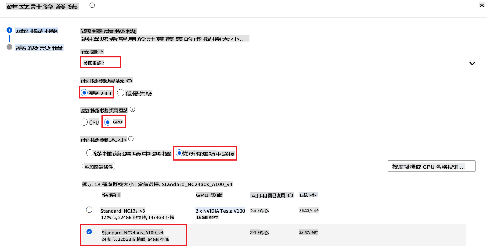

1. 选择 **Next**。

1. 执行以下任务：

    - 输入 **Compute name**。它必须是唯一的值。
    - 将 **Minimum number of nodes** 选择为 **0**。
    - 将 **Maximum number of nodes** 选择为 **1**。
    - 将 **Idle seconds before scale down** 选择为 **120**。

    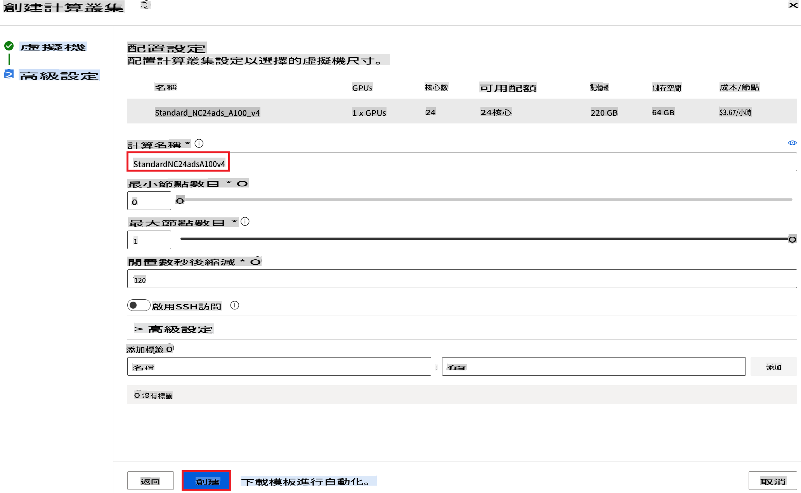

1. 选择 **Create**。

#### 微调 Phi-3 模型

1. 访问 [Azure ML Studio](https://ml.azure.com/home?wt.mc_id=studentamb_279723).

1. 选择你创建的 Azure Machine Learning 工作区。

    

1. 执行以下任务：

    - 从左侧标签中选择 **Model catalog**。
    - 在 **搜索栏** 中输入 *phi-3-mini-4k* 并从出现的选项中选择 **Phi-3-mini-4k-instruct**。

    

1. 从导航菜单中选择 **Fine-tune**。

    

1. 执行以下任务：

    - 将 **Select task type** 选择为 **Chat completion**。
    - 选择 **+ Select data** 上传 **Training data**。
    - 将验证数据上传类型选择为 **Provide different validation data**。
    - 选择 **+ Select data** 上传 **Validation data**。

    

    > [!TIP]
    >
    > 你可以选择 **Advanced settings** 来自定义配置，例如 **learning_rate** 和 **lr_scheduler_type**，以根据你的具体需求优化微调过程。

1. 选择 **Finish**。

1. 在这个练习中，你成功地使用 Azure Machine Learning 微调了 Phi-3 模型。请注意，微调过程可能需要相当长的时间。运行微调任务后，你需要等待它完成。你可以通过导航到 Azure Machine Learning 工作区左侧的 Jobs 标签来监控微调任务的状态。在下一系列中，你将部署微调后的模型并将其与 Prompt flow 集成。

    

### 部署微调后的 Phi-3 模型

要将微调后的 Phi-3 模型与 Prompt flow 集成，你需要部署模型以使其可以进行实时推理。这个过程涉及注册模型、创建在线端点和部署模型。

在这个练习中，你将：

- 在 Azure Machine Learning 工作区中注册微调后的模型。
- 创建一个在线端点。
- 部署注册的微调后的 Phi-3 模型。

#### 注册微调后的模型

1. 访问 [Azure ML Studio](https://ml.azure.com/home?wt.mc_id=studentamb_279723).

1. 选择你创建的 Azure Machine Learning 工作区。

    

1. 从左侧标签中选择 **Models**。
1. 选择 **+ Register**。
1. 选择 **From a job output**。

    

1. 选择你创建的任务。

    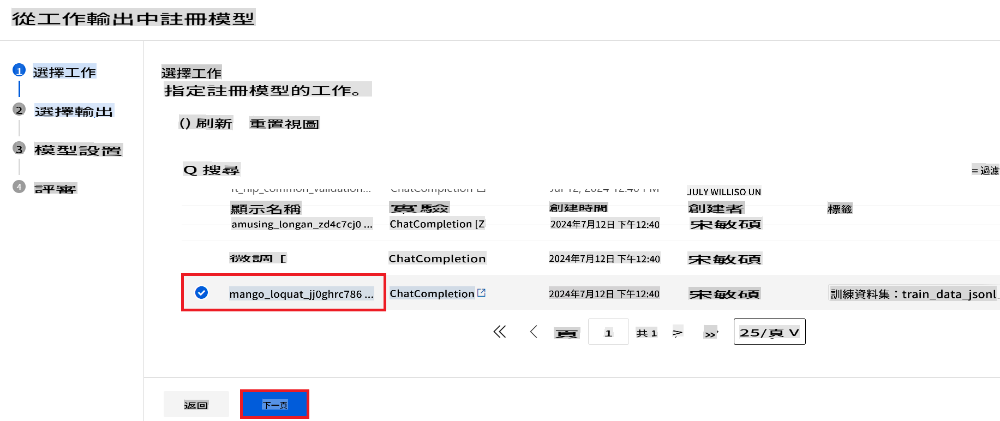

1. 选择 **Next**。

1. 将 **Model type** 选择为 **MLflow**。

1. 确保 **Job output** 被选中；它应该自动被选中。

    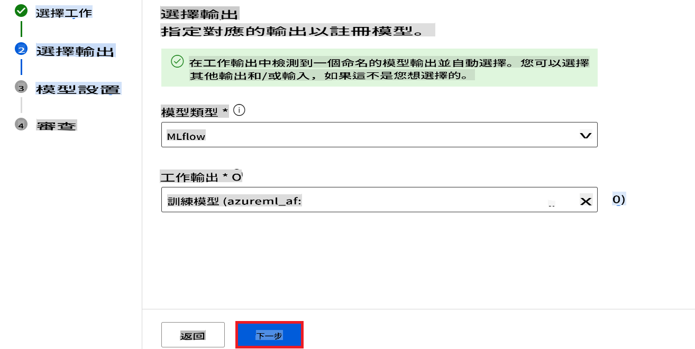

1. 选择 **Next**。

1. 选择 **Register**。

    

1. 你可以通过导航到左侧标签中的 **Models** 菜单查看你注册的模型。

    

#### 部署微调后的模型

1. 导航到你创建的 Azure Machine Learning 工作区。

1. 从左侧标签中选择 **Endpoints**。

1. 从导航菜单中选择 **Real-time endpoints**。

    

1. 选择 **Create**。

1. 选择你创建的注册模型。

    

1. 选择 **Select**。

1. 执行以下任务：

    - 将 **Virtual machine** 选择为 *Standard_NC6s_v3*。
    - 选择你想使用的 **Instance count**。例如，*1*。
    - 将 **Endpoint** 选择为 **New** 以创建一个端点。
    - 输入 **Endpoint name**。它必须是唯一的值。
    - 输入 **Deployment name**。它必须是唯一的值。

    

1. 选择 **Deploy**。

> [!WARNING]
> 为避免额外费用，请确保在 Azure Machine Learning 工作区中删除创建的端点。
>

#### 检查 Azure Machine Learning 工作区中的部署状态

1. 导航到你创建的 Azure Machine Learning 工作区。

1. 从左侧标签中选择 **Endpoints**。

1. 选择你创建的端点。

    

1. 在此页面中，你可以在部署过程中管理端点。

> [!NOTE]
> 部署完成后，确保 **Live traffic** 设置为 **100%**。如果不是，请选择 **Update traffic** 来调整流量设置。请注意，如果流量设置为 0%，你将无法测试模型。
>
> 
>

## 场景 3: 与 Prompt flow 集成并在 Azure AI Studio 中与自定义模型聊天

### 将自定义 Phi-3 模型与 Prompt flow 集成

在成功部署微调后的模型后，你现在可以将其与 Prompt Flow 集成，以在实时应用程序中使用你的模型，从而实现与自定义 Phi-3 模型的各种交互任务。

在这个练习中，你将：

- 创建 Azure AI Studio Hub。
- 创建 Azure AI Studio Project。
- 创建 Prompt flow。
- 为微调后的 Phi-3 模型添加自定义连接。
- 设置 Prompt flow 以与自定义 Phi-3 模型聊天。

> [!NOTE]
> 你也可以使用 Azure ML Studio 与 Promptflow 集成。相同的集成过程也适用于 Azure ML Studio。

#### 创建 Azure AI Studio Hub

在创建项目之前，你需要创建一个 Hub。Hub 类似于资源组，可以让你在 Azure AI Studio 中组织和管理多个项目。

1. 访问 [Azure AI Studio](https://ai.azure.com/?WT.mc_id=aiml-137032-kinfeylo).

1. 从左侧标签中选择 **All hubs**。

1. 从导航菜单中选择 **+ New hub**。

    

1. 执行以下任务：

    - 输入 **Hub name**。它必须是唯一的值。
    - 选择你的 Azure **Subscription**。
    - 选择你要使用的 **Resource group**（如有需要可创建新的）。
    - 选择你想使用的 **Location**。
    - 选择你要使用的 **Connect Azure AI Services**（如有需要可创建新的）。
    - 将 **Connect Azure AI Search** 选择为 **Skip connecting**。

    

1. 选择 **Next**。

#### 创建 Azure AI Studio Project

1. 在你创建的 Hub 中，从左侧标签中选择 **All projects**。

1. 从导航菜单中选择 **+ New project**。

    

1. 输入 **Project name**。它必须是唯一的值。

    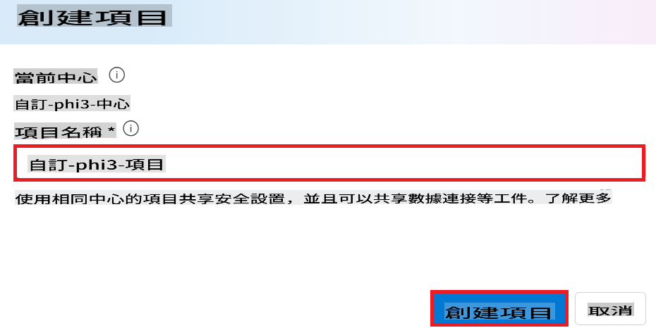

1. 选择 **Create a project**。

#### 为微调后的 Phi-3 模型添加自定义连接

要将自定义 Phi-3 模型与 Prompt flow 集成，你需要在自定义连接中保存模型的端点和密钥。这个设置确保在 Prompt flow 中访问你的自定义 Phi-3 模型。

#### 设置微调后的 Phi-3 模型的 API 密钥和端点 URI

1. 访问 [Azure ML Studio](https://ml.azure.com/home?WT.mc_id=aiml-137032-kinfeylo).

1. 导航到你创建的 Azure Machine Learning 工作区。

1. 从左侧标签中选择 **Endpoints**。

    

1. 选择你创建的端点。

    

1. 从导航菜单中选择 **Consume**。

1. 复制你的 **REST endpoint** 和 **Primary key**。
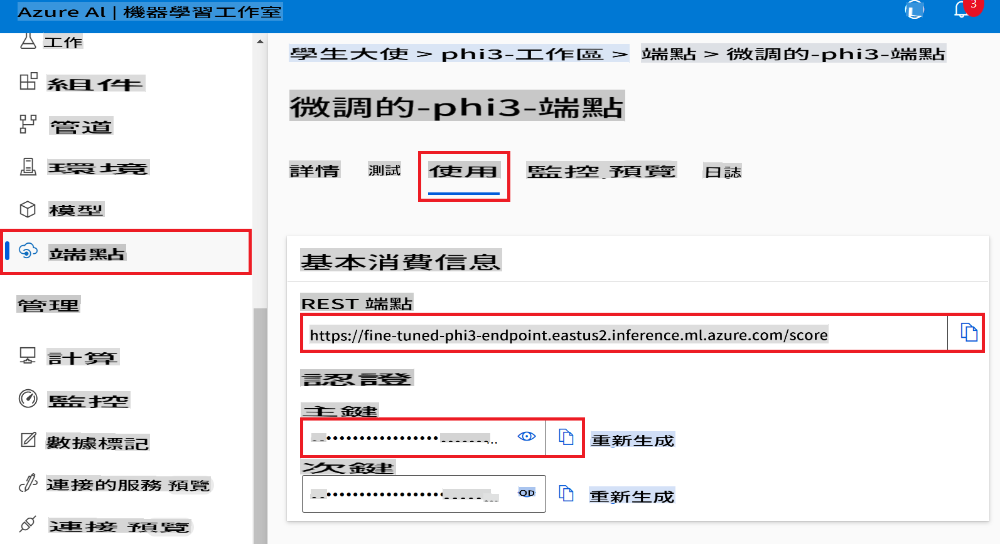

#### 添加自定義連接

1. 訪問 [Azure AI Studio](https://ai.azure.com/?WT.mc_id=aiml-137032-kinfeylo)。

1. 導航到你創建的 Azure AI Studio 項目。

1. 在你創建的項目中，從左側選擇 **Settings**。

1. 選擇 **+ New connection**。

    

1. 從導航菜單中選擇 **Custom keys**。

    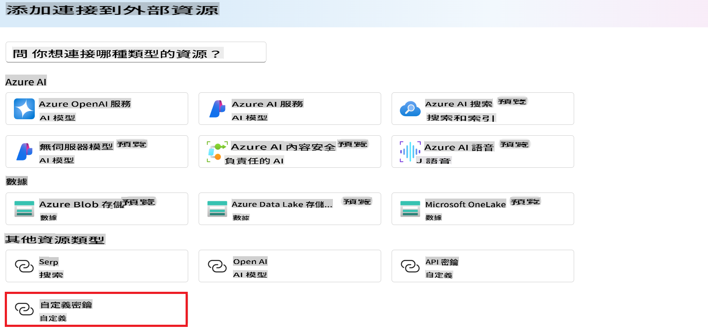

1. 執行以下操作：

    - 選擇 **+ Add key value pairs**。
    - 在鍵名欄位輸入 **endpoint**，並將從 Azure ML Studio 複製的端點粘貼到值欄位。
    - 再次選擇 **+ Add key value pairs**。
    - 在鍵名欄位輸入 **key**，並將從 Azure ML Studio 複製的密鑰粘貼到值欄位。
    - 添加鍵後，選擇 **is secret** 以防止密鑰暴露。

    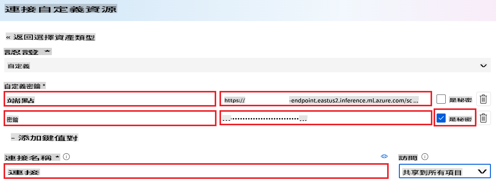

1. 選擇 **Add connection**。

#### 創建 Prompt flow

你已經在 Azure AI Studio 中添加了自定義連接。現在，讓我們按照以下步驟創建一個 Prompt flow。然後，你將把這個 Prompt flow 連接到自定義連接，以便在 Prompt flow 中使用微調過的模型。

1. 導航到你創建的 Azure AI Studio 項目。

1. 從左側選擇 **Prompt flow**。

1. 從導航菜單中選擇 **+ Create**。

    

1. 從導航菜單中選擇 **Chat flow**。

    

1. 輸入 **Folder name**。

    

1. 選擇 **Create**。

#### 設置 Prompt flow 與自定義 Phi-3 模型聊天

你需要將微調過的 Phi-3 模型集成到 Prompt flow 中。然而，現有的 Prompt flow 並不適合這個目的。因此，你必須重新設計 Prompt flow 以啟用自定義模型的集成。

1. 在 Prompt flow 中，執行以下操作來重建現有的流程：

    - 選擇 **Raw file mode**。
    - 刪除 *flow.dag.yml* 文件中的所有現有代碼。
    - 在 *flow.dag.yml* 文件中添加以下代碼。

        ```yml
        inputs:
          input_data:
            type: string
            default: "Who founded Microsoft?"

        outputs:
          answer:
            type: string
            reference: ${integrate_with_promptflow.output}

        nodes:
        - name: integrate_with_promptflow
          type: python
          source:
            type: code
            path: integrate_with_promptflow.py
          inputs:
            input_data: ${inputs.input_data}
        ```

    - 選擇 **Save**。

    

1. 在 *integrate_with_promptflow.py* 文件中添加以下代碼，以在 Prompt flow 中使用自定義 Phi-3 模型。

    ```python
    import logging
    import requests
    from promptflow import tool
    from promptflow.connections import CustomConnection

    # Logging setup
    logging.basicConfig(
        format="%(asctime)s - %(levelname)s - %(name)s - %(message)s",
        datefmt="%Y-%m-%d %H:%M:%S",
        level=logging.DEBUG
    )
    logger = logging.getLogger(__name__)

    def query_phi3_model(input_data: str, connection: CustomConnection) -> str:
        """
        Send a request to the Phi-3 model endpoint with the given input data using Custom Connection.
        """

        # "connection" is the name of the Custom Connection, "endpoint", "key" are the keys in the Custom Connection
        endpoint_url = connection.endpoint
        api_key = connection.key

        headers = {
            "Content-Type": "application/json",
            "Authorization": f"Bearer {api_key}"
        }
        data = {
            "input_data": {
                "input_string": [
                    {"role": "user", "content": input_data}
                ],
                "parameters": {
                    "temperature": 0.7,
                    "max_new_tokens": 128
                }
            }
        }
        try:
            response = requests.post(endpoint_url, json=data, headers=headers)
            response.raise_for_status()
            
            # Log the full JSON response
            logger.debug(f"Full JSON response: {response.json()}")

            result = response.json()["output"]
            logger.info("Successfully received response from Azure ML Endpoint.")
            return result
        except requests.exceptions.RequestException as e:
            logger.error(f"Error querying Azure ML Endpoint: {e}")
            raise

    @tool
    def my_python_tool(input_data: str, connection: CustomConnection) -> str:
        """
        Tool function to process input data and query the Phi-3 model.
        """
        return query_phi3_model(input_data, connection)

    ```

    

> [!NOTE]
> 有關在 Azure AI Studio 中使用 Prompt flow 的更多詳細信息，可以參考 [Prompt flow in Azure AI Studio](https://learn.microsoft.com/azure/ai-studio/how-to/prompt-flow)。

1. 選擇 **Chat input** 和 **Chat output** 以啟用與模型的聊天。

    

1. 現在你已經準備好與自定義 Phi-3 模型聊天。在下一個練習中，你將學習如何啟動 Prompt flow 並使用它與微調過的 Phi-3 模型進行聊天。

> [!NOTE]
>
> 重建的流程應如下圖所示：
>
> 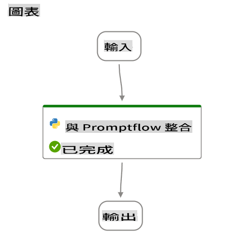
>

### 與自定義 Phi-3 模型聊天

現在你已經微調並將自定義 Phi-3 模型與 Prompt flow 集成，準備開始與它互動。這個練習將指導你設置並啟動與模型的聊天。通過以下步驟，你將能夠充分利用微調過的 Phi-3 模型進行各種任務和對話。

- 使用 Prompt flow 與自定義 Phi-3 模型聊天。

#### 啟動 Prompt flow

1. 選擇 **Start compute sessions** 以啟動 Prompt flow。

    

1. 選擇 **Validate and parse input** 以更新參數。

    

1. 選擇你創建的自定義連接的 **connection** 的 **Value**。例如，*connection*。

    

#### 與自定義模型聊天

1. 選擇 **Chat**。

    

1. 以下是結果示例：現在你可以與自定義 Phi-3 模型聊天。建議根據用於微調的數據提出問題。

    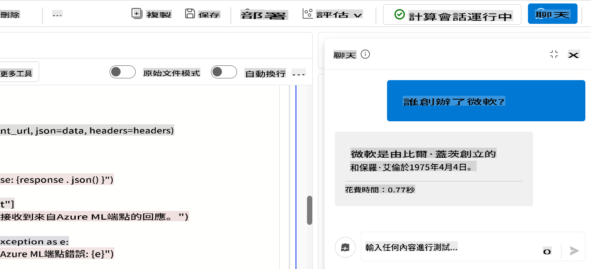

**免責聲明**：
本文件是使用機器翻譯服務翻譯的。雖然我們努力確保準確性，但請注意，自動翻譯可能包含錯誤或不準確之處。應以原始語言的文件為權威來源。對於關鍵信息，建議尋求專業人工翻譯。我們對使用本翻譯所引起的任何誤解或誤讀不承擔責任。