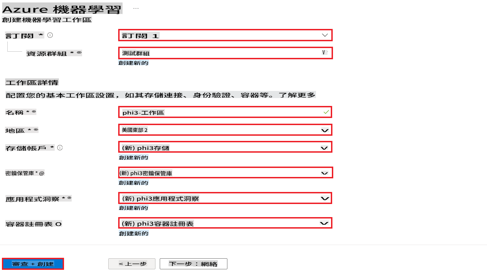
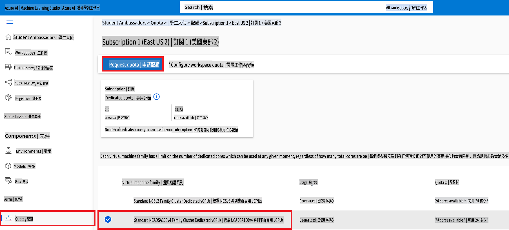
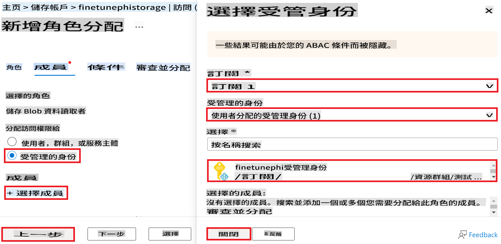
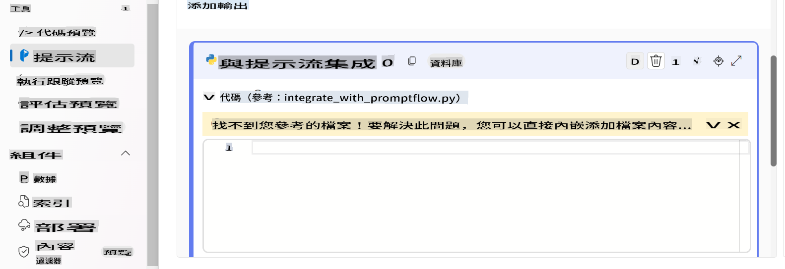
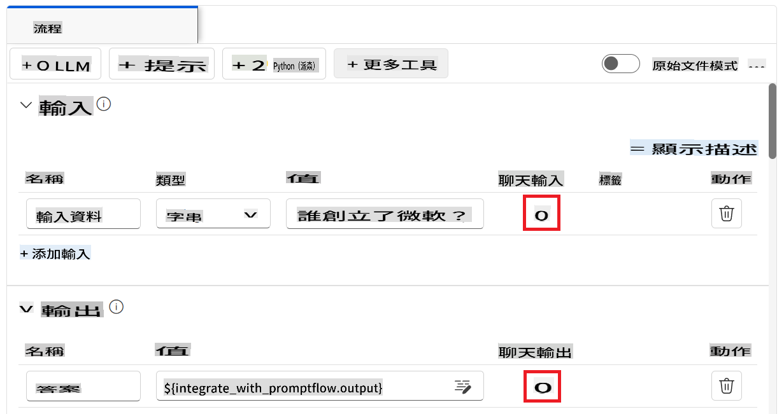

# 微調並整合自訂的 Phi-3 模型與 Prompt flow 在 Azure AI Studio 中

這個端到端（E2E）範例基於 Microsoft Tech Community 的指南 "[Fine-Tune and Integrate Custom Phi-3 Models with Prompt Flow in Azure AI Studio](https://techcommunity.microsoft.com/t5/educator-developer-blog/fine-tune-and-integrate-custom-phi-3-models-with-prompt-flow-in/ba-p/4191726?WT.mc_id=aiml-137032-kinfeylo)"。它介紹了在 Azure AI Studio 中微調、部署和整合自訂 Phi-3 模型與 Prompt flow 的過程。
不同於 E2E 範例 "[Fine-Tune and Integrate Custom Phi-3 Models with Prompt Flow](./E2E_Phi-3-FineTuning_PromptFlow_Integration.md)"，該範例涉及在本地運行代碼，本教程則完全專注於在 Azure AI / ML Studio 中微調和整合您的模型。

## 概述

在這個端到端範例中，您將學習如何微調 Phi-3 模型並將其整合到 Azure AI Studio 的 Prompt flow 中。通過利用 Azure AI / ML Studio，您將建立一個部署和使用自訂 AI 模型的工作流程。這個端到端範例分為三個場景：

**場景 1: 設置 Azure 資源並準備微調**

**場景 2: 微調 Phi-3 模型並在 Azure Machine Learning Studio 中部署**

**場景 3: 與 Prompt flow 整合並在 Azure AI Studio 中與您的自訂模型聊天**

以下是這個端到端範例的概述。


### 目錄

1. **[場景 1: 設置 Azure 資源並準備微調](../../../../md/06.E2ESamples)**
    - [創建 Azure Machine Learning 工作區](../../../../md/06.E2ESamples)
    - [在 Azure 訂閱中申請 GPU 配額](../../../../md/06.E2ESamples)
    - [添加角色分配](../../../../md/06.E2ESamples)
    - [設置項目](../../../../md/06.E2ESamples)
    - [準備微調的數據集](../../../../md/06.E2ESamples)

1. **[場景 2: 微調 Phi-3 模型並在 Azure Machine Learning Studio 中部署](../../../../md/06.E2ESamples)**
    - [微調 Phi-3 模型](../../../../md/06.E2ESamples)
    - [部署微調後的 Phi-3 模型](../../../../md/06.E2ESamples)

1. **[場景 3: 與 Prompt flow 整合並在 Azure AI Studio 中與您的自訂模型聊天](../../../../md/06.E2ESamples)**
    - [將自訂的 Phi-3 模型與 Prompt flow 整合](../../../../md/06.E2ESamples)
    - [與您的自訂 Phi-3 模型聊天](../../../../md/06.E2ESamples)

## 場景 1: 設置 Azure 資源並準備微調

### 創建 Azure Machine Learning 工作區

1. 在入口網站頁面頂部的 **搜索欄** 中輸入 *azure machine learning*，然後從出現的選項中選擇 **Azure Machine Learning**。

    

2. 從導航菜單中選擇 **+ 創建**。

3. 從導航菜單中選擇 **新建工作區**。

    

4. 執行以下任務：

    - 選擇您的 Azure **訂閱**。
    - 選擇要使用的 **資源組**（如果需要，創建一個新的）。
    - 輸入 **工作區名稱**。它必須是唯一的值。
    - 選擇您要使用的 **區域**。
    - 選擇要使用的 **存儲帳戶**（如果需要，創建一個新的）。
    - 選擇要使用的 **金鑰保管庫**（如果需要，創建一個新的）。
    - 選擇要使用的 **應用程序見解**（如果需要，創建一個新的）。
    - 選擇要使用的 **容器註冊表**（如果需要，創建一個新的）。

    

5. 選擇 **查看 + 創建**。

6. 選擇 **創建**。

### 在 Azure 訂閱中申請 GPU 配額

在這個教程中，您將學習如何使用 GPU 微調和部署 Phi-3 模型。微調時，您將使用 *Standard_NC24ads_A100_v4* GPU，這需要申請配額。部署時，您將使用 *Standard_NC6s_v3* GPU，這也需要申請配額。

> [!NOTE]
>
> 只有即用即付訂閱（標準訂閱類型）才有資格獲得 GPU 配額；福利訂閱目前不支持。
>

1. 訪問 [Azure ML Studio](https://ml.azure.com/home?wt.mc_id=studentamb_279723)。

1. 執行以下任務以申請 *Standard NCADSA100v4 Family* 配額：

    - 從左側標籤中選擇 **配額**。
    - 選擇要使用的 **虛擬機器系列**。例如，選擇 **Standard NCADSA100v4 Family Cluster Dedicated vCPUs**，其中包括 *Standard_NC24ads_A100_v4* GPU。
    - 從導航菜單中選擇 **申請配額**。

        

    - 在申請配額頁面中，輸入您要使用的 **新核心限制**。例如，24。
    - 在申請配額頁面中，選擇 **提交** 以申請 GPU 配額。

1. 執行以下任務以申請 *Standard NCSv3 Family* 配額：

    - 從左側標籤中選擇 **配額**。
    - 選擇要使用的 **虛擬機器系列**。例如，選擇 **Standard NCSv3 Family Cluster Dedicated vCPUs**，其中包括 *Standard_NC6s_v3* GPU。
    - 從導航菜單中選擇 **申請配額**。
    - 在申請配額頁面中，輸入您要使用的 **新核心限制**。例如，24。
    - 在申請配額頁面中，選擇 **提交** 以申請 GPU 配額。

### 添加角色分配

要微調和部署您的模型，您必須首先創建一個用戶分配的管理身份（UAI）並分配適當的權限。這個 UAI 將在部署過程中用於身份驗證。

#### 創建用戶分配的管理身份（UAI）

1. 在入口網站頁面頂部的 **搜索欄** 中輸入 *managed identities*，然後從出現的選項中選擇 **Managed Identities**。

    

1. 選擇 **+ 創建**。

    

1. 執行以下任務：

    - 選擇您的 Azure **訂閱**。
    - 選擇要使用的 **資源組**（如果需要，創建一個新的）。
    - 選擇您要使用的 **區域**。
    - 輸入 **名稱**。它必須是唯一的值。

    

1. 選擇 **查看 + 創建**。

1. 選擇 **+ 創建**。

#### 添加貢獻者角色分配到管理身份

1. 導航到您創建的管理身份資源。

1. 從左側標籤中選擇 **Azure 角色分配**。

1. 從導航菜單中選擇 **+ 添加角色分配**。

1. 在添加角色分配頁面中，執行以下任務：
    - 將 **範圍** 選擇為 **資源組**。
    - 選擇您的 Azure **訂閱**。
    - 選擇要使用的 **資源組**。
    - 將 **角色** 選擇為 **貢獻者**。

    

1. 選擇 **保存**。

#### 添加存儲 Blob 數據讀取者角色分配到管理身份

1. 在入口網站頁面頂部的 **搜索欄** 中輸入 *storage accounts*，然後從出現的選項中選擇 **Storage accounts**。

    

1. 選擇與您創建的 Azure Machine Learning 工作區相關聯的存儲帳戶。例如，*finetunephistorage*。

1. 執行以下任務以導航到添加角色分配頁面：

    - 導航到您創建的 Azure 存儲帳戶。
    - 從左側標籤中選擇 **訪問控制（IAM）**。
    - 從導航菜單中選擇 **+ 添加**。
    - 從導航菜單中選擇 **添加角色分配**。

    

1. 在添加角色分配頁面中，執行以下任務：

    - 在角色頁面中，在 **搜索欄** 中輸入 *Storage Blob Data Reader*，然後從出現的選項中選擇 **Storage Blob Data Reader**。
    - 在角色頁面中，選擇 **下一步**。
    - 在成員頁面中，選擇 **分配訪問給** **管理身份**。
    - 在成員頁面中，選擇 **+ 選擇成員**。
    - 在選擇管理身份頁面中，選擇您的 Azure **訂閱**。
    - 在選擇管理身份頁面中，選擇 **管理身份**。
    - 在選擇管理身份頁面中，選擇您創建的管理身份。例如，*finetunephi-managedidentity*。
    - 在選擇管理身份頁面中，選擇 **選擇**。

    

1. 選擇 **查看 + 分配**。

#### 添加 AcrPull 角色分配到管理身份

1. 在入口網站頁面頂部的 **搜索欄** 中輸入 *container registries*，然後從出現的選項中選擇 **Container registries**。

    

1. 選擇與 Azure Machine Learning 工作區相關聯的容器註冊表。例如，*finetunephicontainerregistry*。

1. 執行以下任務以導航到添加角色分配頁面：

    - 從左側標籤中選擇 **訪問控制（IAM）**。
    - 從導航菜單中選擇 **+ 添加**。
    - 從導航菜單中選擇 **添加角色分配**。

1. 在添加角色分配頁面中，執行以下任務：

    - 在角色頁面中，在 **搜索欄** 中輸入 *AcrPull*，然後從出現的選項中選擇 **AcrPull**。
    - 在角色頁面中，選擇 **下一步**。
    - 在成員頁面中，選擇 **分配訪問給** **管理身份**。
    - 在成員頁面中，選擇 **+ 選擇成員**。
    - 在選擇管理身份頁面中，選擇您的 Azure **訂閱**。
    - 在選擇管理身份頁面中，選擇 **管理身份**。
    - 在選擇管理身份頁面中，選擇您創建的管理身份。例如，*finetunephi-managedidentity*。
    - 在選擇管理身份頁面中，選擇 **選擇**。
    - 選擇 **查看 + 分配**。

### 設置項目

為了下載微調所需的數據集，您需要設置本地環境。

在這個練習中，您將：

- 創建一個文件夾來進行工作。
- 創建虛擬環境。
- 安裝所需的包。
- 創建一個 *download_dataset.py* 文件來下載數據集。

#### 創建一個文件夾來進行工作

1. 打開終端窗口，輸入以下命令在默認路徑中創建一個名為 *finetune-phi* 的文件夾。

    ```console
    mkdir finetune-phi
    ```

2. 在終端中輸入以下命令導航到您創建的 *finetune-phi* 文件夾。

    ```console
    cd finetune-phi
    ```

#### 創建虛擬環境

1. 在終端中輸入以下命令創建一個名為 *.venv* 的虛擬環境。

    ```console
    python -m venv .venv
    ```

2. 在終端中輸入以下命令激活虛擬環境。

    ```console
    .venv\Scripts\activate.bat
    ```

> [!NOTE]
> 如果成功，您應該會在命令提示符前看到 *(.venv)*。

#### 安裝所需的包

1. 在終端中輸入以下命令安裝所需的包。

    ```console
    pip install datasets==2.19.1
    ```

#### 創建 `download_dataset.py`

> [!NOTE]
> 完整文件夾結構：
>
> ```text
> └── YourUserName
> .    └── finetune-phi
> .        └── download_dataset.py
> ```

1. 打開 **Visual Studio Code**。

1. 從菜單欄中選擇 **文件**。

1. 選擇 **打開文件夾**。

1. 選擇您創建的 *finetune-phi* 文件夾，位於 *C:\Users\yourUserName\finetune-phi*。

    

1. 在 Visual Studio Code 的左側窗格中右鍵單擊並選擇 **新建文件**，創建一個名為 *download_dataset.py* 的新文件。

    

### 準備微調的數據集

在這個練習中，您將運行 *download_dataset.py* 文件，將 *ultrachat_200k* 數據集下載到您的本地環境。然後，您將使用這些數據集在 Azure Machine Learning 中微調 Phi-3 模型。

在這個練習中，您將：

- 向 *download_dataset.py* 文件中添加代碼以下載數據集。
- 運行 *download_dataset.py* 文件，將數據集下載到您的本地環境。

#### 使用 *download_dataset.py* 下載數據集

1. 在 Visual Studio Code 中打開 *download_dataset.py* 文件。

1. 將以下代碼添加到 *download_dataset.py* 文件中。

    ```python
    import json
    import os
    from datasets import load_dataset

    def load_and_split_dataset(dataset_name, config_name, split_ratio):
        """
        加載並拆分數據集。
        """
        # 使用指定的名稱、配置和拆分比例加載數據集
        dataset = load_dataset(dataset_name, config_name, split=split_ratio)
        print(f"原始數據集大小: {len(dataset)}")
        
        #
1. 造訪 [Azure ML Studio](https://ml.azure.com/home?wt.mc_id=studentamb_279723)。

1. 從左側選單中選擇 **Compute**。

1. 從導航選單中選擇 **Compute clusters**。

1. 選擇 **+ New**。

    

1. 執行以下任務：

    - 選擇你想使用的 **Region**。
    - 將 **Virtual machine tier** 設定為 **Dedicated**。
    - 將 **Virtual machine type** 設定為 **GPU**。
    - 將 **Virtual machine size** 過濾器設定為 **Select from all options**。
    - 將 **Virtual machine size** 設定為 **Standard_NC24ads_A100_v4**。

    

1. 選擇 **Next**。

1. 執行以下任務：

    - 輸入 **Compute name**。這必須是一個唯一的值。
    - 將 **Minimum number of nodes** 設定為 **0**。
    - 將 **Maximum number of nodes** 設定為 **1**。
    - 將 **Idle seconds before scale down** 設定為 **120**。

    

1. 選擇 **Create**。

#### 微調 Phi-3 模型

1. 造訪 [Azure ML Studio](https://ml.azure.com/home?wt.mc_id=studentamb_279723)。

1. 選擇你建立的 Azure Machine Learning 工作區。

    

1. 執行以下任務：

    - 從左側選單中選擇 **Model catalog**。
    - 在 **搜尋欄** 中輸入 *phi-3-mini-4k*，並從出現的選項中選擇 **Phi-3-mini-4k-instruct**。

    

1. 從導航選單中選擇 **Fine-tune**。

    

1. 執行以下任務：

    - 將 **Select task type** 設定為 **Chat completion**。
    - 選擇 **+ Select data** 上傳 **Training data**。
    - 將驗證資料上傳類型設定為 **Provide different validation data**。
    - 選擇 **+ Select data** 上傳 **Validation data**。

    

    > [!TIP]
    >
    > 你可以選擇 **Advanced settings** 來自訂配置，例如 **learning_rate** 和 **lr_scheduler_type**，以根據你的特定需求優化微調過程。

1. 選擇 **Finish**。

1. 在這個練習中，你成功使用 Azure Machine Learning 微調了 Phi-3 模型。請注意，微調過程可能需要相當長的時間。在運行微調工作後，你需要等待其完成。你可以透過導航到 Azure Machine Learning 工作區左側的 Jobs 標籤來監控微調工作的狀態。在下一個系列中，你將部署微調後的模型並將其與 Prompt flow 整合。

    

### 部署微調後的 Phi-3 模型

要將微調後的 Phi-3 模型與 Prompt flow 整合，你需要部署模型以使其可供即時推理使用。這個過程涉及註冊模型、建立線上端點並部署模型。

在這個練習中，你將：

- 在 Azure Machine Learning 工作區中註冊微調後的模型。
- 建立線上端點。
- 部署註冊的微調後 Phi-3 模型。

#### 註冊微調後的模型

1. 造訪 [Azure ML Studio](https://ml.azure.com/home?wt.mc_id=studentamb_279723)。

1. 選擇你建立的 Azure Machine Learning 工作區。

    

1. 從左側選單中選擇 **Models**。
1. 選擇 **+ Register**。
1. 選擇 **From a job output**。

    

1. 選擇你建立的工作。

    

1. 選擇 **Next**。

1. 將 **Model type** 設定為 **MLflow**。

1. 確保選擇了 **Job output**；它應該會自動選擇。

    

1. 選擇 **Next**。

1. 選擇 **Register**。

    

1. 你可以透過導航到左側選單中的 **Models** 來查看已註冊的模型。

    

#### 部署微調後的模型

1. 導航到你建立的 Azure Machine Learning 工作區。

1. 從左側選單中選擇 **Endpoints**。

1. 從導航選單中選擇 **Real-time endpoints**。

    

1. 選擇 **Create**。

1. 選擇你註冊的模型。

    

1. 選擇 **Select**。

1. 執行以下任務：

    - 將 **Virtual machine** 設定為 *Standard_NC6s_v3*。
    - 選擇你想使用的 **Instance count**。例如，*1*。
    - 將 **Endpoint** 設定為 **New** 以建立一個端點。
    - 輸入 **Endpoint name**。這必須是一個唯一的值。
    - 輸入 **Deployment name**。這必須是一個唯一的值。

    

1. 選擇 **Deploy**。

> [!WARNING]
> 為了避免你的帳戶產生額外費用，請確保在 Azure Machine Learning 工作區中刪除已建立的端點。
>

#### 在 Azure Machine Learning 工作區中檢查部署狀態

1. 導航到你建立的 Azure Machine Learning 工作區。

1. 從左側選單中選擇 **Endpoints**。

1. 選擇你建立的端點。

    

1. 在此頁面中，你可以在部署過程中管理端點。

> [!NOTE]
> 部署完成後，確保 **Live traffic** 設定為 **100%**。如果不是，選擇 **Update traffic** 來調整流量設定。請注意，如果流量設定為 0%，你將無法測試模型。
>
> 
>

## 情境 3：與 Prompt flow 整合並在 Azure AI Studio 中與自訂模型聊天

### 將自訂 Phi-3 模型與 Prompt flow 整合

成功部署你的微調模型後，你現在可以將其與 Prompt Flow 整合，以在即時應用中使用你的模型，從而啟用各種互動任務。

在這個練習中，你將：

- 建立 Azure AI Studio Hub。
- 建立 Azure AI Studio Project。
- 建立 Prompt flow。
- 為微調後的 Phi-3 模型添加自訂連接。
- 設定 Prompt flow 與你的自訂 Phi-3 模型聊天

> [!NOTE]
> 你也可以使用 Azure ML Studio 與 Promptflow 整合。相同的整合過程可以應用於 Azure ML Studio。

#### 建立 Azure AI Studio Hub

在建立 Project 之前，你需要建立一個 Hub。Hub 就像一個資源組，允許你在 Azure AI Studio 中組織和管理多個 Projects。

1. 造訪 [Azure AI Studio](https://ai.azure.com/?WT.mc_id=aiml-137032-kinfeylo)。

1. 從左側選單中選擇 **All hubs**。

1. 從導航選單中選擇 **+ New hub**。

    

1. 執行以下任務：

    - 輸入 **Hub name**。這必須是一個唯一的值。
    - 選擇你的 Azure **Subscription**。
    - 選擇要使用的 **Resource group**（如有需要可新建）。
    - 選擇你想使用的 **Location**。
    - 選擇要使用的 **Connect Azure AI Services**（如有需要可新建）。
    - 將 **Connect Azure AI Search** 設定為 **Skip connecting**。

    

1. 選擇 **Next**。

#### 建立 Azure AI Studio Project

1. 在你建立的 Hub 中，從左側選單中選擇 **All projects**。

1. 從導航選單中選擇 **+ New project**。

    

1. 輸入 **Project name**。這必須是一個唯一的值。

    

1. 選擇 **Create a project**。

#### 為微調後的 Phi-3 模型添加自訂連接

要將你的自訂 Phi-3 模型與 Prompt flow 整合，你需要在自訂連接中保存模型的端點和密鑰。這個設置確保在 Prompt flow 中能夠訪問你的自訂 Phi-3 模型。

#### 設定微調後 Phi-3 模型的 api key 和 endpoint uri

1. 造訪 [Azure ML Studio](https://ml.azure.com/home?WT.mc_id=aiml-137032-kinfeylo)。

1. 導航到你建立的 Azure Machine Learning 工作區。

1. 從左側選單中選擇 **Endpoints**。

    

1. 選擇你建立的端點。

    

1. 從導航選單中選擇 **Consume**。

1. 複製你的 **REST endpoint** 和 **Primary key**。


#### 新增自訂連線

1. 造訪 [Azure AI Studio](https://ai.azure.com/?WT.mc_id=aiml-137032-kinfeylo)。

1. 前往你創建的 Azure AI Studio 專案。

1. 在你創建的專案中，從左側選單選擇 **Settings**。

1. 選擇 **+ New connection**。

    

1. 從導航菜單選擇 **Custom keys**。

    

1. 執行以下任務：

    - 選擇 **+ Add key value pairs**。
    - 在 key 名稱中輸入 **endpoint**，並將從 Azure ML Studio 複製的 endpoint 貼到 value 欄位中。
    - 再次選擇 **+ Add key value pairs**。
    - 在 key 名稱中輸入 **key**，並將從 Azure ML Studio 複製的 key 貼到 value 欄位中。
    - 添加 key 後，選擇 **is secret** 以防止 key 被暴露。

    

1. 選擇 **Add connection**。

#### 創建 Prompt flow

你已在 Azure AI Studio 中新增了自訂連線。現在，讓我們使用以下步驟創建一個 Prompt flow。然後，你將把這個 Prompt flow 連接到自訂連線，以便在 Prompt flow 中使用微調過的模型。

1. 前往你創建的 Azure AI Studio 專案。

1. 從左側選單選擇 **Prompt flow**。

1. 從導航菜單選擇 **+ Create**。

    

1. 從導航菜單選擇 **Chat flow**。

    

1. 輸入 **Folder name**。

    

1. 選擇 **Create**。

#### 設置 Prompt flow 與你的自訂 Phi-3 模型進行對話

你需要將微調過的 Phi-3 模型整合到 Prompt flow 中。然而，現有的 Prompt flow 並不適合這個目的。因此，你必須重新設計 Prompt flow 以實現自訂模型的整合。

1. 在 Prompt flow 中，執行以下任務以重建現有流程：

    - 選擇 **Raw file mode**。
    - 刪除 *flow.dag.yml* 文件中的所有現有代碼。
    - 將以下代碼添加到 *flow.dag.yml* 文件中。

        ```yml
        inputs:
          input_data:
            type: string
            default: "Who founded Microsoft?"

        outputs:
          answer:
            type: string
            reference: ${integrate_with_promptflow.output}

        nodes:
        - name: integrate_with_promptflow
          type: python
          source:
            type: code
            path: integrate_with_promptflow.py
          inputs:
            input_data: ${inputs.input_data}
        ```

    - 選擇 **Save**。

    

1. 將以下代碼添加到 *integrate_with_promptflow.py* 文件中，以在 Prompt flow 中使用自訂 Phi-3 模型。

    ```python
    import logging
    import requests
    from promptflow import tool
    from promptflow.connections import CustomConnection

    # Logging setup
    logging.basicConfig(
        format="%(asctime)s - %(levelname)s - %(name)s - %(message)s",
        datefmt="%Y-%m-%d %H:%M:%S",
        level=logging.DEBUG
    )
    logger = logging.getLogger(__name__)

    def query_phi3_model(input_data: str, connection: CustomConnection) -> str:
        """
        Send a request to the Phi-3 model endpoint with the given input data using Custom Connection.
        """

        # "connection" is the name of the Custom Connection, "endpoint", "key" are the keys in the Custom Connection
        endpoint_url = connection.endpoint
        api_key = connection.key

        headers = {
            "Content-Type": "application/json",
            "Authorization": f"Bearer {api_key}"
        }
        data = {
            "input_data": {
                "input_string": [
                    {"role": "user", "content": input_data}
                ],
                "parameters": {
                    "temperature": 0.7,
                    "max_new_tokens": 128
                }
            }
        }
        try:
            response = requests.post(endpoint_url, json=data, headers=headers)
            response.raise_for_status()
            
            # Log the full JSON response
            logger.debug(f"Full JSON response: {response.json()}")

            result = response.json()["output"]
            logger.info("Successfully received response from Azure ML Endpoint.")
            return result
        except requests.exceptions.RequestException as e:
            logger.error(f"Error querying Azure ML Endpoint: {e}")
            raise

    @tool
    def my_python_tool(input_data: str, connection: CustomConnection) -> str:
        """
        Tool function to process input data and query the Phi-3 model.
        """
        return query_phi3_model(input_data, connection)

    ```

    

> [!NOTE]
> 有關在 Azure AI Studio 中使用 Prompt flow 的更多詳細資訊，請參閱 [Prompt flow in Azure AI Studio](https://learn.microsoft.com/azure/ai-studio/how-to/prompt-flow)。

1. 選擇 **Chat input**，**Chat output** 以啟用與模型的對話功能。

    

1. 現在你已準備好與自訂 Phi-3 模型進行對話。在下一個練習中，你將學習如何啟動 Prompt flow 並使用它與微調過的 Phi-3 模型進行對話。

> [!NOTE]
>
> 重建的流程應如下圖所示：
>
> 
>

### 與你的自訂 Phi-3 模型對話

現在你已微調並整合了自訂的 Phi-3 模型與 Prompt flow，你已準備好開始與它互動。此練習將指導你設置並啟動與模型的對話。通過遵循這些步驟，你將能夠充分利用微調過的 Phi-3 模型的能力來完成各種任務和對話。

- 使用 Prompt flow 與你的自訂 Phi-3 模型對話。

#### 啟動 Prompt flow

1. 選擇 **Start compute sessions** 以啟動 Prompt flow。

    

1. 選擇 **Validate and parse input** 以更新參數。

    

1. 選擇 **connection** 的 **Value** 以連接到你創建的自訂連線。例如，*connection*。

    

#### 與你的自訂模型對話

1. 選擇 **Chat**。

    

1. 以下是結果示例：現在你可以與自訂的 Phi-3 模型對話。建議根據用於微調的數據來提問。

    

免责声明：此翻译由AI模型从原文翻译而来，可能不够完美。请审阅输出并进行任何必要的修正。