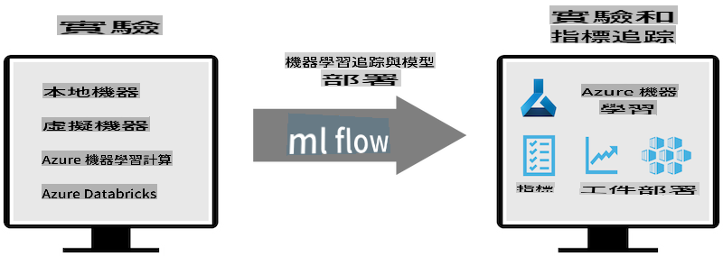

# MLflow

[MLflow](https://mlflow.org/) 是一個開源平台，旨在管理機器學習生命周期的每個環節。


MLFlow 用於管理機器學習的生命周期，包括實驗、可重現性、部署和集中模型註冊。MLFlow 目前提供四個組件：

- **MLflow Tracking:** 記錄和查詢實驗、代碼、數據配置和結果。
- **MLflow Projects:** 將數據科學代碼打包成可在任何平台上重現的格式。
- **Mlflow Models:** 在多種服務環境中部署機器學習模型。
- **Model Registry:** 在集中庫中存儲、註釋和管理模型。

MLFlow 包含實驗跟蹤、代碼打包成可重現運行、共享和部署模型的功能。MLFlow 集成到 Databricks 中，並支持各種機器學習庫，使其與庫無關。它可以與任何機器學習庫和任何編程語言一起使用，因為它提供了方便的 REST API 和 CLI。



MLFlow 的主要特性包括：

- **實驗跟蹤:** 記錄和比較參數和結果。
- **模型管理:** 將模型部署到各種服務和推理平台。
- **模型註冊:** 協作管理 MLFlow 模型的生命周期，包括版本控制和註釋。
- **項目:** 將機器學習代碼打包以供共享或生產使用。

MLFlow 也支持 MLOps 循環，包括準備數據、註冊和管理模型、打包模型以供執行、部署服務和監控模型。它旨在簡化從原型到生產工作流的過程，特別是在雲端和邊緣環境中。

## 端到端場景 - 構建封裝器並將 Phi-3 用作 MLFlow 模型

在這個端到端示例中，我們將展示兩種不同的方法來構建 Phi-3 小型語言模型 (SLM) 的封裝器，然後將其作為 MLFlow 模型在本地或雲端（例如 Azure Machine Learning 工作區）運行。


| 項目 | 描述 | 位置 |
| ------------ | ----------- | -------- |
| Transformer Pipeline | 如果你想使用帶有 MLFlow 實驗性 transformers 風格的 HuggingFace 模型，Transformer Pipeline 是構建封裝器的最簡單選擇。 | [**TransformerPipeline.ipynb**](../../../../code/06.E2E/E2E_Phi-3-MLflow_TransformerPipeline.ipynb) |
| Custom Python Wrapper | 在撰寫本文時，transformer pipeline 不支持 HuggingFace 模型的 ONNX 格式的 MLFlow 封裝生成，即使使用實驗性的 optimum Python 包也是如此。對於這種情況，你可以為 MLFlow 模式構建自定義 Python 封裝器。 | [**CustomPythonWrapper.ipynb**](../../../../code/06.E2E/E2E_Phi-3-MLflow_CustomPythonWrapper.ipynb) |

## 項目: Transformer Pipeline

1. 你需要從 MLFlow 和 HuggingFace 獲取相關的 Python 包：

    ``` Python
    import mlflow
    import transformers
    ```

2. 接下來，你應該通過引用 HuggingFace 註冊表中的目標 Phi-3 模型來啟動 transformer pipeline。從 _Phi-3-mini-4k-instruct_ 的模型卡可以看出，它的任務是“文本生成”類型：

    ``` Python
    pipeline = transformers.pipeline(
        task = "text-generation",
        model = "microsoft/Phi-3-mini-4k-instruct"
    )
    ```

3. 現在你可以將 Phi-3 模型的 transformer pipeline 保存為 MLFlow 格式，並提供額外的細節，例如目標工件路徑、特定的模型配置設置和推理 API 類型：

    ``` Python
    model_info = mlflow.transformers.log_model(
        transformers_model = pipeline,
        artifact_path = "phi3-mlflow-model",
        model_config = model_config,
        task = "llm/v1/chat"
    )
    ```

## 項目: Custom Python Wrapper

1. 我們可以利用 Microsoft 的 [ONNX Runtime generate() API](https://github.com/microsoft/onnxruntime-genai) 來進行 ONNX 模型的推理和 token 編碼/解碼。你需要為目標計算選擇 _onnxruntime_genai_ 包，以下示例針對 CPU：

    ``` Python
    import mlflow
    from mlflow.models import infer_signature
    import onnxruntime_genai as og
    ```

1. 我們的自定義類實現了兩個方法：_load_context()_ 用於初始化 Phi-3 Mini 4K Instruct 的 **ONNX 模型**、**生成器參數**和**分詞器**；_predict()_ 用於為提供的提示生成輸出 tokens：

    ``` Python
    class Phi3Model(mlflow.pyfunc.PythonModel):
        def load_context(self, context):
            # 從工件中檢索模型
            model_path = context.artifacts["phi3-mini-onnx"]
            model_options = {
                 "max_length": 300,
                 "temperature": 0.2,         
            }
        
            # 定義模型
            self.phi3_model = og.Model(model_path)
            self.params = og.GeneratorParams(self.phi3_model)
            self.params.set_search_options(**model_options)
            
            # 定義分詞器
            self.tokenizer = og.Tokenizer(self.phi3_model)
    
        def predict(self, context, model_input):
            # 從輸入中檢索提示
            prompt = model_input["prompt"][0]
            self.params.input_ids = self.tokenizer.encode(prompt)
    
            # 生成模型的響應
            response = self.phi3_model.generate(self.params)
    
            return self.tokenizer.decode(response[0][len(self.params.input_ids):])
    ```

1. 現在你可以使用 _mlflow.pyfunc.log_model()_ 函數為 Phi-3 模型生成自定義 Python 封裝器（以 pickle 格式），以及原始 ONNX 模型和所需的依賴項：

    ``` Python
    model_info = mlflow.pyfunc.log_model(
        artifact_path = artifact_path,
        python_model = Phi3Model(),
        artifacts = {
            "phi3-mini-onnx": "cpu_and_mobile/cpu-int4-rtn-block-32-acc-level-4",
        },
        input_example = input_example,
        signature = infer_signature(input_example, ["Run"]),
        extra_pip_requirements = ["torch", "onnxruntime_genai", "numpy"],
    )
    ```

## 生成的 MLFlow 模型簽名

1. 在上面 Transformer Pipeline 項目的第 3 步中，我們將 MLFlow 模型的任務設置為“_llm/v1/chat_”。這樣的指令會生成與 OpenAI 的 Chat API 兼容的模型 API 封裝，如下所示：

    ``` Python
    {inputs: 
      ['messages': Array({content: string (required), name: string (optional), role: string (required)}) (required), 'temperature': double (optional), 'max_tokens': long (optional), 'stop': Array(string) (optional), 'n': long (optional), 'stream': boolean (optional)],
    outputs: 
      ['id': string (required), 'object': string (required), 'created': long (required), 'model': string (required), 'choices': Array({finish_reason: string (required), index: long (required), message: {content: string (required), name: string (optional), role: string (required)} (required)}) (required), 'usage': {completion_tokens: long (required), prompt_tokens: long (required), total_tokens: long (required)} (required)],
    params: 
      None}
    ```

1. 因此，你可以按以下格式提交你的提示：

    ``` Python
    messages = [{"role": "user", "content": "What is the capital of Spain?"}]
    ```

1. 然後，使用與 OpenAI API 兼容的後處理，例如 _response[0][‘choices’][0][‘message’][‘content’]_，將輸出美化為如下內容：

    ``` JSON
    Question: What is the capital of Spain?
    
    Answer: The capital of Spain is Madrid. It is the largest city in Spain and serves as the political, economic, and cultural center of the country. Madrid is located in the center of the Iberian Peninsula and is known for its rich history, art, and architecture, including the Royal Palace, the Prado Museum, and the Plaza Mayor.
    
    Usage: {'prompt_tokens': 11, 'completion_tokens': 73, 'total_tokens': 84}
    ```

1. 在上面 Custom Python Wrapper 項目的第 3 步中，我們允許 MLFlow 包從給定的輸入示例生成模型的簽名。我們的 MLFlow 封裝器的簽名如下所示：

    ``` Python
    {inputs: 
      ['prompt': string (required)],
    outputs: 
      [string (required)],
    params: 
      None}
    ```

1. 因此，我們的提示需要包含 "prompt" 字典鍵，類似於這樣：

    ``` Python
    {"prompt": "<|system|>You are a stand-up comedian.<|end|><|user|>Tell me a joke about atom<|end|><|assistant|>",}
    ```

1. 模型的輸出將以字符串格式提供：

    ``` JSON
    Alright, here's a little atom-related joke for you!
    
    Why don't electrons ever play hide and seek with protons?
    
    Because good luck finding them when they're always "sharing" their electrons!
    
    Remember, this is all in good fun, and we're just having a little atomic-level humor!
    ```

免責聲明：此翻譯由AI模型從原文翻譯而來，可能不完全準確。請檢查翻譯結果並進行任何必要的修正。