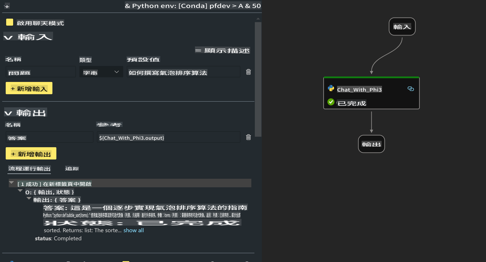

# **Lab 2 - 在 AIPC 中運行 Phi-3-mini 的 Prompt flow**

## **什麼是 Prompt flow**

Prompt flow 是一套開發工具，旨在簡化基於 LLM 的 AI 應用程序的端到端開發週期，從構思、原型設計、測試、評估到生產部署和監控。它使 prompt 工程變得更加簡單，並使您能夠構建具有生產質量的 LLM 應用程序。

使用 Prompt flow，您可以：

- 創建將 LLMs、prompts、Python 代碼和其他工具連接在一起的可執行工作流。

- 輕鬆調試和迭代您的工作流，特別是與 LLMs 的交互。

- 評估您的工作流，使用更大的數據集計算質量和性能指標。

- 將測試和評估集成到您的 CI/CD 系統中，以確保工作流的質量。

- 將您的工作流部署到您選擇的服務平台或輕鬆集成到您的應用程序代碼庫中。

- （可選但強烈推薦）利用 Azure AI 中的 Prompt flow 雲版本與您的團隊合作。

## **什麼是 AIPC**

AI PC 擁有 CPU、GPU 和 NPU，每個都有特定的 AI 加速能力。NPU，或神經處理單元，是一種專門的加速器，能夠在您的 PC 上處理人工智能（AI）和機器學習（ML）任務，而不是將數據發送到雲端處理。GPU 和 CPU 也可以處理這些工作負載，但 NPU 尤其擅長低功耗的 AI 計算。AI PC 代表了我們計算機操作方式的根本轉變。它不是針對以前不存在的問題的解決方案，而是對日常 PC 使用的一個巨大改進。

那麼它是如何工作的呢？與訓練於大量公共數據的大型生成式 AI 和 LLMs 相比，發生在您 PC 上的 AI 在各個層面上更容易接觸。這個概念更容易理解，因為它是基於您的數據訓練的，不需要訪問雲端，這樣的好處對更廣泛的人群更具吸引力。

在短期內，AI PC 世界涉及直接在您的 PC 上運行的個人助理和較小的 AI 模型，使用您的數據提供個人、私密、更安全的 AI 增強功能，用於您每天已經在做的事情——例如會議記錄、組織幻想足球聯賽、自動增強照片和視頻編輯，或根據每個人的到達和離開時間安排完美的家庭聚會行程。

## **在 AIPC 上構建生成代碼流**

***注意***：如果您尚未完成環境安裝，請訪問 [Lab 0 -Installations](./01.Installations.md)

1. 在 Visual Studio Code 中打開 Prompt flow 擴展並創建一個空的 flow 項目


2. 添加輸入和輸出參數，並添加 Python 代碼作為新的 flow



您可以參考這個結構（flow.dag.yaml）來構建您的 flow

```yaml

inputs:
  question:
    type: string
    default: how to write Bubble Algorithm
outputs:
  answer:
    type: string
    reference: ${Chat_With_Phi3.output}
nodes:
- name: Chat_With_Phi3
  type: python
  source:
    type: code
    path: Chat_With_Phi3.py
  inputs:
    question: ${inputs.question}


```

3. 在 ***Chat_With_Phi3.py*** 中添加代碼

```python

from promptflow.core import tool

# import torch
from transformers import AutoTokenizer, pipeline,TextStreamer
import intel_npu_acceleration_library as npu_lib

import warnings

import asyncio
import platform

class Phi3CodeAgent:
    
    model = None
    tokenizer = None
    text_streamer = None
    
    model_id = "microsoft/Phi-3-mini-4k-instruct"

    @staticmethod
    def init_phi3():
        
        if Phi3CodeAgent.model is None or Phi3CodeAgent.tokenizer is None or Phi3CodeAgent.text_streamer is None:
            Phi3CodeAgent.model = npu_lib.NPUModelForCausalLM.from_pretrained(
                                    Phi3CodeAgent.model_id,
                                    torch_dtype="auto",
                                    dtype=npu_lib.int4,
                                    trust_remote_code=True
                                )
            Phi3CodeAgent.tokenizer = AutoTokenizer.from_pretrained(Phi3CodeAgent.model_id)
            Phi3CodeAgent.text_streamer = TextStreamer(Phi3CodeAgent.tokenizer, skip_prompt=True)

    

    @staticmethod
    def chat_with_phi3(prompt):
        
        Phi3CodeAgent.init_phi3()

        messages = "<|system|>You are a AI Python coding assistant. Please help me to generate code in Python.The answer only genertated Python code, but any comments and instructions do not need to be generated<|end|><|user|>" + prompt +"<|end|><|assistant|>"


        generation_args = {
            "max_new_tokens": 1024,
            "return_full_text": False,
            "temperature": 0.3,
            "do_sample": False,
            "streamer": Phi3CodeAgent.text_streamer,
        }

        pipe = pipeline(
            "text-generation",
            model=Phi3CodeAgent.model,
            tokenizer=Phi3CodeAgent.tokenizer,
            # **generation_args
        )

        result = ''

        with warnings.catch_warnings():
            warnings.simplefilter("ignore")
            response = pipe(messages, **generation_args)
            result =response[0]['generated_text']
            return result


@tool
def my_python_tool(question: str) -> str:
    if platform.system() == 'Windows':
        asyncio.set_event_loop_policy(asyncio.WindowsSelectorEventLoopPolicy())
    return Phi3CodeAgent.chat_with_phi3(question)


```

4. 您可以從 Debug 或 Run 測試 flow 以檢查生成的代碼是否正常


5. 在終端中運行 flow 作為開發 API

```

pf flow serve --source ./ --port 8080 --host localhost   

```

您可以在 Postman / Thunder Client 中測試

### **注意**

1. 第一次運行需要很長時間。建議從 Hugging face CLI 下載 phi-3 模型。

2. 考慮到 Intel NPU 的計算能力有限，建議使用 Phi-3-mini-4k-instruct。

3. 我們使用 Intel NPU Acceleration 進行 INT4 量化轉換，但如果重新運行服務，則需要刪除 cache 和 nc_workshop 文件夾。

## **資源**

1. 學習 Promptflow [https://microsoft.github.io/promptflow/](https://microsoft.github.io/promptflow/)

2. 學習 Intel NPU Acceleration [https://github.com/intel/intel-npu-acceleration-library](https://github.com/intel/intel-npu-acceleration-library)

3. 示例代碼，下載 [Local NPU Agent Sample Code](../../../../../../../code/07.Lab/01/AIPC/local-npu-agent)

免責聲明：此翻譯是由AI模型從原文翻譯而來，可能不完全準確。請檢查輸出並進行任何必要的修正。