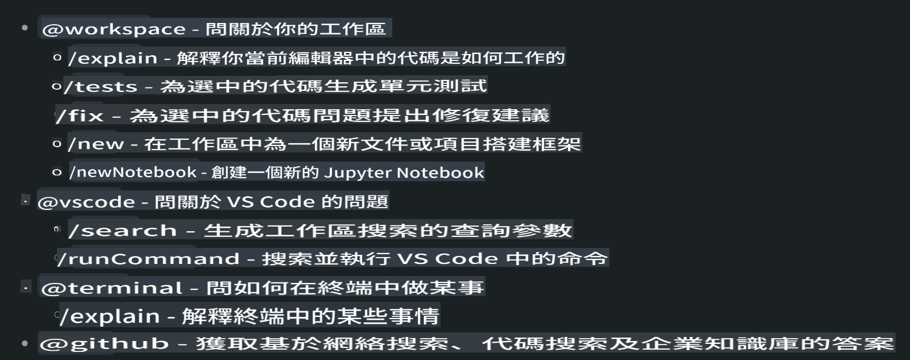
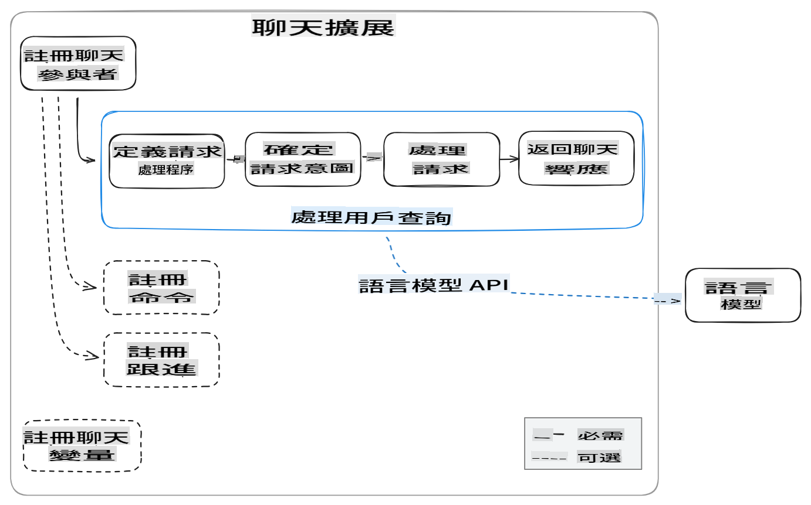
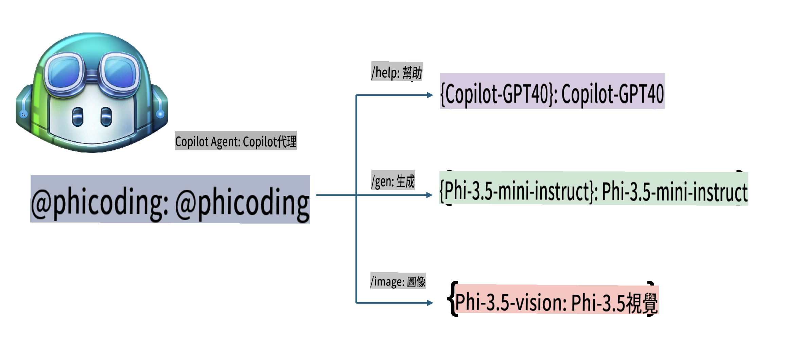
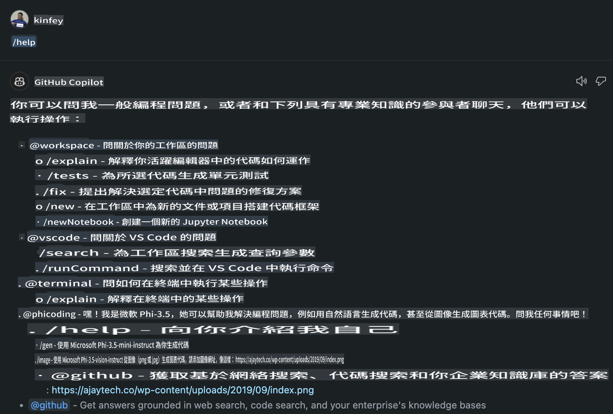
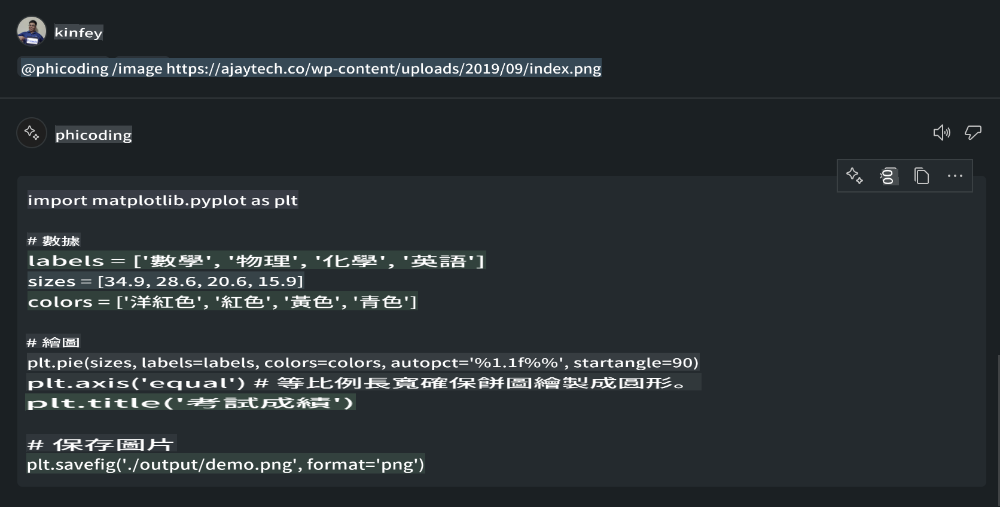

# **用 GitHub 模型的 Phi-3.5 創建你自己的 Visual Studio Code Chat Copilot Agent**

你在使用 Visual Studio Code Copilot 嗎？特別是在 Chat 中，你可以使用不同的代理來提升在 Visual Studio Code 中創建、編寫和維護項目的能力。Visual Studio Code 提供了一個 API，允許公司和個人基於他們的業務創建不同的代理，以在不同的專有領域擴展其功能。在這篇文章中，我們將重點介紹 GitHub 模型的 **Phi-3.5-mini-instruct (128k)** 和 **Phi-3.5-vision-instruct (128k)**，以創建你自己的 Visual Studio Code Agent。

## **關於 GitHub 模型的 Phi-3.5**

我們知道 Phi-3/3.5-mini-instruct 在 Phi-3/3.5 家族中具有強大的代碼理解和生成能力，並且在這方面優於 Gemma-2-9b 和 Mistral-Nemo-12B-instruct-2407。


最新的 GitHub 模型已經提供了 Phi-3.5-mini-instruct (128k) 和 Phi-3.5-vision-instruct (128k) 模型的訪問。開發者可以通過 OpenAI SDK、Azure AI Inference SDK 和 REST API 訪問這些模型。


***Note: *** 建議在這裡使用 Azure AI Inference SDK，因為它可以更好地與生產環境中的 Azure Model Catalog 切換。

以下是 **Phi-3.5-mini-instruct (128k)** 和 **Phi-3.5-vision-instruct (128k)** 在與 GitHub 模型對接後的代碼生成場景中的結果，並為後續的示例做準備。

**示例：GitHub 模型 Phi-3.5-mini-instruct (128k) 從提示生成代碼** ([點擊這裡](../../../../../code/09.UpdateSamples/Aug/ghmodel_phi35_instruct_demo.ipynb))

**示例：GitHub 模型 Phi-3.5-vision-instruct (128k) 從圖像生成代碼** ([點擊這裡](../../../../../code/09.UpdateSamples/Aug/ghmodel_phi35_vision_demo.ipynb))

## **關於 GitHub Copilot Chat Agent**

GitHub Copilot Chat Agent 可以在不同的項目場景中基於代碼完成不同的任務。系統有四個代理：workspace、github、terminal、vscode。



通過在代理名稱前添加 ‘@’，你可以快速完成相應的工作。對於企業來說，如果添加與自己的業務相關的內容，如需求、編碼、測試規範和發布，你可以基於 GitHub Copilot 擁有更強大的企業私有功能。

Visual Studio Code Chat Agent 現在已正式發布其 API，允許企業或企業開發者基於不同的軟件業務生態系統開發代理。基於 Visual Studio Code 擴展開發的方法，你可以輕鬆訪問 Visual Studio Code Chat Agent API 的接口。我們可以基於這個過程進行開發。



開發場景可以支持訪問第三方模型 API（如 GitHub 模型、Azure Model Catalog 和基於開源模型的自建服務），也可以使用 GitHub Copilot 提供的 gpt-35-turbo、gpt-4 和 gpt-4o 模型。

## **基於 Phi-3.5 添加一個 Agent @phicoding**

我們嘗試整合 Phi-3.5 的編程能力來完成代碼編寫、圖像生成代碼等任務。圍繞 Phi-3.5 完成一個 Agent - @PHI，以下是一些功能：

1. 通過 **@phicoding /help** 命令，使用 GitHub Copilot 提供的 GPT-4o 生成自我介紹。

2. 通過 **@phicoding /gen** 命令，使用 **Phi-3.5-mini-instruct (128k)** 生成不同編程語言的代碼。

3. 通過 **@phicoding /image** 命令，使用 **Phi-3.5-vision-instruct (128k)** 和圖像完成代碼生成。



## **相關步驟**

1. 使用 npm 安裝 Visual Studio Code 擴展開發支持

```bash

npm install --global yo generator-code 

```
2. 創建一個 Visual Studio Code 擴展插件（使用 Typescript 開發模式，命名為 phiext）

```bash

yo code 

```

3. 打開創建的項目並修改 package.json。這裡是相關的說明和配置，以及 GitHub 模型的配置。請注意，你需要在這裡添加你的 GitHub 模型 token。

```json

{
  "name": "phiext",
  "displayName": "phiext",
  "description": "",
  "version": "0.0.1",
  "engines": {
    "vscode": "^1.93.0"
  },
  "categories": [
    "AI",
    "Chat"
  ],
  "activationEvents": [],
  "enabledApiProposals": [
      "chatVariableResolver"
  ],
  "main": "./dist/extension.js",
  "contributes": {
    "chatParticipants": [
        {
            "id": "chat.phicoding",
            "name": "phicoding",
            "description": "Hey! I am Microsoft Phi-3.5, She can help me with coding problems, such as generation code with your natural language, or even generation code about chart from images. Just ask me anything!",
            "isSticky": true,
            "commands": [
                {
                    "name": "help",
                    "description": "Introduce myself to you"
                },
                {
                    "name": "gen",
                    "description": "Generate code for you with Microsoft Phi-3.5-mini-instruct"
                },
                {
                    "name": "image",
                    "description": "Generate code for chart from image(png or jpg) with Microsoft Phi-3.5-vision-instruct, please add image url like this : https://ajaytech.co/wp-content/uploads/2019/09/index.png"
                }
            ]
        }
    ],
    "commands": [
        {
            "command": "phicoding.namesInEditor",
            "title": "Use Microsoft Phi 3.5 in Editor"
        }
    ],
    "configuration": {
      "type": "object",
      "title": "githubmodels",
      "properties": {
        "githubmodels.endpoint": {
          "type": "string",
          "default": "https://models.inference.ai.azure.com",
          "description": "Your GitHub Models Endpoint",
          "order": 0
        },
        "githubmodels.api_key": {
          "type": "string",
          "default": "Your GitHub Models Token",
          "description": "Your GitHub Models Token",
          "order": 1
        },
        "githubmodels.phi35instruct": {
          "type": "string",
          "default": "Phi-3.5-mini-instruct",
          "description": "Your Phi-35-Instruct Model",
          "order": 2
        },
        "githubmodels.phi35vision": {
          "type": "string",
          "default": "Phi-3.5-vision-instruct",
          "description": "Your Phi-35-Vision Model",
          "order": 3
        }
      }
    }
  },
  "scripts": {
    "vscode:prepublish": "npm run package",
    "compile": "webpack",
    "watch": "webpack --watch",
    "package": "webpack --mode production --devtool hidden-source-map",
    "compile-tests": "tsc -p . --outDir out",
    "watch-tests": "tsc -p . -w --outDir out",
    "pretest": "npm run compile-tests && npm run compile && npm run lint",
    "lint": "eslint src",
    "test": "vscode-test"
  },
  "devDependencies": {
    "@types/vscode": "^1.93.0",
    "@types/mocha": "^10.0.7",
    "@types/node": "20.x",
    "@typescript-eslint/eslint-plugin": "^8.3.0",
    "@typescript-eslint/parser": "^8.3.0",
    "eslint": "^9.9.1",
    "typescript": "^5.5.4",
    "ts-loader": "^9.5.1",
    "webpack": "^5.94.0",
    "webpack-cli": "^5.1.4",
    "@vscode/test-cli": "^0.0.10",
    "@vscode/test-electron": "^2.4.1"
  },
  "dependencies": {
    "@types/node-fetch": "^2.6.11",
    "node-fetch": "^3.3.2",
    "@azure-rest/ai-inference": "latest",
    "@azure/core-auth": "latest",
    "@azure/core-sse": "latest"
  }
}


```

4. 修改 src/extension.ts

```typescript

// The module 'vscode' contains the VS Code extensibility API
// Import the module and reference it with the alias vscode in your code below
import * as vscode from 'vscode';
import ModelClient from "@azure-rest/ai-inference";
import { AzureKeyCredential } from "@azure/core-auth";


interface IPhiChatResult extends vscode.ChatResult {
    metadata: {
        command: string;
    };
}


const MODEL_SELECTOR: vscode.LanguageModelChatSelector = { vendor: 'copilot', family: 'gpt-4o' };

function isValidImageUrl(url: string): boolean {
    const regex = /^(https?:\/\/.*\.(?:png|jpg))$/i;
    return regex.test(url);
}
  

// This method is called when your extension is activated
// Your extension is activated the very first time the command is executed
export function activate(context: vscode.ExtensionContext) {

    const codinghandler: vscode.ChatRequestHandler = async (request: vscode.ChatRequest, context: vscode.ChatContext, stream: vscode.ChatResponseStream, token: vscode.CancellationToken): Promise<IPhiChatResult> => {


        const config : any = vscode.workspace.getConfiguration('githubmodels');
        const endPoint: string = config.get('endpoint');
        const apiKey: string = config.get('api_key');
        const phi35instruct: string = config.get('phi35instruct');
        const phi35vision: string = config.get('phi35vision');
        
        if (request.command === 'help') {

            const content = "Welcome to Coding assistant with Microsoft Phi-3.5"; 
            stream.progress(content);


            try {
                const [model] = await vscode.lm.selectChatModels(MODEL_SELECTOR);
                if (model) {
                    const messages = [
                        vscode.LanguageModelChatMessage.User("Please help me express this content in a humorous way: I am a programming assistant who can help you convert natural language into code and generate code based on the charts in the images. output format like this : Hey I am Phi ......")
                    ];
                    const chatResponse = await model.sendRequest(messages, {}, token);
                    for await (const fragment of chatResponse.text) {
                        stream.markdown(fragment);
                    }
                }
            } catch(err) {
                console.log(err);
            }


            return { metadata: { command: 'help' } };

        }

        
        if (request.command === 'gen') {

            const content = "Welcome to use phi-3.5 to generate code";

            stream.progress(content);

            const client = new ModelClient(endPoint, new AzureKeyCredential(apiKey));

            const response = await client.path("/chat/completions").post({
              body: {
                messages: [
                  { role:"system", content: "You are a coding assistant.Help answer all code generation questions." },
                  { role:"user", content: request.prompt }
                ],
                model: phi35instruct,
                temperature: 0.4,
                max_tokens: 1000,
                top_p: 1.
              }
            });

            stream.markdown(response.body.choices[0].message.content);

            return { metadata: { command: 'gen' } };

        }


        
        if (request.command === 'image') {


            const content = "Welcome to use phi-3.5 to generate code from image(png or jpg),image url like this:https://ajaytech.co/wp-content/uploads/2019/09/index.png";

            stream.progress(content);

            if (!isValidImageUrl(request.prompt)) {
                stream.markdown('Please provide a valid image URL');
                return { metadata: { command: 'image' } };
            }
            else
            {

                const client = new ModelClient(endPoint, new AzureKeyCredential(apiKey));
    
                const response = await client.path("/chat/completions").post({
                    body: {
                      messages: [
                        { role: "system", content: "You are a helpful assistant that describes images in details." },
                        { role: "user", content: [
                            { type: "text", text: "Please generate code according to the chart in the picture according to the following requirements\n1. Keep all information in the chart, including data and text\n2. Do not generate additional information that is not included in the chart\n3. Please extract data from the picture, do not generate it from csv\n4. Please save the regenerated chart as a chart and save it to ./output/demo.png"},
                            { type: "image_url", image_url: {url: request.prompt}
                            }
                          ]
                        }
                      ],
                      model: phi35vision,
                      temperature: 0.4,
                      max_tokens: 2048,
                      top_p: 1.
                    }
                  });
    
                
                stream.markdown(response.body.choices[0].message.content);
    
                return { metadata: { command: 'image' } };
            }


        }


        return { metadata: { command: '' } };
    };


    const phi_ext = vscode.chat.createChatParticipant("chat.phicoding", codinghandler);

    phi_ext.iconPath = new vscode.ThemeIcon('sparkle');


    phi_ext.followupProvider = {
        provideFollowups(result: IPhiChatResult, context: vscode.ChatContext, token: vscode.CancellationToken) {
            return [{
                prompt: 'Let us coding with Phi-3.5 😋😋😋😋',
                label: vscode.l10n.t('Enjoy coding with Phi-3.5'),
                command: 'help'
            } satisfies vscode.ChatFollowup];
        }
    };

    context.subscriptions.push(phi_ext);
}

// This method is called when your extension is deactivated
export function deactivate() {}


```

6. 運行

***/help***



***@phicoding /help***


***@phicoding /gen***


***@phicoding /image***



你可以下載示例代碼：[點擊](../../../../../code/09.UpdateSamples/Aug/vscode)

## **資源**

1. 註冊 GitHub 模型 [https://gh.io/models](https://gh.io/models)

2. 學習 Visual Studio Code 擴展開發 [https://code.visualstudio.com/api/get-started/your-first-extension](https://code.visualstudio.com/api/get-started/your-first-extension)

3. 了解 Visual Studio Code Coilot Chat API [https://code.visualstudio.com/api/extension-guides/chat](https://code.visualstudio.com/api/extension-guides/chat)

**免責聲明**:
本文件已使用機器翻譯服務進行翻譯。儘管我們努力確保準確性，但請注意，自動翻譯可能包含錯誤或不準確之處。應將原始語言的文件視為權威來源。對於關鍵信息，建議使用專業的人類翻譯。我們對因使用本翻譯而產生的任何誤解或誤讀不承擔任何責任。