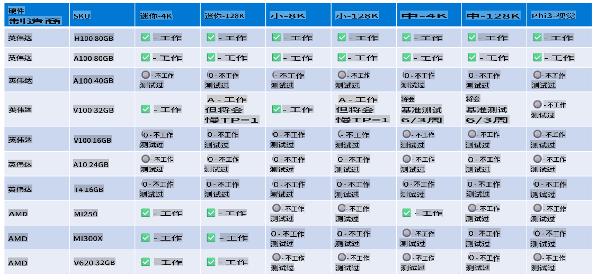

# Phi-3 硬件支持

Microsoft Phi-3 已经针对 ONNX Runtime 进行了优化，并支持 Windows DirectML。它在各种硬件类型上表现良好，包括 GPU、CPU，甚至移动设备。

## 设备硬件
具体支持的硬件包括：

- GPU SKU: RTX 4090 (DirectML)
- GPU SKU: 1 A100 80GB (CUDA)
- CPU SKU: Standard F64s v2 (64 vCPUs, 128 GiB 内存)

## 移动 SKU

- Android - Samsung Galaxy S21
- Apple iPhone 14 或更高版本的 A16/A17 处理器

## Phi-3 硬件规格

- 最低配置要求。
- Windows: 支持 DirectX 12 的 GPU 和至少 4GB 的组合内存

CUDA: 计算能力 >= 7.02 的 NVIDIA GPU



## 在多 GPU 上运行 onnxruntime

目前可用的 Phi-3 ONNX 模型仅支持 1 个 GPU。支持多 GPU 的 Phi-3 模型是可能的，但使用 2 个 GPU 的 ORT 并不保证比使用 2 个 ort 实例能提供更高的吞吐量。

在 [Build 2024 the GenAI ONNX Team](https://youtu.be/WLW4SE8M9i8?si=EtG04UwDvcjunyfC) 宣布，他们已经为 Phi 模型启用了多实例而不是多 GPU。

目前，这允许你使用 CUDA_VISIBLE_DEVICES 环境变量运行一个 onnnxruntime 或 onnxruntime-genai 实例，如下所示。

```Python
CUDA_VISIBLE_DEVICES=0 python infer.py
CUDA_VISIBLE_DEVICES=1 python infer.py
```

欢迎在 [Azure AI Studio](https://ai.azure.com) 进一步探索 Phi-3。

**免责声明**：
本文档使用基于机器的AI翻译服务进行翻译。尽管我们努力确保准确性，但请注意，自动翻译可能包含错误或不准确之处。应将原始语言的文档视为权威来源。对于关键信息，建议使用专业人工翻译。对于因使用本翻译而产生的任何误解或误释，我们不承担任何责任。