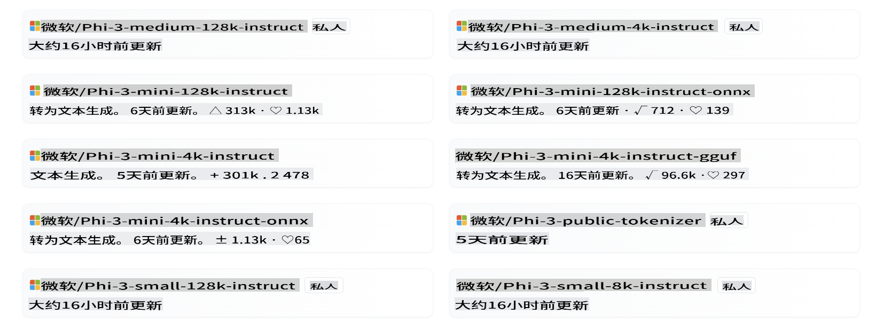

# **在 Hugging Face 上使用 Phi-3**

[Hugging Face](https://huggingface.co/) 是一个非常受欢迎的 AI 社区，拥有丰富的数据和开源模型资源。不同厂商会通过 Hugging Face 发布开源的大型语言模型（LLM）和小型语言模型（SLM），如微软、Meta、Mistral、苹果、谷歌等。



微软的 Phi-3 已经在 Hugging Face 上发布。开发者可以根据场景和业务需求下载相应的 Phi-3 模型。除了在 Hugging Face 上部署 Phi-3 Pytorch 模型外，我们还发布了量化模型，使用 GGUF 和 ONNX 格式，为终端用户提供选择。

## **1. 从 Hugging Face 下载 Phi-3**

```bash

git lfs install 

git clone https://huggingface.co/microsoft/Phi-3-mini-4k-instruct

```

## **2. 了解 Phi-3 提示模板**

在训练 Phi-3 时有一个特定的数据模板，因此在使用 Phi-3 时，发送提示需要通过模板进行设置。在微调过程中，数据也需要根据模板进行扩展。

模板包含三个角色，包括系统、用户和助手。

```txt

<|system|>
Your Role<|end|>
<|user|>
Your Question?<|end|>
<|assistant|>

```

例如

```txt

<|system|>
Your are a python developer.<|end|>
<|user|>
Help me generate a bubble algorithm<|end|>
<|assistant|>

```

## **3. 使用 Python 进行 Phi-3 推理**

使用 Phi-3 进行推理是指使用 Phi-3 模型基于输入数据生成预测或输出的过程。Phi-3 模型是一系列小型语言模型（SLM），包括 Phi-3-Mini、Phi-3-Small 和 Phi-3-Medium 等变体，每种模型针对不同的应用场景并具有不同的参数规模。这些模型经过高质量数据训练，并针对聊天功能、对齐性、鲁棒性和安全性进行了微调。它们可以使用 ONNX 和 TensorFlow Lite 部署在边缘和云平台上，并根据微软的负责任 AI 原则进行开发。

例如，Phi-3-Mini 是一个轻量级、最先进的开源模型，拥有 38 亿参数，适用于使用聊天格式的提示，并支持最长 128K 令牌的上下文长度。它是同类模型中第一个支持如此长上下文的模型。

Phi-3 模型可以在 Azure AI MaaS、HuggingFace、NVIDIA、Ollama、ONNX 等平台上使用，可用于实时交互、自主系统和需要低延迟的应用程序。

有很多种方式可以引用 Phi-3。你可以使用不同的编程语言来引用模型。

下面是一个 Python 示例。

```python

import torch
from transformers import AutoModelForCausalLM, AutoTokenizer, pipeline

torch.random.manual_seed(0)

model = AutoModelForCausalLM.from_pretrained(
    "microsoft/Phi-3-mini-4k-instruct", 
    device_map="cuda", 
    torch_dtype="auto", 
    trust_remote_code=True, 
)
tokenizer = AutoTokenizer.from_pretrained("microsoft/Phi-3-mini-4k-instruct")

messages = [
    {"role": "system", "content": "Your are a python developer."},
    {"role": "user", "content": "Help me generate a bubble algorithm"},
]

pipe = pipeline(
    "text-generation",
    model=model,
    tokenizer=tokenizer,
)

generation_args = {
    "max_new_tokens": 600,
    "return_full_text": False,
    "temperature": 0.3,
    "do_sample": False,
}

output = pipe(messages, **generation_args)
print(output[0]['generated_text'])


```

> [!NOTE]
> 你可以看看这个结果是否与你想象中的一致

## **4. 使用 C# 进行 Phi-3 推理**

下面是一个 .NET 控制台应用程序中的示例。

C# 项目必须添加以下包：

```bash
dotnet add package Microsoft.ML.OnnxRuntime --version 1.18.0
dotnet add package Microsoft.ML.OnnxRuntimeGenAI --version 0.3.0-rc2
dotnet add package Microsoft.ML.OnnxRuntimeGenAI.Cuda --version 0.3.0-rc2
```

这是 C# 代码。

```csharp
using System;
using Microsoft.ML.OnnxRuntimeGenAI;


// folder location of the ONNX model file
var modelPath = @"..\models\Phi-3-mini-4k-instruct-onnx";
var model = new Model(modelPath);
var tokenizer = new Tokenizer(model);

var systemPrompt = "You are an AI assistant that helps people find information. Answer questions using a direct style. Do not share more information that the requested by the users.";

// chat start
Console.WriteLine(@"Ask your question. Type an empty string to Exit.");


// chat loop
while (true)
{
    // Get user question
    Console.WriteLine();
    Console.Write(@"Q: ");
    var userQ = Console.ReadLine();    
    if (string.IsNullOrEmpty(userQ))
    {
        break;
    }

    // show phi3 response
    Console.Write("Phi3: ");
    var fullPrompt = $"<|system|>{systemPrompt}<|end|><|user|>{userQ}<|end|><|assistant|>";
    var tokens = tokenizer.Encode(fullPrompt);

    var generatorParams = new GeneratorParams(model);
    generatorParams.SetSearchOption("max_length", 2048);
    generatorParams.SetSearchOption("past_present_share_buffer", false);
    generatorParams.SetInputSequences(tokens);

    var generator = new Generator(model, generatorParams);
    while (!generator.IsDone())
    {
        generator.ComputeLogits();
        generator.GenerateNextToken();
        var outputTokens = generator.GetSequence(0);
        var newToken = outputTokens.Slice(outputTokens.Length - 1, 1);
        var output = tokenizer.Decode(newToken);
        Console.Write(output);
    }
    Console.WriteLine();
}
```

运行的演示类似于这个：


***注意：**第一个问题中有一个拼写错误，Phi-3 足够智能，给出了正确答案！*

## **5. 在 Hugging Face 聊天中使用 Phi-3**

Hugging Face 聊天提供了相关体验。进入 [这里试试 Phi-3 聊天](https://huggingface.co/chat/models/microsoft/Phi-3-mini-4k-instruct) 在你的浏览器中体验。


**免责声明**:
本文件已使用基于机器的人工智能翻译服务进行翻译。尽管我们努力确保准确性，但请注意，自动翻译可能包含错误或不准确之处。应将原始文件的母语版本视为权威来源。对于关键信息，建议进行专业的人类翻译。对于因使用本翻译而引起的任何误解或误读，我们不承担责任。