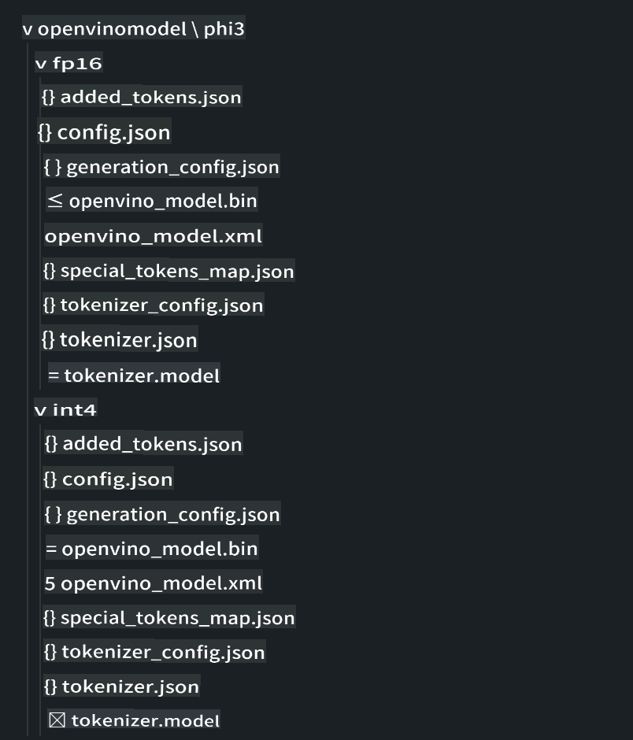
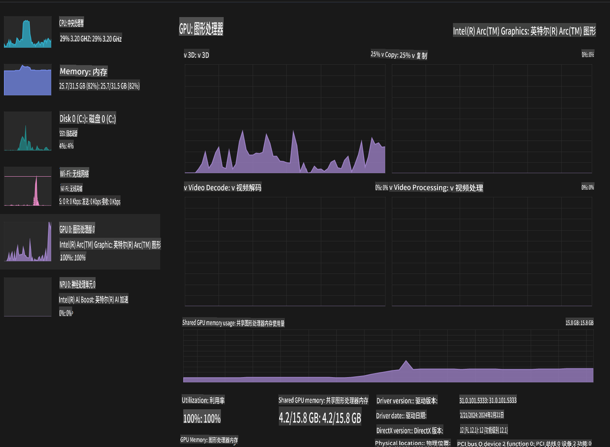

# **AI PC 上的 Phi-3 推理**

随着生成式 AI 的进步和边缘设备硬件能力的提升，越来越多的生成式 AI 模型现在可以集成到用户的自带设备 (BYOD) 中。AI PC 就是其中的一种。从 2024 年开始，英特尔、AMD 和高通与 PC 制造商合作，通过硬件改造推出 AI PC，方便本地化生成式 AI 模型的部署。在本次讨论中，我们将重点关注英特尔 AI PC，并探讨如何在英特尔 AI PC 上部署 Phi-3。

### **什么是 NPU**

NPU（神经处理单元）是一种专门设计用于加速神经网络操作和 AI 任务的处理器或处理单元，通常集成在更大的 SoC 上。与通用 CPU 和 GPU 不同，NPU 优化了数据驱动的并行计算，使其在处理大量多媒体数据（如视频和图像）以及神经网络数据处理方面非常高效。它们特别擅长处理 AI 相关的任务，例如语音识别、视频通话中的背景模糊以及对象检测等照片或视频编辑过程。

## **NPU vs GPU**
尽管许多 AI 和机器学习工作负载运行在 GPU 上，但 GPU 和 NPU 之间存在重要区别。
GPU 以其并行计算能力而闻名，但并非所有 GPU 在处理图形之外的任务时都同样高效。而 NPU 则专为神经网络操作中的复杂计算而设计，使其在 AI 任务中非常有效。

总的来说，NPU 是加速 AI 计算的数学高手，它们在 AI PC 的新时代中扮演着关键角色！

***此示例基于英特尔最新的 Intel Core Ultra 处理器***

## **1. 使用 NPU 运行 Phi-3 模型**

英特尔® NPU 设备是一种集成在英特尔客户端 CPU 中的 AI 推理加速器，从英特尔® Core™ Ultra 处理器（以前称为 Meteor Lake）开始。它能够高效地执行人工神经网络任务。


**英特尔 NPU 加速库**

英特尔 NPU 加速库 [https://github.com/intel/intel-npu-acceleration-library](https://github.com/intel/intel-npu-acceleration-library) 是一个 Python 库，旨在利用英特尔神经处理单元 (NPU) 的强大计算能力，提高应用程序的效率。

在由英特尔® Core™ Ultra 处理器驱动的 AI PC 上运行 Phi-3-mini 的示例。


使用 pip 安装 Python 库

```bash

   pip install intel-npu-acceleration-library

```

***Note*** 项目仍在开发中，但参考模型已经非常完整。

### **使用英特尔 NPU 加速库运行 Phi-3**

使用英特尔 NPU 加速时，该库不会影响传统的编码过程。您只需使用此库量化原始 Phi-3 模型，例如 FP16，INT8，INT4 等

```python

from transformers import AutoTokenizer, pipeline,TextStreamer
import intel_npu_acceleration_library as npu_lib
import warnings

model_id = "microsoft/Phi-3-mini-4k-instruct"

model = npu_lib.NPUModelForCausalLM.from_pretrained(
                                    model_id,
                                    torch_dtype="auto",
                                    dtype=npu_lib.int4,
                                    trust_remote_code=True
                                )

tokenizer = AutoTokenizer.from_pretrained(model_id)

text_streamer = TextStreamer(tokenizer, skip_prompt=True)

```
量化成功后，继续执行以调用 NPU 运行 Phi-3 模型。

```python

generation_args = {
            "max_new_tokens": 1024,
            "return_full_text": False,
            "temperature": 0.3,
            "do_sample": False,
            "streamer": text_streamer,
        }

pipe = pipeline(
            "text-generation",
            model=model,
            tokenizer=tokenizer,
)

query = "<|system|>You are a helpful AI assistant.<|end|><|user|>Can you introduce yourself?<|end|><|assistant|>"

with warnings.catch_warnings():
    warnings.simplefilter("ignore")
    pipe(query, **generation_args)

```

执行代码时，我们可以通过任务管理器查看 NPU 的运行状态


***Samples*** : [AIPC_NPU_DEMO.ipynb](../../../../code/03.Inference/AIPC/AIPC_NPU_DEMO.ipynb)

## **2. 使用 DirectML + ONNX Runtime 运行 Phi-3 模型**

### **什么是 DirectML**

[DirectML](https://github.com/microsoft/DirectML) 是一个高性能、硬件加速的 DirectX 12 机器学习库。DirectML 为各种支持的硬件和驱动程序（包括 AMD、英特尔、NVIDIA 和高通的所有 DirectX 12 兼容 GPU）提供 GPU 加速的常见机器学习任务。

单独使用时，DirectML API 是一个低级别的 DirectX 12 库，适用于高性能、低延迟的应用程序，如框架、游戏和其他实时应用程序。DirectML 与 Direct3D 12 的无缝互操作性以及其低开销和硬件一致性，使其成为在需要高性能和硬件结果可靠性和可预测性的情况下加速机器学习的理想选择。

***Note*** : 最新的 DirectML 已经支持 NPU(https://devblogs.microsoft.com/directx/introducing-neural-processor-unit-npu-support-in-directml-developer-preview/)

### DirectML 和 CUDA 在能力和性能方面的比较：

**DirectML** 是由微软开发的机器学习库。它旨在加速 Windows 设备（包括台式机、笔记本电脑和边缘设备）上的机器学习工作负载。
- 基于 DX12: DirectML 构建在 DirectX 12 (DX12) 之上，提供广泛的 GPU 硬件支持，包括 NVIDIA 和 AMD。
- 更广泛的支持: 由于利用 DX12，DirectML 可以与任何支持 DX12 的 GPU 一起工作，甚至是集成 GPU。
- 图像处理: DirectML 使用神经网络处理图像和其他数据，适用于图像识别、对象检测等任务。
- 简单的设置: 设置 DirectML 很简单，不需要 GPU 制造商的特定 SDK 或库。
- 性能: 在某些情况下，DirectML 表现良好，尤其是某些工作负载时可能比 CUDA 更快。
- 限制: 但在某些情况下，DirectML 可能较慢，特别是对于 float16 大批量任务。

**CUDA** 是 NVIDIA 的并行计算平台和编程模型。它允许开发人员利用 NVIDIA GPU 的强大计算能力进行通用计算，包括机器学习和科学模拟。
- 特定于 NVIDIA: CUDA 紧密集成于 NVIDIA GPU，并专为其设计。
- 高度优化: 提供出色的 GPU 加速任务性能，特别是在使用 NVIDIA GPU 时。
- 广泛使用: 许多机器学习框架和库（如 TensorFlow 和 PyTorch）都支持 CUDA。
- 定制化: 开发人员可以为特定任务微调 CUDA 设置，从而实现最佳性能。
- 限制: 但 CUDA 对 NVIDIA 硬件的依赖可能会限制其在不同 GPU 上的兼容性。

### 选择 DirectML 和 CUDA：
选择 DirectML 还是 CUDA 取决于您的具体使用案例、硬件可用性和偏好。
如果您寻求更广泛的兼容性和简单的设置，DirectML 可能是一个不错的选择。然而，如果您拥有 NVIDIA GPU 并需要高度优化的性能，CUDA 仍然是一个强有力的竞争者。总之，DirectML 和 CUDA 各有优劣，选择时请考虑您的需求和可用硬件。

### **使用 ONNX Runtime 的生成式 AI**

在 AI 时代，AI 模型的可移植性非常重要。ONNX Runtime 可以轻松地将训练好的模型部署到不同设备上。开发人员无需关注推理框架，使用统一的 API 即可完成模型推理。在生成式 AI 时代，ONNX Runtime 也进行了代码优化（https://onnxruntime.ai/docs/genai/）。通过优化后的 ONNX Runtime，可以在不同终端上推理量化的生成式 AI 模型。在使用 ONNX Runtime 的生成式 AI 中，您可以通过 Python、C#、C / C++ 来推理 AI 模型 API。当然，在 iPhone 上部署可以利用 C++ 的 ONNX Runtime API。

[示例代码](https://github.com/Azure-Samples/Phi-3MiniSamples/tree/main/onnx)

***编译生成式 AI 使用 ONNX Runtime 库***

```bash

winget install --id=Kitware.CMake  -e

git clone https://github.com/microsoft/onnxruntime.git

cd .\onnxruntime\

./build.bat --build_shared_lib --skip_tests --parallel --use_dml --config Release

cd ../

git clone https://github.com/microsoft/onnxruntime-genai.git

cd .\onnxruntime-genai\

mkdir ort

cd ort

mkdir include

mkdir lib

copy ..\onnxruntime\include\onnxruntime\core\providers\dml\dml_provider_factory.h ort\include

copy ..\onnxruntime\include\onnxruntime\core\session\onnxruntime_c_api.h ort\include

copy ..\onnxruntime\build\Windows\Release\Release\*.dll ort\lib

copy ..\onnxruntime\build\Windows\Release\Release\onnxruntime.lib ort\lib

python build.py --use_dml

```

**安装库**

```bash

pip install .\onnxruntime_genai_directml-0.3.0.dev0-cp310-cp310-win_amd64.whl

```

这是运行结果


***Samples*** : [AIPC_DirectML_DEMO.ipynb](../../../../code/03.Inference/AIPC/AIPC_DirectML_DEMO.ipynb)

## **3. 使用 Intel OpenVino 运行 Phi-3 模型**

### **什么是 OpenVINO**

[OpenVINO](https://github.com/openvinotoolkit/openvino) 是一个开源工具包，用于优化和部署深度学习模型。它为视觉、音频和语言模型提供了增强的深度学习性能，支持 TensorFlow、PyTorch 等流行框架。开始使用 OpenVINO。OpenVINO 还可以与 CPU 和 GPU 结合使用来运行 Phi3 模型。

***Note***: 目前，OpenVINO 尚不支持 NPU。

### **安装 OpenVINO 库**

```bash

 pip install git+https://github.com/huggingface/optimum-intel.git

 pip install git+https://github.com/openvinotoolkit/nncf.git

 pip install openvino-nightly

```

### **使用 OpenVINO 运行 Phi-3**

与 NPU 类似，OpenVINO 通过运行量化模型来完成生成式 AI 模型的调用。我们需要首先量化 Phi-3 模型，并通过命令行使用 optimum-cli 完成模型量化。

**INT4**

```bash

optimum-cli export openvino --model "microsoft/Phi-3-mini-4k-instruct" --task text-generation-with-past --weight-format int4 --group-size 128 --ratio 0.6  --sym  --trust-remote-code ./openvinomodel/phi3/int4

```

**FP16**

```bash

optimum-cli export openvino --model "microsoft/Phi-3-mini-4k-instruct" --task text-generation-with-past --weight-format fp16 --trust-remote-code ./openvinomodel/phi3/fp16

```

转换后的格式如下



通过 OVModelForCausalLM 加载模型路径 (model_dir)、相关配置 (ov_config = {"PERFORMANCE_HINT": "LATENCY", "NUM_STREAMS": "1", "CACHE_DIR": ""}) 和硬件加速设备 (GPU.0)

```python

ov_model = OVModelForCausalLM.from_pretrained(
     model_dir,
     device='GPU.0',
     ov_config=ov_config,
     config=AutoConfig.from_pretrained(model_dir, trust_remote_code=True),
     trust_remote_code=True,
)

```

执行代码时，我们可以通过任务管理器查看 GPU 的运行状态



***Samples*** : [AIPC_OpenVino_Demo.ipynb](../../../../code/03.Inference/AIPC/AIPC_OpenVino_Demo.ipynb)

### ***Note*** : 以上三种方法各有优势，但推荐使用 NPU 加速进行 AI PC 推理。

免责声明：该翻译由AI模型从原文翻译而来，可能不够完美。请审核输出内容并进行必要的修改。