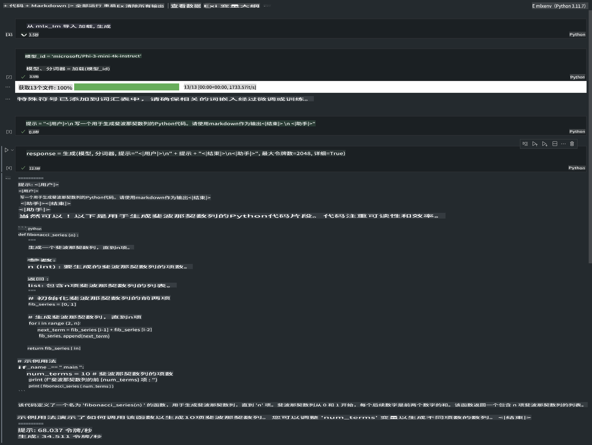

# **使用 Apple MLX 框架进行 Phi-3 推理**

## **什么是 MLX 框架**

MLX 是一个用于在 Apple 硅芯片上进行机器学习研究的数组框架，由 Apple 机器学习研究团队推出。

MLX 是由机器学习研究人员为机器学习研究人员设计的。该框架旨在用户友好，同时在训练和部署模型时依然高效。框架本身的设计在概念上也很简单。我们希望研究人员可以轻松扩展和改进 MLX，以便快速探索新想法。

通过 MLX，可以在 Apple 硅设备上加速 LLMs，并且可以非常方便地在本地运行模型。

## **使用 MLX 进行 Phi-3-mini 推理**

### **1. 设置 MLX 环境**

1. Python 3.11.x
2. 安装 MLX 库

```bash

pip install mlx-lm

```

### **2. 在终端中使用 MLX 运行 Phi-3-mini**

```bash

python -m mlx_lm.generate --model microsoft/Phi-3-mini-4k-instruct --max-token 2048 --prompt  "<|user|>\nCan you introduce yourself<|end|>\n<|assistant|>"

```

结果（我的环境是 Apple M1 Max, 64GB）如下


### **3. 在终端中使用 MLX 量化 Phi-3-mini**

```bash

python -m mlx_lm.convert --hf-path microsoft/Phi-3-mini-4k-instruct

```

***注意：*** 模型可以通过 mlx_lm.convert 进行量化，默认量化为 INT4。此示例将 Phi-3-mini 量化为 INT4

模型可以通过 mlx_lm.convert 进行量化，默认量化为 INT4。此示例将 Phi-3-mini 量化为 INT4。量化后将存储在默认目录 ./mlx_model 中

我们可以在终端中测试使用 MLX 量化后的模型

```bash

python -m mlx_lm.generate --model ./mlx_model/ --max-token 2048 --prompt  "<|user|>\nCan you introduce yourself<|end|>\n<|assistant|>"

```

结果如下


### **4. 在 Jupyter Notebook 中使用 MLX 运行 Phi-3-mini**



***注意：*** 请阅读此示例 [点击此链接](../../../../code/03.Inference/MLX/MLX_DEMO.ipynb)

## **资源**

1. 了解 Apple MLX 框架 [https://ml-explore.github.io](https://ml-explore.github.io/mlx/build/html/index.html)

2. Apple MLX GitHub 仓库 [https://github.com/ml-explore](https://github.com/ml-explore)

**免责声明**：
本文件使用基于机器的AI翻译服务进行翻译。尽管我们努力确保准确性，但请注意，自动翻译可能包含错误或不准确之处。应将原文档的母语版本视为权威来源。对于关键信息，建议进行专业的人类翻译。对于因使用本翻译而产生的任何误解或误读，我们概不负责。