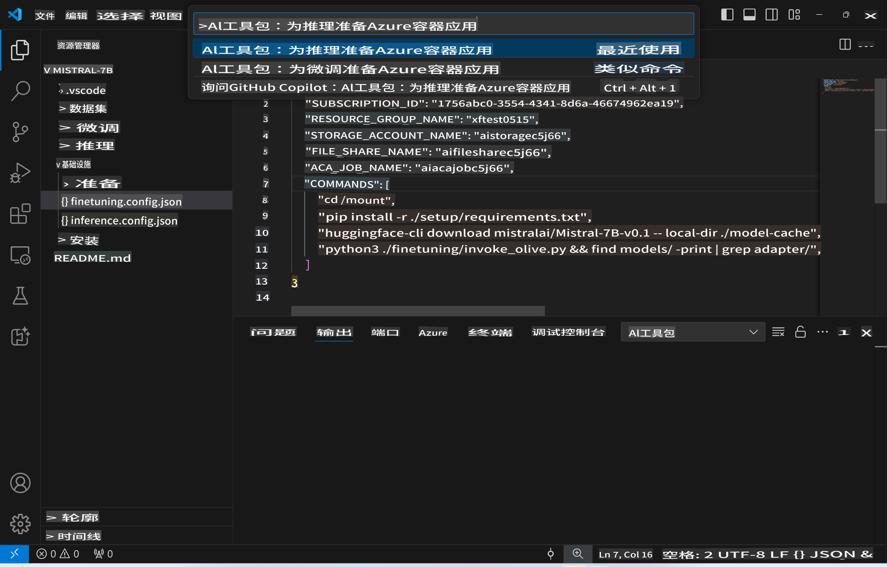
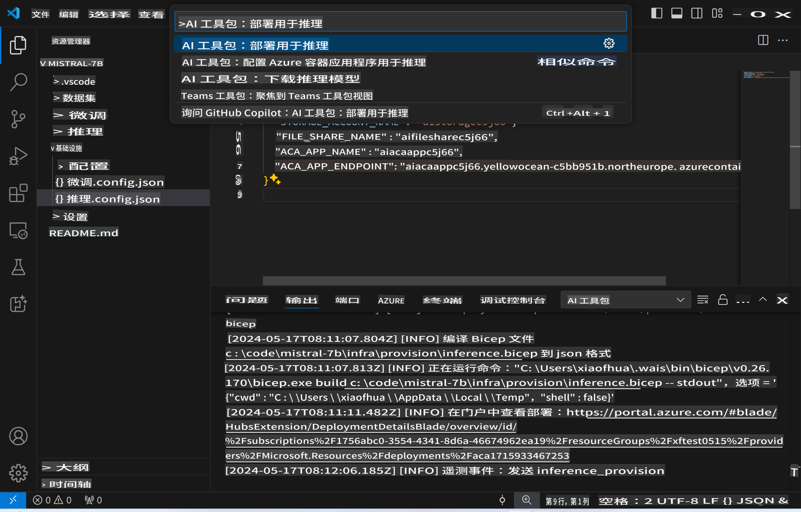

# 使用微调模型进行远程推理

在远程环境中训练完适配器后，可以使用一个简单的Gradio应用程序与模型进行交互。


### 配置Azure资源
您需要通过命令面板执行`AI Toolkit: Provision Azure Container Apps for inference`来设置用于远程推理的Azure资源。在此设置过程中，系统会要求您选择Azure订阅和资源组。  

   
默认情况下，推理的订阅和资源组应与用于微调的相匹配。推理将使用相同的Azure容器应用环境，并访问存储在Azure文件中的模型和模型适配器，这些是在微调步骤中生成的。

## 使用AI工具包

### 推理部署  
如果您希望修改推理代码或重新加载推理模型，请执行`AI Toolkit: Deploy for inference`命令。这将同步您最新的代码到ACA并重新启动副本。



部署成功完成后，模型现在可以使用此端点进行评估。

### 访问推理API

您可以通过点击VSCode通知中显示的“*Go to Inference Endpoint*”按钮来访问推理API。或者，可以在`ACA_APP_ENDPOINT`的`./infra/inference.config.json`和输出面板中找到Web API端点。


> **Note:** 推理端点可能需要几分钟才能完全运行。

## 模板中包含的推理组件
 
| 文件夹 | 内容 |
| ------ |--------- |
| `infra` | 包含所有远程操作所需的配置。 |
| `infra/provision/inference.parameters.json` | 保存用于配置Azure资源推理的bicep模板参数。 |
| `infra/provision/inference.bicep` | 包含用于配置Azure资源推理的模板。 |
| `infra/inference.config.json` | 由`AI Toolkit: Provision Azure Container Apps for inference`命令生成的配置文件。它用作其他远程命令面板的输入。 |

### 使用AI工具包配置Azure资源
配置[AI工具包](https://marketplace.visualstudio.com/items?itemName=ms-windows-ai-studio.windows-ai-studio)

为推理配置Azure容器应用` command.

You can find configuration parameters in `./infra/provision/inference.parameters.json` file. Here are the details:
| Parameter | Description |
| --------- |------------ |
| `defaultCommands` | This is the commands to initiate a web API. |
| `maximumInstanceCount` | This parameter sets the maximum capacity of GPU instances. |
| `location` | This is the location where Azure resources are provisioned. The default value is the same as the chosen resource group's location. |
| `storageAccountName`, `fileShareName` `acaEnvironmentName`, `acaEnvironmentStorageName`, `acaAppName`,  `acaLogAnalyticsName` | These parameters are used to name the Azure resources for provision. By default, they will be same to the fine-tuning resource name. You can input a new, unused resource name to create your own custom-named resources, or you can input the name of an already existing Azure resource if you'd prefer to use that. For details, refer to the section [Using existing Azure Resources](../../../../md/03.Inference). |

### Using Existing Azure Resources

By default, the inference provision use the same Azure Container App Environment, Storage Account, Azure File Share, and Azure Log Analytics that were used for fine-tuning. A separate Azure Container App is created solely for the inference API. 

If you have customized the Azure resources during the fine-tuning step or want to use your own existing Azure resources for inference, specify their names in the `./infra/inference.parameters.json`文件。然后，从命令面板运行`AI Toolkit: Provision Azure Container Apps for inference`命令。这将更新任何指定的资源并创建任何缺失的资源。

例如，如果您有一个现有的Azure容器环境，您的`./infra/finetuning.parameters.json`应如下所示：

```json
{
    "$schema": "https://schema.management.azure.com/schemas/2019-04-01/deploymentParameters.json#",
    "contentVersion": "1.0.0.0",
    "parameters": {
      ...
      "acaEnvironmentName": {
        "value": "<your-aca-env-name>"
      },
      "acaEnvironmentStorageName": {
        "value": null
      },
      ...
    }
  }
```

### 手动配置  
如果您更喜欢手动配置Azure资源，可以使用`./infra/provision` folders. If you have already set up and configured all the Azure resources without using the AI Toolkit command palette, you can simply enter the resource names in the `inference.config.json`文件中提供的bicep文件。

例如：

```json
{
  "SUBSCRIPTION_ID": "<your-subscription-id>",
  "RESOURCE_GROUP_NAME": "<your-resource-group-name>",
  "STORAGE_ACCOUNT_NAME": "<your-storage-account-name>",
  "FILE_SHARE_NAME": "<your-file-share-name>",
  "ACA_APP_NAME": "<your-aca-name>",
  "ACA_APP_ENDPOINT": "<your-aca-endpoint>"
}
```

**免责声明**：
本文档已使用基于机器的人工智能翻译服务进行翻译。尽管我们努力确保准确性，但请注意，自动翻译可能包含错误或不准确之处。应将原始文档的本地语言版本视为权威来源。对于关键信息，建议使用专业的人类翻译。我们对因使用本翻译而产生的任何误解或误释不承担责任。